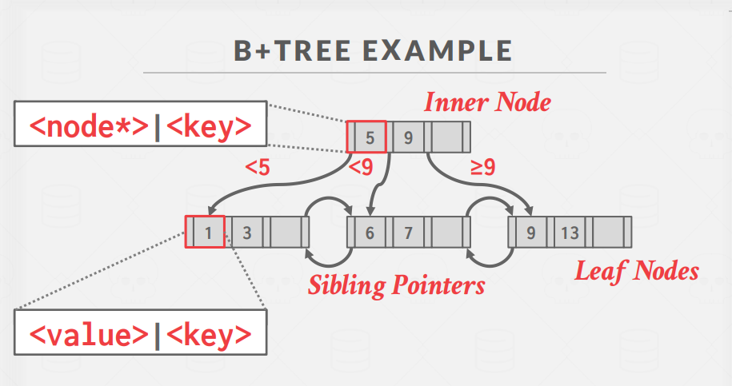

# B+树索引详解

## 一、表索引概念与作用

### 什么是表索引(table index)

- 表索引是表中部分属性的子集副本，经过组织和/或排序以便高效访问
- DBMS确保表内容和索引在逻辑上保持同步
- DBMS负责确定使用哪些索引来执行查询

### 索引数量的权衡

- 存储开销：每个索引需要额外存储空间
- 维护开销：插入、更新、删除数据时需要同时维护所有索引

## 二、B+树基础

### B树家族

B树家族是一类平衡树数据结构：

- B-Tree (1971)：原始B树
- B+Tree (1973)：最常用的数据库索引结构
- B\*Tree (1977)：B+树的变种
- B_link-Tree (1981)：支持并发操作的B+树

### B+树特性

- 自平衡树数据结构
- 保持数据有序并支持搜索、顺序访问、插入和删除，时间复杂度均为O(log n)
- 二叉搜索树的泛化，节点可以有多个子节点
- 为读写大块数据的系统优化设计

### B+树的关键性质

1. 完全平衡（所有叶节点都在同一深度）
2. `除根节点外，每个节点至少半满：M/2-1 ≤ 键数 ≤ M-1`
3. 每个具有k个键的内部节点有k+1个非空子节点
4. 所有数据都存储在叶节点中

## 三、B+树结构与操作



### 节点类型

每个B+树节点包含键值对数组：

1. **内部节点**：

   - 键：源自索引基于的属性
   - 值：指向子节点的指针
   - 仅用于引导搜索过程

2. **叶节点**：
   - 键：源自索引基于的属性
   - 值：`可以是记录ID或实际元组数据`(聚簇：数据存储在叶节点中，非聚簇：存储在其他地方)
   - 通过兄弟指针相互连接，形成链表

### 叶节点值存储方式

1. **记录ID方法**：

   - 存储指向对应元组位置的指针
   - 更节省空间

2. **元组数据方法**：
   - 直接存储元组的实际内容
   - 避免额外查找，但需要更多空间
   - 二级索引必须使用记录ID作为值

### B+树vs原始B树

- 原始B树在所有节点存储键和值
- B+树仅在叶节点存储值，内部节点只用于引导搜索
- B+树设计使得范围查询更高效

### 基本操作

#### 插入操作

1. 找到正确的叶节点L
2. 按排序顺序插入数据
3. 如果L有足够空间，操作完成
4. 否则，将L的键分裂到L和新节点L2
   - 均匀重新分配条目，向上复制中间键
   - 在L的父节点中插入指向L2的索引条目
5. 分裂内部节点时，均匀重新分配条目，但将中间键上推

#### 删除操作

1. 从根开始，找到条目所属的叶节点L
2. 移除条目
3. 如果L至少半满，操作完成
4. 如果L只有M/2-1个条目：
   - 尝试从兄弟节点借用
   - 如果重新分配失败，合并L和兄弟节点
5. 如果发生合并，必须从L的父节点删除指向L或兄弟的条目

### 搜索条件支持

最左匹配原则：

- B+树索引可用于查询提供的任何搜索键属性
- 示例：索引在<a,b,c>上
  - 支持：a=1 AND b=2 AND c=3
  - 支持：a=1 AND b=2
  - 支持：b=2或c=3
- 哈希索引必须有搜索键的所有属性

## 四、B+树在数据库中的应用

### 处理重复键

1. **附加记录ID方法**：

   - 将元组的唯一记录ID添加为键的一部分
   - DBMS仍可使用部分键查找元组

2. **溢出叶节点方法**：
   - 允许叶节点溢出到包含重复键的溢出节点
   - 维护和修改更复杂

### 聚集索引(Clustered Index)

- 表按主键指定的排序顺序存储
- 可以是堆组织或索引组织的存储
- 直接遍历到最左叶页面，然后从所有叶页面检索元组
- 始终优于为每个查询排序数据

### 索引扫描页面排序

- 按非聚集索引顺序检索元组效率低下
- DBMS可先确定所需的所有元组，然后按页面ID排序
- 减少冗余读取

## 五、B+树设计选择与优化

### 设计选择

1. **节点大小**：

   - 存储设备越慢，最佳节点大小越大
   - HDD：~1MB
   - SSD：~10KB
   - 内存：~512B

   **mysql b+树节点等于默认的页大小16KB**

   tp型数据库，Root-to-Leaf 查询多，节点可以小一点；
   ap型数据库，lead node scan 查询多，节点可以大一点。

2. **合并阈值**：

   - 有些DBMS不总是在节点半满时合并
   - `延迟合并`可能减少重组量
   - 有时更好的做法是`让较小的节点存在，然后定期重建整个树`

3. **变长键处理**：

   - 指针法(Pointers)：存储指向元组属性的指针
   - 变长节点(Variable-Length Nodes)：节点大小可变
   - 填充法(padding)：将键填充至最大长度
   - 键映射/间接法 (Key Map / Indirection)：嵌入指向节点内键+值列表的指针数组

4. **节点内搜索**：
   - 线性搜索：从头到尾扫描
   - 二分搜索：跳到中间键，根据比较向左/右移动
   - 插值搜索：基于已知键分布近似估计所需键位置(机器学习法)

### 优化技术

1. **前缀压缩**：

   - 提取同一叶节点中排序键的共同前缀
   - 只存储每个键的唯一后缀

2. **去重**：

   - 非唯一索引可能在叶节点中存储多个相同键副本
   - 只存储一次键，然后维护具有该键的元组列表

3. **后缀截断**：

   - 内部节点的键仅用于"引导流量"
   - 只存储正确路由索引探测所需的最小前缀

4. **指针物化(Pointer Swizzling)**：

   - 节点通常使用页面ID引用索引中的其他节点
   - 对缓冲池中固定的页面，可以`存储原始指针而非页面ID`
   - 避免从页面表中查找地址

5. **批量插入**：
   - 为现有表构建新B+树的最快方法
   - 先对键排序，然后从底向上构建索引

## 结论

B+树几乎总是数据库索引的最佳选择：

- 支持高效的点查询和范围查询
- 自动平衡，维护开销可控
- 磁盘友好的设计，最小化I/O操作
- 灵活性高，可支持多种查询模式

---

- 最左匹配原则

  最左匹配原则是复合索引（多列索引）使用的核心规则：

  - 复合索引只能从最左边的列开始按顺序使用
  - 如果查询条件不包含最左边的列，则无法使用该索引
  - 一旦跳过某一列，该列右侧的列也无法使用索引

  ## 示例

  假设有索引(A, B, C)：

  ✅ 可以使用索引的查询：

  - WHERE A=1
  - WHERE A=1 AND B=2
  - WHERE A=1 AND B=2 AND C=3
  - WHERE A=1 AND C=3 (只使用A列索引)

  ❌ 无法使用索引的查询：

  - WHERE B=2
  - WHERE C=3
  - WHERE B=2 AND C=3

  这是因为B+树索引按列顺序构建，必须先匹配左侧列才能定位右侧列的值。

- 聚簇(Clustered)索引和非聚簇索引

  假设有员工表 `Employees`:

  ```sql
  CREATE TABLE Employees (
      emp_id INT PRIMARY KEY,  -- 聚簇索引列
      name VARCHAR(100),
      department VARCHAR(50),
      salary INT,
      INDEX idx_dept (department)  -- 非聚簇索引
  );
  ```

  ## 聚簇索引示例 (emp_id)

  物理存储结构(按emp_id排序存储):

  ```
  [磁盘页1]           [磁盘页2]           [磁盘页3]
  │emp_id=1│name=张三│...│ │emp_id=4│name=王五│...│ │emp_id=7│name=赵七│...│
  │emp_id=2│name=李四│...│ │emp_id=5│name=马六│...│ │emp_id=8│name=钱八│...│
  │emp_id=3│name=王明│...│ │emp_id=6│name=刘红│...│ │emp_id=9│name=孙九│...│
  ```

  B+树聚簇索引结构:

  ```
           [4, 7]
          /   |   \
     [1,2,3] [4,5,6] [7,8,9]
      (完整行数据) (完整行数据) (完整行数据)
  ```

  ## 非聚簇索引示例 (department)

  B+树非聚簇索引结构:

  ```
             [市场, 研发]
            /      |      \
  [财务部门, emp_id指针] [市场部门, emp_id指针] [研发部门, emp_id指针]
  ```

  ## 查询过程比较

  ### 使用聚簇索引查询

  ```sql
  SELECT * FROM Employees WHERE emp_id = 6;
  ```

  - 直接通过索引找到包含完整行数据的叶节点
  - 一步完成，无需额外查找

  ### 使用非聚簇索引查询

  ```sql
  SELECT * FROM Employees WHERE department = '研发部门';
  ```

  - 先在department索引中找到匹配的叶节点
  - 获取对应的emp_id值
  - 再通过emp_id(聚簇索引)查找完整行数据
  - 这个额外步骤称为"回表"

  非聚簇索引就像图书的主题索引，告诉你相关内容在第几页，而聚簇索引则直接按页码组织了整本书。
