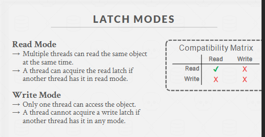
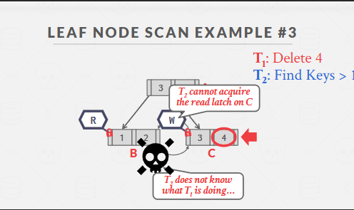

## 1. 为什么要关注“索引并发”？

- **数据库索引**通常使用 B+ 树、哈希等数据结构来加速对记录的查找和插入删除。
- 在实际生产中，多个事务/线程会**同时**对同一个索引进行操作（查询、插入、删除、更新）。不正确的并发控制会导致**数据结构被破坏**（例如树节点分裂时另一个线程也在改同一节点）或读取到不一致结果。
- 同时，我们希望**最大化并发性能**：不能为了安全就把整个索引一次性加个大锁，否则所有访问只能串行，性能太差。

所以，“索引并发”的目标是：**在保证数据结构安全和一致性的前提下，尽量提高并发度**。

---

## 2. B+ 树索引并发的常见方案

### 2.1 闩锁耦合（Latch Coupling / Crabbing）

**思想**：在走树时，自顶向下，逐层获取节点的锁（latch），在确认要继续往子节点走时再获取子节点锁，然后释放父节点锁。这就是**锁蟹行**（Crabbing）的由来——像螃蟹爬行，钳子一次只抓相邻部分，逐步前进。

1. **搜索**（只读）场景：

   - 对当前节点加**共享锁（S 锁）**；
   - 准备访问子节点之前，给子节点也加 S 锁后，释放父节点。
   - 一路下去直到叶子节点。这样可以允许并发读者共享访问不同或相同节点。

2. **插入/删除**（写）场景：
   - 可能会触发**节点分裂**或**合并**操作，需要对受影响的节点持有**排他锁（X 锁）**。
   - 悲观：在下行时就持有 X 锁，一路到叶；需要分裂时再更新父节点。
   - 乐观：或者采用更细腻的“先 S 后 X”：先以 S 锁下行，到达要修改的节点及其父节点时再升级成 X 锁。要小心**死锁**，故往往要严格按自顶向下的顺序锁定。

**优点**：实现较为直观，不用一次锁住整个树，可以并发访问不同路径上的节点。  
**缺点**：仍然有时候锁持有稍微偏长、可能造成竞争；若层数不多还好，但流量非常大时要进一步优化。

---

### 2.2 B-link 树

- **B-link 树**是 B+ 树的一种改进变体，为每个节点增加一个“右兄弟指针”。
- 用处：**并发插入或分裂时**，可以在不锁住父节点的情况下让搜索线程“顺着右兄弟指针”找到正确的节点，避免或缩短对上层节点的锁持有。
- 当某节点分裂时，把新节点插入其兄弟链中，让读者如果发现自己在的范围不合适，可以沿兄弟链跳到正确节点，而不必依赖父节点来更新指针后才释放。
- 这样可以减小上层节点的锁竞争，提高并发。

---

### 2.3 锁 vs. 版本

- 一些**无锁/乐观索引**算法（如 Bw-tree 或“乐观 B+ 树”）通过MVCC或版本戳技术避免大量加写锁，也能实现并发安全。
- 传统 B+ 树则多用**闩锁耦合**或 B-link 方案。

---

## 3. 索引并发中常见问题

1. **节点分裂或合并**：当多个事务并发操作同一节点并且想要分裂/合并时，必须保证对数据结构的原子更新，否则结构可能损坏。
2. **死锁**：如果两个事务想同时获取某些节点写锁，但顺序不一致，就可能形成死锁。解决方法：
   - **统一锁顺序**：自顶向下；
   - 或**死锁检测**，发现环后让一个事务回退。
3. **读到过期**：如果节点正被另一个事务修改，读操作要保证不会看到中间状态；闩锁耦合可确保搜索期间不读到正在分裂的节点。

---

## 4. 在实际系统中的使用

- **传统数据库**（MySQL InnoDB、PostgreSQL）实现 B+ 树并发控制通常采用**闩锁耦合 + 局部改进**（例如后写 sibling pointer），来在插入/删除时维持高并发度。
- **新一代/学术研究**有各种无锁 / 乐观索引（Bw-tree, Masstree），通过版本管理、原子CAS操作在多核 CPU 下发挥更大并发。

---

## 5. 小结 & 记忆要点

1. **目标**：实现 B+ 树等索引在多事务/多线程场景下的安全与高并发。
2. **闩锁耦合**：下行搜索时，对当前节点加 S锁（或X锁），获取下一层节点锁后再释放父节点锁。插入/删除可多用 X锁。
3. **B-link 树**：在 B+ 树每节点加“右兄弟指针”，可减少上层锁竞争，简化并发分裂处理。
4. **死锁/不一致**：通过自顶向下锁顺序、或死锁检测解决。
5. **无锁/乐观**：一些前沿实现不使用传统闩锁耦合，而采用多版本或原子操作来并发访问。

**一句话记**：

> “索引并发的核心是：如何在B+树插入/删除/查找同时进行时，避免结构损坏、提升并发。  
> 通用方法：闩锁耦合；高级方法：B-link树或无锁索引。”

这样，你就能快速理解和记住**索引并发**在数据库系统中的主要做法和关键概念了。祝学习顺利！

---

https://15445.courses.cs.cmu.edu/fall2022/slides/09-indexconcurrency.pdf

- redis 单线程

- 并发控制协议的标准
  A concurrency control protocol is the method that the DBMS uses to ensure “correct” results for concurrent operations on a shared object.

  - 物理正确性：数据结构
  - 逻辑正确性：事务

- Lock 与 Latch
  Lock 是一个逻辑概念，Latch 是物理概念。Latch 是 Lock 的实现方式之一，可以理解为 Mutex.
- 读写锁
  

- 哈希表并发控制
  容易实现，因为：所有线程移动方向相同，不可能发生死锁
  如果要resize，需要全局加写锁

  - Page Latch
    类似 ConcurrentHashMap 的分段锁
    访问每个段之前都要获取读写锁
  - Slot Latch
    不太现实

  golang sync.Map 读近乎无锁

- B+ 树并发控制

  - Latch Crabbing

    - 搜索
      加读锁，然后 Crabbing
    - 插入、删除、修改

      - 悲观
        根节点加写锁，然后 Crabbing
      - 乐观
        先加读锁，然后 Crabbing，最后叶子节点加写锁，如果错了就降级为悲观

        Most modifications to a B+Tree will not require a split or merge.
        `Instead of assuming that there will be a split/merge, optimistically traverse the tree using read latches.`
        If you guess wrong, repeat traversal with the pessimistic algorithm.

  - Leaf Node Scan
    
    锁不支持死锁检测或避免。我们解决这个问题的唯一方法是`通过编码规范`。
    顺序资源分配很关键，例如有的数据库只允许一个方向遍历。
    **Mysql 很长时间不支持倒序遍历**。后来弄了倒序的索引。
