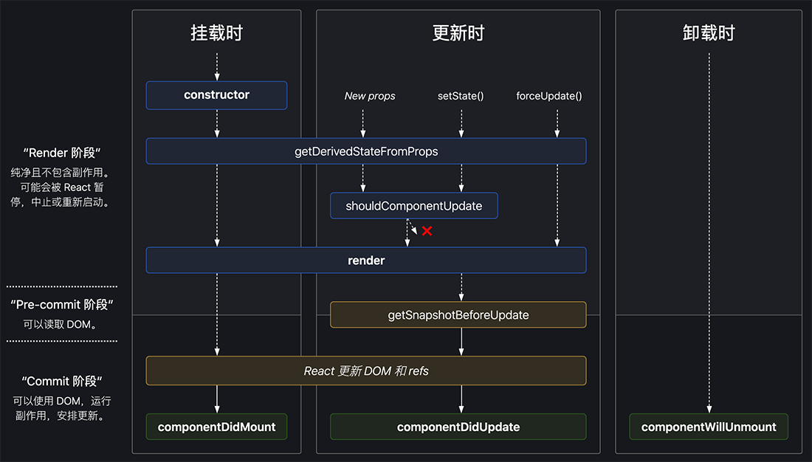

https://www.hangyu.site/2021/02/17/React-%E7%89%B9%E6%80%A7%E5%B0%8F%E7%BB%93%EF%BC%88v17-0-1%EF%BC%89/

1. 所有 React 组件都必须像纯函数一样确保它们的 props 不被更改
2. 出于性能考虑，React 可能会把多个 setState() 调用合并成一个调用。在需要依赖值以更新下一个状态时，可以使用该方法的`函数形式`：

```javascript
this.setState((state, props) => ({
  // 此处为上一个 state；
  counter: state.counter + props.increment
}))
```

3. 让 render 方法返回 null，可以让 React 不进行任何渲染
4. 启发式 “diffing” 算法的两个假设：
   - 两个不同类型的元素会产生不同的树
   - 开发者可以通过 key prop 告知哪些子元素在不同的渲染下保持稳定
5. 生命周期方法：
   
6. 惰性初始 state
   如果初始 state 需要通过复杂计算获得，则可以传入一个函数，在函数中计算并返回初始的 state，`此函数只在初始渲染时被调用。`
   ```javascript
   const [state, setState] = useState(() => {
     const initialState = someExpensiveComputation(props)
     return initialState
   })
   ```
7. Effects 的“自给自足”（基于 useEffect 的回调函数模式）：

- 依赖模式：

```javascript
useEffect(() => {
  const id = setInterval(() => {
    setCount(count + 1) // 依赖于外部状态；
  }, 1000)
  return () => clearInterval(id)
}, [count])
```

- 自给自足模式：

```javascript
useEffect(() => {
  const id = setInterval(() => {
    setCount(c => c + 1) // 不再依赖外部状态，以“发送指令”的方式告知 React 具体的操作；
  }, 1000)
  return () => clearInterval(id)
}, [])
```

8. 在组件内定义的函数每一次渲染都在变，因此将其作为 useEffect 的依赖会导致每次渲染都会触发 effect（本次渲染的函数与上一次的并不相同）。解决方案：

- 如果一个函数没有使用组件内的任何值，可以把它提到组件外面去定义（`脱离组件上下文`），然后就可以自由地在 effects 中使用；
- 将函数包装成 `“useCallback”`，然后作为 useEffect 的依赖，即只有当函数的依赖发生改变时，effect 才会被重新执行。

9. 防止竞态问题，保证已过期的 render-screen 不会影响当前正在生效的渲染：**利用布尔值进行跟踪。**

```javascript
function Article({ id }) {
  const [article, setArticle] = useState(null)

  useEffect(() => {
    let didCancel = false // 跟踪当前渲染的有效性；
    async function fetchData() {
      const article = await API.fetchArticle(id)
      if (!didCancel) {
        // 若当前渲染已取消则不渲染内容；
        setArticle(article)
      }
    }
    fetchData()
    return () => {
      didCancel = true // 新渲染完成时将旧渲染标记为“取消”；
    }
  }, [id])
  // ...
}
```

10. React 作为 UI 运行时的一些概念
    - 宿主树：React 程序通常会输出一棵会随时间变化的树。树必须是稳定（大多数情况的更新并不会从根本上改变其整体结构）且通用（宿主树可以被拆分为外观和行为一致的 UI 模式而不是随机的形状）的
    - 宿主实例：`宿主树上的“节点”`。如在 DOM 环境中，宿主实例就是我们通常所说的 DOM 节点。且通常会有原生的 API 用于操控这些宿主实例；
    - 渲染器：渲染器教会 React 如何**与特定的宿主环境通信以及如何管理它的宿主实例**，比如“协调器”的实现细节便存于其中。渲染器的具体实现是平台相关的，如：react-dom \ react-native \ react-art 等
    - React 元素：是一个普通的 JavaScript 对象。它用来描述一个宿主实例。JSX 是用来描述这些对象的语法糖。React 元素具有不可变性，你不能改变 React 元素中的子元素或者属性，如果想要在稍后渲染一些不同的东西，需要从头创建新的 React 元素树来描述它；
    - 入口：一个特定的 API 可以告诉 React ，`将特定的 React 元素树渲染到真正的宿主实例中`。比如 ReactDOM.render；
    - `协调(reconcile)：确定该对宿主实例做什么来响应新的信息；`
    - 组件：会返回 React 元素的函数，组件接受一个参数 — 对象哈希；
    - 纯净：React 组件中对于 props 应该是纯净的。只要`调用组件多次是安全的`，并且不会影响其他组件的渲染，React 并不关心你的代码是否像严格的函数式编程一样百分百纯净。在 React 中，幂等性比纯净性更加重要；
    - 控制反转（IoC）：让 React 调用我们的组件，而不是我们主动调用组件形成元素树；
      - 组件类型参与协调：通过 React 来调用你的组件，能让它了解更多关于元素树的结构；
      - React 能够推迟协调：如果让 React 控制调用你的组件，它可以让浏览器在组件调用之间做一些工作，这样重渲染大体量的组件树时就不会阻塞主线程。
    - 缓存：当父组件通过 setState 准备更新时，React 默认会协调整个子树。当树的深度和广度达到一定程度时，可以让 React 缓存子树（React.memo）并重用先前的渲染结果仅当 prop 在浅比较之后是相同时；
    - 一致性：需要在同步的循环中对真实的宿主实例进行操作，`以保证用户不会看见半更新状态的 UI` ，浏览器也不会对中间状态进行不必要的布局和样式计算。因此，**React 将所有的工作分成了“渲染阶段”和“提交阶段”。渲染阶段是当 React 调用组件然后进行协调的时段；提交阶段就是 React 操作宿主树的时候，而这个阶段永远是同步的；**
    - 原始模型：React 并没有使用“反应式”的系统来支持细粒度的更新。**任何在顶层的更新只会触发协调而不是局部更新那些受影响的组件；**
    - 调用树：React 会为每一个调用的组件维护一个“调用树”，这些“调用树”帧会随它们的局部状态和宿主实例一起被摧毁，这些帧本质上就是 Fibers。Fibers 是局部状态真正存在的地方。当状态被更新后，React 将其下面的 Fibers 标记为需要进行协调，之后便会调用这些组件；
    - 静态使用顺序：Hooks 的内部实现其实是“链表”。当调用 useState 的时候，指针会移到下一项。当退出组件的“调用树”帧时，会缓存该结果的列表直到下次渲染开始。
