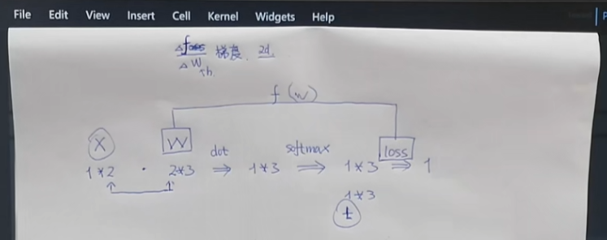
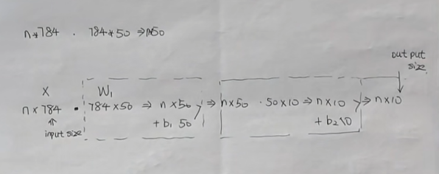

## 感知机(Perceptron)

### Sigmoid 函数

**Sigmoid** 函数是常用的激活函数，公式为：

\[
\sigma(x) = \frac{1}{1 + e^{-x}}
\]

特点：

- **输出范围**：将输入映射到 \( (0, 1) \) 区间。
- **用途**：适用于二分类问题，输出可解释为概率值。

### Softmax 函数

**Softmax** 函数用于多分类问题，将**输入向量转换为概率分布**，公式为：

\[
\sigma(z)_i = \frac{e^{z_i}}{\sum_{j=1}^{K} e^{z_j}}
\]

其中，\( K \) 为类别数，\( z_i \) 为第 \( i \) 个类别的输入值。

特点：

- **输出范围**：将输入向量映射到 \( (0, 1) \) 区间，且所有输出之和为 1。
- **用途**：用于多分类模型的最后一层，得到每个类别的概率。

```python
def softmax(x):
  if x.ndim == 2:
    x = x.T
    x = x - np.max(x, axis=0)
    y = np.exp(x) / np.sum(np.exp(x), axis=0)
    return y.T
  x = x - np.max(x)
  return np.exp(x) / np.sum(np.exp(x))
```

### mnist 数据集

- **训练集**：60000 张 28x28 的手写数字图片。
- **测试集**：10000 张 28x28 的手写数字图片。
- **标签**：0-9 十个数字。
- **预处理**：将图片像素值归一化到 \( [0, 1] \) 区间。
- **输入**：将 28x28 的图片展开为 784 维向量。
- **输出**：使用 One-Hot 编码表示标签。
- **模型**：输入层 784 个神经元，输出层 10 个神经元。
- **损失函数**：交叉熵。
- **优化算法**：梯度下降。
- **学习率**：0.01。
- **迭代次数**：1000。
- **Mini-Batch**：每次训练 100 张图片。
- **评估**：准确率。
- **结果**：准确率约 92%。
- **可视化**：权重矩阵。
- **预测**：输出概率最大的类别。

## 损失函数(Loss Function)

### 均方误差(MSE)

### 交叉熵(Cross Entropy)

```python
def cross_entropy_error(y, t):
  if y.ndim == 1:
    t = t.reshape(1, t.size)
    y = y.reshape(1, y.size)
  if t.size == y.size:
    t = t.argmax(axis=1)
  batch_size = y.shape[0]
  return -np.sum(t * np.log(y + 1e-7)) / batch_size
```

### Mini-Batch

**Mini-Batch** 是深度学习中常用的一种训练方式，介于批量梯度下降和随机梯度下降之间。使用 Mini-Batch 方法计算损失函数和更新参数时，每次使用一小部分数据（称为一个批次）来计算梯度。

**优点：**

- **计算效率高**：相比全量数据，Mini-Batch 减少了每次更新的计算量，提升了训练速度。
- **收敛稳定**：相比单个样本，使用 Mini-Batch 可以获得更稳定的梯度估计，有助于模型收敛。
- **利用向量化**：可以充分利用矩阵运算，加速计算过程。

**损失函数计算：**

对于每个 Mini-Batch，损失函数 \( L \) 定义为该批次内所有样本损失的平均值：

\[
L*{\text{mini-batch}} = \frac{1}{m} \sum*{i=1}^{m} L^{(i)}
\]

其中，\( m \) 是 Mini-Batch 的大小，\( L^{(i)} \) 是第 \( i \) 个样本的损失。

## 梯度下降

梯度：损失函数关于参数的偏导数。
定义：梯度下降是一种优化算法，通过迭代更新参数，使得损失函数最小化。

```py
def numerical_gradient_1d(f, xs):
    """
    计算函数 f 在点 xs 处的梯度
    """"
    h = 1e-4
    grad = np.zeros_like(xs)

    for idx in range(xs.size):
        tmp_val = xs[idx]

        # f(xs + h)
        xs[idx] = tmp_val + h
        fxh1 = f(xs)

        # f(xs - h)
        xs[idx] = tmp_val - h
        fxh2 = f(xs)

        grad[idx] = (fxh1 - fxh2) / (2 * h)
        xs[idx] = tmp_val

    return grad

def numerical_gradient_2d(f, xs):
    """
    计算函数 f 在点 xs 处的梯度
    """
    if xs.ndim == 1:
        return numerical_gradient_1d(f, xs)
    else:
        grad = np.zeros_like(xs)

        for idx, x in enumerate(xs):
            grad[idx] = numerical_gradient_1d(f, x)

        return grad
```

超参数(Hyperparameters)：影响模型训练的参数，如学习率、迭代次数等。

```py
def gradient_descent(f, init_x, lr=0.01, step_num=100):
    """
    梯度下降算法

    f: 损失函数
    init_x: 初始参数
    lr: 学习率
    step_num: 迭代次数
    """
    x = init_x
    for i in range(step_num):
        grad = numerical_gradient_1d(f, x)
        x -= lr * grad
    return x
```

学习率的选择：

- 学习率过大：可能导致参数更新过大，无法收敛。
- 学习率过小：可能导致收敛速度过慢，需要更多的迭代次数。
- 自适应学习率：如 AdaGrad、RMSprop、Adam 等。
- 衰减学习率：随着迭代次数增加，逐渐减小学习率。
- 损失函数：通过损失函数的变化情况，调整学习率。
- 梯度剪裁：限制梯度的范围，防止梯度爆炸。
- 正则化：通过正则化项，控制参数的大小。

### 神经网络的梯度实现



1. 是什么：神经网络的梯度是指损失函数关于参数的偏导数。这里的参数包括权重W和偏置b。
2. 为什么：梯度是优化算法的基础，通过梯度下降更新参数，使得`损失函数最小化`。
3. 怎么做：使用数值微分或反向传播算法计算梯度。

```py
# 1. 定义xtw
x = np.array([0.6, 0.9]) # 输入
t = np.array([0, 0, 1]) # 正确结果
w = np.random.randn(2, 3) # 2x3 权重矩阵

# 2. x,w 点乘获得y
y = np.dot(x, w)

# 3. 通过softmax函数处理y
y_sum = softmax(y)

# 4. 计算交叉熵损失函数
loss = cross_entropy_error(y_sum, t)

# 5. 将W变为损失函数的参数
class SimpleNet:
  def __init__(self, w):
    self.W = w

  def predict(self, x):
    return np.dot(x, self.W)

  def loss(self, x, t):
    z = self.predict(x)
    y = softmax(z)
    return cross_entropy_error(y, t)

net = SimpleNet(w)
f = lambda _: net.loss(x, t)

# 6. 计算损失函数关于W的梯度
dW = numerical_gradient_2d(f, w)
```

### 两层神经网络的类



```py
class TwoLayerNet:
  __slots__ = ('params',)  # 模型的参数

  def __init__(self, input_size, hidden_size, output_size, weight_init_std=0.01):
    self.params = {}
    self.params['W1'] = weight_init_std * np.random.randn(input_size, hidden_size)  # input_size x hidden_size 的矩阵
    self.params['b1'] = np.zeros(hidden_size)
    self.params['W2'] = weight_init_std * np.random.randn(hidden_size, output_size)
    self.params['b2'] = np.zeros(output_size)

  def accuracy(self, x, t):
    y = self._predict(x)
    y = np.argmax(y, axis=1)
    t = np.argmax(t, axis=1)
    res = np.sum(y == t) / float(x.shape[0])
    return res

  def loss(self, x, t):
    y = self._predict(x)
    return cross_entropy_error(y, t)

  def numerical_gradient(self, x, t):
    f = lambda _: self.loss(x, t)
    grads = {}
    grads['W1'] = numerical_gradient_2d(f, self.params['W1'])
    grads['b1'] = numerical_gradient_1d(f, self.params['b1'])
    grads['W2'] = numerical_gradient_2d(f, self.params['W2'])
    grads['b2'] = numerical_gradient_1d(f, self.params['b2'])
    return grads

  def _predict(self, x):
    W1, W2 = self.params['W1'], self.params['W2']
    b1, b2 = self.params['b1'], self.params['b2']
    a1 = np.dot(x, W1) + b1
    z1 = sigmoid(a1)
    a2 = np.dot(z1, W2) + b2
    y = softmax(a2)
    return y

# 1. 定义输入、输出、隐藏层大小
input_size = 784
hidden_size = 100
output_size = 10

# 2. 创建神经网络
net = TwoLayerNet(input_size, hidden_size, output_size)

# 3. 定义输入、输出
x = np.random.rand(100, 784)
t = np.random.rand(100, 10)

# 4. 计算梯度
grads = net.numerical_gradient(x, t)

# 5. 计算损失函数
loss = net.loss(x, t)

# 6. 计算准确率
acc = net.accuracy(x, t)

print(grads)
print(loss)
print(acc)
```

### 基于两层神经网络的手写数字识别

```py
import numpy as np
from dataset.mnist import load_mnist
from two_layer_net import TwoLayerNet

# 1. 加载数据
(x_train, t_train), (x_test, t_test) = load_mnist(normalize=True, one_hot_label=True)

# 2. 创建神经网络
input_size = 784
hidden_size = 50
output_size = 10
net = TwoLayerNet(input_size, hidden_size, output_size)

# 3. 超参数
iters_num = 10000
train_size = x_train.shape[0]
batch_size = 100
learning_rate = 0.1

# 4. 训练, mini-batch 梯度下降
for i in range(iters_num):
  batch_mask = np.random.choice(train_size, batch_size)  # 随机选择 batch_size 个样本
  x_batch = x_train[batch_mask]
  t_batch = t_train[batch_mask]

  grad = net.numerical_gradient(x_batch, t_batch)

  for key in ('W1', 'b1', 'W2', 'b2'):
    net.params[key] -= learning_rate * grad[key]  # 更新网络参数

  loss = net.loss(x_batch, t_batch)
  print(f'Iter: {i}, Loss: {loss}')

# 5. 测试
train_acc = net.accuracy(x_train, t_train)
test_acc = net.accuracy(x_test, t_test)
print(f'Train Acc: {train_acc}, Test Acc: {test_acc}')
```
