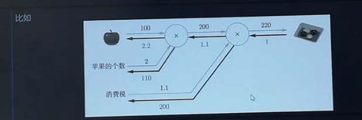
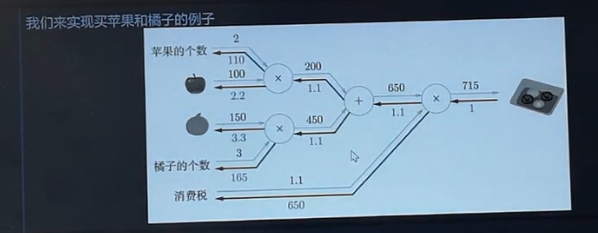
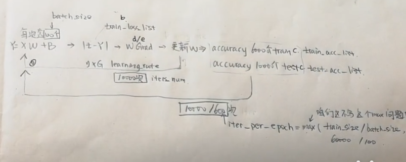

https://www.bilibili.com/video/BV15t411K7T2

神经网络层

## 误差反向传播算法（Error Backpropagation）



- 是什么：误差反向传播算法是一种通过反向传播误差信号来`调整神经网络权重的`方法。
- 为什么：在神经网络中，我们需要通过调整权重来减小误差，而误差反向传播算法是一种有效的方法。
- 怎么办：误差反向传播算法的基本思想是通过计算输出层和隐藏层的误差信号，然后根据误差信号来调整权重。

### 乘法层

定义：实现乘法的节点称为乘法层，乘法层的输入是两个数，输出是两个数的乘积。

```python
class MulLayer:
  def __init__(self):
    self.x = None
    self.y = None

  def forward(self, x, y):
    self.x = x
    self.y = y
    out = x * y
    return out

  def backward(self, dout):
    """
    dout: 上一层的导数
    """
    dx = dout * self.y
    dy = dout * self.x
    return dx, dy

apple = 100
apple_num = 2
tax = 1.1

# layer
mul_apple_layer = MulLayer()
mul_tax_layer = MulLayer()

# forward
apple_price = mul_apple_layer.forward(apple, apple_num)
price = mul_tax_layer.forward(apple_price, tax)

# backward
dprice = 1
dapple_price, dtax = mul_tax_layer.backward(dprice)
dapple, dapple_num = mul_apple_layer.backward(dapple_price)
```

### 加法层


定义：实现加法的节点称为加法层，加法层的输入是两个数，输出是两个数的和。

```python
class AddLayer:
  def __init__(self):
    pass

  def forward(self, x, y):
    out = x + y
    return out

  def backward(self, dout):
    dx = dout * 1
    dy = dout * 1
    return dx, dy

apple = 100
apple_num = 2
orange = 150
orange_num = 3
tax = 1.1

# layer
mul_apple_layer = MulLayer()
mul_orange_layer = MulLayer()
add_apple_orange_layer = AddLayer()
mul_tax_layer = MulLayer()

# forward
apple_price = mul_apple_layer.forward(apple, apple_num)
orange_price = mul_orange_layer.forward(orange, orange_num)
all_price = add_apple_orange_layer.forward(apple_price, orange_price)
price = mul_tax_layer.forward(all_price, tax)

# backward
dprice = 1
dall_price, dtax = mul_tax_layer.backward(dprice)
dapple_price, dorange_price = add_apple_orange_layer.backward(dall_price)
dorange, dorange_num = mul_orange_layer.backward(dorange_price)
dapple, dapple_num = mul_apple_layer.backward(dapple_price)
```

### 激活函数层ReLU

ReLU：Rectified Linear Unit，修正线性单元。
作用：引入非线性、缓解梯度消失问题，加快模型的收敛速度。

```py
def relu(x):
  return np.maximum(0, x)

class Reru:
  def __init__(self):
    self.mask = None

  def forward(self, x):
    self.mask = (x <= 0)  # <=0 的位置为True
    out = x.copy()
    out[self.mask] = 0
    return out

  def backward(self, dout):
    dout[self.mask] = 0
    dx = dout
    return dx
```

### 激活函数层Sigmoid

```py
def sigmoid(x):
  return 1 / (1 + np.exp(-x))

class Sigmoid:
  def __init__(self):
    self.out = None

  def forward(self, x):
    out = sigmoid(x)
    self.out = out
    return out

  def backward(self, dout):
    dx = dout * (1.0 - self.out) * self.out
    return dx
```

### Affine层

```py
class Affine:
  def __init__(self, W, b):
    self.W = W
    self.b = b
    self.x = None
    self.dW = None
    self.db = None

  def forward(self, x):
    self.x = x
    out = np.dot(x, self.W) + self.b
    return out

  def backward(self, dout):
    dx = np.dot(dout, self.W.T)  # .T 转置
    self.dW = np.dot(self.x.T, dout)
    self.db = np.sum(dout, axis=0)
    return dx
```

### soft-max with loss 层

它将 Softmax 激活函数 与 损失函数（通常是交叉熵损失）结合在一起.

```py
class SoftmaxWithLoss:
  def __init__(self):
    self.loss = None
    self.y = None
    self.t = None

  def forward(self, x, t):
    self.t = t
    self.y = softmax(x)
    self.loss = cross_entropy_error(self.y, self.t)
    return self.loss

  def backward(self, dout=1):
    batch_size = self.t.shape[0]
    if self.t.size == self.y.size:
      dx = (self.y - self.t) / batch_size
    else:
      # 当数据为 one-hot 时
      dx = self.y.copy()
      dx[np.arange(batch_size), self.t] -= 1
      dx = dx / batch_size
    return dx
```

### 误差反向传播算法的实现

思路：

1. 主函数
   
2. 用什么层
   四层(layer)
   - affine1 (w1, b1)
   - relu
   - affine2 (w2, b2)
   - softmax with loss
3. 层里的神经元如何实现

```py
class TwoLayerNet:
  __slots__ = ('params', 'layers', 'lastLayer')

  def __init__(self, input_size, hidden_size, output_size, weight_init_std=0.01):
    self.params = {}
    self.params['W1'] = weight_init_std * np.random.randn(input_size, hidden_size)
    self.params['b1'] = np.zeros(hidden_size)
    self.params['W2'] = weight_init_std * np.random.randn(hidden_size, output_size)
    self.params['b2'] = np.zeros(output_size)

    self.layers = OrderedDict()
    self.layers['Affine1'] = Affine(self.params['W1'], self.params['b1'])
    self.layers['Relu1'] = Relu()
    self.layers['Affine2'] = Affine(self.params['W2'], self.params['b2'])

    self.lastLayer = SoftmaxWithLoss()

  def predict(self, x):
    for layer in self.layers.values():
      x = layer.forward(x)
    return x

  def loss(self, x, t):
    y = self.predict(x)
    return self.lastLayer.forward(y, t)

  def accuracy(self, x, t):
    y = self.predict(x)
    y = np.argmax(y, axis=1)
    if t.ndim != 1:
      t = np.argmax(t, axis=1)  # 转为 one-hot
    accuracy = np.sum(y == t) / float(x.shape[0])
    return accuracy

  def numerical_gradient(self, x, t):
    loss_W = lambda _: self.loss(x, t)
    grads = {}
    grads['W1'] = numerical_gradient(loss_W, self.params['W1'])
    grads['b1'] = numerical_gradient(loss_W, self.params['b1'])
    grads['W2'] = numerical_gradient(loss_W, self.params['W2'])
    grads['b2'] = numerical_gradient(loss_W, self.params['b2'])
    return grads

  def gradient(self, x, t):
    # forward
    self.loss(x, t)

    # backward
    dout = 1
    dout = self.lastLayer.backward(dout)

    for layer in reversed(self.layers.values()):
      dout = layer.backward(dout)

    grads = {}
    grads['W1'] = self.layers['Affine1'].dW
    grads['b1'] = self.layers['Affine1'].db
    grads['W2'] = self.layers['Affine2'].dW
    grads['b2'] = self.layers['Affine2'].db
    return grads
```

### 多维数组求梯度

- np.nditer: 用于迭代多维数组的迭代器对象。

  - flags: 用于指定迭代器的行为。
    - multi_index: 用于获取多维数组的索引。
  - op_flags: 用于指定迭代器的操作行为。
    要修改数组元素，需要设置迭代器为可写模式。

  方法：`it.iternext()`、`it.multi_index`、`it.finished`

```py
def numerical_gradient(f, x):
  h = 1e-4
  grad = np.zeros_like(x)

  it = np.nditer(x, flags=['multi_index'], op_flags=['readwrite'])
  while not it.finished:
    idx = it.multi_index
    tmp_val = x[idx]
    x[idx] = tmp_val + h
    fxh1 = f(x)

    x[idx] = tmp_val - h
    fxh2 = f(x)

    grad[idx] = (fxh1 - fxh2) / (2 * h)
    x[idx] = tmp_val
    it.iternext()
  return grad
```
