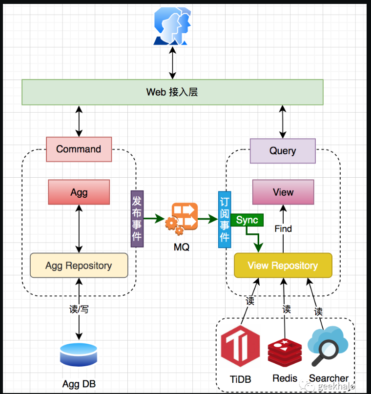

架构整洁之道
https://github.com/leewaiho/Clean-Architecture-zh/blob/master/docs/part1.md

旧瓶装新酒

## Part1. INTRODUCTION 概述

软件架构就是“用最小的人力成本来满足构建和维护系统的需求”

## Chap1. WHAT IS DESIGN AND ARCHITECTURE? 设计与架构到底是什么

设计（Design）：
架构（Architecture）：
**设计与架构一点区别都没有！！！**

- 乱麻系统的特点(THE SIGNATURE OF A MESS)
  这种系统一般都是没有经过设计，匆匆忙忙被构建起来的。然后为了加快发布的速度，拼命地往团队里加入新人，同时加上决策层对代码质量提升和设计结构优化存在着持续的、长久的忽视，这种状态能持续下去就怪了。
- 研发团队最好的选择是`清晰地认识并避开工程师们过度自信的特点，开始认真地对待自己的代码架构，对其质量负责`

## Chap2. A TALE OF TWO VALUES 两个价值维度

- 对于每个软件系统，我们都对以通过`行为`和`架构`两个维度来休现它的实际价值
  行为价值：满足需求，系统正常工作；
  架构价值：满足需求的同时，保持软件系统的灵活性。software。“ware” 的意思是“产品”，而 “soft” 的意思，不言而喻，是指软件的灵活性。软件系统必须够“软” 也就是说，`软件应该容易被修改。`

  好的系统架构设计应该尽可能做到与“形状”无关。

- 系统行为更重要，还是系统架构的灵活性更重要；哪个价值更大?
  FIGHT FOR THE ARCHITECTURE 为好的软件架构而持续斗争

## Part2. STARTING WITH THE BRICKS: PROGRAMMING PARADIGMS 从基础构件开始：编程范式

## Chap3. PARADIGM OVERVIEW 编程范式总览

**编程范式对程序员的写法灵活性进行了限制。**

直到今天，我们也一共只有三个编程范式，而且未来几乎不可能再出现新的：

- 结构化编程（structured programming）
  Structured programming imposes discipline on direct transfer of control.
  限制了 goto 语句，将程序结构限制在顺序、分支和循环上，对`程序控制权的直接转移`进行了限制和规范。

- 面向对象编程（object-oriented programming）
  Object-oriented programming imposes discipline on indirect transfer of control.
  通过多态让函数指针更易于使用也更安全，对`程序控制权的间接转移`进行了限制和规范

- 函数式编程（functional programming）
  Functional programming imposes discipline upon assignment.
  对程序中的`赋值`进行了限制和规范。以此可以将软件分为可变部分和不可变部分，不可变部分可以降低并发的难度

多态是我们跨越架构边界的手段，函数式编程是我们规范和限制数据存放位置与访问权限的手段，结构化编程则是各模块的算法实现基础
Notice how well those three align with the three big concerns of architecture: function, separation of components, and data management.
这和软件架构的三大关注重点不谋而合：`功能性、组件独立性以及数据管理`

## Chap4. STRUCTURED PROGRAMMING 结构化编程

All programs can be constructed from just three structures: `sequence, selection, and iteration`
人们可以用顺序结构、分支结构、循环结构这三种结构构造出任何程序

## Chap5. OBJECT-ORIENTED PROGRAMMING 面向对象编程

多态其实不过就是函数指针的一种应用：
在 C++中，类中的每个虚函数（virtual function）的地址都被记录在一个名叫 vtable 的数据结构里。我们对虚函数的每次调用都要先查询这个表，其衍生类的构造函数负责将该衍生类的虚函数地址加载到整个对象的 vtable 中

## Chap6. FUNCTIONAL PROGRAMMING 函数式编程

**一个架构设计良好的应用程序应该将状态修改的部分和不需要修改状态的部分隔离成单独的组件，然后用合适的机制来保护可变量**

## Part3. DESIGN PRINCIPLES 设计原则

## Chap7. SRP: THE SINGLE RESPONSIBILITY PRINCIPLE SRP：单一职责原则

任何一个软件模块都应该只对一个用户（User）或系统利益相关者（Stakeholder）负责。
任何一个软件模块都应该只对某一类行为者(actor)负责。

## Chap8. OCP: THE OPEN-CLOSED PRINCIPLE OCP：开闭原则

## Chap9. LSP: THE LISKOV SUBSTITUTION PRINCIPLE LSP：里氏替换原则

## Chap10. ISP: THE INTERFACE SEGREGATION PRINCIPLE ISP：接口隔离原则

## Chap11. DIP: THE DEPENDENCY INVERSION PRINCIPLE DIP：依赖反转原则

- 在源代码层次的依赖关系中引用抽象类型
- 反例：java String 类，原因：
  - 软件系统在实际构造中不可避免地需要依赖到一些具体实现
  - String 类本身是非常稳定的
- 在应用 DIP 时，我们也`不必考虑稳定的操作系统或者平台设施，因为这些系统接口很少会有变动`
  ` 我们主要应该关注的是软件系统内部那些会经常变动的（volatile）具体实现模块`，这些模块是不停开发的，也就会经常出现变更。

## Part4. COMPONENT PRINCIPLES 组件构建原则

## Chap12. COMPONENTS 组件

组件是软件的部署单元，是整个软件系统在部署过程中可以独立完成部署的最小实体
**组件化是插件架构的基础**

## Chap13. COMPONENT COHESION 组件聚合

The granule of reuse is the granule of release.
软件复用的最小粒度应等同于其发布的最小粒度

## Chap14. COMPONENT COUPLING 组件耦合

- 无依赖环原则
- 每周构建
- 打破循环依赖
  1. 依赖倒置原则(DIP)：调用接口
  2. 抽离公共依赖
- 稳定性指标
  根据入向依赖和出向依赖的数量来判断组件的稳定性
- **并不是所有组件都应该是稳定的**
  取决于抽象程度
- **一个组件的抽象化程度应该与其稳定性保持一致**
  衡量抽象化程度：组件中类的数量/组件中抽象类和接口的数量

## Part5. ARCHITECTURE 软件架构

**软件架构设计的主要目标是支撑软件系统的全生命周期，设计良好的架构可以让系统便于理解、易于修改、方便维护，并且能轻松部署。软件架构的终极目标就是最大化程序员的生产力，同时最小化系统的总运营成本**

## Chap15. WHAT IS ARCHITECTURE? 什么是软件架构

要坚定地在一线写代码，架构师应该是解决问题最强的那个人而不是高高在上指点江山的人(不贴合业务也设计不出啥好架构)

- 软件架构师自身需要是程序员，并且必须一直坚持做一线程序员，绝对不要听从那些说应该让软件架构师从代码中解放出来以专心解决高阶问题的伪建议。也许软件架构师生产的代码量不是最多的，但是他们必须不停地承接编程任务。如果不亲身承受因系统设计而带来的麻烦，`就体会不到设计不佳所带来的痛苦，接着就会逐渐迷失正确的设计方向`
  - 用例(Use Cases)
    架构必须能支持其自身的设计意图，让系统的行为意图在架构层面上可见。
  - 开发(Development)
    方便开发
  - 部署(Deployment)
    一键式的轻松部署
  - 运行(Operation)
    揭示系统运行：好的架构可以使开发人员对系统的运行过程一目了然
  - 维护(Maintenance)
    降低探秘（确定修改位置）、风险（确定影响范围）成本

## Chap16. INDEPENDENCE 独立性

## Chap17. BOUNDARIES: DRAWING LINES 划分边界

插件式架构
软件开发技术发展的历史就是一个如何想方设法方便地增加插件，从而构建一个可扩展、可维护的系统架构的故事
为了在软件架构中画边界线，`我们需要先将系统分割成组件，其中一部分是系统的核心业务逻辑组件，而另一部分则是与核心业务逻辑无关但负责提供必要功能的插件`。然后通过对源代码的修改，让这些非核心组件依赖于系统的核心业务逻辑组件。

## Chap18. BOUNDARY ANATOMY 边界剖析

## Chap19. POLICY AND LEVEL 策略与层次

## Chap20. BUSINESS RULES 业务逻辑————DDD 思想的来源

Business rules are rules or procedures that make or save the business money
业务逻辑是一个软件系统存在的意义，它们属于核心功能，是系统用来赚钱或省钱的那部分代码，是整个系统中的皇冠明珠
关键业务逻辑和关键业务数据是紧密相关的，所以它们很适合被放在同一个对象中处理，称为业务实体（Entity）。
`业务逻辑应该是系统中最独立、复用性最高的代码`， 不掺杂用户界面（比如 httpservletrequest）或者所使用的数据库相关的东西（比如数据 model）。

## Chap21. SCREAMING ARCHITECTURE 尖叫的软件架构

`一个系统的架构应该着重于展示系统本身的设计，而并非该系统所使用的框架`。
如果我们要构建的是一个医疗系统，新来的程序员第一次看到其源码时就应该知道这是一个医疗系统。新来的程序员应该先了解该系统的用例，而非系统的交付方式。他们可能会走过来问你：
"我看到了一些看起来像是模型的代码——但它们的视图和控制器在哪里？”
这时你的回答应该是：
“哦，我们现在先不考虑这些细节问题，回头再来决定应该怎么做。”
**简单理解就是先实现核心的业务逻辑，最后具体使用 React 框架还是 Vue 框架可以往后推迟，因为核心业务逻辑与框架是解耦的**

## Chap22. THE CLEAN ARCHITECTURE 整洁架构

## Chap23. PRESENTERS AND HUMBLE OBJECTS 展示器和谦卑对象

0. 谦卑对象模式最初的设计目的是帮助单元测试的编写者区分容易测试的行为与难以测试的行为，并将它们隔离。难以测试的一组叫谦卑组
1. PRESENTERS AND VIEWS 展示器与视图
   利用谦卑对象模式将 GUI 的这两种行为拆分成展示器与视图两部分

   - 视图部分属于难以测试的谦卑对象。这种对象的代码通常应该越简单越好，它只应负责将数据填充到 GUI 上，而不应该对数据进行任何处理
   - 展示器则是可测试的对象。`展示器的工作是负责从应用程序中接收数据，然后按视图的需要将这些数据格式化，以便视图将其呈现在屏幕上`。
   - 视图部分除了加载视图模型所需要的值，不应该再做任何其他事情。因此，我们才能说`视图是谦卑对象。`一般是 View 的数据模型，比如 React 中的 state 对象。

2. 在每个系统架构的边界处，都有可能发现谦卑对象模式的存在。因为跨边界的通信肯定需要用到某种简单的数据结构，而`边界会自然而然地将系统分割成难以测试的部分与容易测试的部分，`所以通过在系统的边界处运用谦卑对象模式，我们可以大幅地提高整个系统的可测试性。

## Chap24. PARTIAL BOUNDARIES 不完全边界

## Chap25. LAYERS AND BOUNDARIES 层次与边界

## Chap26. THE MAIN COMPONENT Main 组件

在所有的系统中，都至少要有一个组件来负责创建、协调、监督其他组件的运转。我们将其称为 Main 组件
Main 组件的任务是创建所有的工厂类、策略类以及其他的全局设施，并最终将系统的控制权转交给最高抽象层的代码来处理
**一般而言我们会在 main 中引入依赖注入框架**

## Chap27. SERVICES: GREAT AND SMALL 服务：宏观与微观

无数历史事实证明，大型系统一样可以采用单体模式，或者组件模式来构建，不一定非得服务化。因此服务化并不是构建大型系统的唯一选择

## Chap28. THE TEST BOUNDARY 测试边界

不变的组件不要依赖多变的东西，这样会导致非常难以测试

## Chap29. CLEAN EMBEDDED ARCHITECTURE 整洁的嵌入式架构

## Part6. DETAILS 实现细节

## Chap30. THE DATABASE IS A DETAIL 数据库只是实现细节

是数据库并不是数据模型。数据库只是一款软件，是用来存取数据的工具。从系统架构的角度来看，工具通常是无关紧要的——因为这只是一个底层的实现细节，一种达成目标的手段。`一个优秀的架构师是不会让实现细节污染整个系统架构的`

## Chap31. THE WEB IS A DETAIL Web 是实现细节

## Chap32. FRAMEWORKS ARE DETAILS 应用程序框架是实现细节

框架的选择要慎重，我们业务逻辑本身不能依赖框架

## Chap33. CASE STUDY: VIDEO SALES 案例分析：视频销售网站

## Chap34. THE MISSING CHAPTER 拾遗

- PACKAGE BY LAYER 按层封装

  - 在 presentation Domain Data Layering 这篇文章中，Martin Fowler 声称釆用这种分层架构是初期一个不错选择。他的观点并不缺乏拥戴者。很多书籍、教程和代码示范都在教育你采用分层架构。这种方式在在`项目初期之所以会很合适，是因为它不会过于复杂`。但就像 Martin 指出的那样，一旦软件规模扩展了，我们很快就会发现`将代码分为三大块并不够，需要进一步进行模块化`
  - **分层架构无法展现具体的业务领域信息**。`把两个不同业务领域的、但是都采用了分层架构的代码进行对比，你会发现它们的相似程度极高：都有 Web 层、服务层和数据仓库层`。这是分层架构的另外一个问题

- PACKAGE BY FEATURE 按功能封装
  另外一种组织代码的形式是“按功能封装”，`即垂直切分，根据相关的功能、业务概念或者聚合根（领域驱动设计原则中的术语）来切分`。在常见的实现中，所有的类型都会放在一个相同的包中，以业务概念来命名。
  一个好处是，如果需要修改 “查看订单”这个业务用例，比较容易找到相关代码，毕竟它们都在一个包中，而不是分散在各处

  **软件研发团队常常一开始采用水平分层方式（即 “按层封装”），遇到困难后再切换到垂直分层方式（即 “按功能封装”）。我认为，两种方式都很不好。看完本书，你应该意识到还有更好的分类方式**
  按层封装还有一个问题：`边界不清晰`，eg：多维表格筛选 UI 展示配置，view-model 层就是一个混乱的地方，不知道应该放在哪里

- PACKAGE BY COMPONENT 按组件封装
  分层架构设计的目的是将功能相似的代码进行分组。
  组件是部署单元。组件是系统中能够部署的最小单位，对应在 Java 里就是 jar 文件
  一个架构设计原则内容是`“Web 控制器永远不应该直接访问数据层”`。
  有一小部分团队告诉我，他们会采用静态分析工具来在构建阶段自动检查违反架构设计规则的代码
  一般来说就是一段正则表达式，例如`“包 **/web 下面的类型不允许访问 **/data 下面的类型”`，这些检查在编译步骤之后执行
  Public 类型越少，潜在的依赖关系就越少。

---

> CQRS 是 Command Query Responsibility Segregation 得简称，简单理解就是对 “写”（Command） 和 “读” （Query）操作进行分离
> Command 场景需要保障严谨的业务逻辑，通常复杂性偏高，所以 DDD 是最优解
> Query 场景需要更灵活的数据组装能力作为支持，通常比较简单，所以 事务脚本 是最优解
> 
> 由于 CQRS 的本质是对于读写操作的分离，所以比较简单的 CQRS 的做法是：
> CQ 两端数据库表共享，CQ 两端只是在上层代码上分离。

---

架构整洁之道网友笔记
https://lailin.xyz/post/go-training-week4-clean-arch.html

- 架构的主要目的是支持系统的生命周期。良好的架构使系统易于理解，易于开发，易于维护和易于部署。最终目标是最小化系统的寿命成本并最大化程序员的生产力

https://www.meetkiki.com/archives/%E5%86%8D%E8%AF%BB%E3%80%8A%E6%9E%B6%E6%9E%84%E6%95%B4%E6%B4%81%E4%B9%8B%E9%81%93%E3%80%8B

- 面向对象的软件设计到底是什么，怎么用一句话形容这个行为？很多人只能意会，无法言表，看完这本书，终于知道怎么说了，那就是两个控制：

1. 分离系统中变与不变的内容，对变化的部分进行控制
   例如：插槽
2. 分析系统中的各种依赖关系（对象、组件），对这些依赖关系进行控制

https://juejin.cn/post/7160552589250166820

https://juejin.cn/post/7124624443279671332#heading-22

https://qiankunli.github.io/2019/08/20/clean_architecture_note.html
