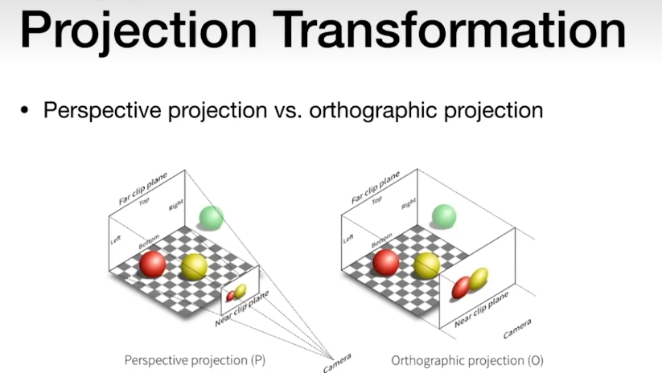

https://blog.csdn.net/weixin_43803133/category_10303553.html
https://immmortal.notion.site/GAMES101-b0e27c856cde429b8672671a54c34817

# Lec 01：Overview 计算机图形学概述

- 0 前言
  The Quick Brown Fox Jumps Over The Lazy Dog (快速的棕色狐狸跳过了懒狗)
- 1 什么是计算机图形学

  **图形学：合成与操作视觉信息**(Synthesis and manipulation of visual information)

- 2 为什么要学计算机图形学
  - 2.1 应用
  - 2.2 基础学习的困难：数学、物理、动画、仿真
  - 2.3 技术的挑战
- 3 本课程讨论的话题
  - 3.1 光栅化（Rasterization）
    定义：将几何图形显示在屏幕上的过程(Project geometric primitives onto the screen)
  - 3.2 曲线和曲面 (Curves and Meshes)
  - 3.3 光线追踪 (Ray Tracing)
  - 3.4 动画/仿真 (Animation/Simulation)
  - 3.5 注意
    不讨论：OpenGL/DirectX
    讨论：图形学，而不是图形学 api

# Lec 02：Linear Algebra 线性代数回顾

- 0 图形学的依赖学科
- 1 向量
  - 1.1 点乘
  - 1.2 叉乘
- 2 矩阵

# Lec 03~04：Transformation 基础变换/MVP 矩阵

- 3D Transformation
  基础变换（仿射变换）：旋转、缩放、切变、平移，齐次坐标系，旋转的表示
  关于四元数
  坐标系统，MVP 矩阵
- Viewing Transformation
  - view/camera transformation 观测矩阵相关（摄影机），
    Also known as ModelView Transformation (MVP)
  - projection transformation
    - 正交投影(Orthographic Projection)，没有近大远小
    - 透视投影(Perspective Projection)，鸽子为什么这么大
      

# Lec 05~06：Rasterization 光栅化

## 1 从标准化设备坐标到屏幕

## 2 从图形到光栅显示

2.1 采样
2.2 实际的光栅化
2.3 采样的缺点

## 3 反走样

- 3.1 引入
- 3.2 走样现象
- 3.3 基于超采样的反走样方法
  3.3.1 SSAA（Supersampling Anti-Aliasing）
  3.3.2 MSAA（Multisample Anti-Aliasing）
- 3.4 基于形态学的反走样方法
  3.4.1 MLAA(Morphological Antialiasing) & SMAA(Subpixel Morphological Antialiasing)
  3.4.2 FXAA（Fast Approximate Anti-Aliasing）
- 3.5 基于时间的反走样方法
  3.5.1 TAA(Temporal Anti-Aliasing)
- 3.6 深度学习反走样

## 4 可见度/遮挡

4.1 Z 缓冲

# Lec 07~09：Shading 定义、着色模型、着色频率、图形渲染管线、纹理

# Lec 10~12：Geometry 几何、隐式与显式、曲线与曲面、网格

# Lec 13~14（1）：Ray Tracing（1） Whitted 风格光线追踪

# Lec 14（2）~16：Ray Tracing（2） BRDF、渲染方程、全局光照、路径追踪

# Lec 17：Materials and Appearances 材质和外观

# Lec 18：Advanced Topics in Rendering

# Lec 19： Cameras, Lenses and Light Fields 相机、透镜、光场

# Lec 20：Color and Perception 颜色与感知

# Lec 21~22：Animation
