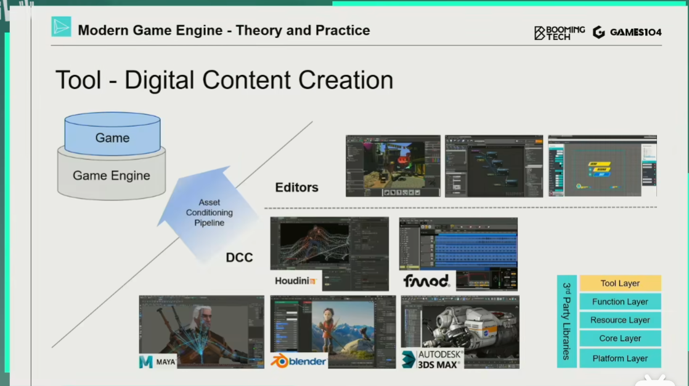
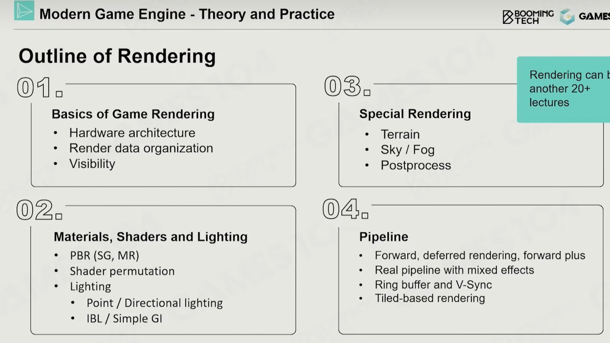
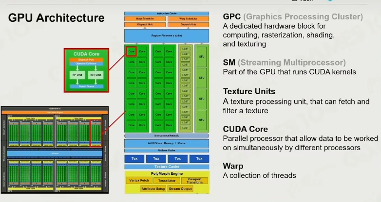
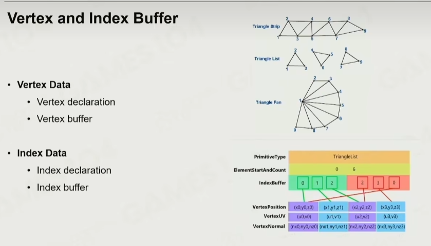
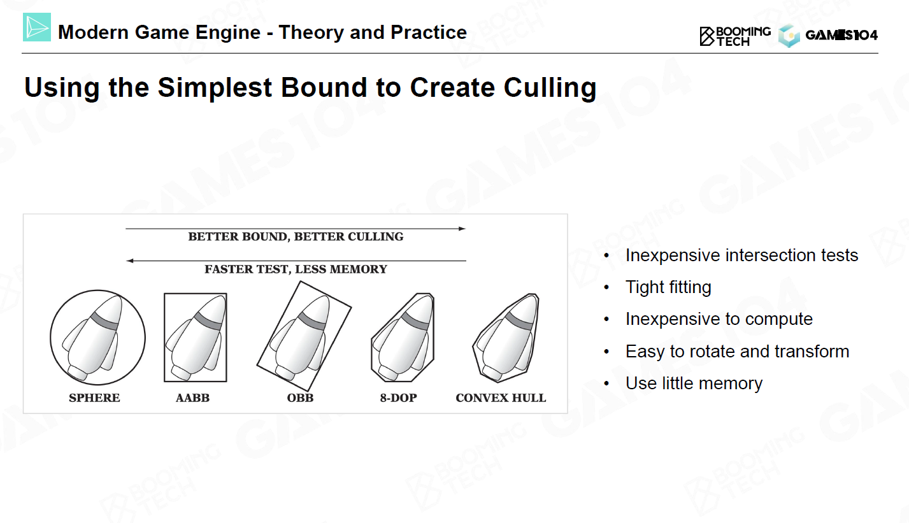
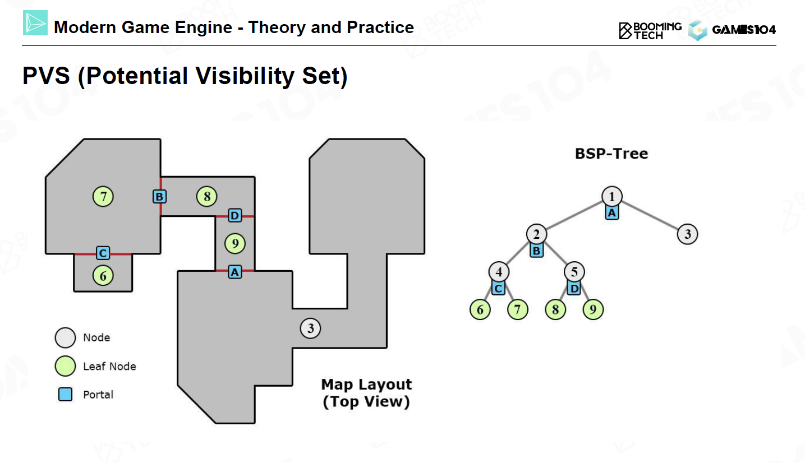
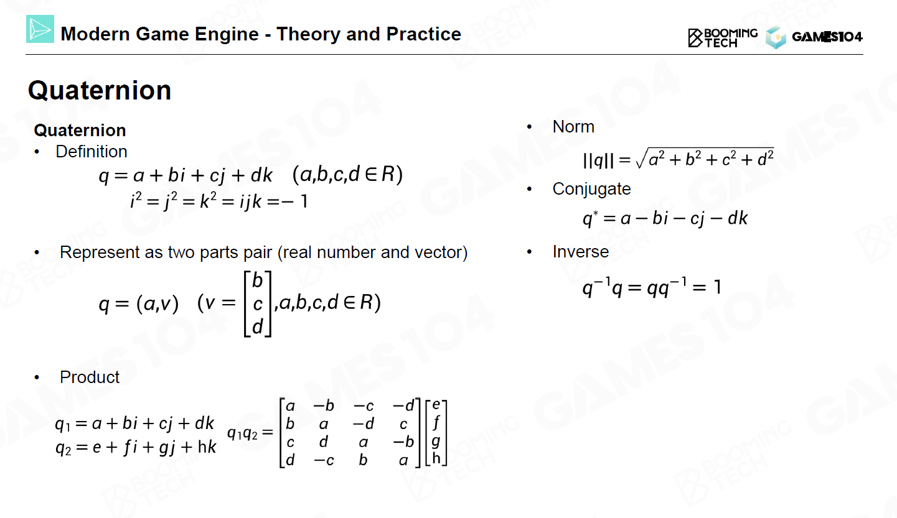
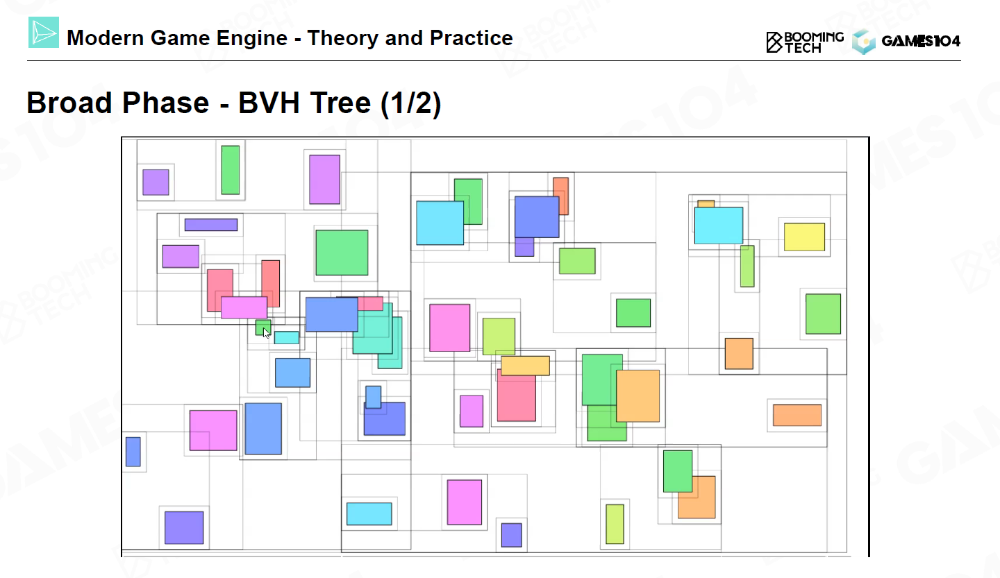
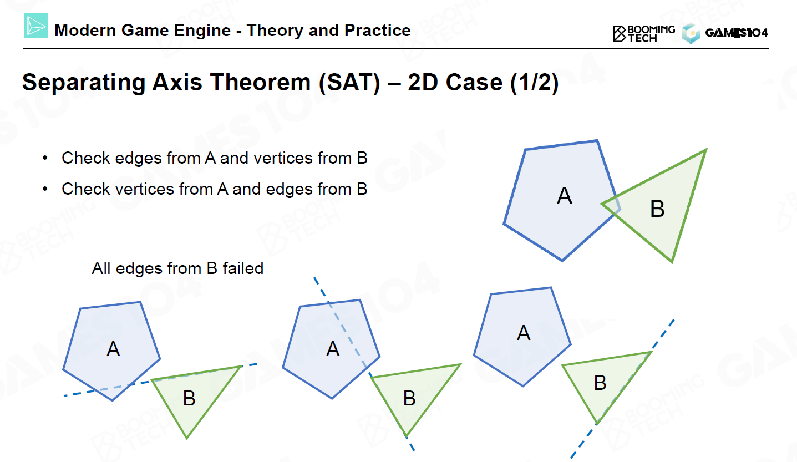

目录：
本课程会涉及现代游戏引擎的

- 体系架构
  游戏引擎的基础构建，如 MVVM
  - 游戏引擎分几层？
  - 看引擎代码先看 update 函数
- Rendering
  把东西放在 1/30s 内显示出来，渲染管线，各种算法如何拼接和组合
- Animation
  过渡怎么做、应变、一些列的动画如何组织起来，强调交互与玩法，让设计师能够理解
- Physics
  物理表达，刚体力学模拟运动，弹性力学，流体模拟
- Gameplay：前面就是世界的模拟器，而 gameplay 就是好玩的规则，规则如何让计算机理解，而且需要设计师去使用，所有的游戏就是规则体系；编程不一定是写代码，制作逻辑就算编程
- Misc. Systems：特效系统，寻路系统、相机系统
- Tool set：构建工具体系，如反射体系，在更新的时候，过去与未来的设计能够兼容
- Online Gaming：通过信息沟通，让每个平行宇宙发生的事情是一致的；异步同步算法、帧同步算法
- Advanced Technology：
  - Motion matching、PCG（自动生成）
  - 面向数据的编程、多线程的任务系统，程序在多核运行
  - lumen 光照技术、Nanite 面片技术

1. 游戏引擎导论 (Overview of Game Engine)
   游戏引擎是一个软件开发`框架`。
   现代游戏引擎是一个非常庞大的系统，它集合了整个计算机科学从底层硬件到应用端几乎全部的内容。某种意义上说，开发一个现代游戏引擎的难度不亚于开发一个现代操作系统。
   `Game Engine is Way Beyond Rendering`
   - 为什么要学习游戏引擎
     技术
   - 游戏发展史
     1. 早期的游戏并没有专门的引擎，开发者的目标是在有限的计算能力和存储空间中实现相对复杂的游戏玩法。公认的游戏引擎之父是 John Carmack，他开发的重返德军总部(Wolfenstein 3D, 1992)可以认为是第一款通过游戏引擎开发的游戏。
     2. **现代游戏引擎的出现则要归功于 GPU 的发展**。随着对图形渲染需求的增加，人们开发出了 GPU 这样的计算硬件`将图形运算从 CPU 逻辑运算分离出来`。通过对**高度并行化图形运算**的优化，人们第一次实现了全程的 3D 游戏。
     3. 除了游戏引擎外也有很多公司和团队专精某一个子系统的功能，包括物理仿真、声学仿真、渲染等等。
   - 游戏引擎的目标是在有限的计算资源和带宽下尽可能对现实世界进行**实时**模拟。`实时性`是游戏引擎和图形学其它研究的重要区别之一，大部分游戏特效的计算都要压缩在 1 ms 左右。
   - 游戏引擎和工业软件例如 CAD、建筑软件等有很多共通点，但是每个引擎都会根据自己的需求做定制 游戏引擎仍然是跑的最远的，因为在商业上被充分竞争。
2. 基础架构 1 – 引擎架构分层，整体 Pipeline (Layered Architecture of Game Engine)
   现代游戏引擎是一个非常复杂的系统并包含了海量的代码，但幸运的是游戏引擎一般会通过分层的方式将这些代码组织起来。因此了解游戏引擎的分层架构有助于对整个系统形成全面的认识。
   对游戏引擎进行分层的意义在于对不同类型的代码进行解耦，这样可以更好地管理这个系统的复杂度。

   1. 工具层：现代游戏引擎的界面，各种编辑器，直接和开发者进行交互
   2. 功能层：让这个世界看得见动起来
      `游戏引擎的核心是 tick 函数`

      - tickLogic：先把整个世界的物理规则算一遍，模拟出这个世界
      - tickRender：某个人看到的一副 2d 画面；会做裁剪、光照、阴影

   3. 资源层：各种数据，动画、模型、音乐，负责加载管理这些资源，为功能层提供弹药

      - 把资源的数据转换成引擎的高效数据：resource->assets；去掉无用信息
      - 数据之间的关联 reference 是最重要的
      - `guid：资产的全局唯一识别号`，相当于身份证
      - 需要一个实时的资产管理器，handle 系统
      - 资产会根据进度进行加载和卸载，guid 和 handle 就是解决这个问题
        延迟加载策略，比如材质从粗糙到细致的加载

   4. 核心层：功能层各个部分都会调用相同的很基础底层的代码，就像是工具箱、瑞士军刀

      - 数学库：数学效率
        - carmack’s 1/sqrt(x)
        - sse：cpu 并行运算向量
      - 数据结构：在核心层做一套自己的数据结构，没有内存碎片
      - 内存管理：开辟一大块内存自己管理，为追求最高的效率；cpu 的缓存越大，取出数据效率越高；
        内存管理三大步骤：把数据放在一起，尽可能地顺序访问数据，读写的时候尽可能一起去读写

   5. 平台层：最终发步到用户的设备上，平台不一样、输入不一样（键盘、手柄、体感）

      - 掩盖掉平台差异度
      - Render Hardware Interface(RHI)：重新定义一个 api，把各个硬件 sdk 封装起来

   6. 中间件和第三方库：会集成到上面的各个层中，有 sdk 可以直接编译进去；还有是工具，在引擎之外

   - Decoupling and Reducing Complexity
     底层与高层独立
     Lower layers are independent from upper layers.
     封装，高层不知道底层的实现
     Upper layers dont't know how lower layers are implemented.
   - Response for Evolving Demands
     底层的代码不要轻易改动，顶层可以；只允许上调用下
     Upper layers evolve fast, but lower layers are stable.
     

   1. 打开一个游戏引擎会直接看到各种类型的编辑器。这个直接和开发者进行交互的层称为工具层(tool layer)。
      工具层是为游戏开发者提供支持的一层。工具层允许游戏开发者直观地预览不同美术资源在游戏环境中的表现，对于游戏开发者和设计师有着重要的意义。
      DCC(Digital Content Creation)：别人开发的资产生产工具（比如 3dmax、maya、houdini）
      从 dcc 到 game engine 的流程叫做 `asset condition pipeline，有导入器、导出器`
      
   2. 在工具层下面包含功能层(function layer)，用来实现游戏的渲染、动画、交互等不同类型的功能。

      功能层的作用类似于一个时钟(`tick`)用来控制整个游戏世界的运行，在每个时钟周期内功能层需要完成整个游戏系统的全部运算
      **tickLogic(deltaTime) -> tickRender(deltaTime)**

   3. 在此基础上还需要资源层(resource layer)来管理各种各样的场景美术资源。
      游戏中的每一个对象都包含不同类型的资产(asset)，比如说几何模型、纹理、声音、动画等，同时每种资产都可能包括不同的数据格式。通过资源层我们将游戏对象的资产组织起来并通过全局唯一标识符(Globally Unique Identifier, GUID)进行识别和管理。

      - **资源层的核心在于管理不同资产的生命周期(life cycle)**。gc 很关键

   4. 再下一层是核心层(core layer)，它包括支持游戏渲染、动画、物理系统、内存管理等不同系统的核心代码。
      核心层数学库还大量使用了 `CPU 的 SIMD 指令`，这样可以极大地加速矩阵和向量的计算速度。
      **核心层最重要的功能是实现内存管理(memory management)，**

      **内存管理三条核心**：

      - put data together (把数据放在一起)
      - access data in order (按顺序访问数据)
      - allocate and de-allocate as a block (读写在一个块中)

   5. 最底层是平台层(platform layer)，一般包括各种图形 API、输入设备支持以及不同游戏平台的底层代码。
      平台层来提供对不同操作系统和硬件平台的支持
      Render Hardware Interface：重新定义一个 api，把各个硬件 sdk 封装起来
   6. 除此之外各种不同类型的中间件也会贯穿整个游戏引擎的不同层。

   - Takeaways

     1. 引擎是分层架构的：
        平台层、核心层、资源层、功能层、工具层
     2. 越底层的代码越稳定质量越高，越高层的代码设计得越开放越灵活，能适应不同的游戏
     3. 游戏引擎的核心是 tick 函数

3. 基础架构 2 – 数据组织和管理
   `组合`

   - 游戏世界是由各种各样的**游戏对象(game object, GO)**组成的
   - 现代游戏引擎中一般是通过**组件化(components)**的方式来描述一个对象(组件模式)
     以无人机为例，我们可以把任意形式的无人机拆分成 Transform、Motor、Model、AI 等组件，然后单独实现每个组件的功能。
   - 更新方法模式：两种 tick  
     object-based tick -> component-based tick
     component-based tick 相对要反直觉一点，但却有着更高的性能。component-based tick 相当于把系统的 tick()函数分解成流水线，这样可以提高系统的并行性并重复利用缓存。
   - 使用了 event 机制来实现 GO 之间的通信
     **很多 tick 是并行执行的，所以时序很重要，如果让 go 彼此互相通信，就会产生逻辑混乱，因此引入邮局(dag)；go 之间不能直接通信**
     **pretick 和 posttick 就是解决时序问题**
   - How to Manage Game Objects?
     稍微好一点的管理方式是把场景划分成一个均匀的网格，这样需要进行查询时只考虑相邻格子中的 GO 即可。`但如果 GO 在网格上不是均匀分布，这种管理方式的效率仍然很低。`
     合理的管理方法是使用带层级的网格，这种方式的本质是使用一个`四叉树`进行管理。这样进行查询时只需要对树进行遍历即可。
     除了四叉树之外，现代游戏引擎进行场景管理时还会使用 `BVH、BSP、octree、scene graph 等不同类型的数据结构。`
     
   - FAQ
     - 如果 tick 时间过长怎么办：一般会用 deferred tick，把爆炸的计算分散到各个帧里面算，做延迟 tick(时间分片)。
     - tick 时渲染线程和逻辑线程怎么同步：tickrender 主要做数据准备，ticklogic 会比 tickrender 早一些。

4. 渲染系统 1 – 渲染数据组织 (Basic of Game Rendering)
   

   渲染研究更关注于算法理论的正确性而对于实时性没有太多的要求，而在游戏渲染中实时性则至关重要。对`实时渲染`的关注构成了游戏渲染和渲染理论之间的主要差别。

   - realtime -> 30fps
   - interactive -> 100fps
   - offline rendering
   - out-of-core rendering (电影 cg 渲染，几天渲染一帧)

   渲染的四个难点

   1. 不同类型的渲染对象(场景复杂)
   2. 要考虑渲染过程的硬件实现
   3. 人们对于游戏画质和帧率的要求逐渐提高

      - 帧率稳定，30fps 算 realtime，10fps 算可交互
      - 1080P、4K 甚至 8K 分辨率

   4. 渲染系统只能占掉 10-20%的计算资源

   - Rendering Pipeline and Data
     目前游戏引擎渲染的主流方法仍是**基于光栅化(rasterization)的渲染管线。**
     
     投影、光栅化、着色、纹理采样：
     首先我们需要把场景中的物体投影到 NDC 上，然后分别计算平面上每一个像素对应的渲染对象。
     接下来对于每一个像素需要调用相应的 shader 计算像素的颜色。
     在调用 shader 时往往还需要通过纹理采样的方法进行反走样等处理。
     > mipmap：纹理的不同分辨率，用来解决纹理采样的问题
   - Understand the Hardware
     渲染计算的特点是有大量的像素需要进行计算，而像素之间的计算则往往是相互独立的。因此人们设计出了 `GPU(显卡) 来执行图形渲染计算`，这样还解放了 CPU 的计算资源。可以说现代 GPU 的发展也推动了整个游戏行业渲染技术的进步。
     SIMD 是指在运行程序时可以`把一条指令同时执行在不同的数据上`，目前现代 CPU 对于 SIMD 有着很好的支持，这种技术在高性能计算等领域中有着广泛的应用；而 SIMT 则是把`同一条指令分配到大量的计算核心上同时执行`，现代 GPU 的计算过程更类似于 SIMT。

     > simd(single instruction Multiple Data)：单指令、多数据的数据运算，就是四维向量，也就是说一个指令同时完成四个加减法
     > simt(single instruction Multiple Threads)：如果计算内核很小，但有很多个，一个指令让很`多核`去计算，极可能使用同样的代码，每个核访问自己的数据，所以跑的非常快

     GPU 费米架构：
     
     在现代 GPU 架构中有着大量重复的内核，每一组内核称为一个 GPC(Graphics Processing Cluster)。在每个 GPC 内部存放着大量的 SM(Stream Multiprocessor)，而每个 SM 中还有着大量的 CUDA 核心用来执行数学运算，当 SM 接收到指令进行计算时会把运算分配给 CUDA 核心进行并行计算。同时 GPU 上还有 share memory 用来实现 GPU 上不同核心以及 GPU 和 CPU 之间的通信。

     `GPU 和 CPU 之间通信的代价是非常大的，因此在渲染系统中会尽量把数据通信设计为单向的。这样 GPU 只需要读取 CPU 发送的数据而无需反向传输渲染的结果。`
     

     Cache：内存固然快，但依然比缓存慢百倍 (数据要放在一起)

   - Renderable
     在进行渲染时我们只需要考虑那些需要进行渲染的 GO，它们称为可渲染对象(renderable)。
     一般来说我们可以把整个可渲染对象拆分成若干个 block，每个 block 有着自身的网格、材质等渲染信息。
     对于网格数据，我们需要存储网格上所有的顶点坐标以及每个面包含节点的编号。同时我们往往还需要为每个顶点单独存储一个法向来`处理曲面发生突变`的情况。

     > 存储方式：顶点缓冲区（vertex buffer）和索引缓冲区（index buffer）
     > https://doodlewind.github.io/learn-wgpu-cn/beginner/tutorial4-buffer/

     
     对于材质(matrials)数据，我们需要定义常见材质的渲染模型。在现代游戏引擎中往往还会集成大量的 PBR 材质以渲染出更加逼真的图像。
     除此之外，我们还需要考虑材质的纹理(texture)。纹理对于材质的定义以及最终渲染呈现的效果起着至关重要的作用。
     当然我们还需要考虑 shader，在进行渲染时需要把编译好的 shader 连同数据一起提交的 GPU 上进行计算。

   - Render Objects in Engine
     接下来我们就可以对 GO 进行渲染了。
     将顶点数据、材质、纹理交给 gpu，再让 gpu 按 shader 执行，就会渲染出东西来。
     实际工程中我们往往需要把一个完整的网格拆分成不同的`submesh，每个submesh有着自己的材质和纹理而整个网格共享一套顶点和面片信息(instance pool，享元模式)`。这样利用 submesh 的概念就可以绘制出更加逼真的图像。
     为了更高效地利用 GPU，我们还可以把场景中的`submesh按照材质进行排序。这样可以保证渲染时具有相同材质的submesh会放在一起进行绘制，从而降低GPU切换资源的开销`
     在很多游戏场景中还存在着大量相似甚至是完全相同的 GO。对于这种情况可以通过`GPU batch rendering`的方法把这些 GO 组织在一起，然后把同一 batch 中的对象一次性交给 gpu 绘制出来，进一步提升场景渲染的效率。
   - Visibility Culling
     `可见性剔除(visibility culling)`是渲染系统中非常实用的技术，它的思想是在送入渲染管线前首先判断场景中的每个可渲染对象是否在相机视野中，然后只对视野范围内的对象进行渲染。
     `visibility culling的核心是把可渲染对象使用bounding box(包围盒)进行表示，然后通过bounding box来迅速判断物体是否在视锥范围内。`我们通过 bounding box 将场景中的物体组织起来，这样在渲染时只需要通过对它们进行遍历就可以快速地实现 visibility culling。

     

     在现代游戏引擎中，**BVH(Bounding Volume Hierarchy) 是应用最为广泛的 bounding box。BVH 的一大特点是它可以在场景中物体发生运动时通过对节点的操作来动态地修改树的结构**，这样无需每次都重新建树从而大大提高了计算效率。

     在游戏设计中，**PVS(potential visibility set)**是一种非常实用的技术。`它的思想是把整个场景划分为若干个相对独立的区域，不同区域之间通过 portal 进行连接。`先用 BSP 将房间分成小格子，每个格子通过 Portal 链接，在其中一个格子时，只看到部分的格子，从而减少绘制。
     

     利用现代 GPU 的强大并行计算能力我们可以**显卡来做裁剪，生成遮挡物的深度图，然后选择是否丢掉，这样的技术称为 GPU based culling。**

   - Texture Compression
     纹理压缩

     我们在前面的章节介绍过纹理对于渲染出逼真的物体起着重要的作用。通常情况下纹理会通过一张二维贴图进行表示，并且在`计算机中使用 JPG 或是 PNG 这样的压缩格式进行存储`。而在游戏引擎中则无法使用这些常用的图像压缩格式，这主要是因为 `JPG 这样的压缩算法不支持快速的随机图像坐标访问(Random Access)，而且它们往往具有过大的计算复杂度无法进行实时的压缩与解压。`

     在渲染系统中最常用的纹理压缩算法是`block compression`，它的思想是统计每个 4×4 区域内纹理图像最大和最小值然后通过插值的方法进行查询。
     PC 端：BC7 算法
     `移动端：ASTC 算法`

   - Authoring Tools of Modeling

     游戏中的模型是怎么获得的呢？

     1. 几何建模：最经典的建模方法是使用 3ds Max、Maya、blender 等建模软件来绘制 3D 模型。
     2. 雕刻：近几年基于雕刻的建模软件也获得了非常多的应用。
     3. 扫描：随着人工智能和三维重建技术的发展，我们甚至可以从实物通过扫描的方法来重建出非常精细的网格。
     4. 程序化生成：除此之外，还有一些自动化建模工具来自动生成地形等场景的网格。

     

   - Cluster-Based Mesh Pipeline
     随着现代 GPU 计算能力的提高以及人们对于画质需求的不断增长，在 3A 大作中的模型往往都具有`百万级甚至千万级的网格`
     为了渲染出具有如此高精度的网格就需要使用 **mesh shader** 相关的技术。**mesh shader 的核心思想是把网格上的一小块区域视为一个 meshlet，每个 meshlet 都具有固定数量的三角形。**
     mesh shader 可以生成几乎无限的细节，而且可以根据相机和物体的相对位置关系动态地调整网格的精度。
     虚幻 5 中的 Nanite 技术可以认为是更加成熟的 mesh shader。

   - Take Away
     1. 游戏引擎的渲染深度依赖于硬件架构设计(gpu)
     2. submesh 来提高渲染效率
     3. visibility culling 尽可能少地渲染(do nothing)
     4. 尽量用 GPU 做计算，CPU 只负责数据准备 (gpu driven)

   Q&A:

   - 引擎有必要自写渲染管线吗？
     最好不造轮子

5. 渲染系统 2 – 光照 (Materials、Shaders and Lighting)
   渲染是研究光与材质相互作用的学科，因此本节课从光线、材质以及 shader 三个方面介绍现代游戏引擎中各种经典实时算法的原理。

   - The Rendering Equation
     渲染的本质是求解渲染方程(the rendering equation)，它由 James Kajiya 于 1986 年提出。
     渲染的难点可以分为一下三部分：
     如何计算入射光线、如何考虑材质以及如何实现全局光照。
   - Starting from Simple

     1. 环境光+主光+环境光贴图
     2. Blinn-Phong 模型是最简单的光照模型，它包括了漫反射、高光反射和环境光反射三种光照效果。问题是能量不守恒。
     3. 对于阴影问题，现代游戏引擎的主流方法是 shadow map。
        shadow map 的处理流程是在光源位置设置一个新的相机并渲染出一张`深度图`，然后在实际相机进行渲染时对每个点检测它到光源处的深度。

   - Pre-computed Global Illumination
     全局光照可以显著地提升画面的渲染效果。

     - 球面谐波函数(spherical harmonics, SH)是实时渲染中表示环境光照的经典方法
     - lightmap ：我们可以将场景中每个点的光照离线烘焙到一张纹理图上，然后在渲染时读取纹理值来获得 SH 表达的环境光照。计算 lightmap 是非常耗时的，但通过 lightmap 可以实现非常逼真的场景效果，而且在实际渲染时 lightmap 可以实现场景的实时渲染。

   - Physical-Based Material

   - Image-Based Lighting

   - Classic Shadow Solution

   - Moving Wave of High Quality
     随着各种 shader 模型的提出以及硬件计算性能的进步，上面介绍的实时渲染算法已经不能完全满足人们对画质的需求。
     `实时光线追踪(real-time ray tracing)`就是一个很好的案例。随着显卡性能的提升我们可以把光线追踪算法应用在实时渲染中从而获得更加真实的光照和反射效果。
     在虚幻 5 引擎中还使用了 `virtual shadow map` 来生成更加逼真的阴影。`(原理类似雪碧图)`
   - Shader Management
     本节课最后讨论了游戏引擎中的 shader 管理问题。在现代 3A 游戏中每一帧的画面上可能都有上千个 shader 在运行。
     这些大量的 shader 一方面来自于美术对场景和角色的设计，另一方面不同材质在不同光照条件下的反应也使得程序员需要将不同情况下的 shader 组合到一起，并通过宏的方式让程序自行选择需要执行的代码。

6. 渲染系统 3 – 天空，地形，后处理等 (Specail Rendering)

   - Landscape

     1. 地形的几何表示

        - 表示地形最简单的方法是使用高度场(heightfield)。我们可以把地形看做是平面上具有不同高度的函数，然后通过在平面进行均匀采样来近似它。这种方法在遥感等领域仍然有着很多的应用。
          高度场的缺陷在于当我们需要表示大规模的地形或者需要更精细的地形时所需的采样点数会成倍的增长。

        - Adaptive Mesh Tessellation
          在游戏引擎中由于玩家观察的`视野(field of view, FOV)`是有限的，实际上我们不需要对所有的网格进行加密采样，只需关注视野中的地形即可。在这种思想下人们提出了两条加密采样原则：
          1. 根据距离和视野来调整网格的疏密，对于不在视野范围内或是距离观察点比较遥远位置的地形无需使用加密的网格
          2. 近处地形的误差尽可能小而远处的误差可以大一些
             
        - Triangle-based subdivision
          对三角网格进行加密可以通过三角网剖分算法来实现。对于均匀分布的网格，其中每个三角形都是等腰直角三角形。
        - **QuadTree-Based subdivision**
          `在游戏行业中更常用的高度场表达方式是使用四叉树来表达地形。`这种方法更符合人的直觉，同时也可以直接使用纹理的存储方式来存储这种四叉树的结构。
          

     2. 地形的纹理
        在现代游戏引擎中大量使用了虚拟纹理(virtual texture)的技术来提高渲染性能。

        - Camera-Relative Rendering：
          当渲染物体与相机的距离达到一定程度时就需要考虑浮点数的计算精度问题，如果不进行处理会导致严重的抖动和穿模现象。
          想要缓解这种问题可以将相机设置为世界坐标的中心，这样的处理方法称为 camera-relative rendering。

   - Sky and Atmosphere

7. 渲染系统 4 – 渲染管线 (pipeline)

- 走样（Aliasing）分为好几种，一个是锯齿，另一个是高光的闪烁，还有就是 texture 采样精度不足导致的纹理扭曲。所有的 Aliasing 都是采样率不足导致的。应对方法是`超采样`。

8. 动画系统 1 – 骨骼动画

- Introduction
  Challenges

  - 可交互性和动态变化的动画：
    在游戏中不能预设玩家的行为
    游戏中的动画要和很多 gameplay 互动
    受制于周围的环境
  - 实时：
    每一帧都要计算
    动画数据很大
  - 真实度：
    更生动
    表情

- 2D Animation Techniques in Games

  - live2D：通过把一个人物拆分成多个组件，例如头发，眼睛，衣服等，然后把所有的图元生成一些控制网格，通过编辑这些控制网格来编辑 keyframe 动画。

- 3D Animation Techniques in Games

  - 自由度(degrees of freedom, DoF)
    对于刚体而言描述它的运动需要 3 个平动和 3 个旋转一共 6 个自由度
  - Rigid Hierarchical Animation：层次结构刚体动画
    问题是骨骼转的时候 mesh 彼此会穿插
  - Per-vertex Animation：顶点动画

- Skinned Animation Implementation

- Math of 3D Rotation

  1. 欧拉角：三维旋转矩阵
     
     欧拉角的主要缺陷如下：

     万向锁(gimbal lock)及相应的自由度退化问题；
     很难对欧拉角进行插值；
     很难通过欧拉角对旋转进行叠加；
     很难描述绕 x,y,z 轴之外其它轴的旋转。
     由于这些缺陷的存在，游戏引擎中几乎不会直接使用欧拉角来表达物体的旋转。

  2. **四元数(Quaternion)**
     在游戏引擎中更常用的旋转表达方式是四元数(quaternion)
     
     任意的三维旋转可以通过一个单位四元数来表示。当我们需要对点 v 进行旋转时，只需要先把 v 转换成一个纯四元数，然后再`按照四元数乘法进行变换，最后取出虚部作为旋转后的坐标即可：`

- Joint Pose

- Animation Compression

- Animation DCC Process

9. 动画系统 2 – 高级动画技术：动画树、IK 和表情动画

- Animation Blending
  在实际游戏中我们还需要将不同类型的动画混合起来以实现更加自然的运动效果
- Blend Space

- Action State Machine (ASM)
  动作状态机(action state machine, ASM)。
- Animation Blend Tree
  动画树(animation blend tree)
- Inverse Kinematics (IK)
  反向运动学(inverse kinematics, IK)
- Facial Animation

- Animation Retargeting

10. 物理系统 1 – 碰撞和刚体

游戏中的物体分为几类：

- 静态 Actor：无法移动的例如墙，地板等
- 动态 actor：一些动态的物体，可以符合物理碰撞规律的，例如弹珠撞到了一个石头，石头会动。
- trigger：当任何一个 acter 前面，其他的物体会作出相应的反应，例如自动门。
- 反物理规律的(kinematics)：例如人在推箱子，但是推力没有设置好，箱子一下子就飞出去了。或者是有一些游戏机关，地板在不断的上下移动。让玩家上去。

- Collision Detection(碰撞检测)：
  - Broad Phase
    只利用物体的 bounding box 来快速筛选出`可能发生`碰撞的物体
    使用 BVH 空间划分快速检测碰撞 使用 sort and sweep 来做碰撞检测，该方法优势在于只要把物体都提前排序以后，只移动少部分物体，效率会非常高。
    
    
  - Narrow Phase
    筛选出可能发生碰撞的物体后就需要对它们进行`实际的碰撞检测`，这个阶段称为 narrow phase。除了进一步判断刚体是否相交外，在 narrow phase 中一般还需要去计算交点、相交深度以及方向等信息。
    目前在 narrow phase 中一般会使用相交测试、Minkowski 距离以及分离轴等方法。
    - 简单物体求交： 圆、胶囊等求交相对简单
    - 凸包的求交使用 Minkowski 和 与 Minkowski difference 来判断。Minkowski difference 肯定会经过圆点，使用 GJK 算法找到圆点 另一种算法是通过判断是否存在一条边能把两个物体分开
    - 分离轴定理(separating axis theorem, SAT)同样是一种计算凸多边形交的算法
      它的思想是`平面上任意两个互不相交的图形我们必然可以找到一条直线将它们分隔在两端`。对于凸多边形还可以进一步证明必然存在以多边形顶点定义的直线来实现这样的分隔，因此判断凸多边形相交就等价于寻找这样的分隔直线。
      
- Collision Resolution(碰撞解决)：
  完成碰撞检测后就需要对发生碰撞的刚体进行处理，使它们`相互分开`。目前刚体的碰撞主要有三种处理思路，分别是 penalty force、velocity constraints 以及 position constraints

  - velocity constraints
    目前物理引擎中主流的刚体碰撞处理算法`是基于 Lagrangian 力学的求解方法，它会把刚体之间的碰撞和接触转换为系统的约束，然后求解约束优化问题`。

- Scene Query
  对场景中的物体进行一些查询，这些查询操作也需要物理引擎的支持
  - Raycast
    查询与射线相交的最近物体
    实际上在光线追踪中就大量使用了 raycast 的相关操作，而在物理引擎中 raycast 也有大量的应用，比如说`子弹击中目标`就是使用 raycast 来实现的
  - Sweep
  - Overlap
  - Collision Group
- Efficiency, Accuracy, and Determinism

  - Simulation Optimization
    分块：把场景中的物体划分为若干个 island，当 island 内没有外力作用时就对它们进行休眠
  - Continuous Collidion Detection(CCD)
    连续碰撞检测
    当物体运动的速度过快时可能会出现一个物体之间穿过另一个物体的现象(tunneling)，此时可以使用 CCD 的相关方法来进行处理。

    解决穿墙问题：

    - 把墙做厚一点
    - CCD 方法：做一个保守估计，即物体和环境碰撞的一个安全距离是多少，在安全距离外可以任意移动，`在安全距离内就会把 substep 调密`，做更精细的检测

  - Determinism Simulation
    在进行物理仿真时还需要考虑仿真结果的确定性。也就是说对物理的模拟，相同的操作结果相同（为了使得联网游戏中每个玩家看到的世界相同）

11. 物理系统 2 – 布料模拟

- Character Controller
  角色控制器是一个反物理的系统，摩擦力几乎是无限大的
  - 在构建角色控制器时一般会使用`简化后的形状来包裹角色`，这样便于处理各种场景之间的互动。
  - 玩家控制的角色撞到了墙壁上 => 碰到环境比如墙体不能前进时，会滑一下，修改角色的运动方向
  - 上台阶的时候，把 capsule 往上添加 offset
  - 在不同姿态 controller 体积要变换
  - 当 controller 和一个物体站在一起时，会在逻辑上将二者绑定起来
- Ragdoll
  布娃娃系统
- Cloth
  在布料仿真中往往还会为网格上的每个顶点赋予一定位移的约束，从而获得更符合人直觉的仿真结果。
- Destruction
  破坏系统
  - Chunk Hierarchy
    把碎片组成一个树状结构
  - Connectivity Graph
    使用一张图来表示不同碎片之间的连接关系,当冲击大于边上的值时就会发生物体的破碎。
  - Damage Calculation
  - Fracturing with Voronoi Diagram
    在物理引擎中一般会使用 Voronoi 图(Voronoi diagram)这样的技术来对原始的物体区域进行划分
  - Destruction in Physics System
  - Issues with Destruction
    当碎块碎了之后会执行很多回调函数，比如出发音效、粒子效果、navigation 更新
  - Popular Destruction Implementations
    目前很多商业引擎都有现成的破坏系统。
- Vehicle
  载具系统
- Advanced: PBD/XPBD

12. 粒子和声效系统
13. GamePlay 1 – 基础机制
14. GamePlay 2 – Graph Driven
15. 其他系统 （相机，控制，寻路等）
16. 工具链 1 – 基础框架
    

- 如何处理工具链中各个资源格式不同的问题： 使用 schema。将所有复杂的数据都拆分成一些“原子数据”，schema 更像是一个分子式，是一个描述物体的格式，schema 通常是一个 xml，而且要有继承关系，例如军人的 schema 可以继承自人的 schema。同时还需要能够相互 reference 数据。能够把数据关联在一起。

17. 工具链 2 – 代码反射，数据打包等

- 协同编辑最终的状态是，每一个人可以实时看到别人的编辑结果，这其实是一个网络同步问题。这需要将对所有命令原子化。

20. 网络同步(网络游戏的架构)
21. 前沿介绍 1 – Data Oriented Programming，Job System
22. 前沿介绍 2 – Motion Matching, Nanite, Lumen
23. 前沿介绍 3 – Procedurally Generated Content
24. 教学项目 Pilot 源码分析：
25. 项目安装
26. 源码分析 1
27. Bevy 游戏引擎分析：
28. 引擎安装
29. 引擎介绍
30. 游戏开发
31. 源码分析 1
32. 源码分析 2
