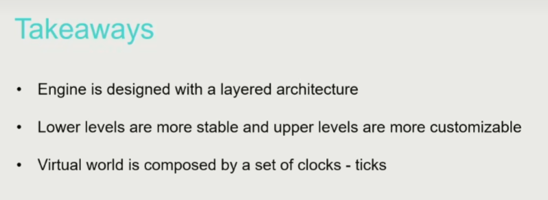

目录：

1. 游戏引擎导论 (Overview of Game Engine)
   游戏引擎是一个软件开发框架。
   现代游戏引擎是一个非常庞大的系统，它集合了整个计算机科学从底层硬件到应用端几乎全部的内容。某种意义上说，开发一个现代游戏引擎的难度不亚于开发一个现代操作系统。
   `Game Engine is Way Beyond Rendering`
2. 基础架构 1 – 引擎架构分层，整体 Pipeline (Layered Architecture of Game Engine)
   现代游戏引擎是一个非常复杂的系统并包含了海量的代码，但幸运的是游戏引擎一般会通过分层的方式将这些代码组织起来。因此了解游戏引擎的分层架构有助于对整个系统形成全面的认识。
   对游戏引擎进行分层的意义在于对不同类型的代码进行解耦，这样可以更好地管理这个系统的复杂度。

   - Decoupling and Reducing Complexity
     Lower layers are independent from upper layers.
     Upper layers dont't know how lower layers are implemented.
   - Response for Evolving Demands
     Upper layers evolve fast, but lower layers are stable.
     

   1. 打开一个游戏引擎会直接看到各种类型的编辑器。这个直接和开发者进行交互的层称为工具层(tool layer)。
      工具层是为游戏开发者提供支持的一层。工具层允许游戏开发者直观地预览不同美术资源在游戏环境中的表现，对于游戏开发者和设计师有着重要的意义。
      
   2. 在工具层下面包含功能层(function layer)，用来实现游戏的渲染、动画、交互等不同类型的功能。

      功能层的作用类似于一个时钟(`tick`)用来控制整个游戏世界的运行，在每个时钟周期内功能层需要完成整个游戏系统的全部运算
      **tickLogic(deltaTime) -> tickRender(deltaTime)**

   3. 在此基础上还需要资源层(resource layer)来管理各种各样的场景美术资源。
      游戏中的每一个对象都包含不同类型的资产(asset)，比如说几何模型、纹理、声音、动画等，同时每种资产都可能包括不同的数据格式。通过资源层我们将游戏对象的资产组织起来并通过全局唯一标识符(Globally Unique Identifier, GUID)进行识别和管理。

      - gc 很关键

   4. 再下一层是核心层(core layer)，它包括支持游戏渲染、动画、物理系统、内存管理等不同系统的核心代码。
      核心层数学库还大量使用了 CPU 的 SIMD 指令，这样可以极大地加速矩阵和向量的计算速度。
      核心层最重要的功能是实现内存管理(memory management)，

      **内存管理三条核心**：

      - put data together (把数据放在一起)
      - access data in order (按顺序访问数据)
      - allocate and de-allocate as a block (读写在一个块中)

   5. 最底层是平台层(platform layer)，一般包括各种图形 API、输入设备支持以及不同游戏平台的底层代码。
      平台层来提供对不同操作系统和硬件平台的支持
   6. 除此之外各种不同类型的中间件也会贯穿整个游戏引擎的不同层。

3. 基础架构 2 – 数据组织和管理
   `组合`

   - 更新方法模式：两种 tick
     object-based tick -> component-based tick

   - How to Manage Game Objects?
     稍微好一点的管理方式是把场景划分成一个均匀的网格，这样需要进行查询时只考虑相邻格子中的 GO 即可。`但如果 GO 在网格上不是均匀分布，这种管理方式的效率仍然很低。`
     合理的管理方法是使用带层级的网格，这种方式的本质是使用一个`四叉树`进行管理。这样进行查询时只需要对树进行遍历即可。
     除了四叉树之外，现代游戏引擎进行场景管理时还会使用 `BVH、BSP、octree、scene graph 等不同类型的数据结构。`
     

4. 渲染系统 1 – 渲染数据组织 (Basic of Game Rendering)

   渲染研究更关注于算法理论的正确性而对于实时性没有太多的要求，而在游戏渲染中实时性则至关重要。对`实时渲染`的关注构成了游戏渲染和渲染理论之间的主要差别。

   - realtime -> 30fps
   - interactive -> 100fps
   - offline rendering
   - out-of-core rendering (电影 cg 渲染，几天渲染一帧)

   渲染的四个难点

   1. 不同类型的渲染对象
   2. 要考虑渲染过程的硬件实现
   3. 人们对于游戏画质和帧率的要求逐渐提高

      - 帧率稳定，至少 30fps
      - 1080P、4K 甚至 8K 分辨率

   4. 渲染系统只能占掉 10-20%的计算资源

   目前游戏引擎渲染的主流方法仍是**基于光栅化(rasterization)的渲染管线。**
   渲染计算的特点是有大量的像素需要进行计算，而像素之间的计算则往往是相互独立的。因此人们设计出了 `GPU 来执行图形渲染计算`，这样还解放了 CPU 的计算资源。可以说现代 GPU 的发展也推动了整个游戏行业渲染技术的进步。
   SIMD 是指在运行程序时可以`把一条指令同时执行在不同的数据上`，目前现代 CPU 对于 SIMD 有着很好的支持，这种技术在高性能计算等领域中有着广泛的应用；而 SIMT 则是把`同一条指令分配到大量的计算核心上同时执行`，现代 GPU 的计算过程更类似于 SIMT。

   - Visibility Culling
   - Texture Compression
   - Authoring Tools of Modeling
   - Cluster-Based Mesh Pipeline
     随着现代 GPU 计算能力的提高以及人们对于画质需求的不断增长，在 3A 大作中的模型往往都具有百万级甚至千万级的网格
     为了渲染出具有如此高精度的网格就需要使用 mesh shader 相关的技术。mesh shader 的核心思想是把网格上的一小块区域视为一个 meshlet，每个 meshlet 都具有固定数量的三角形。
     虚幻 5 中的 Nanite 技术可以认为是更加成熟的 mesh shader。

5. 渲染系统 2 – 光照

6. 渲染系统 3 – 渲染管线 (pipeline)
7. 渲染系统 4 – 天空，地形，后处理等

8. 动画系统 1 – 骨骼动画
9. 动画系统 2 – 动画混合
10. 动画系统 3 – 高级动画
11. 物理系统 1 – 碰撞和刚体
12. 物理系统 2 – 布料模拟
13. GamePlay 1 – 基础机制
14. GamePlay 2 – Graph Driven
15. 特效系统
16. 其他系统 （相机，控制，寻路等）
17. 工具链 1 – 基础框架
18. 工具链 2 – 代码反射，数据打包等
19. 网络同步
20. 前沿介绍 1 – Data Oriented Programming，Job System
21. 前沿介绍 2 – Motion Matching, Nanite, Lumen
22. 前沿介绍 3 – Procedurally Generated Content
23. 教学项目 Pilot 源码分析：
24. 项目安装
25. 源码分析 1
26. Bevy 游戏引擎分析：
27. 引擎安装
28. 引擎介绍
29. 游戏开发
30. 源码分析 1
31. 源码分析 2
