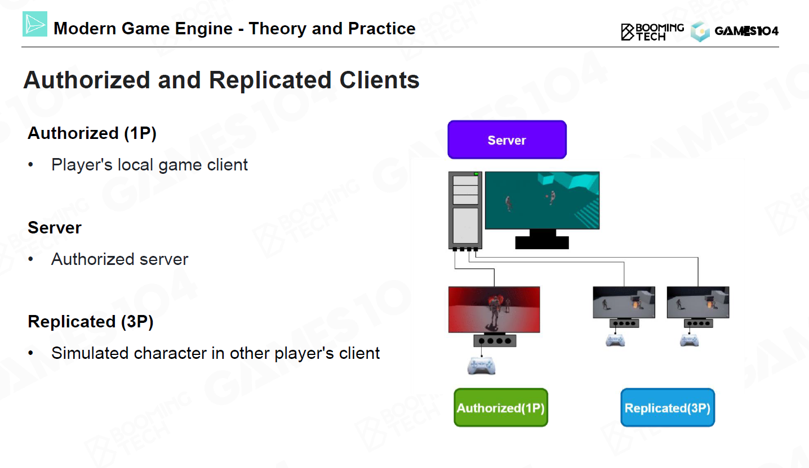

[游戏 AI 浅谈](https://blog.csdn.net/jk_chen_acmer/article/details/119904413)

17. 游戏中的人工智能 2 – Advanced Artificial Intelligence

- 层次任务网络(hierarchical tasks network, HTN)
  
  - 世界的状态+行为的条件+行为的影响
  - 任务就是行为的抽象，每个任务都可以有条件和影响
  - 规划(Planning)
    带着目的进行预测
  - Replan
- goal-oriented action planning(GOAP)
  一种基于`规划`的 AI 技术，和前面介绍过的方法相比 GOAP 一般会更适合动态的环境。
  - 目标 + 行动 + 规划器
  - 反向规划(backward planning)。整个规划问题就等价于在有向图上的最短路径问题。
- 蒙特卡洛树搜索(Monte Carlo tree search, MCTS)
  https://ouuan.github.io/post/monte-carlo-tree-search/

  1. State and Action
     
     
  2. Simulation
     AI 利用当前的策略(default policy)快速地完成整个游戏过程。
     
  3. Backpropagate
     到了叶节点后，会`向上更新这次搜索所经过的路径上的每个节点的被访问次数和胜利次数。`
     蒙特卡洛树搜索基于这样一个设定：每次搜索其实就是在模拟玩家的选择，搜索时某个子节点的被访问次数更多，实际游戏中选择这个子节点就更优；而搜索次数越多，对玩家最优选择的模拟就越准确。这样的话，当搜索次数足够多时，每次选择都是对于当前节点的先手玩家而言最优的，就收敛到了 Min-Max 搜索。
  4. Iteration Steps
     
     - 选择（Selection）：在对节点进行选择时，MCTS 会优先选择可拓展的节点。
       在进行拓展时往往还要权衡一些 exploitation 和 exploration，因此我们可以把 UCB 可以作为一种拓展的准则。
       ` 让游戏树向最优的方向扩展，这是蒙特卡洛树搜索的精要所在。`
       
       Exploitaion：开发，选择已知最优的节点。
       Exploration：探索，选择未知的节点。
       有点像模拟退火的思想。
     - 扩展（Expansion）：除非任意一方的输赢使得游戏在 L 结束，否则创建一个或多个子节点并选取其中一个节点 C。
     - 仿真（Simulation）：再从节点 C 开始，用随机策略进行游戏，又称为 playout 或者 rollout。
     - 反向传播（Backpropagation）：使用随机游戏的结果，更新从 C 到 R 的路径上的节点信息。

  MCTS 最主要的优点有两点：

  1. `如果你完全不会一个游戏，只知道它的规则，也可以使用 MCTS。`
     而 Min-Max 搜索必须有一个估价函数。
     当然，如果完全使用原始的基于随机选择的 MCTS，棋力不一定足够高。
  2. 由于对随机采样的利用，可以胜任较大的搜索空间。

- Machine Learning Basic
  机器学习大致可以分为监督学习、无监督学习、半监督学习以及强化学习等几类。
  `监督学习(Supervided Learning，SL)`：data + label，例如分类、回归
  无监督学习：data，例如聚类
  半监督学习：data + label + data，例如半监督分类

  `强化学习(reinforcement learning, RL)`是游戏 AI 技术的基础。在强化学习中我们希望 AI 能够通过和环境的不断互动来学习到一个合理的策略。
  强化学习：agent + environment + action + reward，例如 AlphaGo

  Markov Decision Process(MDP)：状态、动作、奖励、策略、价值函数

- Build Advanced Game AI
  尽管目前基于机器学习的游戏 AI 技术大多还处于试验阶段，但已经有一些很优秀的项目值得借鉴和学习，包括 DeepMind 的 AlphaStar 以及 OpenAI 的 Five 等。
  基于`深度强化学习(deep reinforcement learning, DRL)`的游戏 AI 都是使用一个`深度神经网络`来进行决策，整个框架包括接收游戏环境的观测，利用神经网络获得行为，以及从游戏环境中得到反馈。

  1. State
     以 AlphaStar 为例，智能体可以直接从游戏环境获得的信息包括地图、统计数据、场景中的单位以及资源数据等。
  2. Action
     
  3. Reward
     奖励函数的设计对于模型的训练以及最终的性能都有着重要的影响。在 AlphaStar 中使用了非常简单的奖励设计，智能体仅在获胜时获得+1 的奖励；而在 OpenAI Five 中则采用了更加复杂的奖励函数并以此来鼓励 AI 的进攻性。
  4. Network
     在 AlphaStar 中使用了不同种类的神经网络来处理不同类型的输入数据，比如说对于定长的输入使用了 MLP，对于图像数据使用了 CNN，对于非定长的序列使用了 Transformer，而对于整个决策过程还使用了 LSTM 进行处理。

     MLP：多层感知机
     CNN：卷积神经网络，例如 ResNet
     Transformer：自注意力机制
     LSTM：长短期记忆网络

  5. Training Strategy
     在 AlphaStar 的训练过程中首先使用了监督学习的方式来`从人类玩家的录像中进行学习。`接着，AlphaStar 使用了强化学习的方法来进行自我训练。
     
     试验结果分析表明基于监督学习训练的游戏 AI 其行为会比较接近于人类玩家，但基本无法超过人类玩家的水平；而基于强化学习训练的 AI 则可能会有超过玩家的游戏水平，不过需要注意的是使用强化学习可能需要非常多的训练资源。

     **因此对于游戏 AI 到底是使用监督学习还是使用强化学习进行训练需要结合实际的游戏环境进行考虑。对于奖励比较密集的环境可以直接使用强化学习进行训练，而对于奖励比较稀疏的环境则推荐使用监督学习。**

     奖励足够密集：打方块
     奖励不够密集：超级马里奥

  训练在 gpu，运行在 cpu

2.  网络游戏的架构 1 – 基础

- Network Protocols
  人们提出了中间层(intermediate layer)的概念来隔绝掉应用和硬件，使得开发者可以专注于程序本身而不是具体的通信过程。
  
  在现代计算机网络中人们设计了 OSI 模型(OSI model)来对通信过程进行封装和抽象。
  

  1. Socket
  2. TCP
  3. UDP
     除了 TCP 之外人们还开发出了 UDP 这样的轻量级网络协议。UDP 的本质是一个端到端的网络协议，它不需要建立长时间的连接，也不要求发送数据的顺序，因此 UDP 要比 TCP 简单得多。
     

     `对于实时性要求比较高的游戏会优先选择 UDP，而策略类的游戏则会考虑使用 TCP。`在大型网络游戏中还可能会使用复合类型的协议来支持游戏中不同系统的通信需求。

  4. Reliable UDP
     同时现代网络游戏中往往还会对网络协议进行定制。以 TCP 为例，虽然 TCP 协议比较稳定但是效率过于低了，而且网络游戏中出现一定的丢包是可以接受的；而对于 UDP 来说它虽然非常高效但是却不够稳定。
     因此现代网络游戏中往往**会基于 UDP 来定制一个网络协议，这样既可以利用 UDP 的高效性又可以保证数据通信的有序性。**
     ACK(确认消息) 及其相关技术是保证数据可靠通信的基本方法。

     - **ARQ(automatic repeat request，自动重传请求)**是基于 ACK 的错误控制方法，所有的通信算法都要事项 ARQ 的功能。
       滑动窗口协议(sliding window protocol)是一种经典的 ARQ 实现方法，它在发送数据时每次发送窗口大小的包然后检验回复的 ACK 来判断是否出现丢包的情况。（滑动窗口哈希）
     - **Forward Error Correction(FEC，前向纠错)**
       前向纠错码，是一种通过增加冗余数据来实现数据纠错的方法。
       目前常用的 FEC 算法包括异或校验位以及 Reed-Solomon codes 两大类。
       海明码(Hamming code)是一种最简单的纠错码，它通过增加冗余位来实现数据的纠错。
       Reed-Solomon codes 是经典的信息传输算法，它利用 Vandemode 矩阵及其逆阵来恢复丢失的数据。

  `总结一下，在自定义 UDP 时需要考虑 ARQ 和 FEC 两类问题。`

- Clock Synchronization
  有了网络协议后就可以开始对网络游戏进行开发了，不过在具体设计游戏前我们还需要考虑`不同玩家之间的时钟同步(clock synchronization)问题。`
  1. Round Trip Time(RTT)
     RTT 是指从发送数据到接收到回复的时间，它是网络通信中的一个重要指标。
     这个间隔的时间称为 round-trip time(RTT)。`RTT 的概念类似于 ping，不过它们的区别在于 ping 更加偏向于底层而 RTT 则位于顶部的应用层。`
  2. 网络时间协议 NTP（Network Time Protocol）
     NTP 同步原理：
     https://info.support.huawei.com/info-finder/encyclopedia/zh/NTP.html
     只需要从客户端发送请求然后从服务器接收一个时刻就好，这样就可以得到 `4 个时间戳`。如果我们进一步假定网络`上行和下行的延迟是一致的`，我们可以直接计算出 RTT 的时间长短以及两个设备之间的时间偏差。
     实际上我们可以证明在不可靠的通信中是无法严格校准时间的。不过在实践中我们可以通过不断的使用 NTP 算法来得到一系列 RTT 值，然后`把高于平均值 50%的部分丢弃，剩下的 RTT 平均值的 1.5 倍就可以作为真实 RTT 的估计。`
- Remote Procedure Call (RPC 协议)
  尽管利用 socket 我们可以实现客户端和服务器的通信，但`对于网络游戏来说完全基于 socket 的通信是非常复杂的。这主要是因为网络游戏中客户端需要向服务器发送大量不同类型的消息，同时客户端也需要解析相应类型的反馈，这就会导致游戏逻辑变得无比复杂。`
  在现代网络游戏中一般会使用 RPC(remote procedure call)的方式来实现客户端和服务器的通信。`基于 RPC 的技术在客户端可以像本地调用函数的方式来向服务器发送请求，这样使得开发人员可以专注于游戏逻辑而不是具体底层的实现。`
  

  golang 的 rpc
  

  在 RPC 中会大量使用 `IDL(interface definiton language，接口描述语言)`来定义不同的消息形式。
  

  然后在启动时通过 RPC stubs 来通知客户端有哪些 RPC 是可以进行调用的。
  
  stub 类似 python 的存根(.后缀为.pyi 的 stub 存根文件)，是类型定义

- Network Topology
  在设计网络游戏时还需要考虑网络自身的架构。

1. Peer-to-Peer
   最经典的网络架构是 P2P(peer-to-peer)，此时每个客户端之间会直接建立通信。
   很多早期经典的游戏都是使用这样的网络架构来实现联网功能。
   当 P2P 需要集中所有玩家的信息时则可以选择其中一个客户端作为主机，这样其它的客户端可以通过连接主机的方式来实现联机。
   
2. Dedicated Server
   
   从实践结果来看，对于小型的网络游戏 P2P 是一个足够好的架构，而对于大型的商业网络游戏则必须使用 dedicated server 这样的形式。

- **Game Synchronization**
  而在网络游戏中，除了单机游戏都需要的分层外我们还需要考虑不同玩家之间的同步。在理想情况下我们希望客户端只负责处理玩家的输入，整个游戏逻辑都放在服务器端。
  

  1. Snapshot Sync (快照同步)
     代表：MineCraft
     快照同步(snapshot synchronization)是一种相对古老的同步技术。在快照同步中`客户端只负责向服务器发送当前玩家的数据，由服务器完成整个游戏世界的运行。然后服务器会为游戏世界生成一张快照，再发送给每个客户端来给玩家反馈。`
     快照同步可以`严格保证每个玩家的状态都是准确的`，但其缺陷在于它给服务器提出了非常巨大的挑战。因此在实际游戏中一般会降低服务器上游戏运行的帧率来平衡带宽，然后在客户端上通过插值的方式来获得高帧率。
     由于每次生成快照的成本是相对较高的，为了压缩数据我们可以使用`状态的变化量来对游戏状态进行表示`。
     快照同步非常简单也易于实现，`但它基本浪费掉了客户端上的算力同时在服务器上会产生过大的压力。因此在现代网络游戏中基本不会使用快照同步的方式。`
  2. Lockstep Sync (帧同步)
     代表：英雄联盟
     帧同步(lockstep synchronization)是现代网络游戏中非常常用的同步技术。`不同于快照同步完全通过服务器来运行游戏世界，在帧同步中服务器更多地是完成数据的分发工作。`玩家的操作通过客户端发送到服务器上，经过服务器汇总后将当前游戏世界的状态返还给客户端，然后在每个客户端上运行游戏世界。
     

     > Same Input + Same Execution Process = Same State

     - Lockstep Initialization
       使用帧同步时首先需要进行初始化，将客户端上所有的游戏数据与服务器进行同步。这一过程一般是`在游戏 loading 阶段`来实现的。
     - Deterministic Lockstep
       早期的联网游戏问题：`当某个玩家的数据滞后了所有玩家都必须要进行等待。`
       waiting for players...
     - Bucket Synchronization
       为了克服这样的问题，人们提出了 bucket synchronization 这样的策略。
       此时`服务器只会等待 bucket 长度的时间，如果超时没有收到客户端发来的数据就越过去`，看下一个 bucket 时间段能否接收到。通过这样的方式其它玩家就无需一直等待了。
       bucket synchronization`本质是对玩家数据的一致性以及游戏体验进行的一种权衡(trade-off)。`
     - Deterministic(确定性) Difficulties
       帧同步的一大难点在于它要保证不同客户端上游戏世界在相同输入的情况下有着完全一致的输出。
       为了保证输出的确定性我们首先要保证浮点数在不同客户端上的一致性，这可以使用 IEEE 754 标准来实现。
       其次在不同的设备上我们需要保证相关的数学运算函数有一致的行为，对于这种问题则可以使用`查表`的方式来避免实际的计算。
       还要考虑随机数的问题，我们要求`随机数在不同的客户端上也必须是完全一致的`。因此在游戏客户端和服务器进行同步时需要`将随机数种子以及随机数生成算法进行同步`

     - Tracing and Debugging
       对于服务器来说检测客户端发送的数据是否存在 bug 就非常重要。一般来说我们会要求`客户端每隔一段时间就上传本地的 log，由服务器来检查上传数据是否存在 bug。`
       server 比较不同 client 的 checksum
     - Lag and Delay
       为了处理网络延迟的问题我们还可以在客户端上`缓存若干帧`，当然缓存的大小会在一定程度上影响玩家的游戏体验。
       eg: jitter buffer 抖动缓冲器
       另一方面我们还可以把游戏逻辑帧和渲染帧进行分离，然后通过插值的方式来获得更加平滑的渲染效果。
     - Reconnection Problem
       断线重连的机制
       实际上在进行帧同步时每个若干帧会**设置一个关键帧。在关键帧进行同步时还会更新游戏世界的快照，这样可保证即使游戏崩溃了也可以从快照中恢复。**
       为了实现这样的功能可以使用 `quick catch up` 技术，此时我们暂停游戏的渲染把所有的`计算资源用来执行游戏逻辑`，以追上游戏进度。可以理解为渲染 silent 了。
       在服务器端也可以使用类似的技术，从而**帮助掉线的玩家快速恢复到游戏的当前状态**。`实际上网络游戏的观战和回放功能也是使用这样的技术来实现的。`
       
       

       观战：本质是重连。Watching is similar to reconnecting after a client crash.
       回放(replay)：`关键帧 + commands`

     - Lockstep Cheating Issues
       对于帧同步的游戏，玩家可以通过发送虚假的状态来实现作弊行为，这就要求我们实现一些反作弊机制。
       - 多人 PVP：投票机制
       - 双人：服务器记录 checksum。不过这种一般都是 p2p 架构，可以换状态同步。
       - 需要解决的问题：客户端外挂，例如透视挂
     - Lockstep Summary
       总结一下，帧同步会占用更少的带宽也比较适合各种需要实时反馈的游戏。而帧同步的难点主要集中在如何保证在不同客户端上游戏运行的一致性，如何设计断线重连机制等。

  3. State Sync (状态同步)
     代表：Counter-Strike(反恐精英)、守望先锋
     状态同步(state synchronization)是目前大型网游非常流行的同步技术，它的基本思想是把玩家的状态和事件进行同步。
     
     进行状态同步时由客户端提交玩家的状态数据，而服务器则会在收集到所有玩家的数据后运行游戏逻辑，然后把下一时刻的状态分发给所有的客户端。

     server 端有一个完整的世界，只会把部分信息发给客户端

     - Authorized and Replicated Clients
       状态同步中服务器称为 authorized server，它是整个游戏世界的绝对权威；(1P)
       而玩家的本地客户端称为 authorized client，它是玩家操作游戏角色的接口；
       在`其他玩家视角下的本地客户端`则称为 replicated client，表示它们仅仅是 authorized client 的一个副本。(3P)
       
     - State Synchronization Example
       authorized client 执行了某种行为时首先会向服务发送相关的数据，**服务器进行计算再发布给所有的客户端**，驱动 replicated client 执行 authorized client 的行为。（活在缸中之脑，每个人活在自己的世界）
       这样的好处在于我们`无需要求每个客户端上的模拟是严格一致的，整个游戏世界本质上仍然是由统一的服务器进行驱动。`
       因为是服务器计算的，所以不存在歧义。
     - Dumb Client Problem
       由于游戏角色的所有行为都需要经过服务器的确认才能执行，状态同步会产生 dumb client 的问题，即`玩家视角下角色的行为可能是滞后的。`
       要缓解这样的问题可以`在客户端上对玩家的行为进行预测(client-side prediction)`。比如说当角色需要进行移动时首先在本地移动半步，然后等服务器传来确定的消息后再进行对齐，这样就可以改善玩家的游戏体验。在守望先锋中就使用了这样的方式来保证玩家顺畅的游玩。
       

       > 有点像 preload(预加载)，先斩后奏

       - Server Reconciliation
         由于网络波动的存在，来自服务器的确认消息往往会滞后于本地的预测。因此我们可以`使用一个 buffer 来记录游戏角色的状态`，这样当收到服务器的消息时首先跟 buffer 中的状态进行检验。当 buffer 中的状态和服务器的数据不一致时就需要根据服务器的数据来矫正玩家状态。

         例子：移动被服务器打回

         当然这样的机制对于网络条件不好的玩家是不太公平的，他们的角色状态会不断地被服务器修正。

     - Packet Loss
       对于丢包的问题在服务器端也会维护一个小的 buffer 来储存玩家的状态。如果 `buffer 被清空则说明可能出现了掉线的情况`，此时服务器会复制玩家上一个输入来维持游戏的运行。

     帧同步和状态同步两种主流同步技术的对比如下：
     

1.  网络游戏的架构 2 – 进阶

- Character Movement Replication

- Hit Registration

- MMOG Network Architecture

- Bandwidth Optimization

- Anti-Cheat

- Build a Scalable World

6.  前沿介绍 1 – Data Oriented Programming，Job System
7.  前沿介绍 2 – Motion Matching, Nanite, Lumen
8.  前沿介绍 3 – Procedurally Generated Content
9.  教学项目 Pilot 源码分析：
10. 项目安装
11. 源码分析 1
12. Bevy 游戏引擎分析：
13. 引擎安装
14. 引擎介绍
15. 游戏开发
16. 源码分析 1
17. 源码分析 2
