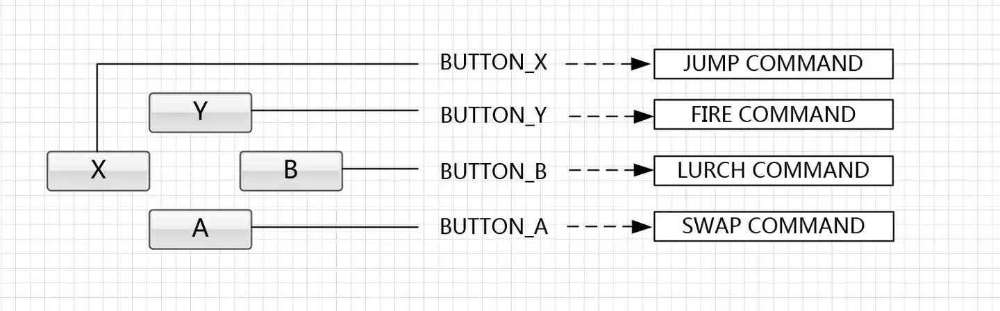

## 游戏编程模式

[在线](https://gpp.tkchu.me/) http://gameprogrammingpatterns.com/contents.html
[浅墨笔记](https://zhuanlan.zhihu.com/p/22482170)

- 尽量使用 32 位变量而不是用 8 位变量或 16 位变量
  选择使用 32 位变量而不是 8 位或 16 位变量的原因主要与处理器架构、性能优化、内存对齐以及开发的便利性有关。以下是一些具体的考虑因素：

  1. **处理器架构**：现代计算机的处理器（尤其是 32 位和 64 位处理器）在处理 32 位数据时最为高效。这是因为这些处理器的数据总线宽度和寄存器大小通常是 32 位或 64 位，这使得它们在单个指令周期内可以直接读取、写入和操作 32 位数据。使用与处理器原生匹配的数据类型可以减少需要的指令数量和处理时间。

  2. **性能优化**：在很多情况下，使用比处理器字长小的数据类型（如 8 位或 16 位变量）并不会节省内存或提高性能。相反，它可能导致更多的处理开销。例如，当处理器需要操作一个 8 位或 16 位的数据时，它可能需要先将这个数据扩展到 32 位或 64 位，然后执行操作，最后再将结果截断回原来的大小。这个额外的处理步骤可能会降低程序的运行效率。

  3. **内存对齐**：现代处理器访问内存时，对数据的对齐有特定的要求。数据对齐是指数据的起始地址是某个数（通常是 4 或 8）的倍数。不正确的数据对齐可能导致性能下降或增加处理器的工作负担。使用 32 位变量有助于保持良好的内存对齐，从而提高内存访问的效率。

  4. **开发便利性**：在很多编程环境中，默认的整数类型（如 C 语言中的`int`）是 32 位的。使用这些默认类型可以使代码更简洁、更清晰，同时减少因类型转换而引入的潜在错误。

  然而，这并不意味着总是应该使用 32 位变量。在特定的应用场景中，如需要处理大量数据且内存空间有限的嵌入式系统，使用 8 位或 16 位变量可能更合适。此外，对于某些特定的算法，使用较小的数据类型可能会更有效。

  总之，选择使用何种大小的变量应该基于对目标平台的理解以及对性能、内存使用和开发效率的综合考虑。

---

1. 架构，性能和游戏

   - 抽象与解耦会让代码的灵活性更强，但量力而行。除非你觉得这样的灵活性` 有必要，``否则不要过度追求。 `
     每当你添加了一层抽象或者支持扩展的部分，其实就是在赌这部分功能以后是否用得上。 添加代码和复杂性到游戏中，这都需要时间来开发，调试和维护。
     > 有些人喜欢简写为术语“YAGNI”——You aren't gonna need it（你不需要那个）——来对抗预测将来需求的强烈欲望。
   - 性能优化固然重要，但最好留到最后做。
   - 灵活性与高性能不可兼得。我们可以一直`保持灵活性直到设计确定，再抽出抽象层`来提高性能。
     软件架构和抽象有时会被批评，尤其是在游戏开发中: 它伤害了游戏的性能。
     许多让代码更灵活的模式依靠虚拟调度、 接口、 指针、 消息，和其他机制， 而这些都会消耗运行时成本
     **一个有趣的反面例子是 C++中的模板。模板编程有时可以给你抽象接口而无需运行时开销。**
     当写代码调用类中的具体方法时，你已经硬编码了调用的是哪个类：但通过虚方法或接口，直到运行时才知道调用的类。虽然这样更加灵活，但增加了运行时开销。
     **而模板编程是在两者之间——在编译时初始化模板，决定调用哪些类。(类似 rust 零成本抽象)**
   - 摇滚明星将旅店的房间弄的一团糟，因为他们知道明天会有人来打扫干净。
   - `完美不是没有东西可以再添加的时候，而是没有东西可以再删除的时候。`
   - `评价架构设计就是评价它应对变化有多么轻松`
   - decoupling
     如果有两块代码是耦合的， 那就意味着`无法仅仅只理解了其中一个，而对另一个丝毫不了解。`
     如果解耦了他俩，`就可以独自的理解其中之一，根本无需牵扯到另一个。`
     从后期阶段来看，另一种解耦的定义则是：
     `当一块代码有变化时，没必要修改另外的代码`。
     肯定需要修改一些东西，但耦合程度越小，变化会波及的范围就越小。
   - 过度设计的代价
     解耦意味着在修改代码之前需要了解的代码更少，**但其实你需要对抽象层有很多的了解**
   - 过度去关注设计模式和软件架构，会让一批人很容易地沉浸在代码中，`而忽略要自己的最终目的是要发布游戏`。
     无数的开发者听着加强可扩展性的“警世名言”，花费多年时间制作“引擎”， `却没有搞清楚做引擎是为了什么。`

2. 论撤消重做、回放系统的实现：命令模式

- `将一组行为抽象为对象`，这个对象和其他对象一样可以被存储和传递，从而实现行为请求者与行为实现者之间的松耦合，这就是命令模式
  优点：解耦，缺点：容易导致类数量的膨胀
- 做法：
  1. 硬编码
  2. Command(Step) 以前每个输入都会直接调用一个函数，现在则会有一个`间接调用层`
     
     命令模式的`关键在于引入了抽象命令接口（execute( )方法）`，且发送者针对抽象命令接口编程，只有实现了抽象命令接口的具体命令才能与接收者相关联。
     而且命令模式的本质是对命令进行封装，将发出命令的责任和执行命令的责任分割开。
  3. Command 的依赖、延迟 apply 调用、撤销接口

3. 录像与回放系统的实现思路
   重做在游戏中并不常见，但回放（replay）、录像、观战系统却很常见。一个简单粗暴的实现方法就是`记录每一帧的游戏状态以便能够回放`，但是这样会占用`大量的内存`。
   所以，许多游戏会记录`每一帧每个实体所执行的一系列命令，就可以轻松的实现回放功能`。
   录像与回放等功能，可以基于命令模式实现，也就是执行并`解析一系列经过预录制的序列化后的各玩家操作的有序命令集合`

   - 《魔兽争霸 3》中的 replay 录像，大概就是通过将所有玩家的操作命令，`序列化到一个.rep 后缀的文件中`，然后在游戏中进行解析后回放来实现。
   - 《守望先锋》采用的是 ECS 架构

   ECS 架构是什么？
   https://www.zhihu.com/question/61169850/answer/185229191

   - what:

     ECS（Entity-Component-System）架构是一种大型游戏开发中的编程范式，它通过将实体（Entity）、组件（Component）和系统（System）分离

     1. Component：组件(`类似只有属性的接口`)，`只包含数据，不包含行为`。如位置、健康值或渲染信息。
     2. Entity：实体，是游戏世界中的一个对象，不包含数据、行为，仅仅是`组件的容器/组合`。如玩家、敌人或道具。
     3. System：系统，处理具有`特定组件的实体`集合的逻辑操作()，`不包含状态，只包含行为`。如碰撞系统。

   - why：

     1. **ECS 要解决的最复杂，最核心的问题：网络同步(主要动机)**
        网络同步涉及预测同步、协同，因此，`状态的单独保存`是非常重要的。
        在 ECS 模型中，C 是纯数据，所以非常方便做快照和回滚。Entity 的组件分离，也适合做关键状态的记录
     2. 安全地获得多线程带来的性能提升：通过分析数据依赖和读写关系，来实现 System 间的并行
        不过，Rust 给这个问题带来了解决方案。可以参考 Rust 实现的并行 ECS 框架：slide-rs/specs
     3. 面向接口；区别于 oop，ecs 倾向于通过连接与组合来描述游戏对象
     4. 解耦：将数据（组件）和逻辑（系统）分离，降低了代码间的耦合度
     5. 性能优化：ECS 鼓励数据驱动的设计，有助于优化数据存储和访问模式，提高游戏运行效率，尤其是在处理大量实体时。

   - how：
     实现 ECS 架构的基本步骤如下：

     1. 定义组件：根据游戏中的实体需要拥有的属性和状态，定义相应的组件。组件仅包含数据，不包含任何逻辑。
     2. 创建实体：实体是组件的容器。在游戏初始化或运行过程中，根据需要创建实体，并为其添加相应的组件。
     3. 实现系统：系统是包含游戏逻辑和行为的部分。定义系统时，需要指定系统操作的组件类型。在游戏循环中，系统会遍历所有具有指定组件的实体，并执行相应的逻辑操作。
     4. 游戏循环：在游戏循环中，依次执行各个系统。每个系统根据自己的逻辑读取和修改其操作的组件数据，从而驱动游戏的运行。
        每个需要根据输入表现的 System 都提供了一个 UpdateFixed 函数

     经典摘录：

     - 一个对象在不同的观察者(system)眼中是不同的。
     - OO 或 Actor 强调的是`对象自身`处理自身的业务，然后框架去管理对象的集合，负责用消息驱动它们。
       而在 ECS 中，每个系统关注的是不同的对象集合，它处理的`对象中有共性的切片`。
     - 每个 System 都可以独立开发，它只需要遍历给框架提供给它的组件集合，做出正确的处理，更新组件状态就够了。编写 Gameplay 的人更像是在用胶水粘合这些 System ，
     - 一个 System 对大多数 Component 是只读的，只对少量 Component 是会改写的(一是容易管理复杂度，二是给`并行`处理留下了优化空间)
     - `数据和方法分离`很有意义；oop 里不同的方法关注的数据不同，数据和方法分离可以强迫不同的方法解耦
     - 一个 System 知道哪些 Entity 才是它真正关心的，该怎么回退它所关心的东西。这样开发的复杂度就减少了
     - `局部使用 OOP 设计模式`来实现模块，并暴露简单接口，是可以起到提升代码质量和逼格的效果。然而在架构层面滥用，往往只是`把逻辑中的复杂度转移到架构复杂度上`。
     - 同类的多个 Component 实现了紧凑连续的内存布局
     - Component 只有数据，行为是 System 的事。这样的模式，避免了上一节提到的 Unity3D 中容易出现的问题。
       `Component 没有逻辑上的互相引用，Component 的耦合和依赖由 System 处理`。此外，由 System 进行统一的状态修改，也有利于定位和隔离问题。
     - 感觉 ECS 比 OOP 更符合现实物理世界，毕竟事物(Entity)的变化并不是本身在驱动，而是规律(System)在驱动，而且从各个层面和尺度(Component)呈现的变化不同
       比如飞出的鸡蛋撞到墙壁，形状变了，颜色变了，运动轨迹变了，可食用的属性也变了。从这四个维度(也即 Component)去审视就有四种不同的变化
     - Utility 函数：System 间的解耦，把共用代码放进 Utils 解决（守望先锋例子）。

     - 五个原则：
       1. component 只包含数据
       2. entity 是 component 的容器
       3. System 之间不能相互调用（减少耦合）(是由游戏世界（外部框架）来驱动若干 System 的)；System 间的解耦，主要通过事件回调
