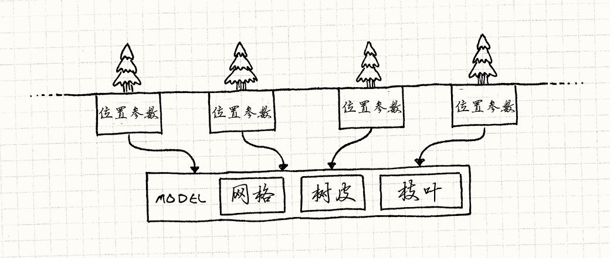
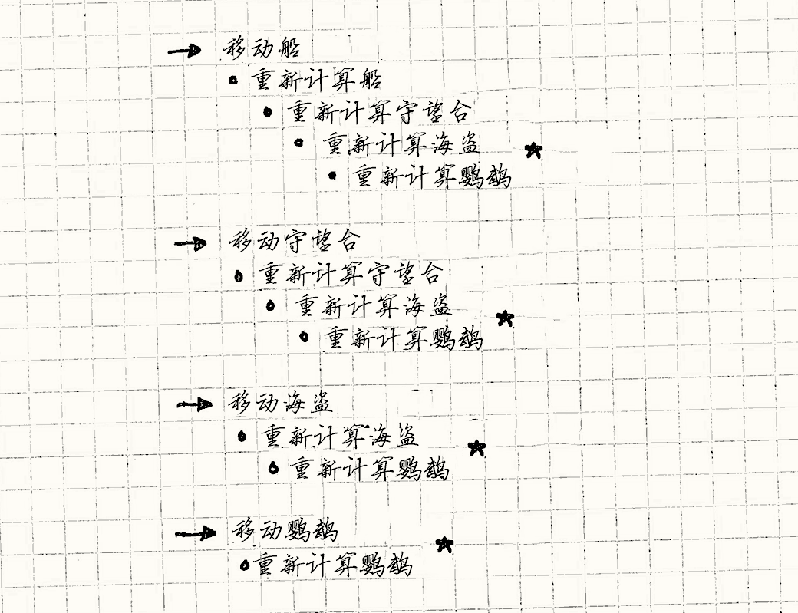
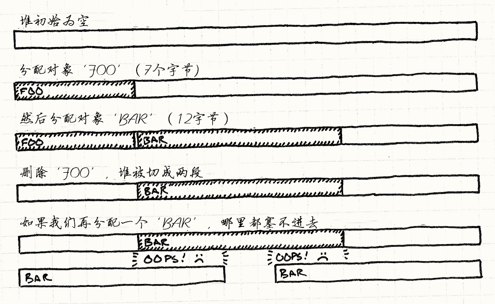

https://zhuanlan.zhihu.com/p/23821422
https://gameprogrammingpatterns.com/contents.html

## 序

### 书店里已经有很多游戏编程书籍了。为什么要再写一本呢？

很多编程书籍可以归为这两类：

- 特定领域的书籍
- 完整引擎的书籍

前者未设计组合代码，后者通常过于整体，过于专注某类游戏了

### 工程挑战：

- 时间和顺序通常是游戏架构的核心部分。事物必须在正确的时间按正确的顺序发生。
- 高度压缩的开发周期，大量程序员需要能快速构建和迭代一系列不同的行为，同时保证不烦扰他人，也不污染代码库。
- 在定义所有的行为后，游戏开始互动。怪物攻击英雄，药物相互混合，炸弹炸飞敌人或者友军。 实现这些互动不能把代码库搞成一团乱麻。
- 最后，游戏中性能很重要。 游戏开发者处于一场榨干平台性能的竞赛中。 节约 CPU 循环的技巧区分了 A 级百万销量游戏和掉帧差评游戏。

### 架构，性能和游戏

与其说这本书是关于如何写代码，不如说是关于如何架构代码的。
每个程序都有一定架构，哪怕这架构是“将所有东西都塞到 main()中看看如何”， 所以我认为讲讲什么造成了好架构是很有意思的。
我们如何区分好架构和坏架构呢？

**好的架构易于修改代码，轻松应对变化。**

保持平衡：
这些都是速度：长期开发的速度，游戏运行的速度，和短期开发的速度。

看看新手程序员，他们经常这么干：为每种情况编写条件逻辑。
当我们想象优雅的代码时，想的是通用的那一个： 只需要很少的逻辑就可以覆盖整个用况。
**“臻于完美之时，不是加无可加，而是减无可减。”**

但最重要的是，如果你想要做出让人享受的东西，那就享受做它的过程。

## 一、常用 GOF 设计模式（重访设计模式，Design Patterns Revisited）

我认为有些模式被过度使用了（单例模式）， 而另一些被冷落了（命令模式）。
有些模式在这里是因为我想探索其在游戏上的特殊应用（享元模式和观察者模式）。
最后，我认为看看有些模式在更广的编程领域是如何运用的是很有趣的（原型模式和状态模式）。

1. 命令模式
   三个作用：

   1. 序列化
   2. 日志
   3. 可撤销

   **命令是具现化(thingify)的方法调用**
   具现化的意思是“实例化，对象化”
   命令模式是一种回调的面向对象实现：方法调用被存储在对象中

   AI -> 命令流 -> actor ，解耦了消费者和生产者

   - 你最终可能会得到很多不同的命令类。
     为了更容易实现这些类，定义一个具体的基类，包含一些能定义行为的高层方法，往往会有帮助。
     这将命令的主体 execute()转到子类沙箱中。（DataStep、ModelStep、MatrixStep）
   - 有些命令是无状态的纯粹行为，比如第一个例子中的 JumpCommand。
     在这种情况下，有多个实例是在浪费内存，因为所有的实例是等价的。 可以用享元模式解决。

2. 享元模式
   `森林`
   哪怕森林里有千千万万的树，它们大多数长得一模一样。 它们使用了相同的网格和纹理。 这意味着这些树的实例的大部分字段是一样的。
   我们可以通过显式地将对象切为两部分来更加明确地模拟。 第一，将树共有的数据拿出来分离到另一个类中：

   ```cpp
   // 共享状态
   class TreeModel
   {
   private:
     Mesh mesh_;
     Texture bark_;
     Texture leaves_;
   };
   ```

   游戏只需要一个这种类， 因为没有必要在内存中把相同的网格和纹理重复一千遍。 游戏世界中每个树的实例只需有一个对这个共享 TreeModel 的引用。 留在 Tree 中的是那些实例相关的数据：

   ```cpp
   class Tree
   {
   private:
     TreeModel* model_;

     Vector position_;
     double height_;
     double thickness_;
     Color barkTint_;
     Color leafTint_;
   };
   ```

   

   这有点像类型对象模式。 两者都涉及将一个类中的状态委托给另外的类，来达到在不同实例间分享状态的目的。 但是，这两种模式背后的`意图不同`。
   使用类型对象，目标是通过将类型引入对象模型，减少需要定义的类。 伴随而来的内容分享是额外的好处。享元模式则是纯粹的为了效率。

   实例渲染(Geometry instancing)：
   https://en.wikipedia.org/wiki/Geometry_instancing
   Direct3D 和 OpenGL 的 API 中，你需要提供两部分数据流。 第一部分是一块需要渲染多次的共同数据——在例子中是树的网格和纹理。 第二部分是实例的列表以及绘制第一部分时需要使用的参数。 然后调用一次渲染，绘制整个森林。

   `扎根之所`
   实际的地形类，没有状态

   ```cpp
   class Terrain
   {
   public:
     Terrain(int movementCost,
             bool isWater,
             Texture texture)
     : movementCost_(movementCost),
       isWater_(isWater),
       texture_(texture)
     {}

     int getMovementCost() const { return movementCost_; }
     bool isWater() const { return isWater_; }
     const Texture& getTexture() const { return texture_; }

   private:
     int movementCost_;
     bool isWater_;
     Texture texture_;
   };

   // 每个相同地形的区块会指向相同的地形实例
   class World
   {
   public:
     World()
     : grassTerrain_(1, false, GRASS_TEXTURE),
       hillTerrain_(3, false, HILL_TEXTURE),
       riverTerrain_(2, true, RIVER_TEXTURE)
     {}

   private:
     Terrain grassTerrain_;
     Terrain hillTerrain_;
     Terrain riverTerrain_;

     // 其他代码……
   };
   ```

   看上去是单例，实际上是享元模式，目的是节省内存，提高效率
   一般保存在对象池中

3. 观察者模式
   观察者模式应用广泛，Java 甚至将其放到了核心库之中（java.util.Observer），而 C#直接将其嵌入了语法（event 关键字）
   `“委托”是方法的引用在 C#中的术语`

   - `成就解锁`的案例
   - **观察者模式是同步的。**
     被观察者直接调用了观察者，这意味着直到所有观察者的通知方法返回后， 被观察者才会继续自己的工作。观察者会阻塞被观察者的运行。
     如果要对事件同步响应，你需要完成响应，尽可能快地返回，这样 UI 就不会锁死。
     `当你有耗时的操作要执行时，将这些操作推到另一个线程或工作队列中去。`
     在多线程引擎中，你最好使用`事件队列来做异步通信`。
   - 在好的观察者设计中，观察同一被观察者的两个观察者互相之间不该有任何顺序相关。
     `如果顺序确实有影响，这意味着这两个观察者有一些微妙的耦合，最终会害了你`

   - 链表有两种风格。学校教授的那种，`节点对象包含数据`。
     在我们之前的观察者链表的例子中，是另一种： `数据（这个例子中是观察者）包含了节点（next\_指针）。`
     后者的风格被称为“侵入式”链表，因为在对象内部使用链表侵入了对象本身的定义。
     侵入式链表灵活性更小，但如我们所见，也更有效率。 在 Linux 核心这样的地方这种风格很流行。

   - 销毁被观察者和观察者
     难点不在如何做，而在记得做。
     - 在每个被观察者销毁时，让观察者自动取消注册
     - 失效监听者问题: 由于被观察者保留了对观察者的引用，最终有 UI 界面对象僵死在内存中。 `这里的教训是要及时删除观察者。`

4. 原型模式
   `简化 json`
   无能的 JSON 没法这么做。所以让我们把它做得更加巧妙些
   我们可以为对象添加"prototype"字段记录委托对象的名字。 如果在此对象内没找到一个字段，那就去委托对象中查找。

   ```json
    {
     "name": "goblin grunt",
     "minHealth": 20,
     "maxHealth": 30,
     "resists": ["cold", "poison"],
     "weaknesses": ["fire", "light"]
    }

   {
     "name": "goblin wizard",
     "prototype": "goblin grunt",
     "spells": ["fire ball", "lightning bolt"]
   }

   {
     "name": "goblin archer",
     "prototype": "goblin grunt",
     "attacks": ["short bow"]
   }
   ```

   只需在游戏引擎上多花点时间，`你就能让设计者更加方便地添加不同的武器和怪物`，而增加的这些丰富度能够取悦玩家。

5. 单例模式

   这个章节展示如何避免使用单例模式

   - 模式
     Ensure a class has one instance, and provide a global point of access to it.
     确保一个类有一个实例，并提供对其的全局访问点。
   - Why We Use It 我们为什么使用它

     - 惰性初始化?
     - 容易访问，不会出现复杂依赖（代价是，在我们不希望使用它的地方，我们也同样容易拿到该对象。
     - **可以对单例进行子类化，例如 getLocale() 获取国际化资源**
       通过一个简单的编译器开关，我们将文件系统包装器绑定到适当的具体类型。我们的整个代码库可以使用 FileSystem::instance()访问文件系统，`而无需耦合到任何特定于平台的代码`。该耦合被封装在 FileSystem 类本身的实现文件中。

       ```cpp
       FileSystem& FileSystem::instance()
       {
         #if PLATFORM == PLAYSTATION3
           static FileSystem *instance = new PS3FileSystem();
         #elif PLATFORM == WII
           static FileSystem *instance = new WiiFileSystem();
         #endif

         return *instance;
       }
       ```

     - lazy

   - Why We Regret Using It 为什么我们后悔使用它

     - 单例是全局变量：
       **理解代码更加困难**(为了弄清楚发生了什么，我们必须搜索整个代码库以查看哪些内容触及了全局数据)
       **促进了耦合的发生**(稍微#include 之后，我们的新人就破坏了精心构建的架构；引用一个单例的背后，也引用了其他代码)
       `通过控制对实例的访问，你控制了耦合。`
       **不适合并发**(我们创建了一块内存，每个线程都可以看到并查看它)
     - 它能在你只有一个问题的时候解决两个

       **便利的访问，几乎是使用单例模式的全部原因。**
       想想日志类。大部分模块都能从记录诊断日志中获益。 但是，如果将 Log 类的实例传给每个需要这个方法的函数，那就`混杂了产生的数据，模糊了代码的意图。`明显的解决方案是让 Log 类成为单例。
       但当我们这样做时，我们无意地制造了一个奇怪的小约束。 **突然之间，我们不再能创建多个日志记录者了。**

     - 惰性初始化从你那里剥夺了控制权
       因此大多数游戏都不使用惰性初始化

   - What We Can Do Instead 我们可以做什么来解决

     - 看看你是不是真正地需要类, 消除 单例 manager 类：
       管理器类有时是有用的，但通常它们只是反映出作者对 OOP 的不熟悉。
       设计不佳的单例通常是向另一个类添加功能的“助手”。如果可以的话，将所有这些行为转移到它有帮助的类中。毕竟，OOP 就是让对象照顾好自己。
     - 将类限制为单一的实例，运行时检查并阻止多重实例化
     - **提供便捷的实例访问**
       一般规则是，我们希望变量的范围尽可能缩小，同时仍能完成工作。
       这种便利是需要付出代价的——在我们不想要对象的地方，也能轻易地使用。

       通用原则是在能完成工作的同时，将`变量写得尽可能局部`。 `对象影响的范围越小`，在处理它时，我们需要放在脑子里的东西就越少。
       例如，吧全局变量管理在一个地方，暴露访问点(mock i18nClient 单例)。

       - 传递它(Context)。简单的依赖注入。
         但是**有些对象不该在方法的参数列表中出现(传了一大堆莫名其妙的东西，多维表格的本地视图)**，像这样的情况，我们需要考虑其他的选项(处理 AI 的函数可能也需要写日志文件，但是日志不是它的核心关注点)。
         这也是多维表格有的问题。
         像日志这样散布在代码库各处的是“横切关注点”(cross-cutting concern)。 `小心地处理横切关注点是架构中的持久挑战，特别是在静态类型语言中。`
         **面向切面编程**被设计出来应对它们。
       - 从基类获取它(Provider)
         让基类创建并拥有静态实例.
         使用 protected 函数，让派生对象使用的模式， 被涵盖在**子类沙箱模式**中。例如查找替换就是子类沙箱。
         如果你不想要基类承担这些，你可以提供一个初始化函数传入 Log 实例， 或使用服务定位器模式找到它。
       - **从已有的全局变量上获取，以减少全局类的数量，例如挂在 window 上**
         ```cpp
         // 只有Game在全局范围内可用，可以通过它访问其他系统：
         Game::instance().getAudioPlayer().play(VERY_LOUD_BANG);
         ```
         **如果稍后将架构更改为支持多个 Game 实例（可能是出于流式传输或测试目的），则 Log 、 FileSystem 和 AudioPlayer 均不受影响**
         这比一大坨单例要好。
       - 从服务定位器获取它(提供对对象的全局访问)
         定义一个类，存在的唯一目标就是为对象提供全局访问。确实让一个对象全局可用， 但它给了你如何设置对象的灵活性。

6. 状态模式

   - 组成

     1. 状态接口(可以用 static/instantce 实现接口)
     2. 委托

     ```cpp
     class Heroine
      {
      public:
        virtual void handleInput(Input input)
        {
          state_->handleInput(*this, input);
        }

        virtual void update()
        {
          state_->update(*this);
        }

        // Other methods...
      private:
        // 为了“改变状态”，我们只需要指定state_指向不同的HeroineState对象
        HeroineState* state_;
      };
     ```

     **有时候，state 上还要加进入状态，离开状态的钩子**

   What’s the Catch? 有什么问题？

   - Concurrent State Machines
     并发状态机：
     当多组状态大多不相关时，拆分、委托给多个独立的状态机
   - Hierarchical State Machines
     分层状态机(state 可以通过继承实现)解决代码复用问题
     一个状态可以有一个超级状态（使自己成为一个子状态）。当事件发生时，如果子状态不处理它，它就会向上滚动超级状态链。`换句话说，它的工作原理就像重写继承的方法一样。`
   - Pushdown Automata 下推自动机  
     stack 记录历史状态

## 二、序列型模式

本章的三种模式都是游戏开发中的常客：

游戏循环是游戏运行的主心骨。
游戏对象通过更新方法来进行每帧的更新。
我们可以用双缓冲模式存储快照，来隐藏计算机的顺序执行，从而使得游戏世界能够同步更新。

7. 双缓冲模式(Double Buffer)

双缓冲类需保存两个缓冲的实例：下一缓存和当前缓存。
当信息从缓冲区中读取，我们总是去读取当前的缓冲区。
当信息需要写到缓存，我们总是在下一缓冲区上操作。
当改变完成后，一个交换操作会立刻将当前缓冲区和下一缓冲区交换，这样新缓冲区就是公共可见的了。旧的缓冲区则成为了下一个重用的缓冲区。

案例：动态规划的 dp 数组转移，可以双缓冲来减少空间复杂度。

8. 游戏循环(Game Loop)
   https://caihua.tech/2018/05/06/2018-5-6-%E6%B8%B8%E6%88%8F%E8%AE%BE%E8%AE%A1%E6%A8%A1%E5%BC%8F%E8%AF%BB%E4%B9%A6%E7%AC%94%E8%AE%B0%EF%BC%9A%E6%B8%B8%E6%88%8F%E5%BE%AA%E7%8E%AF/

   - 意图：
     Decouple the progression of game time from user input and processor speed.
     将游戏时间的进程与用户输入和处理器速度分离。
   - 模式:
     游戏循环在游戏过程中持续运行。每转一次循环，它都会无阻塞地处理用户输入、更新游戏状态并渲染游戏。它跟踪时间的流逝来控制游戏的速度。
   - 游戏循环是一个游戏系统中最为关键的环节，可以说只要开发游戏就会用到这个模式，只不过它很多时候已经被`集成到了引擎当中`。在使用 Unity 引擎的过程中，可以体会到一个游戏中所有的表现都依赖于循环。
   - 不同于传统软件循环中只等待输入的情况，一个游戏循环在游玩中不断运行。每一次循环，它`无阻塞地处理玩家输入，更新游戏状态`，渲染游戏。它追踪时间的消耗并控制游戏的速度。
   - 有时候在某个平台开发游戏循环时，`需要使用平台特有的事件循环。`

   如果我们用实际时间来测算游戏循环运行的速度，就得到了游戏的“帧率”(FPS)。
   两个因素决定了帧率:

   1. **一个是每帧要做多少工作**。复杂的物理，众多游戏对象，图形细节都让 CPU 和 GPU 繁忙，这决定了需要多久能完成一帧。
   2. **另一个是底层平台的速度**。 更快的芯片可以在同样的时间里执行更多的代码。 多核，GPU 组，独立声卡，以及系统的调度都影响了在一次滴答中能够做多少东西。

   当前的游戏开发中，**游戏循环的一个重要任务就是不管潜在的硬件条件，以固定速度运行游戏。**

9. 更新方法(Update Method)

通过每次处理一帧的行为来模拟一系列独立对象
`更新方法模式，以及游戏循环模式和组件模式，是构建游戏引擎核心的铁三角`

- 要点
  更新方法模式：在游戏中保持游戏对象的集合。`每个对象实现一个更新方法`，以处理对象在一帧内的行为。每一帧中，游戏循环对集合中的每一个对象进行更新。
  当离开每帧时，我们也许需要存储下状态，以备不时之需。

  类似 react 类组件？

## 三、行为型模式

10. 字节码(Bytecode)
    将行为编码为虚拟机器上的指令，赋予其数据的灵活性。
    `指令集` 定义了可执行的底层操作。 一系列的指令被编码为`字节序列`。
    `虚拟机` 使用 `中间值栈` 依次执行这些指令。 通过组合指令，可以定义复杂的高层行为。
    （并不通用，TODO）
    Lua 是游戏中最广泛应用的脚本语言。 它的内部被实现为一个非常紧凑的，基于寄存器的字节码虚拟机。
    > 直接调用机器码可以执行更快，但是还是有平台禁止程序运行时生成或加载机器码。这是为什么？ 后来找了找资料，大致上应该是防止更新的东西会侵害玩家的隐私，毕竟热更新后的 app 不需要再经过他们的审核。
11. 子类沙箱(Subclass Sandbox)
    意图：使用其基类提供的一组操作定义子类中的行为。
    基类定义抽象的沙箱方法和几个提供的操作。 将操作标为 protected，表明它们只为子类所使用。 每个推导出的沙箱子类用提供的操作实现了沙箱函数。
    当我们看到许多子类之间重复的代码时，我们总是可以将其汇总到 Superpower 中作为他们都可以使用的新操作。
    我们通过`将耦合限制在一处来解决耦合问题`。 Superpower 本身最终将与不同的游戏系统耦合，但我们的数百个派生类不会。相反，`它们仅与其基类耦合`。当这些游戏系统之一发生变化时，可能需要对 Superpower 进行修改，但不应触及数十个子类。

    > 最近，你会发现很多人批评面向对象语言中的继承。 继承是有问题——在代码库中没有比父类子类之间的耦合更深的了——但我发现`扁平的继承树比起深的继承树更好处理`。

    - 要点 1：基类应该提供什么操作？
      一个极端，基类几乎不提供任何操作。只有一个沙箱方法。 为了实现功能，总是需要调用基类外部的系统。如果你这样做，很难说你在使用这个模式。
      另一个极端，基类提供了所有子类也许需要的操作。 子类只与基类耦合，不调用任何外部系统的东西。
      `你提供的操作越多，外部系统与子类耦合越少，但是与基类耦合越多。 从子类中移除了耦合是通过将耦合推给基类完成的。`
      如果提供的操作仅由一个或几个子类使用，那么您不会获得太多收益。您增加了基类的复杂性，这会影响每个人，但只有少数类受益。让这些特殊情况的子类直接调用外部系统可能会更简单、更清晰。
    - 要点 2：方法应该直接提供，还是通过包含它们的对象提供？
      您最终可能会在基类中塞入大量令人痛苦的方法。您可以通过将`其中一些方法转移到其他类`来缓解这种情况。然后，基类中提供的操作仅返回这些对象之一。
      好处：减少了基类中方法的数量、使代码更容易查看、降低了基类和其他系统之间的耦合(通过 delegate 到一个类消除耦合)。
    - 基类如何获得它需要的状态(依赖注入)？
      - 构造函数；问题是，每个派生类都需要有一个构造函数来调用基类并传递该参数。这会`将每个派生类暴露给我们不希望他们知道的状态。`
      - `避免通过构造函数传递所有内容`，**两阶初始化**, init/inject 中注入
        您可以通过将整个过程封装到一个函数中来解决这个问题
        ```cpp
        Superpower* createSkyLaunch(ParticleSystem* particles)
        {
          Superpower* power = new SkyLaunch();
          power->init(particles);
          return power;
        }
        ```
      - 让状态静态化，单例，直接获取
      - 使用服务定位器：自己从服务定位器中拿了一个依赖
    - 注意
      如果您发现这种模式正在将您的`基类变成一大碗代码炖菜(Fragile base class 脆弱的基类)`，请考虑将一些提供的操作提取到基类可以分配责任的单独类中。`组件模式可以在这里提供帮助。`
      也就是要按照职责拆分代码。
      子类沙箱一般只适用于某个小某块的代码组织。
    - 和模板模式的区别
      This pattern is a role reversal of the Template Method pattern
      对于子类沙箱，方法位于派生类中，原始操作位于基类中(基类提供主要能力)。
      使用模板方法，基类具有方法，并且原始操作由派生类实现(派生类提供主要能力;甚至可以不用继承，typed object)。

      使用子类沙箱，基类充当外观，向子类隐藏整个游戏引擎。

      脆弱的基类问题，多维表格的聚合类设计问题：对基类看似安全的修改如何通过进入无限递归而导致继承子类发生故障 => 超类最好避免更改对动态绑定方法的调用。
      https://en.wikipedia.org/wiki/Fragile_base_class

12. 类型对象(Type Object)
    这个模式处理的高层问题是在多个对象间分享数据和行为。
    创造一个类 A 来允许灵活地创造新“类型”，类 A 的每个实例都代表了不同的对象类型。

    我们可以通过用不同值实例化 Monster 来创建成百上千的新品种。 如果从配置文件读取不同的数据初始化品种，我们就有能力完全靠数据定义新怪物品种。

    每个“对象”现在都是一对对象：主对象和它的类型对象。

    思想：
    `将决定对象的关键数据，以引用（组件）的方式，集成到 class 里面。`
    比如所有怪物都是 monster 类，里面的类型、hp、数值等数据，都是组合进去随意修改的。这样新增类型就不用开新的子类，直接走表配置即可
    **1. 使用参数取代子类**
    **2. 不简单地调用 new 创建对象（例子：插件内存分配->初始化),统一内存管理规范**
    **3. 通过继承分享数据(js 的 prototype)**

    - 要点
      类型对象的基本思想就是`给基类一个品种参数（breed 参数），而不是用一些子类继承自这个基类。`所以我们在做种类区分的时候就可以只有两个类，怪物类 monster 和品种类 breed，而不是 monster，dragon，troll 等一堆类。所以在此种情况下，游戏中的每个怪物都是怪物类的一个实例，而实例中的 breed 类包含了所有同种类型怪物共享的信息。
    - 使用场合
      不知道后续还需什么新类型。（举个例子，如果你的游戏需要支持增量更新，让用户下载后续新包含进来的怪物品种）
      想要不改变代码或不重新编译就能修改或添加新类型。
    - 这个模式引出的进阶问题是如何在不同对象之间共享数据
      这个模式和 GOF 设计模式中状态模式有很多相似之处，两者都是`委托了对象的部分定义给另外一个对象`

    一种保持多态的灵活性而不使用子类的方法是借助于类型对象模式。

## 四、解耦型模式

能让我们更好地适应变化的工具是解耦。
当我们说两块代码“耦合”时，是指`不能理解一个而不理解另一个`
当我们说两块代码“解耦”时，是指`修改一块代码一般不会需要修改另一块代码。`(`改A坏B就是一种藕盒`)
软件架构的一个关键目标：`在你能够取得进展之前，尽量减少你需要拥有的知识量。`
当我们修改游戏中的特性时，需要修改的代码越少，就越容易。

这一部分的三种模式，专注于解耦：

- 组件模式将一个实体拆成多个，解耦不同的领域。
- 事件队列解耦了两个互相通信的事物，稳定而且实时。
- 服务定位器让代码使用服务而无需绑定到提供服务的代码上(supplier)。

1.  **组件模式**

    - 概括
      单一实体跨越了多个领域。为了保持领域之间相互分离，将每部分代码放入各自的组件类中。 实体被简化为组件的容器。
      每个概念上的“对象”要组成真正的对象需要实例化，初始化，然后正确地连接。
    - 何时使用
      组件通常在定义游戏实体的`核心部分`中使用(eg:低代码引擎的设计器)
      - 有一个涉及了多个领域的类，而你想保持这些领域互相隔离。
      - 一个类正在变大而且越来越难以使用。
      - 想要能定义一系列分享不同能力的类，但是使用继承无法让你精确选取要重用的部分。
    - 如何使用：
      一团乱麻 -> 分离领域 -> 依赖注入
      有些人走的更远。 不使用包含组件的 GameObject，游戏实体只是一个 ID，一个数字。 每个组件都知道它们连接的实体 ID，然后管理分离的组件。
    - 示例代码：

    ```cpp
    class GameObject
    {
    public:
      int velocity;
      int x, y;

      GameObject(InputComponent* input,
                 PhysicsComponent* physics,
                 GraphicsComponent* graphics)
      : input_(input),
        physics_(physics),
        graphics_(graphics)
      {}

      void update(World& world, Graphics& graphics)
      {
        input_->update(*this);
        physics_->update(*this, world);
        graphics_->update(*this, graphics);
      }

    private:
      InputComponent* input_;
      PhysicsComponent* physics_;
      GraphicsComponent* graphics_;
    };

    GameObject* createBjorn()
    {
      return new GameObject(new PlayerInputComponent(),
                            new BjornPhysicsComponent(),
                            new BjornGraphicsComponent());
    }
    ```

    Bjorn 类现在基本上就做两件事：拥有定义它的组件，以及在不同域间分享的数据。
    有两个原因导致位置和速度仍然在 Bjorn 的核心类中：

    1. 首先，它们是“泛领域”状态——几乎每个组件都需要使用它们， 所以我们想要提取它出来时，哪个组件应该拥有它们并不明确(Context)。
    2. 第二，也是更重要的一点，它给了我们`无需让组件耦合就能沟通`的简易方法。 让我们看看能不能利用这一点。

    - 对象如何获取组件？
      依赖注入，外部代码提供组件
    - 组件之间如何通信？
      - (?)通过修改容器对象的状态：
        缺点：
        - 需要将组件分享的任何数据存储在容器类中，信息泄露
          这样被大量代码读写相同数据的`共享状态很难保持正确`。
          这就是为什么学术界花时间研究完全函数式语言，比如 Haskell，那里根本没有可变状态。
        - 这让组件的通信基于组件运行的`顺序`
      - (?)通过它们之间相互引用：
        组件有要交流的组件的引用，这样它们直接交流，无需通过容器类。
        优点：简单快捷
        缺点：一种倒退，因为耦合了。
      - (?)通过发送消息
      - 顶层组件管理器(shellApi)

2.  事件队列
    事件队列在队列中按先入先出的顺序存储一系列通知或请求。 发送通知时，将请求放入队列并返回。 处理请求的系统之后稍晚从队列中获取请求并处理。 这解耦了发送者和接收者，既静态又及时。

    作用: 异步(防止阻塞)、合并请求...

    - 避免在处理事件的代码中发送事件。这会导致无限循环。
      示例代码: 播放音频
      注意事项：
    - 入队时`合并请求`，而不是处理时(多重请求播放同一音频，最终导致音量过大的问题)
    - 分离线程，`异步处理`，避免阻塞

    1. 队列中存储了什么？
       事件 -> 多个监听者
       消息 -> 一个监听者
    2. 谁能从队列中读取？
       单播(singlecast)队列
       多播(multicast)队列
    3. 谁能向队列中写入？
       一对一，一对多，多对一，多对多。

3.  服务定位器(ServiceLocator)
    提供服务的全局接入点，而不必让用户和实现它的具体类耦合。
    就是：怎么调用 xxx？通过静态方法还是实例方法?

    - 定义
      服务 类定义了一堆操作的抽象接口。 具体的服务提供者实现这个接口。 分离的服务定位器提供了通过查询获取服务的方法，同时隐藏了服务`提供者`的具体细节和`定位`它的过程。
    - 何时使用
      当你需要让某物在程序的各处都能被访问时，你就是在找麻烦。 这是单例模式的主要问题，这个模式也没有什么不同。 我对何时使用服务定位器的最简单建议是：少用。
      我的一般准则是，如果服务仅限于游戏中的单个域，则将其范围限制为一个类。例如，访问网络的服务可能仅限于在线课程。像日志记录这样使用更广泛的服务应该是全球性的。
    - 例子

    ```cpp
      class Locator
      {
      public:
        static Audio* getAudio() { return service_; }

        static void provide(Audio* service)
        {
          service_ = service;
        }

      private:
        static Audio* service_;
      };

      ConsoleAudio *audio = new ConsoleAudio();
      Locator::provide(audio);

      // 记录装饰器
      void enableAudioLogging()
      {
        // Decorate the existing service.
        Audio *service = new LoggedAudio(Locator::getAudio());

        // Swap it in.
        Locator::provide(service);
      }
    ```

    - 服务如何定位？

      - 外部代码注册服务
        - 类似 getAudio()方法，返回一个指针
        - 我们控制服务提供者的构建方式
        - 在游戏运行时更改服务(monkey patch)
          例如，在测试时，我们可以将音频服务替换为我们之前讨论过的空服务，以在游戏仍在运行时暂时禁用声音
      - 编译时绑定
        优点：更快；缺点：无法在运行时更改服务；只要您想要更改服务，就必须重新编译并重新启动游戏。

        ```cpp
         class Locator
        {
        public:
         static Audio& getAudio() { return service_; }

        private:
         #if DEBUG
           static DebugAudio service_;
         #else
           static ReleaseAudio service_;
         #endif
        };
        ```

      - 运行时配置
        通常，这意味着加载标识提供程序的配置文件，然后使用反射在运行时实例化该类。

    - 如果找不到该服务会怎样？(反例：多维表格插件，卸载后访问不到 model 和 view)
      - 返回空指针，让用户处理
      - 返回默认实现(空服务)
        在较大的团队中，我鼓励您加入空服务。
      - 抛出异常
    - 服务的访问权限
      限制对单个类及其后代的访问

      ```cpp
      class Base
      {
        // Code to locate service and set service_...

      protected:
        // Derived classes can use service
        static Audio& getAudio() { return *service_; }

      private:
        static Audio* service_;
      };
      ```

      Microsoft 的游戏开发 XNA 框架已将此模式内置到其核心 Game 类中。`每个实例都有一个 GameServices 对象，可用于注册和定位(register and locate)任何类型的服务。`

## 五、优化型模式

16. 数据局部性(Data Locality)

    - 意图：
      合理组织数据，充分使用 CPU 的缓存来加速内存读取。
    - 动机：
      我们可以更快地处理数据，但不能更快地获得数据(RAM 没有紧跟 CPU 的速度增长)。
    - 原理：
      无论何时芯片需要从 RAM 取一字节的数据，它自动将一整块内存读入然后将其放入缓存——通常是 64 到 128 字节。 这些一次性传输的字节被称为 cache line。
      如果你需要的下一字节数据就在这块上， CPU 从缓存中直接读取，比从 RAM 中读取快得多。 成功从缓存中找到数据被称为“缓存命中”。 如果不能从中获得而得去主存里取，这就是一次缓存不命中。
      当缓存不命中时，CPU 空转——它不能执行下一条指令，因为它没有数据。 它坐在那里，无聊地等待几百个周期直到取到数据。 我们的任务是避免这一点。
      `因为缓存的存在，组织数据的方式直接影响了性能。`
      `所以目标是组织数据结构，让要处理的数据紧紧相邻。`
    - 模式:
      `现代的CPU有缓存来加速内存读取。 它可以更快地读取最近访问过的内存的毗邻内存。 通过提高内存局部性来提高性能——保证数据以处理顺序排列在连续内存上。`
    - 记住：
      抽象 vs 局部性，需要权衡
    - 举例：

      - **如果你想要提高数据局部性，找找那些你可以摆脱的间接跳转。**
        **多用连续数组。**
        `我们将每种组件存入巨大的数组：一个数组给 AI 组件，一个给物理，另一个给渲染。`
        而不是使用指针，在游戏地址空间中四处乱转，完成“256MB 内存四晚廉价游”。
        做得更好的一个技巧是新代码中有更少的`.`操作符。
      - **优化分支预测**
        使用 `swap and pop` **打包数据**，更新对象池中活跃的对象。

        ```cpp
        for (int i = 0; i < numParticles_; i++)
        {
          if (particles_[i].isActive())
          {
            particles_[i].update();
          }
        }
        ```

        将所有活跃的粒子放在列表的前头。 如果知道了这些粒子都是活跃的，就不必再检查这些标识位了。还可以很容易地追踪有多少活跃的粒子。

        ```cpp
        for (int i = 0; i < numActive_; i++)
        {
          particles[i].update();
        }
        ```

        现在没有跳过任何数据。 加载入缓存的每一字节都是需要处理的粒子的一部分。
        当一个粒子激活时，我们让它占据第一个不活跃粒子的位置， 将不活跃粒子移动到激活序列的尾端，完成一次交换：
        `这个技巧叫做“交换和递增”(swap and pop)。`

        ```cpp
        void ParticleSystem::activateParticle(int index)
        {
          particles_[index].activate();
          std::swap(particles_[index], particles_[numActive_]);
          numActive_++;
        }
        void ParticleSystem::deactivateParticle(int index)
        {
          particles_[index].deactivate();
          numActive_--;
          std::swap(particles_[index], particles_[numActive_]);
        }
        ```

      - **冷热分割**
        将数据结构划分为两个分离的部分。
        第一部分保存“热”数据，那些每帧都要调用的数据。
        剩下的片段被称为“冷”数据，在那里存储使用的次数较少的数据。
        热部分是 AI 组件的主体。 它是使用最多的部分，所以我们不希望解析指针去找到它。 冷组件可以被归到一边去，但是我们还是需要访问它，因此我们在热组件中包含一个指向它的指针

        ```cpp
        class AIComponent
        {
        public:
          // 方法……
        private:
          Animation* animation_;
          double energy_;
          Vector goalPos_;

          LootDrop* loot_;
        };

        class LootDrop
        {
          friend class AIComponent;
          LootType drop_;
          int minDrops_;
          int maxDrops_;
          double chanceOfDrop_;
        };
        ```

17. 脏标识模式(Dirty Flag) -> Complex side effects should be deferred

    - 意图：
      将工作延期至需要其结果时才去执行，以避免不必要的工作。
      
    - 模式：
      一组原始数据随着时间变化而改变。 使用代价昂贵的过程推定一组导出数据。
      用一个“脏”标识追踪导出数据是否与原始数据保持一致。 它在原始数据改变时被设置。
      `如果导出数据被请求时，该标识被设置了，那么重新计算并清除标识。否则的话，使用之前缓存的导出数据。`
    - 何时使用
      脏标识在两种任务上应用：“计算”和“同步”。 在两种情况下，从原始数据变换到导出数据消耗很多时间，或者有很多其他方面的消耗。
      - **原始数据的变化速度远高于导出数据的使用速度。**
      - **增量更新十分困难。**
    - 注意

      - 延期太久是有代价的
        - 玩家想要结果时才开始计算，这会引起不愉快的`卡顿`。如果计算消耗太大，可能会造成可见的卡顿，`这样就需要隐藏在加载画面或者过场动画之后处理。`
        - 如果有东西出错了，你可能根本无法弥补。 当你使用这个模式将状态持久化时，问题更加突出`(编辑器没保存的修改)`。
          在后台自动保存备份的编辑器弥补了这一失误。 自动保存的频率保持在崩溃时不丢失太多数据和频繁保存文件之间。
      - **缓存一致性**
        由于推导数据是从原始数据推导而来的，它本质上是缓存。 无论何时缓存了数据，都是需要保证缓存一致性的——在缓存与原始数据不同步时通知之。 在这个模式上，这意味着在任何原始数据变化时设置脏标识。
        一处遗漏，你的程序就使用了错误的推导数据。注意，`任何修改了原始数据的代码都得设置脏标识。`
        一种解决它的方法是`将原始数据的修改隐藏在接口之后。`**任何想要改变状态的代码都要通过 API，你可以在 API 那里设置脏标识来保证不会遗漏。**
      - 得将之前的推导数据保存在内存中
        缓存需要占用额外内存
        当你手头有更多空闲的时间而不是内存的时候，最好在需求时重新计算。

      - 脏追踪的粒度

    - 举例
      组件树
      如果父节点链上有任何节点是脏的，那么就是 true。
      当我们顺着层次遍历下来时，parentWorld 用同样的方式更新它的世界变换，dirty 追踪父节点链是否有脏。

      ```cpp
      void GraphNode::render(Transform parentWorld, bool dirty)
      {
        dirty |= dirty_;
        if (dirty)
        {
          world_ = local_.combine(parentWorld);
          dirty_ = false;
        }

        if (mesh_) renderMesh(mesh_, world_);

        for (int i = 0; i < numChildren_; i++)
        {
          children_[i]->render(world_, dirty);
        }
      }
      ```

18. 对象池模式
    注：对象池在支持垃圾回收的系统中很少见，因为内存管理系统通常会为你处理这些碎片。

    - 意图：
      放弃单独地分配和释放对象，从固定的池中重用对象，以提高性能和内存使用率
    - 使用场合
      - 这个模式广泛使用在可见事物上，比如游戏物体和特效。但是它也可在不那么视觉化的数据结构上使用，比如正在播放的声音。
      - 满足以下情况可以使用对象池：
        - 需要频繁创建和销毁对象。
        - 对象大小相仿。
        - 在堆上分配对象缓慢或者会导致内存碎片。
          
          > 大多数主机游戏制作商要求游戏通过“浸泡测试”，即让游戏在 demo 模式运行上几天。 如果游戏崩溃了，他们不允许游戏发售。 浸泡测试失败有时是因为发生罕见的漏洞，但`碎片增长或者内存泄露`是造成游戏停止的大部分原因。
        - 每个对象都封装了像数据库或者网络连接这样很`昂贵又可以重用的资源。`
    - 注意
      你通常依赖垃圾回收机制或者 new 和 delete 来处理内存管理。 通过使用对象池，你是在说，“我知道如何更好地处理这些字节。” `这就意味着处理内存的责任落到了你头上。`
      - 池可能在不需要的对象上浪费内存
        考虑为每个场景调整对象池的大小。自动 resize。
      - 强制干掉一个已有的对象/不要创建对象了。
        找到播放中最轻的声音，然后用新声音替代之。新声音会覆盖掉前一个声音。
        如果已有对象的消失要比新对象的出现更不引人察觉，这也许是正确的选择。
      - **根据对象的大小/类型分割为分离的池**
        这是一种实现有效率的内存管理的常用模式。 管理者拥有一系列池，池的块大小不相同。 当你申请分配一块，它会从合适块大小的池中取出一块，然后分配给你。
      - 未使用的对象会保留在内存中
        如果对象仍然保留任何对其他对象的引用，也会阻止垃圾回收器回收它。
        为了避免这点，**当池中对象不再使用，清除它对其他对象的所有引用。**
      - 举例
        1. 使用压位 trie (或者 freelist 链表?)实现空闲列表(快速 add/remove/next)
           > freeList: 要释放一个区域，只需将其链接到空闲列表。要分配一个区域，只需从空闲列表的末尾删除一个区域并使用它。
           > https://en.wikipedia.org/wiki/Free_list
      - 对象和池耦合吗？
        1. 耦合的好处：可以例如某些约定省略 inUse 字段。例如 value=-1 表示空闲。
        2. 不耦合的好处：可以保存多种类型的对象

19. 空间分区(Spatial Partition)
    分块
    - 意图：
      将对象存储在基于位置组织的数据结构中，来有效的定位对象。
      最简单的空间分区：固定网格。
      这个模式的基本适用场景是你有一系列有位置的对象，当做了大量通过位置寻找对象的查询而导致性能下降的时候。
    - 模式
      对于一系列对象，每个对象都有空间上的位置。 将它们存储在根据位置组织对象的空间数据结构中，让你有效查询在某处或者某处附近的对象。 当对象的位置改变时，更新空间数据结构，这样它可以继续找到对象。
    - 示例代码
      固定网格
      1. 当我们处理战斗时，我们只需考虑在同一格子中的单位。 不是将游戏中的每个单位与其他所有单位比较，我们将战场划分为多个小战场，每个格子中的单位都较少。
      2. 每个维度上使用双向链表——我们可以通过设置一些指针飞快地添加和删除单位。 每帧都有很多单位移动时，这就很重要了。
    - 实现
      网格是连续的桶排序。
      BSPs，k-d trees 和包围盒是线性搜索树。
      四叉树和八叉树是多叉树。
      GeoHash 是编码。

---

对象的生命周期

- 传递所有权
  只能存在一个，给别人的时候，自己就不再拥有。对应 C++中的 unique_ptr<T>

- 共享所有权
  引用计数的方式，有引用就会存在，被遗忘时自动释放。对应 C++中的 shared_ptr<T>

- 永久所有权
  永远存在，需要时获取。对应对象池模式

---

Architecture is a tradeoff between 3 types of “speed”:
架构是 3 种类型的“速度”之间的权衡：

- speed of future modifications (making the program flexible),
  未来修改的速度（使程序灵活），
- execution speed (don’t want to overdo it and get into Java land, where there are 15 layers to get to a piece of code that actually does something)
  执行速度（不想做得太过火，进入 Java 领域，那里有 15 层来获得实际执行的代码）
- short term development speed
  短期发展速度

理想情况下，您正在解耦并在最有可能更改或最有可能需要未来灵活性的地方引入抽象，但要注意不要做得过头（YAGNI）

- 如果两个观察同一个对象的观察者之间存在某种排序依赖关系，则会出现设计问题

---

序言总结

## What is Software Architecture? 什么是软件架构？

代码的组织(organizing)与设计(designing)。
把所有代码塞进 main（） 中是架构，进行领域建模也是架构。

- What is good software architecture?
  **The measure of a design is how easily it accommodates changes.**
  衡量设计的标准是它适应变化的难易程度
- How do you make a change?
  你不必知道整个程序，但你需要将它的所有相关部分加载到你的灵长类动物大脑中。
- How can **decoupling** help?
  将代码加载到神经元中是如此缓慢，以至于找到减少代码体积的策略是值得的。
  minimize the amount of knowledge you need to have in-cranium before you can make progress.
  软件架构的一个关键目标：在你能够取得进展之前，尽量减少你需要拥有的知识量。

## At What Cost?

解耦所有东西，你就能像风一样编码。
每次更改都意味着只需触及一两个选择方法，并且您可以在代码库的表面上跳舞，而不会留下任何阴影。
这种感觉正是人们对抽象、模块化、设计模式和软件架构感到兴奋的原因。
一个架构良好的程序确实是一种愉快的工作体验，每个人都喜欢提高工作效率。好的架构对生产力有很大的影响。
But...
**你必须考虑程序的哪些部分应该解耦，并在这些点上引入抽象。同样，您必须确定应该在何处设计可扩展性，以便更轻松地进行将来的更改。**
**我见过许多程序一开始很漂亮，然后随着程序员一遍又一遍地添加“just one tiny little hack”而死于千刀万剐的死亡。**
就像园艺一样，仅仅种植新植物是不够的。你还必须除草和修剪。
每当您添加一个抽象层或一个支持可扩展性的位置时，您都会推测您以后将需要这种灵活性。
您正在向游戏中添加代码和`复杂性`，这需要时间来开发、调试和维护。

When people get overzealous about this, you get a codebase whose architecture has spiraled out of control.
You’ve got interfaces and abstractions everywhere. Plug-in systems, abstract base classes, virtual methods galore, and all sorts of extension points.
当人们对此过于热衷时，你会得到一个架构失控的代码库。到处都有接口和抽象。插件系统、抽象基类、丰富的虚拟方法以及各种扩展点。

你花了很长时间来追踪所有这些脚手架，才能找到一些真正的代码来做一些事情。
理论上讲，所有这些解耦意味着在扩展它之前，你需要理解的代码更少，`但抽象层本身最终会填满你的心理草稿盘。(认知负担)`
**像这样的代码库是人们反对软件架构，尤其是设计模式的原因。**
你很容易被代码本身所困扰，以至于忽略了你正在尝试发布游戏的事实。
可扩展性的警笛之歌吸引了无数开发人员，他们花费数年时间研究“引擎”，却从未弄清楚引擎是做什么用的。

## Performance and Speed

抽象与性能的权衡。
折衷方案是保持代码的灵活性，直到设计稳定下来，然后再去掉一些抽象，以提高性能。

## The Good in Bad Code

**如果你编写一次性代码，你必须确保你能够扔掉它。**
老板：“嘿，那个原型太棒了。你现在能花几个小时清理一下它，我们就称它为真品吗？

## Striking a Balance

三种速度的权衡

## Simplicity

当我们想到优雅的解决方案时，我们经常想到的是一个通用的解决方案：一小部分逻辑仍然正确地覆盖了大量的用例。
一个好的解决方案不是代码的积累，而是代码的提炼
Perfection is achieved, not when there is nothing more to add, but when there is nothing left to take away.

## Get On With It, Already

Abstraction and decoupling make evolving your program faster and easier, but don’t waste time doing them unless you’re confident the code in question needs that flexibility.
抽象和解耦使你的程序发展得更快、更容易，**但除非你确信所讨论的代码需要这种灵活性，否则不要浪费时间去做这些事情。**

Think about and design for performance throughout your development cycle, but put off the low-level, nitty-gritty optimizations that lock assumptions into your code until as late as possible.
在整个开发周期中考虑和设计性能，但要**尽可能晚地推迟那些将假设锁定在代码中的低级、细致的优化。**

Move quickly to explore your game’s design space, but don’t go so fast that you leave a mess behind you. You’ll have to live with it, after all.Trust me, two months before shipping is not when you want to start worrying about that nagging little “game only runs at 1 FPS” problem.
快速行动起来探索游戏的设计空间，但**不要走得太快**，以至于留下一团糟。毕竟，你必须忍受它。
相信我，在发货前两个月，你不想开始担心那个令人烦恼的“游戏只能以 1 FPS 运行”的问题。

If you are going to ditch code, don’t waste time making it pretty. Rock stars trash hotel rooms because they know they’re going to check out the next day.
如果你打算放弃代码，不要浪费时间让它变得漂亮。摇滚明星把酒店房间弄得乱七八糟，因为他们知道他们第二天要退房。

But, most of all, if you want to make something fun, have fun making it.
但是，最重要的是，**如果你想做一些有趣的事情，那就玩得开心。**
