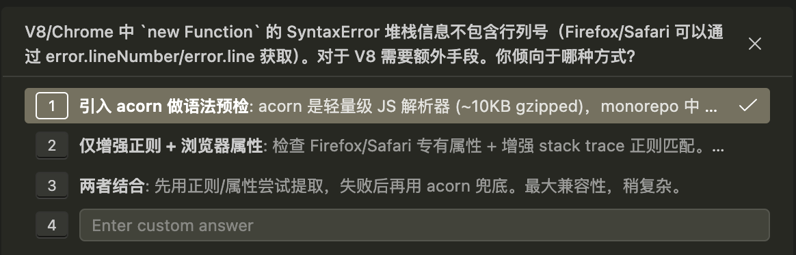

找出 new Function() 失败时 `SyntaxError` 发生的位置
https://stackoverflow.com/questions/18624395/find-where-a-syntax-error-occurs-when-new-function-fails

如果目标只是简单地找到语法错误，使用 jslint 作为预处理步骤会是最佳方案，但我更感兴趣的是浏览器是否能以某种方式报告这些信息，即使是以有限的形式，比如"第几行/第几个字符处存在某个错误...

---

据我所知不可能找出错误发生在哪里。但你可能想查看 Exception.message 来获取错误是什么的信息。



V8/Chrome 中 `new Function` 的 SyntaxError 堆栈信息不包含行列号（Firefox/Safari 可以通过 error.lineNumber/error.line 获取）。对于 V8 需要额外手段。
引入 acorn 做语法预检

- acorn 是轻量级 JS 解析器 (~10KB gzipped)，monorepo 中 packages/cli 已有使用。编译前先用 acorn 解析，语法错误会带精确行列号。最可靠的跨浏览器方案。

---

最佳实践

```
SyntaxError (如 Unexpected token) 发生
  ↓
1. 检查 Firefox/Safari 浏览器专有属性 → 命中则返回
2. 正则匹配 stack trace → 命中则返回
3. acorn 重新解析用户代码 → 获取精确 line/column → 返回
  ↓
格式化: "Unexpected token (行 3, 列 10)"
```
