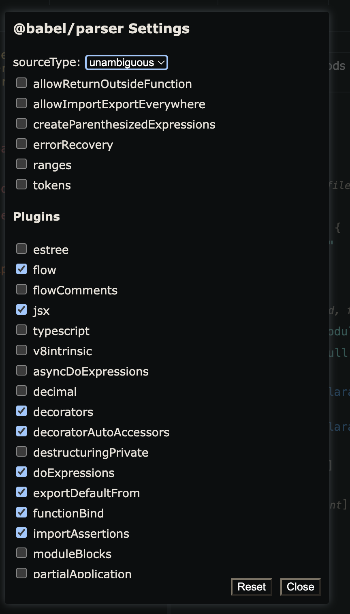

实战部分

1. 自动国际化：自动转换代码为国际化之后的，自动引入资源包并替换代码中的文本
2. 自动生成文档：自动生成 api 文档，不再需要手动去维护
3. 自动埋点：自动进行函数插桩，埋点是一种常见的函数插桩
4. linter： 探索 eslint、stylelint 等 lint 工具的实现原理，能够实现各种 lint 插件
5. type checker：实现简单的 ts 类型检查，会对 typescript 的类型检查的原理会有更深的理解
6. 压缩混淆：前端必用工具之一，探索它的实现原理，压缩怎么做，混淆怎么做，怎么用 babel 实现，开阔下思路
7. js 解释器： AST 除了转译、静态分析外，还可以直接解释执行，学完这个案例可以知道解释器是怎么解释代码的
8. 模块遍历器：基于 babel 做模块的遍历，理解打包工具的依赖图构建原理
9. 手写 babel： 手写 babel 是为了加深对 babel 的理解，真正掌握 babel

# babel 插件基础

## 介绍

一般编译器 Compiler 是指高级语言到低级语言的转换工具。
而从高级语言到高级语言的转换工具，被叫做转换编译器，简称转译器 (Transpiler)。
babel 就是一个 Javascript Transpiler。`(也可以说，transpiler 是一种特殊的 compiler)`

babel 最开始叫 6to5，顾名思义是 es6 转 es5，但是后来随着 es 标准的演进，有了 es7、es8 等， 6to5 的名字已经不合适了，所以改名为了 babel。
babel 是巴别塔的意思，来自圣经中的典故。
我们平时主要用 babel 来做 3 种事情：

1. `转译` esnext、typescript、flow 等到目标环境支持的 js
2. 一些特定用途的代码`转换`
   例如：小程序转译工具 taro
3. 代码的`静态分析`
   例如:linter、api 文档生成工具、type checker、代码混淆工具、js 解释器

Babel 本来就是一个由 Facebook 开发和维护的开源工具，Facebook 也是 Babel 的主要维护者之一

## Babel 的编译流程


熟悉的三步：parse、transform、generate

1. parse：通过 parser 把源码转成抽象语法树（AST）
   
2. transform：遍历 AST，调用各种 transform 插件对 AST 进行增删改
3. generate：把转换后的 AST 打印成目标代码，并生成 sourcemap

## Babel 的 AST

https://astexplorer.net/ 可以查看各种语言
点击这里的 save 就可以保存下来，然后把 url 分享出去


1. Literal(字面量)
   
2. Identifier(标识符)
   变量名、属性名、参数名等各种声明和引用的名字，都是 Identifer。
   `JS 中的标识符只能包含字母或数字或下划线或美元符号，且不能以数字开头`。这是 Identifier 的词法特点。
   
3. Statement(语句)
   我们写的每一条可以独立执行的代码都是语句。`语句末尾一般会加一个分号分隔，或者用换行分隔。`
   语句是代码执行的最小单位，可以说，代码是由语句（Statement）构成的。
   **特点是能够单独执行**
   
4. Declaration
   声明语句用于定义变量
   
   例如：

   - ImportDeclaration
   - ExportDefaultDeclaration、ExportNamedDeclaration、ExportAllDeclaration

5. Expression(表达式)
   执行完以后有返回值
   
   

   ```jsonc
   // a=1
   {
     "type": "Program",
     "start": 0,
     "end": 3,
     "body": [
       {
         "type": "ExpressionStatement",
         "start": 0,
         "end": 3,
         "expression": {
           "type": "AssignmentExpression",
           "start": 0,
           "end": 3,
           "operator": "=",
           "left": {
             "type": "Identifier",
             "start": 0,
             "end": 1,
             "name": "a"
           },
           "right": {
             "type": "Literal",
             "start": 2,
             "end": 3,
             "value": 1,
             "raw": "1"
           }
         }
       }
     ],
     "sourceType": "module"
   }
   ```

6. Class
   
7. Modules

- import: ImportSpicifier、ImportDefaultSpecifier、ImportNamespaceSpcifier
- export: ExportNamedDeclaration、ExportDefaultDeclaration、ExportAllDeclaration

8. Program & Directive
   program 是代表整个程序的节点，它有 body 属性代表程序体，存放 statement 数组；还有 directives 属性，存放 Directive 节点
   
9. File & Comment
   babel 的 AST 最外层节点是 File，它有 program、comments、tokens 等属性，分别存放 Program 程序体、注释、token 等，是最外层节点
   块注释：CommentBlock
   行内注释：CommentLine

想查看全部的 AST 可以在 babel parser 仓库里的 AST 文档里查，或者直接去看 @babel/types 的 typescript 类型定义
https://github.com/babel/babel/blob/main/packages/babel-parser/ast/spec.md
https://github.com/babel/babel/blob/main/packages/babel-types/src/ast-types/generated/index.ts

---

AST 的公共属性(BaseNode)

- type： AST 节点的类型
- start、end、loc：start 和 end 代表该节点在源码中的开始和结束下标。而 loc 属性是一个对象，有 line 和 column 属性分别记录开始和结束的行列号
- leadingComments、innerComments、trailingComments：注释
- extra：记录一些额外的信息，用于处理一些特殊情况。记录一些额外的信息，用于处理一些特殊情况。比如 StringLiteral 的 value 只是值的修改，而`修改 extra.raw 则可以连同单双引号一起修改`。
  

## babel 的 Api

文档：https://www.babeljs.cn/docs/babel-parser

1. `@babel/parser` 对源码进行 parse，可以通过 plugins、sourceType 等来指定 parse 语法
   babel parser 叫 babylon，是基于 **acorn** 实现的，扩展了很多语法，可以支持 es next（现在支持到 es2020）、jsx、flow、typescript 等语法的解析。默认只能 parse js 代码，jsx、flow、typescript 这些非标准的语法的解析需要指定语法插件。
   提供了有两个 api：parse 和 parseExpression
   ```ts
   function parse(input: string, options?: ParserOptions): File
   function parseExpression(input: string, options?: ParserOptions): Expression
   ```
   
2. `@babel/traverse` 通过 visitor 函数对遍历到的 ast 进行处理，分为 enter 和 exit 两个阶段，具体操作 AST 使用 path 的 api，还可以通过 state 来在遍历过程中传递一些数据
   ```ts
   traverse(ast, {
     'FunctionDeclaration|VariableDeclaration'(path, state) {}
   })
   ```
   - path 有很多属性和方法，比如记录父子、兄弟等关系的、增删改 AST 的、判断 AST 类型的
   - state 是 Context，传递一些数据
3. `@babel/types` 用于创建、判断 AST 节点，提供了 xxx、isXxx、assertXxx 的 api
4. `@babel/template` 用于批量创建节点
   通过 @babel/types 创建 AST 还是比较麻烦的，要一个个的创建然后组装
   简化了创建 AST 的过程
   支持变量
5. `@babel/generator` 打印 AST 成目标代码字符串，支持 comments、minified、sourceMaps 等选项。
   ```ts
   function (ast: Object, opts: Object): {code, map}
   ```
6. @babel/code-frame 可以创建友好的报错信息
   控制台打印代码格式的功能就叫做 code frame(例如：高亮显示错误的代码行)

7. @babel/core 基于上面的包来完成 babel 的编译流程，可以从源码字符串、源码文件、AST 开始。
   ```ts
   transformSync(code, options) // => { code, map, ast }
   transformFileSync(filename, options) // => { code, map, ast }
   transformFromAstSync(parsedAst, sourceCode, options) // => { code, map, ast }
   ```
   options 主要配置 plugins 和 presets，指定具体要做什么转换。
   这些 api 也同样提供了异步的版本，异步地进行编译，返回一个 promise；明确是同步还是异步

## 实战案例：插入函数调用参数

通过 babel 能够自动在 console.log 等 api 中插入文件名和行列号的参数，方便定位到代码。

1. 分析代码 ast，确定思路
   https://astexplorer.net/#/gist/09113e146fa04044e99f8a98434a01af/80bef2b9068991f7a8e4f113ff824f56e3292253
   函数调用表达式的 AST 是 CallExpression。
   CallExrpession 节点有两个属性，**callee 和 arguments**，分别对应调用的函数名和参数， 所以我们要判断当 callee 是 console.xx 时，在 arguments 的数组中中插入一个 AST 节点。
   

   **babel parser 是自动生成的类型文件，类似条件编译**
   

首先通过 @babel/parser、@babel/traverse、@babel/generator 来组织编译流程，通过@babel/types 创建 AST，通过 path 的各种 api 对 AST 进行操作。

后来需求改为在前面插入 console.xxx 的方式，我们引入了 @babel/template 包，通过 path.replaceWith 和 path.insertBefore 来对 AST 做插入和替换，需要通过 path.findParent 来判断 AST 的父元素是否包含 JSXElement 类型的 AST。子节点的 AST 要用 path.skip 跳过遍历，而且要对新的 AST 做标记，跳过对新生成的节点的处理。

之后我们把它改造成了 babel 插件，也就是一个函数返回一个对象的格式，**函数的第一个参数可以拿到各种 babel 常用包的 api，比如 types、template。** 插件不需要调用 parse、traverse、generate 等 api，只需要提供 visitor 函数。最后我们通过 @babel/core 的 api 使用了下这个插件。

## JS Parser 的历史


- SpiderMonkey 和 estree 标准
- acorn
  > acorn 是基于递归下降的思路实现的
- acorn 插件
  **babel parser 基于 acorn 扩展了一些语法**;
  就是通过继承和重写的方式修改了词法分析、语法分析的逻辑;
  现在 babel parser 的代码里已经看不到 acorn 的依赖了，因为在 babel4 以后，babel 直接 fork 了 acorn 的代码来修改，而不是引入 acorn 包再通过插件扩展的方式.

## traverse 的 path、scope、visitor

visitor 模式，通过对象和操作分离的方式使得 AST 和 visitor 可以独立扩展，还可以轻易的结合在一起
babel 强大的 path，包括它的属性和操作 AST 的 api，以及作用域 scope 的一些概念和 api。

---

- path 是记录遍历路径的 api，它记录了父子节点的引用，还有很多增删改查 AST 的 api
  

  ```js
  path {
      // 属性：
      node
      parent
      parentPath
      scope
      hub
      container
      key
      listKey

      // 方法
      get(key)
      set(key, node)
      inList()
      getSibling(key)
      getNextSibling()
      getPrevSibling()
      getAllPrevSiblings()
      getAllNextSiblings()
      isXxx(opts)
      assertXxx(opts)
      find(callback)
      findParent(callback)

      insertBefore(nodes)
      insertAfter(nodes)
      replaceWith(replacement)
      replaceWithMultiple(nodes)
      replaceWithSourceString(replacement)
      remove()

      traverse(visitor, state)
      skip()
      stop()
  }

  ```

- 作用域 path.scope
  scope 是作用域信息，javascript 中能生成作用域的就是模块、函数、块等，而且作用域之间会形成嵌套关系，也就是作用域链。babel 在遍历的过程中会生成作用域链保存在 path.scope 中。

  ```js
  path.scope {
     bindings  // 每一个声明叫做一个binding
     block
     parent
     parentBlock
     path
     references

     dump()
     getAllBindings()
     getBinding(name)
     hasBinding(name)
     getOwnBinding(name)
     parentHasBinding(name)
     removeBinding(name)
     moveBindingTo(name, scope)
     generateUid(name)  // 生成作用域内唯一的名字
  }
  ```

- state
  state 是遍历过程中 AST 节点之间传递数据的方式。插件的 visitor 中，第一个参数是 path，第二个参数就是 state。

## Generator 和 SourceMap 的奥秘

generate 就是递归打印 AST 成字符串，在递归打印的过程中会根据源码位置和计算出的目标代码的位置来生成 mapping，加到 sourcemap 中。 sourcemap 是源码和目标代码的映射，用于开发时调试源码和生产时定位线上错误。 `babel 通过 source-map 这个包来生成的 sourcemap`，我们使用了下 source-map 包的 api，对 sourcemap 的生成和消费有了一个直观的认识。

## Code-Frame 和代码高亮原理


- 如何打印出标记相应位置代码的 code Frame
  
- 如何实现语法高亮
  实现语法高亮，`词法分析就足够了`，babel 也是这么做的，@babel/highlight 包里面完成了高亮代码的逻辑
  `js-tokens` 这个包暴露出来一个正则，一个函数，正则是用来识别 token 的，其中有很多个分组，而函数里面是对不同的分组下标返回了不同的类型，这样就能完成 token 的识别和分类。
  
  
- 如何在控制台打印颜色
  ANSI

## Babel 插件和 preset

- babel 的 plugin 和 preset 的格式，两者基本一样，都是可以对象和函数两种形式
  插件做的事情就是通过 api 拿到 types、template 等，通过 state.opts 拿到参数，然后通过 path 来修改 AST。
  ```js
  export default function (api, options, dirname) {
    return {
      inherits: parentPlugin,
      manipulateOptions(options, parserOptions) {
        options.xxx = ''
      },
      pre(file) {
        this.cache = new Map()
      },
      visitor: {
        StringLiteral(path, state) {
          this.cache.set(path.node.value, 1)
        }
      },
      post(file) {
        console.log(this.cache)
      }
    }
  }
  ```
  
  ```js
  export default function (api, options) {
    return {
      plugins: ['pluginA'],
      presets: [['presetsB', { options: 'bbb' }]]
    }
  }
  ```
- 函数的形式接收 api 和 options 参数。还可以通过 @babel/core 包里的 createConfigItem 来创建配置项，方便抽离出去。
- plugin 和 preset 是有顺序的，先 plugin 再 preset，plugin 从左到右，preset 从右到左。
- plugin 和 preset 还有名字的规范，符合规范的名字可以简写，这样 babel 会自动补充上 babel plugin 或 babel preset。
  babel 希望插件名字中能包含 babel plugin，这样写 plugin 的名字的时候就可以简化，然后 babel 自动去补充。所以我们写的 `babel 插件最好是 babel-plugin-xx 和 @scope/babel-plugin-xx 这两种，就可以简单写为 xx 和 @scope/xx。`

  坏文明!

## Babel 插件的单元测试

babel-plugin-tester 是利用对结果进行对比的思路，对比方式可以选择直接`对比字符串、对比 fixture 文件的内容和实际输出内容、对比快照`这 3 种方式

> 单测就是文档，可以根据单测了解插件的功能
> 代码改动跑一下单测就知道功能是否正常，快速回归测试，方便后续迭代

## Babel 的内置功能


- 三大块转换内容：
  

  - es20xx
    => preset env
  - proposal-xxx
    => proposal plugin
  - react/flow/typescript
    => preset-jsx、preset-typescript、preset-flow

- babel 内置的 plugin 分为了 `transform、proposal、syntax` 三种
  babel 的内置的 plugin，就 `@babel/plugin-syntax-xxx, @babel/plugin-transform-xxx、@babel/plugin-proposal-xxx` 3 种

  - syntax plugin 是在 parserOptions 中放入一个 flag 让 parser 知道要 parse 什么语法，最终的 parse 逻辑还是 babel parser（babylon） 实现的。
  - transform plugin 是对 AST 的转换，各种 es20xx 语言特性、typescript、jsx 等的转换都是在 transform plugin 里面实现的。
  - 未加入语言标准的特性的 AST 转换插件叫 proposal plugin，其实他也是 transform plugin，但是为了和标准特性区分，所以这样叫。

- preset 就是插件的集合，但是它可以动态确定包含的插件，比如 preset-env 就是根据 targets 来确定插件
  babel7 以后，我们只需要`使用 @babel/preset-env，指定目标环境的 targets`，babel 就会根据内部的兼容性数据库查询出该环境不支持的语法和 api，进行对应插件的引入，从而实现按需的语法转换和 polyfill 引入。
- 插件之间的可复用的 AST 操作逻辑，需要注入的公共代码都在 `helper` 里

- 除了注入到 AST 外，还有一部分是从 runtime 包引入的。`runtime` 包分为 `helper、regenerator、core-js` 3 部分。后面两个都是社区的实现。
  - corejs 这就是新的 api 的 polyfill，分为 2 和 3 两个版本，3 才实现了实例方法的 polyfill
  - regenerator 是 facebook 实现的 aync 的 runtime 库，babel 使用 regenerator-runtime 来支持实现 async await 的支持。
  - helper 是 babel 做语法转换时用到的函数，比如 \_typeof、\_extends 等

## Babel 配置的原理

https://juejin.cn/book/6946117847848321055/section/7093335532888915982?scrollMenuIndex=1#heading-0
