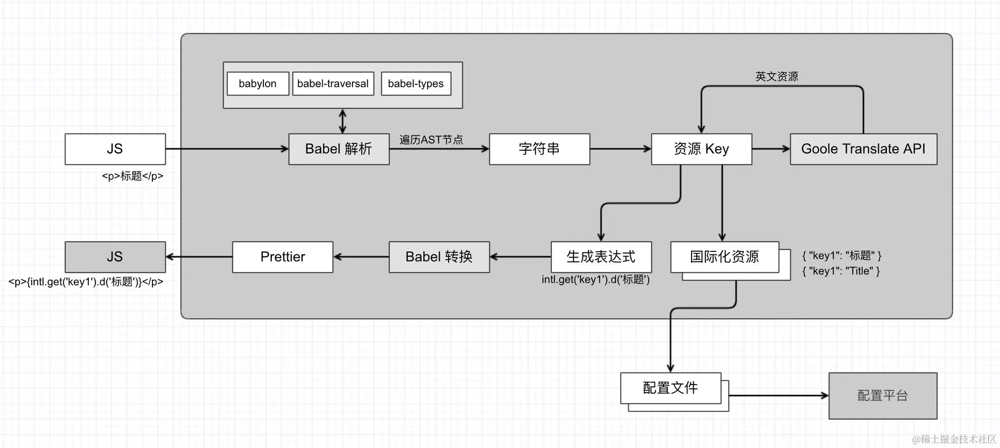

# babel 插件实战

https://github.com/QuarkGluonPlasma/babel-plugin-exercize

## 自动埋点

函数插桩是在函数中插入一段逻辑但不影响函数原本逻辑，埋点就是一种常见的函数插桩，我们完全可以用 babel 来自动做。

实现思路分为`引入 tracker 模块`和`函数插桩`两部分：

- 引入 tracker 模块需要判断 ImportDeclaration 是否包含了 tracker 模块，没有的话就用 @babel/helper-module-import 来引入。
  如果已经引入过就不引入，没有的话就引入，并且生成个唯一 id 作为标识符。
- 函数插桩就是在函数体开始插入一段代码，如果没有函数体，需要包装一层，并且处理下返回值。、

实际上可能有的函数不需要埋点，这种可以自己做一下过滤，或者在函数上写上注释，然后根据注释来过滤，就像 eslint 支持 /_ eslint-disable / 来配置 rule 的开启关闭，teser 支持 `/ @**PURE**_/` 来配置纯函数一样。

## 自动国际化

需求：
如果没有引入 intl 模块，就自动引入，并且生成唯一的标识符，不和作用域的其他声明冲突
把字符串和模版字符串替换为 intl.t 的函数调用的形式
带有 `/*i18n-disable*/` 注释的字符串就忽略
把收集到的值收集起来，输出到一个资源文件中

---



替换字符串和模版字符串(StringLiteral 和 TemplateLiteral 节点)为对应的函数调用语句，要做模块的自动引入。
引入的 id 要生成全局唯一的，注意 jsx 中如果是属性的替换要用 {} 包裹。

## 自动生成 API 文档

对外提供 sdk 的话，那么自动文档生成是个刚需，不然每次都要人工同步改。
自动文档生成主要是信息的提取和渲染两部分，提取源码信息我们只需要分别处理 ClassDeclaration、FunctionDeclaration 或其他节点，然后从 ast 取出名字、注释等信息，之后通过 renderer 拼接成不同的字符串。

- FunctionDelcaration：

函数名： path.get('id').toString()
参数： path.get('params')
返回值类型： path.get('returnType').getTypeAnnotation()
注释信息：path.node.leadingComments
注释可以使用 `doctrine` 来 parse，支持 @xxx 的解析

- ClassDeclaration：

类名：path.get('id').toString()
方法：travese ClassMethod 节点取信息（包括 constructor 和 method）
属性： traverse ClassProperty 节点取信息
注释信息： path.node.leadingComments

## Linter

lint 是什么？在任何一种计算机程序语言中，用来`标记源代码中有疑义段落的工具`。
代码结构的错误包括两种情况： 代码有逻辑或者语法错误，代码没错误但是不符合代码规范.

---

思路分析

- 查看 AST: for 语句的 AST 是 ForStatement

---

lint 工具要分析和修复代码都是基于 AST 的，只不过 babel 没有提供 token 相关的 api，能够检查和修复逻辑错误，但检查和修复不了格式错误。
eslint 也有插件，也是通过 AST 的方式实现检查和修复。
所以，想做 lint 还是用 eslint 吧。

## 类型检查

类型代表了变量的内容和能对它进行的操作
类型检查就是做 AST 的对比，判断声明的和实际的是否一致：

- 简单类型就直接对比，相当于 if else
  AssignmentExpression，左右两边的类型是否匹配
- 带泛型的要先把类型参数传递过去才能确定类型，之后对比，相当于`函数调用包裹 if else`
- 带高级类型的泛型的类型检查，`多了一个对类型求值的过程`，相当于`多级函数调用之后再判断 if else`

## 压缩混淆

压缩混淆也是对代码做转换，但是做的是等价转换，变量名换成无意义的名字，
代码结构转成更难读但是执行效果一样的形式，没用到的代码（return 后的、没被引用的声明）删除掉。等等。

## JS 解释器

- v8 的编译流水线
  
  v8 包括 4 部分，parser、ignition 解释器，JIT 编译器，还有 garbage collector（垃圾回收器）。

  parser 负责把源码 parse 成 AST。
  ignition 解释器负责把 AST 转成字节码，然后解释执行
  turbofan 可以把代码编译成机器码，直接执行
  gc 负责堆内存的垃圾回收

## 模块遍历


- ImportDeclaration 分为三种

```js
// 这种我们叫 deconstruct import（解构引入）
import { a, b as bb } from 'aa'
// 这种我们叫 namespace import（命名空间引入）
import * as c from 'cc'
// 这种我们叫 default import（默认引入）
import b from 'b'
```

- ExportDeclaration 分为三种

```js
// 全部导出(all export)
export * from 'a'
// 默认导出 (default export)
export default b
// 命名导出 (named export)
export { c as cc }
```

---

- 读取文件内容
- 通过 babel parser 把文件内容 parse 成 ast
- 遍历 AST，对 ImportDeclaration、ExportDeclaration 分别做处理
- 对分析出的依赖路径进行处理，变成绝对路径，并尝试补全
- 递归处理分析出来的依赖路径

## Babel Macros

## 如何调试 Babel 源码？
