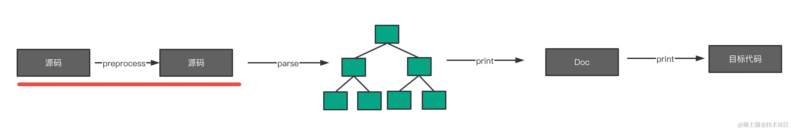
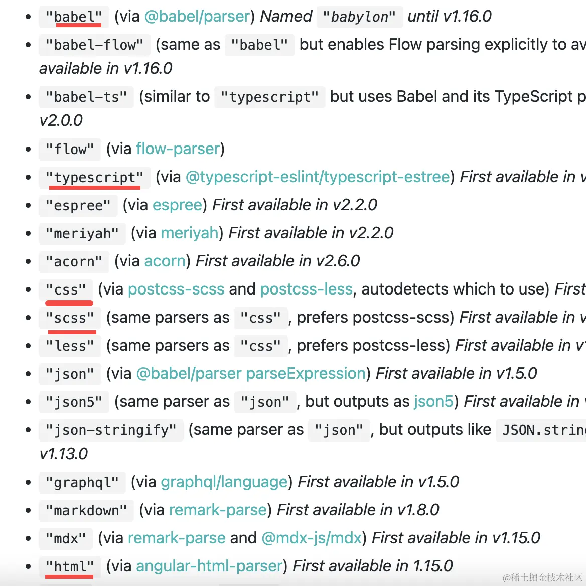

# 手写简易的 babel

https://github.com/QuarkGluonPlasma/babel-plugin-exercize

## 手写 Babel：思路篇

- parser 包是肯定要实现的，babel parser 是基于 acorn fork 的，我们也基于 acorn，做一点扩展。完成从源码到 AST 的转换。
- traverse 包是对 AST 的遍历，需要知道不同类型的 AST 都遍历哪些 key，这些是在 @babel/types 包里面定义的，我们也用类似的实现方式，并且会调用对应的 visitor，实现 path 和 path.scope 的一些 api 然后传入。
- generate 包是打印 AST 成目标代码，生成 sourcemap。打印这部分每个 AST 类型都要写一个对应的函数来处理，生成 sourcemap 使用 source-map 这个包，关联 parse 时记录的 loc 和打印时计算的位置来生成每一个 mapping。
- types 包用于创建 AST，会维护创建和判断各种 AST 的 api，并且提供每种 AST 需要遍历的属性是哪些，用于 traverse 的过程
- template 包是批量创建 AST 的，这里我们实现一个简单的版本，传入字符串，parse 成 AST 返回。
- core 包是整体流程的串联，支持 plugins 和 presets，调用插件，合并成最终的 visitors，然后再 traverse。
- helper 包我们也会实现一个，因为支持了 plugin，那么中有一些公共的函数可以复用
- runtime 包我们也提供一下，不过只加入一些用于做语法转换的辅助函数就好了
- cli 包 实现一个命令行工具，来调用 core 包的功能

## 手写 Babel： parser 篇

acorn 支持插件，可以扩展语法，babel parser 就是 fork 了 acorn 做了扩展，我们也通过类似的方式，实现了两个语法插件，然后通过 options 启用。
acorn 插件的实现方式是`继承之前的 Parser 返回新的 Parser`，重写一些方法来做 AST 修改和扩充。

```js
module.exports = function (Parser) {
  return class extends Parser {
    parseLiteral(...args) {
      const node = super.parseLiteral(...args)
      switch (typeof node.value) {
        case 'number':
          node.type = 'NumericLiteral'
          break
        case 'string':
          node.type = 'StringLiteral'
          break
      }
      return node
    }
  }
}
```

## 手写 Babel： traverse 篇

1. 维护这样一份数据：不同的 AST 有哪些可以遍历的属性。遍历到不同节点时，取出不同节点要遍历的属性，然后递归遍历。
2. 如果 enter 阶段修改了 AST 但是不想遍历新生成的子节点，可以用 path.skip 跳过遍历。

## 手写 Babel： traverse -- path 篇

1. path 记录了遍历路径，并且还实现了一系列增删改的 api，会在遍历 ast 的时候传递给 visitor 的回调函数。
2. path 的实现就是在 traverse 的时候创建一个对象来保存当前节点和父节点，并且能够拿到节点也就能对节点进行操作，可以基于节点来提供一系列增删改的 api。
3. path 的 api 就是对 AST 进行增删改，我们记录了 node（当前节点）、parent（父节点）、parentPath（父 path） 等信息，还会记录 key（父节点属性） 和 listkey（节点在数组中的下标）。基于这些就可以实现 replaceWith、remove、find、findParent、skip 等 api。

## 手写 Babel： traverse -- scope 篇

1. path.scope 中记录着作用域相关的数据，通过 scope 可以拿到整条作用域链，包括声明的变量和对该声明的引用。
2. 能生成 scope 的 AST 叫做 block，比如 FunctionDeclaration 就是 block，因为它会生成一个新的 scope。scope 中记录着 bindings，也就是声明，每个声明会记录在哪里声明的，被哪里引用的。记录完 bindings 之后还要再遍历一次记录引用这些 binding 的 reference。
3. 我们在记录节点的遍历的属性的时候，也记录了该节点是否是 block

## 手写 Babel： generator 篇

## 手写 Babel： core 篇

transformSync 封装了 parse、traverse、generate 的逻辑，并且还实现了插件和 preset 机制。
babel 是微内核架构，就是因为核心只实现了编译流程，具体的转换功能都是通过插件来实现的，而 preset 则是为了简化用户使用 babel 的成本而引入的一种机制，是插件的集合，让用户不需要直接配置具体的插件，选择不同的 preset 即可。

## 手写 Babel： cli 篇

## 手写 Babel： 总结

https://juejin.cn/book/6946117847848321055/section/6995835006530617381

## 会了 babel 插件，就会写 prettier 插件

1. `只包含 parser 和 printer 这两部分`，但是支持很多 language。每种 language 都有自己的 parser 和 printer。
   
   
2. 写一个支持新的语言的格式化的 prettier 插件，只需要一个导出 languages、parsers、pritners 配置的文件：
   - languages 部分指定语言的名字，文件后缀名，用什么 parser 等。
   - parsers 部分实现字符串到 AST 的 parse，还可以指定预处理函数 preprocess。
   - printers 部分实现 AST 到 doc 的打印，doc 是 prettier 的一种中间格式，便于 prettier 再做一层统一的格式控制，之后再打印为字符串
3. 默认 prettier 会加载 node_modules 下的所有 prettier-plugin-xx 的或者 @xxx/prettier-plugin-yy 的插件，不需要手动指定 plugins
   只要安装这个打乱 imports 的 prettier 插件的依赖，prettier 就会自动应用，同事不看 package.json 就很难发现。

## 编译 ts 代码用 babel 还是 tsc？


babel 和 tsc 的编译流程大同小异，都有把源码转换成 AST 的 Parser，都会做语义分析（作用域分析）和 AST 的 transform，最后都会用 Generator（或者 Emitter）把 AST 打印成目标代码并生成 sourcemap。但是 babel 不做类型检查，也不会生成 d.ts 文件。

tsc 支持最新的 es 标准特性和部分草案的特性（比如 decorator），而 babel 通过 @babel/preset-env 支持所有标准特性，也可以通过 @babel/proposal-xx 来支持各种非标准特性，`支持的语言特性上 babel 更强一些。`

tsc 没有做 polyfill 的处理，需要全量引入 core-js，而 babel 的 @babel/preset-env 会根据 targets 的配置`按需引入 core-js`，引入方式受 useBuiltIns 影响 (entry 是在入口引入 targets 需要的，usage 是每个模块引入用到的)。

但是 `babel 因为是每个文件单独编译的`（`tsc 是整个项目一起编译`），而且也不解析类型，所以 const enum（后来支持了），namespace 合并，namespace 导出非 const 值并不支持。而且过时的 export = 的模块语法也不支持。

但这些影响不大，完全可以用 babel 编译 ts 代码来生成体积更小的代码，不做类型检查编译速度也更快。如果想做类型检查可以单独执行 tsc --noEmit。
