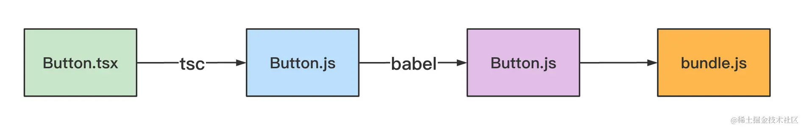

https://github.com/981377660LMT/articles/blob/af32bed62ae47d7c245d2089ce60f09f715b6b66/0706/debug%E5%B0%8F%E5%86%8C.md?plain=1#L4

## vscode debugger 两个优势：

1. 回溯
2. 边调试边写代码是我推荐的写代码方式。

## vscode debugger 配置笔记

1. userDataDir

`user data dir 是保存用户数据的地方，比如浏览历史、cookie 等，一个数据目录只能跑一个 chrome，所以默认会创建临时用户数据目录，想用默认的目录可以把这个配置设为 false`

用户数据目录有个特点，就是只能被一个 Chrome 实例所访问，如果你之前启动了 Chrome 用了这个默认的 user data dir，那就不能再启动一个 Chrome 实例用它了。
默认是 true，代表创建一个临时目录来保存用户数据。
你也可以指定一个自定义的路径，这样用户数据就会保存在那个目录下：

2. sourceMapPathOverrides
   

   `编译后代码路径 -- sourcemap -> 源码路径 -- sourceMapPathOverrides -> 本地文件路径`
   把调试的文件 sourcemap 到的路径映射到本地的文件，这样调试的代码就不再只读了：

   ```json
   // 默认把 meteor、webpack 开头的 path 映射到了本地的目录下
   // 其中 ?:* 代表匹配任意字符，但不映射，而 * 是用于匹配字符并映射的。
   "sourceMapPathOverrides": {
     "meteor://💻app/*": "${workspaceFolder}/*",
     "webpack:///./~/*": "${workspaceFolder}/node_modules/*",
     "webpack://?:*/*": "${workspaceFolder}/*"
   }
   ```

3. console
   internalConsole 就是内置的 debug console 面板，默认是这个。
   **internalTerminal 是内置的 terminal 面板，切换成这个就是彩色了** <- 推荐
   externalTerminal 会打开系统的 terminal 来展示日志信息：
4. env/envFile
   这样在调试的 node 程序里就可以取到这些环境变量
5. cwd
   指定工作目录，使用场景：运行对应目录下的 package.json 里的脚本
6. resolveSourceMapLocations
   默认值是排除掉了 node_modules 目录的，也就是不会查找 node_modules 下的 sourcemap。

## sourcemap 相关

开发时会使用 sourcemap 来调试，但是生产可不会，但是线上报错的时候确实也需要定位到源码，这种情况一般都是单独上传 sourcemap 到错误收集平台。
比如 sentry 就提供了一个  @sentry/webpack-plugin  支持在**打包完成后把 sourcemap 自动上传到 sentry 后台，然后把本地 sourcemap 删掉。还提供了  @sentry/cli  让用户可以手动上传。**

如何生成 sourcemap?
`用 source-map 库生成 sourcemap，`

## 调试 Vue 项目

1. 调试 @vue/cli 创建的 webpack 项目
   vue cli 创建的项目，默认情况下打断点不生效，这是因为文件路径后带了 `?hash`，这是默认的 eval-cheap-module-source-map 的 devtool 配置导致的，去掉 eval，改为 source-map 即可。
2. 调试 create vue 创建的 vite 项目
   `如果 sourcemap 到的文件路径不是本地路径，那就映射不到本地文件，导致断点打不上，这时候可以配置下 sourceMapPathOverrides。如果映射之后路径开头多了几层目录，那就要配置下 webRoot。`
   如果想点击调用栈直接在 workspace 打开对应的文件，这需要把 demo 项目和 vue3 源码项目放到一个 workspace 下，再次调试就可以了。

## VSCode Chrome Debugger 断点映射的原理

VSCode Debugger 里打的断点是怎么在网页里生效的？

1. VSCode 会记录你在哪个文件哪行打了个断点，然后会把这个信息发给 Chrome。
   这是一个形如 `/Users/guang/code/foo/src/App.vue` 的`绝对路径`
   但是问题来了，我们本地打的断点是一个绝对路径，也就是包含 `${workspaceFolder}` 的路径，而网页里根本没有这个路径，那怎么断住的呢？
   这是因为有的文件是关联了 sourcemap 的，它会把文件路径映射到源码路径
   如果映射到的源码路径直接就是本地的文件路径，那断点就生效了。
   
   vite 的项目，sourcemap 都是这种绝对路径，所以断点直接就生效了。
   但是 webpack 的项目，sourcemap 到的路径不是绝对路径，而是这种：
   
   本地打的断点都是绝对路径，而 sourcemap 到的路径不是绝对路径，根本打不上呀！
   `所以 VSCode Chrome Debugger 支持了 sourceMapPathOverrides 的配置，让打断点的文件路径和 sourcemap 之后的文件路径对上`
   如果映射之后路径开头多了几层目录，那就要配置下 webRoot。

## 用 VSCode 调试 React 项目

1. 需要 build 出带有 sourcemap 的 react 包
2. 下载之后 reset 到这个 commit：

   ```bash
   git reset --hard 80f3d88190c07c2da11b5cac58a44c3b90fbc296
   ```

3. 找到 rollup 的配置，添加一行 sourcemap: true，让 rollup 在构建时产生 sourcemap：
4. 找出没有生成 sourcemap 的那几个插件注释掉

## 文件只读，可能是本地不存在这个文件

把调试的文件 sourcemap 到的路径`映射`到本地的文件，这样调试的代码就不再只读了：

## json 与 jsonc

scope 指定为 json 和 jsonc，这是因为 json 文件对应两种语言：

jsonc 是 json with comments，带注释的 json，因为 json 语法是不支持注释的，而我们又想在 json 文件里加一些注释，所以平时都是用 jsonc 的类型。

## 调试 npm scripts

我们也可以用 npx 来跑，比如 npx xx，它的作用就是执行 node_modules/.bin 下的本地命令，如果没有的话会从 npm 下载然后执行。
npm scripts 本质上还是用 node 来跑这些 script 代码，所以调试他们和调试其他 node 代码没啥区别。

1. 也就是可以这样跑：
   在 .vscode/launch.json 的调试文件里，选择 node 的 launch program：
   用 node 执行 node_modules/.bin 下的文件，传入参数即可：

```json
"configurations": [
  {
    "type": "node",
    "request": "launch",
    "name": "Launch Program",
    "skipFiles": ["<node_internals>/**"],
    "program": "${workspaceFolder}/node_modules/.bin/xx.js",
    "args": ["--arg1", "value1"]
  }
]
```


2. 其实还有更简单的方式，VSCode Debugger 对 npm scripts 调试的场景做了封装，可以直接选择 npm 类型的调试配置：

```json
"configurations": [
  {
    "type": "pwa-node",
    "request": "launch",
    "runtimeExecutable": "npm",
    "runtimeArgs": ["run-script", "foo"],
  }
]
```

## 命令行工具的两种调试方式（以 ESLint 源码调试为例）

这些命令行工具都提供了两种入口：**命令行和 api。**

1. 命令行的方式调试 ESLint 源码
   探究 fix 的原理
   `npx eslint ./index.js --fix ` 做了什么？

   ```json
   {
     "type": "node",
     "name": "eslint 调试",
     "program": "${workspaceFolder}/node_modules/.bin/eslint",
     "args": ["./index.js", "--fix"],
     "skipFiles": ["<node_internals>/**"],
     "console": "integratedTerminal",
     "cwd": "${workspaceFolder}",
     "request": "launch"
   }
   ```

   在 .bin 下找到 eslint 的文件打个断点

   eslint 的实现原理：
   
   lint 的实现是基于 AST，调用 rule 来做的检查。
   fix 的实现就是字符串的替换，多个 fix 有冲突的话会循环多次修复，默认修复 10 次还没修复完就终止。

2. api 的方式调试 ESLint 源码
   ESLint 会创建 ESLint 实例，然后调用 lintText 方法来对代码 lint。

   ESLint 源码的调试还是相对简单，因为没有经过编译，如果做了编译的话，那就需要 sourcemap 了

## 有时候我们需要修改 node_modules 下的一些代码，但是 node_modules 不会提交到 git 仓库，改动保存不下来，怎么办呢？

https://github.com/ds300/patch-package#readme
**这时候可以用 patch-package 这个工具。**
当我们需要对 node_modules 下的代码做改动的时候，可以通过 patch-package xxx 生成 patches 文件，它可以被提交到 git 仓库，然后再拉下来的代码就可以通过 patch-package 来应用改动。

1. 使用:

```bash
# 对node_modules/some-package/brokenFile.js做改动
vim node_modules/some-package/brokenFile.js

# 生成patch文件
npx patch-package some-package

# 提交patch文件
git add patches/some-package+3.14.15.patch
git commit -m "fix brokenFile.js in some-package"

# 把项目拉下来的时候，执行下 npx patch-package 就会应用这次改动
# 可以把它配到 postintsll 里，每次安装完依赖自动跑。
# 这样能保证每次拉取下来的代码都包含了对 node_modules 的改动。
```

2. 调试 patch-package 源码
   它默认就是有 sourcemap 的，只不过是 base64 的方式内联的(ts 配置 inlinsourcemap: true)
   

   探究它的实现原理要分为两各方面：
   **一个是 patches 文件怎么生成的，一个是 patches 文件怎么被应用的。**

   1. patches 文件怎么生成的(generate)
      看 patches 文件的内容就能看出来这是 git 的 diff：
      patch-package 就是依赖 git diff 实现的 patches 文件生成
      你可以先对 node_modules 下的某个包做下改动，然后执行 node ./dist/index xxx 来生成 patches 文件

      `好巧妙的方法！`：
      **在临时目录生成 package.json，下载依赖，生成一个 commit，然后把改动的代码复制过去，两者做 gif diff，就可以生成 patches 文件**

   2. patches 如何被应用的(apply)
      patch-package 自己实现了它的 parse，解析 patch 文件，拿到对什么文件的哪些行做什么修改的信息，之后根据不同做类型做不同的文件操作就可以了
      如果是 pnpm，那 patch-package 不支持，这时候用内置的 pnpm patch 命令就好了。
      `pnpm 内置 patch、patch-commit 命令，作用和这个 patch-package 包一样`

## 调试 Babel 源码

Babel 是一个 JS 的编译器，用于把高版本语法的代码转成低版本的，并且添加 polyfill。
它有很多插件，插件还进一步封装成了预设（preset），开箱即用。
此外，我们还可以写 Babel 插件来完成一些特定的代码转换。
`@babel/parser、@babel/traverse、@babel/generator `

```js
const parser = require('@babel/parser')
const traverse = require('@babel/traverse').default
const generate = require('@babel/generator').default

const source = `
    (async function() {
        console.log('hello guangguang');
    })();
`

const ast = parser.parse(source)

traverse(ast, {
  StringLiteral(path) {
    path.node.value = path.node.value.replace('guangguang', 'dongdong')
  }
})

const { code, map } = generate(ast, {
  sourceMaps: true
})

console.log(code)
console.log(JSON.stringify(map))
```

1. 怎么调试最初的源码呢
   sourcemap！
   但是你去 node_modules 下看下这些包，会发现它们已经有 sourcemap 了，而且也关联了：
   那为什么调试的时候调试的不是源码呢？
   这是因为 VSCode 的一个默认配置导致 sourcemap 不会生效。
   `resolveSourceMapLocations`!
   VSCode Node Debugger 默认不会查找 node_modules 下的 sourcemap。
2. 虽然调试的是源码的 ts 了，但是路径是 node_modules 包下的
   我们可以把 babel 项目下下来和测试项目放在一个 workspace 下，`然后去 node_modules 下手动替换下 sourcemap 的 sources 路径`，换成本地的路径，这样就可以调试 babel 源码了。
   然后在新的 workspace 创建个调试配置，这时目录改了，要指定下 cwd

## 实战案例：调试 Vite 源码

问题：vite 跑 dev server 的过程都执行了什么逻辑

1. debug npm script

```json
{
  "name": "Launch via NPM",
  "type": "node",
  "request": "launch",
  "runtimeExecutable": "npm",
  "runtimeArgs": ["run-script", "dev"],
  "console": "integratedTerminal",
  "skipFiles": ["<node_internals>/**"]
}
```

可以调用栈看到这部分代码是 node_modules/vite/dist/node 下的
去 node_modules 下看了下，并没有 sourcemap：
那去哪里找 sourcemap 呢？
这时就只能通过源码 build 了。
vite 是用 rollup 打包的，每个包下都有个 rollup.config.ts 文件，
搜一下 sourcemap，会找到一个 createNodeConfig 的函数，这里就是配置 node 部分的代码是否生成 sourcemap 的地方：
vite 编译会生成三部分代码，一部分是浏览器里的，也就是 client 目录下的，一部分是 node 跑的，是 esm 的模块，还有一部分是 node 跑的 cjs 的模块。

## 实战案例：调试 TypeScript 源码 (ts 的一些特性，可以通过源码找答案)

https://juejin.cn/book/7070324244772716556/section/7137086397147512840?utm_source=profile_book

```ts
type Test<T> = T extends number ? 1 : 2
type res = Test<any>

// 为什么res是1|2呢？
// 这就要从源码找答案了!
```

1. 下载源码
   lib 目录下有 `tsc.js` 和 `typescript.js`，这两个分别是 ts 的命令行和 api 的入口
   但是，这些是编译以后的 js 代码，源码在 src 下，是用 ts 写的。
   怎么把编译后的 js 代码和 ts 源码关联起来呢？ sourcemap！
2. 打断点
   ts 代码太多了，不知道哪些是解析类型的逻辑，在哪里打断点比较好。
   `这种情况还是用 api 的方式调试比较好。`

   ```js
   const ts = require('./built/local/typescript')

   const filename = './input.ts'
   const program = ts.createProgram([filename], {
     allowJs: false,
     strictNullChecks: true
   })

   const ast = program.getSourceFile(filename) // 想知道代码哪部分是什么 AST 可以通过 astexplorer.net 来查看
   const typeChecker = program.getTypeChecker()

   function visitNode(node) {
     if (node.kind === ts.SyntaxKind.TypeAliasDeclaration && node.name.escapedText === 'res') {
       const type = typeChecker.getTypeFromTypeNode(node.name)

       console.log(type)
     }

     node.forEachChild(child => visitNode(child))
   }

   visitNode(ast)
   ```

   
   通过运用 ts 的 api 去调试 ts 会比直接调试源码简单，如果条件类型左边是 any 时会作为联合类型处理

## 如何通过变量写出更灵活的调试配置？

vscode 的 debug 配置变量支持变量

- input 变量，可以让**用户输入或者选择**，通过 ${input:xxx} 语法
  例如："${input:port}" -> 输入一个端口号
- env 变量，可以读取**环境变量**值，通过 ${env:xxx} 语法
  例如："${env:HOME}" -> 取 HOME 环境变量
- config 变量，取 **vscode 的配置**，通过 ${config:xxx} 语法
  例如，可以通过 ${config:launch.nodePath} 来取 launch 配置里的 nodePath
- command 变量，可以**读取命令执行结果**，通过 ${command: xxx} 语法
  例如："${command:extension.pickNodeProcess}" -> 选择一个 node 进程
- 内置变量，可以取当前文件、目录等信息，通过 ${xxx} 语法
  例如：${file}、${workspaceFolder}、${relativeFile}、${fileBasename}、${fileDirname}、${fileExtname}、${cwd}

  灵活运用这些变量，可以让调试配置更灵活。

## 如何灵活的调试 Jest 测试用例

- 如果只是想跑某个测试文件的用例: jest 后面加上要跑的测试文件的就行
- 如果想跑某个测试用例: jest 后面加上 -t 参数，然后加上要跑的测试用例的名字。-t 是 --testNamePattern 的缩写，可以指定要跑的用例名的正则。

1. 跑 jest 怎么跑呢？
   其实我们跑 jest 最终执行的是 node_modules/jest/bin/jest.js 这个文件，所以调试的时候就直接用 node 跑这个文件，传入参数就行。
   还要指定日志输出位置为内置的终端，也就是 console 为 integratedTerminal。
   
   但你会发现它跑了多个 woker 进程，每个用例一个，这是 jest 优化性能的方式。
   但调试的时候可以不用这种优化，直接在主进程跑就行。
   可以加个 -i 的参数：
   -i 是 `--runInBand` 的缩写，这个参数的意思是不再用 worker 进程并行跑测试用例，而是在当前进程串行跑：
   但这样每调试一个用例都得改下配置也太麻烦了，能不能我打开哪个文件，就跑哪个文件的用例呢？
   可以的。
   VSCode 调试配置支持变量，比如 ${file} 就代表当前文件。
   这样就可以打开哪个调试那个了。
   那想指定具体的测试用例呢？
   **vscode 还支持输入类型的变量。**
2. jest-runner VSCode 插件 原理
   它会在每个测试用例旁边加一个运行和调试的按钮：
   点击不同位置的 debug，就是获取文件名和用例名传入调试配置
   相比第三方的 Jest 插件，自己写调试配置明显灵活、强大的多(例如正则)。

## 7 种断点(breakpoint)

这里只记录 3 种 chrome devtools 的 source 面板的

- dom 断点
  
  有三种类型，`子树修改的时候断住`、属性修改的时候断住、节点删除的时候断住。
  这时候你会发现代码在修改 DOM 的地方断住了，**这就是 React 源码里最终操作 DOM 的地方，看下调用栈就知道 setState 之后是如何更新 DOM 的了。**
- Event Listener 断点 (事件断点)
  之前我们想调试事件发生之后的处理逻辑，需要找到事件监听器，然后打个断点。
  打开 sources 面板，就可以找到事件断点，有各种类型的事件：
  
- url 请求断点
  当你想在某个请求发送的时候断住，但你不知道在哪里发的，这时候就可以用 url 请求断点
  
  不输入内容就是在任何请求处断住，你可以可以输入内容，那会在 url 包含该内容的请求处断住：

## 实战案例：调试 Ant Design 组件源码

1. 在组件里打个断点，代码会在这里断住
2. 在调用栈里找到`renderWithHooks`，这是 react 源码里调用函数组件的地方
3. 所有函数组件都是在这里被调用的，`而 antd 的组件也全部是函数组件，那么我们在这里加个断点，打名字为 Button 的函数组件被调用的时候断住不就行了？`
   右键选择添加条件断点：当组件名字包含 Button 的时候才断住。
   
4. InternalButton 在这里断住了。
   这个 InternalButton 就是 antd 里的 Button 组件。
5. step into 进入函数内部
   你会发现这确实是 Button 组件的源码，但却是被编译后的，比如 jsx 都被编译成了 React.createElement：
   这样是可以调试 Button 组件源码的，但是比较别扭。
   那能不能直接调试 Button 组件对应的 tsx 源码呢？
   可以的，这就要用到 sourcemap 了。
   ```bash
   git clone --depth=1 --single-branch git@github.com:ant-design/ant-design.git
   ```
   --single-branch 是下载单个分支， --depth=1 是下载单个 commit， 这样速度会快几十倍
6. 但你会发现 package.json 中有 build 命令，有 dist 命令，该执行哪个呢？
   这个就需要了解下 antd 的几种入口了。
   去 react 项目的 node_modules 下，找到 antd 的 package.json 看一下，你会发现它有三种入口：
   
   main 是 commonjs 的入口，也就是 require('antd') 的时候会走这个。
   module 是 esm 的入口，也就是 import xx from 'antd' 的时候会走这个。
   unpkg 是 UMD 的入口，也就是通过 script 标签引入的时候或者 commonjs 的方式等都可以用。
   分别对应了 lib、es、dist 的目录。
   `所以 antd 项目里的 dist 命令就是单独生成 UMD 代码的，而 build 命令是生成这三种代码。`
7. 那直接用 dist 入口的代码就能调试源码了么？
   把引入组件的地方换成 dist 目录下，也就是用 UMD 形式的入口。
   重新跑调试：
   你会发现代码确实比之前更像源码了。
8. 也就是没了 babel runtime 的代码，这明显是源码了。
   `但是依然还是 React.createElement，而不是 jsx，也没有 ts 的代码。`说明它还不是最初的源码。
   为什么会出现这种既是源码又不是源码的情况呢？
   **缺少 loader 的 sourcemap!**

   因为它的编译流程是这样的：
   
   Button.tsx --tsc -> Button.js --babel -> Button.js --webpack -> bundle.js
   tsc 和 babel 的编译都会生成 sourcemap，而 webpack 也会生成一个 sourcemap
   webpack 的 sourcemap 默认只会根据最后一个 loader 的 sourcemap 来生成。
   所以想映射回最初的 tsx 源码，只要关联了每一级 loader 的 sourcemap 就可以了(`也就是tsc和babel的sourcemap`)。而这个是可以配置的，就是 devtool。

9. 改编译配置，sourcemap 直接顶配
   antd 的编译工具链在 @ant-design/tools 这个包里，从 antd/node_modules/@antd-design/tools/lib/getWebpackConfig.js 就可以找到 webpack 的配置
10. 改 webpack 的 devtool：
    搜一下 ts-loader，你就会看到这段配置：
    
    确实就像我们分析的，tsx 会经过 ts-loader 和 babel-loader 的处理。
    搜一下 devtool，你会发现**它的配置是 source-map：**
    这就是 antd 虽然有 sourcemap，但是关联不到 tsx 源码的原因(没带`module`)。
    那我们给它改一下：
    把 devtool 改为 cheap-`module`-source-map，关联 loader 的 sourcemap
11. 改 babel：并且改一下 babel 配置，设置 sourceMap 为 true，让它生成 sourcemap
12. 改 ts：ts 也同样要生成 sourcemap，不过那个是在根目录的 tsconfig.json 里改
13. 重新 build，把它复制到 react 项目的 node_modules/antd/dist 下，覆盖之前的
14. 清一下 babel-loader 的缓存，删除整个 .cache 目录
15. 有的同学可能会担心 node_modules 下的改动保存不下来。
    这个也不是问题，可以执行下 npx patch-package antd，会生成这样一个 patch 文件:

## 实战案例：调试 ElementUI 组件源码
