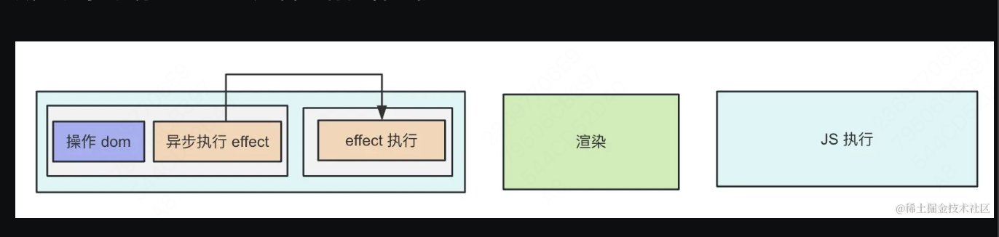
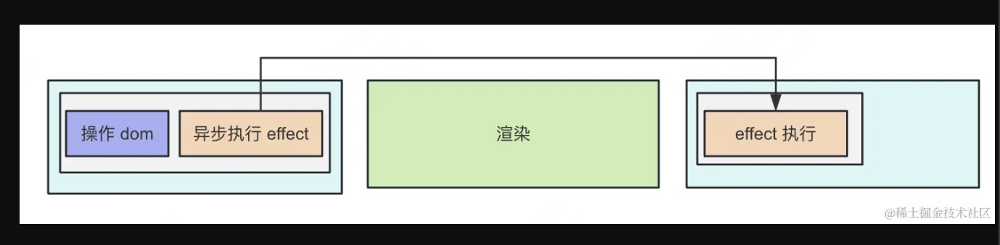

[TODO](https://juejin.cn/book/7294082310658326565?scrollMenuIndex=1)

是一本关于 react 组件的小册

## 1. 关于本小册

如何掌握好 React 呢？

我觉得就是这两方面：
一方面是 React 之上，学会写各种组件，并且能把这些组件封装成一个`组件库`、学习各种 React 相关的库。
一方面是 React 之下，能够自己调试源码，知道 React 是怎么运行的，能够实现一个`简易版 React`。

这两方面都掌握到一定程度，React 技术栈就算是通关了。

## 2. 一网打尽组件常用 Hook

- 官方文档也已经把 class 组件的语法划到了 legacy（遗产）的目录下。

- React.StrictMode 会导致额外的渲染
  在开发模式下，当组件内部使用了严格模式，`React 会故意将组件的挂载、更新和卸载操作执行两遍`。这样做的目的是为了帮助开发者发现那些可能不会在每次渲染中都表现出相同行为的副作用。如果一个副作用在两次渲染中表现不一致，那么它可能就是一个潜在的 bug 来源。
- 为什么要有 useLayoutEffect
  useEffect 的 effect 函数会在操作 dom 之后异步执行

  绝大多数情况下，用 useEffect，它能避免因为 effect 逻辑执行时间长导致页面卡顿（掉帧）。 但如果你遇到闪动的问题比较严重，那可以用 useLayoutEffect，但要注意 effect 逻辑不要执行时间太长。
  
  

  好处：浏览器会等 effect 逻辑执行完再渲染，好处自然就是不会闪动了。
  坏处：effect 逻辑要执行很久呢？就阻塞渲染了。
  useEffect 的 effect 函数是异步执行的，所以可能中间有次渲染，会闪屏，而 useLayoutEffect 则是同步执行的，所以不会闪屏，但如果计算量大可能会导致掉帧。

- 在 react 里，只要涉及到 state 的修改，就必须返回新的对象，不管是 useState 还是 useReducer
- react Context
  用 createContext 创建 context 对象，用 Provider 修改其中的值
  function 组件使用 useContext 的 hook 来取值，class 组件使用 Consumer 来取值。
- React.memo
  用 React.memo 的话，一般还会结合两个 hook：useMemo 和 useCallback。
  **React.memo 是防止 props 没变时的重新渲染，useMemo 和 useCallback 是防止 props 的不必要变化。**

  如果子组件用了 memo，那给它传递的对象、函数类的 props 就需要用 useMemo、useCallback 包裹，否则，每次 props 都会变，memo 就没用了。
  反之，如果 props 使用 useMemo、useCallback，但是子组件没有被 memo 包裹，那也没意义，因为不管 props 变没变都会重新渲染，只是做了无用功。

  **memo + useCallback、useMemo 是搭配着来的，少了任何一方，都会使优化失效。**

## 3. Hook 的闭包陷阱的成因和解决方案

    - 闭包陷阱是什么：
    - 本质原因：静态作用域
    - 原因：
    - 怎么办：

## 4. React 组件如何写 TypeScript 类型

## 5. React 组件如何调试

## 6. 受控模式 VS 非受控模式
