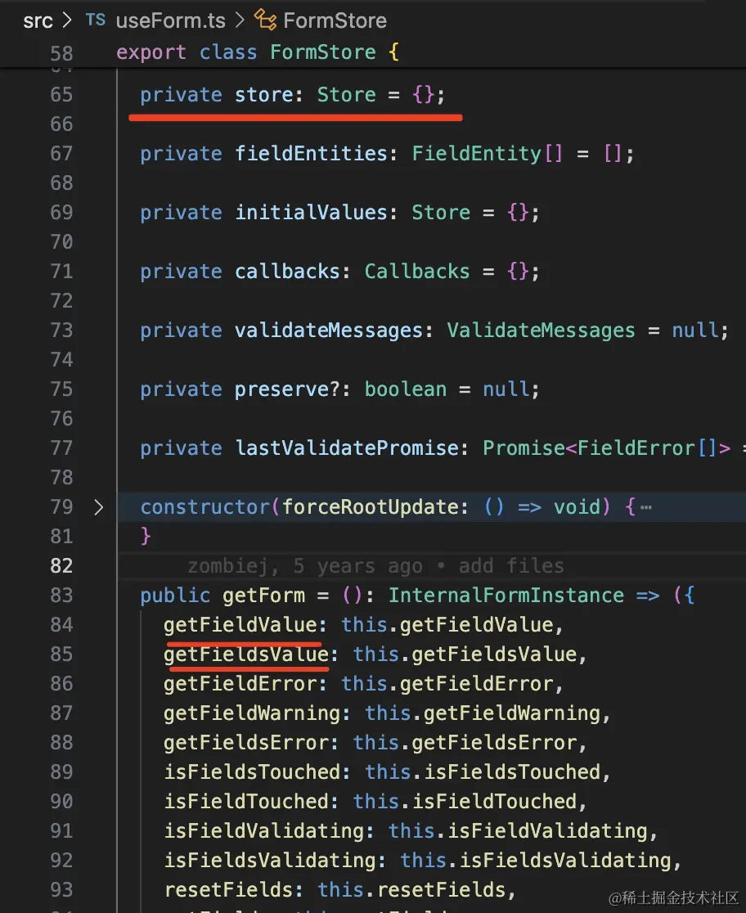

[TODO](https://juejin.cn/book/7294082310658326565?scrollMenuIndex=1)

是一本关于 react 组件的小册

**实战组件，只记录关键步骤与思路，这里不手写了，以后需要再回头看**

## 1. 关于本小册

如何掌握好 React 呢？

我觉得就是这两方面：
一方面是 React 之上，学会写各种组件，并且能把这些组件封装成一个`组件库`、学习各种 React 相关的库。
一方面是 React 之下，能够自己调试源码，知道 React 是怎么运行的，能够实现一个`简易版 React`。

这两方面都掌握到一定程度，React 技术栈就算是通关了。

## 2. 一网打尽组件常用 Hook

- 官方文档也已经把 class 组件的语法划到了 legacy（遗产）的目录下。

- React.StrictMode 会导致额外的渲染
  在开发模式下，当组件内部使用了严格模式，`React 会故意将组件的挂载、更新和卸载操作执行两遍`。这样做的目的是为了帮助开发者发现那些可能不会在每次渲染中都表现出相同行为的副作用。如果一个副作用在两次渲染中表现不一致，那么它可能就是一个潜在的 bug 来源。
- 为什么要有 useLayoutEffect
  useEffect 的 effect 函数会在操作 dom 之后异步执行

  绝大多数情况下，用 useEffect，它能避免因为 effect 逻辑执行时间长导致页面卡顿（掉帧）。 但如果你遇到闪动的问题比较严重，那可以用 useLayoutEffect，但要注意 effect 逻辑不要执行时间太长。
  
  

  好处：浏览器会等 effect 逻辑执行完再渲染，好处自然就是不会闪动了。
  坏处：effect 逻辑要执行很久呢？就阻塞渲染了。
  useEffect 的 effect 函数是异步执行的，所以可能中间有次渲染，会闪屏，而 useLayoutEffect 则是同步执行的，所以不会闪屏，但如果计算量大可能会导致掉帧。

  ```jsx
  // useLayoutEffect 内读取布局信息，同步修改 DOM
  import React, { useLayoutEffect, useRef } from 'react'

  function LayoutEffectComponent() {
    const divRef = useRef(null)

    useLayoutEffect(() => {
      // 读取布局信息
      const { height } = divRef.current.getBoundingClientRect()
      console.log('Div height:', height)

      // 同步修改 DOM（如果需要）
      divRef.current.style.backgroundColor = 'lightblue'
    }, [])

    return <div ref={divRef}>This div has a background color.</div>
  }
  ```

- 在 react 里，只要涉及到 state 的修改，就必须返回新的对象，不管是 useState 还是 useReducer
- react Context
  用 createContext 创建 context 对象，用 Provider 修改其中的值
  function 组件使用 useContext 的 hook 来取值，class 组件使用 Consumer 来取值。
- React.memo
  用 React.memo 的话，一般还会结合两个 hook：useMemo 和 useCallback。
  **React.memo 是防止 props 没变时的重新渲染，useMemo 和 useCallback 是防止 props 的不必要变化。**

  如果子组件用了 memo，那给它传递的对象、函数类的 props 就需要用 useMemo、useCallback 包裹，否则，每次 props 都会变，memo 就没用了。
  反之，如果 props 使用 useMemo、useCallback，但是子组件没有被 memo 包裹，那也没意义，因为不管 props 变没变都会重新渲染，只是做了无用功。

  **memo + useCallback、useMemo 是搭配着来的，少了任何一方，都会使优化失效。**

## 3. Hook 的闭包陷阱的成因和解决方案

- 闭包陷阱是什么：
  effect 函数等引用了 state，形成了闭包，但是并没有把 state 加到依赖数组里，导致`执行 effect 时用的 state 还是之前的`
- 本质原因：静态作用域
- 怎么办：

  1. 使用 `setState` 的函数的形式，从参数拿到上次的 state，这样就不会形成闭包了，或者用 useReducer，直接 dispatch action，而不是直接操作 state，这样也不会形成闭包
  2. 把`用到的 state 加到依赖数组里`，这样 state 变了就会重新跑 effect 函数，`引用新的 state`
  3. 使用 useRef 保存每次渲染的值，用到的时候从 `ref.current 取`

---

定时器的场景需要保证定时器只跑一次，不然重新跑会导致定时不准，所以需要用 useEffect + useRef 的方式来解决闭包陷阱问题。
我们还封装了 useInterval 的自定义 hook，这样可以不用在每个组件里都写一样的 useRef + useEffect 了，直接用这个自定义 hook 就行。
此外，关于要不要在渲染函数里直接修改 ref.current，其实都可以，直接改也行，包一层 useLayoutEffect 或者 useEffect 也行。

## 4. React 组件如何写 TypeScript 类型

- ReactNode > ReactElement > JSX.Element
- HTMLAttributes：组件可以传入 html 标签的属性，也可以指定具体的 ButtonHTMLAttributes、AnchorHTMLAttributes。

## 5. React 组件如何调试

## 6. 受控模式 VS 非受控模式

value 由用户控制就是非受控模式，由代码控制就是受控模式。
根本区别：**状态维护在组件内部还是组件外部。**

- 什么情况用受控模式
  需要对输入的值做处理之后设置到表单的时候，或者是你想实时同步状态值到父组件(比如把用户输入改为大写)
  

- 非受控组件的 props 范式
  `defaultValue + onChange`
  这种情况，调用者只能设置 defaultValue 初始值，onChange 通知外部，组件内部的 state 值发生了变化。

  ```jsx
  function Test() {
    return (
      <Calendar
        defaultValue={new Date()}
        onChange={newDate => {
          alert(newDate.toLocaleDateString())
        }}
      ></Calendar>
    )
  }
  ```

- 受控组件的 props 范式
  `value + onChange`
  这种情况，调用者维护 value，onChange 通知外部需要改变 value。

  ```jsx
  function Test() {
    const [date, setDate] = useState(new Date())

    return (
      <Calendar
        value={date}
        onChange={newDate => {
          setDate(newDate)
          alert(newDate.toLocaleDateString())
        }}
      ></Calendar>
    )
  }
  ```

一般的组件库，都会提供受控和非受控两种模式，比如 antd 的 Input 组件，就有 value 和 defaultValue 两个属性。
参数同时支持 value 和 defaultValue，`通过判断 value 是不是 undefined 来区分受控模式和非受控模式。`

- **抹平受控和非受控的差异的 hook：**
  参见 ahooks 的 `useControllableValue` hook
  [useControllableValue](https://github.com/alibaba/hooks/blob/master/packages/hooks/src/useControllableValue/index.ts)
  用的时候就不用区分受控非受控了，直接 setState 就行

总结：
非受控模式就是完全用户自己修改 value，我们只是`设置个 defaultValue，可以通过 onChange 或者 ref 拿到表单值。`
受控模式是代码来控制 value，用户输入之后通过 `onChange 拿到值然后 setValue，触发重新渲染。`
单独用的组件，绝大多数情况下，用非受控模式就好了，因为你只是想获取到用户的输入。
如果需要结合 Form 表单用，那是要支持受控模式，因为 Form 会通过 Store 来统一管理所有表单项。
封装业务组件的话，用非受控模式或者受控都行。
有的团队就要求组件一定是受控的，然后在父组件里维护状态并同步到状态管理库，这样组件重新渲染也不会丢失数据。

# 7. 组件实战：迷你 Calendar

我选择 gpt o1

# 8. 组件实战：Calendar 日历组件(上)

- 不再用 Date 获取当前月、上个月、下个月的天数和星期几，而是用 dayjs 的 api
- style 和 className 用于修改 Calendar 组件外层容器的样式。
  内部的布局我们都是用的 flex，所以只要外层容器的样式变了，内部的布局会自动适应。
- 把 `6 * 7` 个日期，按照 6 行，每行 7 个来组织成 jsx。
- dateRender 和 dateInnerConent 是用于修改日期单元格的内容的，比如显示节日、日程安排等
  dateRender 是渲染整个日期单元格的，dateInnerContent 是渲染日期单元格里的文本内容的。

# 9. 组件实战：Calendar 日历组件(下)

# 10. 快速掌握 Storybook

用 Storybook 写 MDX 文档。
mdx 是 markdown + jsx 的混合语法，用来写文档很不错。
用 storybook 可以轻松的创建组件文档，可以写多个 story，直观的看到组件不同场景下的渲染结果，还可以用来做测试。
如果想给你的组件加上文档，storybook 基本是最好的选择。

# 11 React 组件如何写单测？

# 12 深入理解 Suspense 和 ErrorBoundary

Suspense 都是结合 React.lazy 异步加载组件的时候用，其实它也可以独立用。
它的底层原理就是 `throw 一个 promise，然后 React 会捕获这个 promise，交给最近的 Suspense 组件来处理。`
类似的，ErrorBoundary 也是这种处理方式，只不过捕获的是 throw 的 error。

- 自己写 throw promise 来触发 Suspense 还是很麻烦的，一般我们都不用这个，而是自己写个 loading 的 state 来标识。

# 13 组件实战：Icon 图标组件

# 14 组件实战：Space 间距组件

# 15 React.Children 和它的两种替代方案

# 16 三个简单组件的封装

# 17 浏览器的 5 种 Observer

# 18 组件实战：Watermark 防删除水印组件

# 19 手写 react-lazyload

# 20 图解网页的各种距离

# 21 自定义 hook 练习

# 22 自定义 hook 练习(二)

# 23 react-spring 做弹簧动画

# 24 react-spring 结合 use-gesture 手势库实现交互动画

# 25 react-transition-group 和 react-spring 做过渡动画

# 26 快速掌握 tailwindcss

# 27 用 CSS Modules 避免样式冲突

# 28 CSS in JS: 快速掌握 styled-components

- 用 styled.div、styled() 可以创建样式组件
- 写样式的时候，通过 & 代表当前样式组件的实例，`当样式和全局样式冲突的时候，还可以 && 提高优先级。`
- pros and cons
  优点：没有样式冲突，用 js 写样式逻辑
  缺点：一大堆样式组件和普通组件混在一起，React DevTools 里会有很多层的样式组件

# 29 react-spring 实现滑入滑出的转场动画

react-spring 实现了滑入滑出的转场动画（或者叫过渡动画）。

# 30 组件实战：Message 全局提示组件

核心就是一个列表元素的增删改，然后用 react-transition-group 加上过渡动画。
这个列表可以通过 `createPortal 渲染到 body 下。`
难点在于如何在 api 的方式来动态添加这个组件。
**我们是通过 forwardRef + context 转发来实现的：**

# 31 组件实战：Popover 气泡卡片组件
