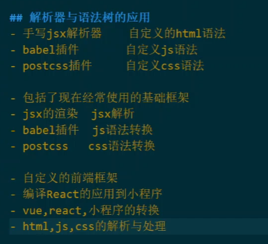
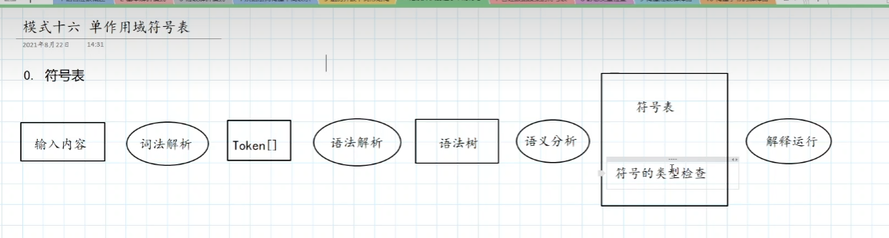

# 解析起步

## 基本解析器模式

1. LL(1)递归下降词法解析：
2. LL(1)递归下降语法解析:
   1个lookahead符号
   连续、选择、重复
3. `LL(K)递归下降语法解析：`
   K个lookahead符号
   为什么需要看K个符号？ 因为有些文法，需要看多个符号才能确定如何解析

   接口，LA(i)、LT(i)；实现：环形缓冲区

## 高级解析器模式

4. 回溯解析器
   为什么需要：LL(K)解析器，需要看K个符号，但是有些文法，需要看更多的符号才能确定如何解析

   思路：用一个marker栈保存当前游标的位置，如果解析失败，回溯到marker栈的位置，重新解析

   - 缓冲区可扩容
   - mark、release

5. `记忆解析器`
   为什么需要：回溯解析器，效率低，因为重复解析了很多次

   思路：用一个缓存，保存解析的结果，如果解析失败，直接返回缓存的结果

   - 缓存的key：开始游标
   - 缓存的value：失败=>-1；成功=>结束游标

# 分析语言

## 从语法树构建中间表示(AST的构建方式)

6. 解析树
   - AbstractNode
   - RuleNode
   - TokenNode
7. 同型AST
   语法树全部用ASTNode表示，ASTNode包含token和children

   ```ts
   interface ASTNode {
     token: Token
     children: ASTNode[]
   }
   ```

   三种形式：
   前缀形式：`(+ 1 2)`, 语法树描述友好
   中缀形式：`1 + 2`, 对人阅读友好
   后缀形式：`1 2 +`, 对机器运算友好

8. `规范化异型AST`
   基类AST+子类具体实现

9. `不规则异型AST`
   不规则: hetero
   子节点的记录方式是不规则的

## 遍历并改写树形结构(从AST中抽取信息)

10. 内嵌遍历器(不推荐)
    遍历方法写死在ASTNode中，一般用于异型树的节点类。
11. `外部访问者`(访问者模式)
    tranverse方法写在Visitor类中，ASTNode中有accept方法，接受Visitor的访问。
12. 树文法
    自动生成语法树访问器

    安装antlr-ts

    ```sh
    npm install antlr4ts antlr4ts-cli
    ```

    https://github.com/codediy/LanguageImplementPatternCodes/tree/master/walking/tree-grammar

    语法树应用：

    

    - jsxParser 自定义html语法
    - babelPlugin 自定义js语法
    - postcssPlugin 自定义css语法

## 记录并识别程序中的符号



13. 单作用域符号表(全局)
    所有的符号都在用一个作用域中

    - 符号表：符号名=>符号对象
    - 符号对象：符号名、类型、值

14. 嵌套作用域符号表(局部)
    作用域不止一个，还可以嵌套

## 管理数据聚集的符号表

## 静态类型检查

# 解释执行

# 翻译和生成语言
