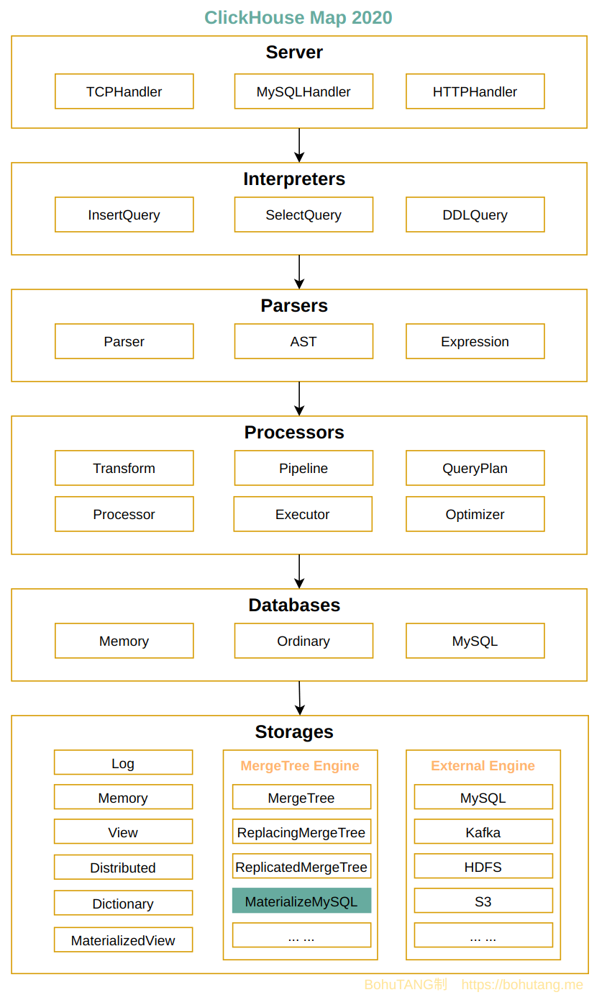
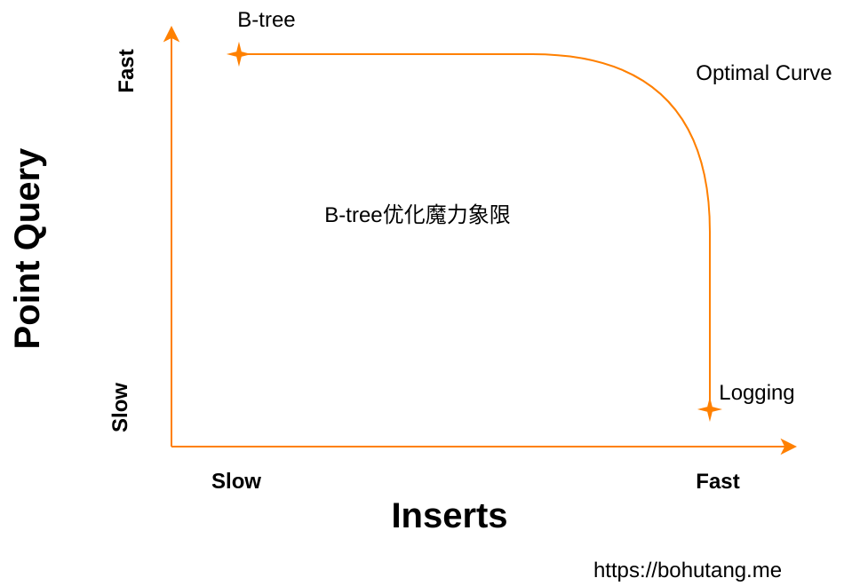
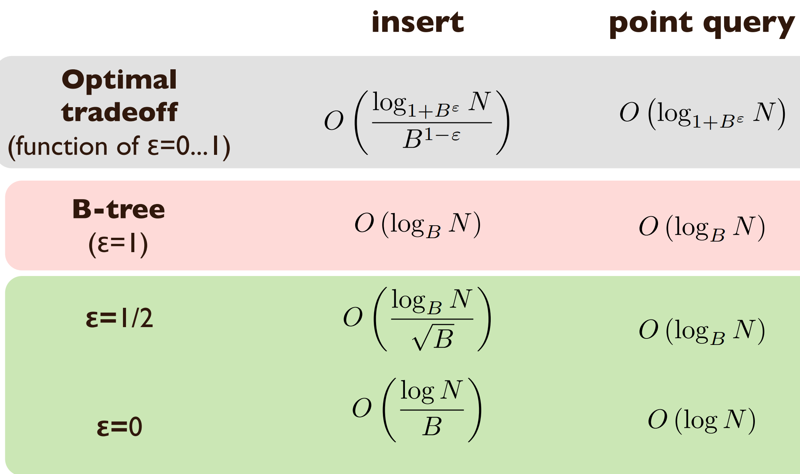

https://bohutang.me/2020/06/05/clickhouse-and-friends-development/

## ClickHouse和他的朋友们（1）编译、开发、测试

ClickHouse的设计哲学:

1. The product must solve actual problem
2. And do it better than others

对用户来说，他们关心的不是什么天花乱坠、上天入地的高科技，只是需要一个能很好解决自己问题的方案，这在开源社区是非常难得的，靠实力“野蛮式”生长。

## ClickHouse和他的朋友们（2）MySQL Protocol和Read调用栈

## ClickHouse和他的朋友们（3）MySQL Protocol和Write调用栈

## ClickHouse和他的朋友们（4）Pipeline处理器和调度器

ClickHouse 核心科技：处理器 Processor 和有向无环调度器 DAG Scheduler

如果 transformer1 和 transformer2 没有交集，那么它们就可以并行处理

## ClickHouse和他的朋友们（5）存储引擎技术进化与MergeTree

B-tree优化魔力象限

目前最先进的 Fractal-tree (TokuDB)

## ClickHouse和他的朋友们（6）MergeTree存储结构

## ClickHouse和他的朋友们（８）纯手工打造的SQL解析器

## ClickHouse和他的朋友们（9）MySQL实时复制与实现

ClickHouse 可以挂载为 MySQL 的一个从库 ，先全量再增量的实时同步 MySQL 数据，这个功能可以说是今年最亮眼、最刚需的功能，基于它我们可以轻松的打造一套企业级解决方案，让 OLTP 和 OLAP 的融合从此不再头疼

## ClickHouse和他的朋友们（10）MergeTree Write-Ahead Log

## ClickHouse和他的朋友们（11）MySQL实时复制之GTID模式

## ClickHouse和他的朋友们（12）神奇的物化视图(Materialized View)与原理

物化视图是一种数据库对象，它存储了基于一个或多个基础表的查询结果。与普通视图不同，物化视图在创建时会实际计算并存储查询结果，从而在查询时无需重新计算，直接读取存储的结果，提高查询效率。

| 特性     | 普通视图 (View)            | 物化视图 (Materialized View) |
| -------- | -------------------------- | ---------------------------- |
| 存储方式 | 不存储数据，仅存储查询定义 | 存储查询结果数据             |
| 查询性能 | 需实时计算                 | 直接读取预计算结果           |
| 更新机制 | 每次查询时动态计算         | 基础表更新时自动维护更新     |
| 使用场景 | 简化复杂查询、数据抽象     | 提升查询性能、预计算聚合数据 |

## ClickHouse和他的朋友们（14）存储计算分离方案与实现

## ClickHouse和他的朋友们（15）Group By 为什么这么快
