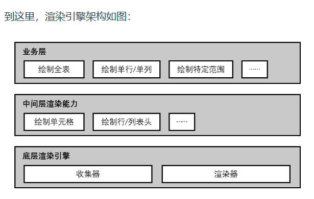

## 收集与渲染

Canvas 渲染过程拆分为收集和渲染两部分
基础图形的收集和绘制，包括文本、线段、矩形、图像等

### 渲染数据的收集

对于表格这样的产品来说，存储的往往是以单元格为基本单位的数据，如每个单元格的内容（可能是复杂的富文本、图片、图标结合）、样式（边框、背景色）、行列的宽高等。而在实际上页面渲染的时候，我们可能会根据行列宽高、每个单元格的边框线设置来绘制格子的布局。
使用一个收集器，通过给数据添加渲染类型，来将不同类型的数据放在一起，方便统一管理。在渲染的时候，则先根据绘制类型和堆叠顺序进行排序，再进行绘制。

### 渲染数据享元

`getReusedElement` 自定义key

## 分层架构

架构就是为了不断变化的业务服务的，因此架构设计的时候，保留符合业务发展需要的拓展能力也是十分必要的。

## 多渲染方式适配

渲染器的多种渲染方式的适配，其中常见的就包括：

Canvas 渲染
SVG 渲染
DOM 渲染
其他渲染方式（如 WEBGL 渲染等）

---

考虑到性能问题 ECharts 提供了 Canvas/SVG 两种绘制方式；又比如考虑到首屏直出的效率，各个在线表格的团队分别适配了更合适的渲染方式。

---

在图表渲染引擎中，最常见的是 Canvas 渲染和 SVG 渲染，我们也可以从 ECharts 官网中找到两者的对比描述：

一般来说，Canvas 更适合绘制图形元素数量较多（这一般是由数据量大导致）的图表（如热力图、地理坐标系或平行坐标系上的大规模线图或散点图等），也利于实现某些视觉特效。
但在不少场景中，SVG 具有重要的优势：它的内存占用更低（这对移动端尤其重要）、并且用户使用浏览器内置的缩放功能时不会模糊。
选择哪种渲染器，可以根据软硬件环境、数据量、功能需求综合考虑：

---

谷歌表格使用了 Canvas/DOM 两种渲染方式，其中 DOM 渲染主要用于首屏直出
金山表格使用了 Canvas/SVG 两种渲染方式，其中 SVG 渲染主要用于首屏直出
飞书表格使用了 Canvas 渲染

---
