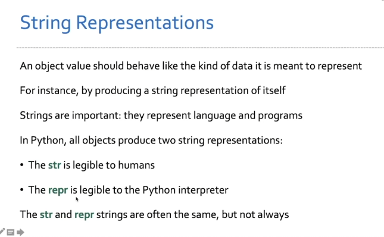

# type

- type dispatching: 根据对象的类型来调用不同的方法
- type coercion: 将一个对象转换为另一个对象

# `str` 和 `repr` 的区别


在 Python 中，`str` 和 `repr` 是两个用于对象字符串表示的方法。它们虽然都用于生成对象的字符串表示，但目的和使用场景有所不同。

## `str` 方法

### 定义

- **`str`** 方法用于生成用户友好的可读字符串表示，主要用于展示给最终用户。

### 目的

- 提供一个简洁且易于理解的字符串表示，侧重于可读性。

### 使用场景

- 当使用 `print()` 函数输出对象时，默认调用的是 `str` 方法。
- 适用于需要人类阅读的场景，如日志记录、用户界面显示等。

### 示例

```python
class Person:
    def __init__(self, name, age):
        self.name = name
        self.age = age

    def __str__(self):
        return f'Person(Name: {self.name}, Age: {self.age})'

person = Person("Alice", 30)
print(person)  # 输出: Person(Name: Alice, Age: 30)
```

````

## `repr` 方法

### 定义

- **`repr`** 方法用于生成对象的官方字符串表示，主要用于开发和调试。

### 目的

- 提供一个准确且无歧义的字符串表示，通常包含足够的信息以重新创建该对象。

### 使用场景

- 当在交互式解释器中直接输入对象名时，显示的是 `repr` 方法的返回值。
- 适用于开发者查看对象的内部状态和调试程序。

### 示例

```python
class Person:
    def __init__(self, name, age):
        self.name = name
        self.age = age

    def __repr__(self):
        return f'Person(name={self.name!r}, age={self.age!r})'

person = Person("Alice", 30)
repr(person)  # 输出: Person(name='Alice', age=30)
```

## `str` 和 `repr` 的关系

- **默认情况下**，如果一个类没有定义 `__str__` 方法，那么 `str` 会默认调用 `repr` 方法。
- 一个好的实践是确保 `repr` 方法返回的字符串能够准确反映对象的状态，并且在可能的情况下，可以用它来重新创建对象。

### 示例

```python
class Person:
    def __init__(self, name, age):
        self.name = name
        self.age = age

    def __repr__(self):
        return f'Person("{self.name}", {self.age})'

person = Person("Alice", 30)
print(repr(person))  # 输出: Person("Alice", 30)
print(str(person))   # 输出: Person("Alice", 30) （因为没有定义 __str__ 方法）
```

## 总结

- **`str`**：

  - 用于生成用户友好的字符串表示。
  - 适用于显示给最终`用户`的场景。
  - 通过 `__str__` 方法定义。

- **`repr`**：
  - 用于生成准确且无歧义的字符串表示。
  - 适用于`开发和调试`的场景。
  - 通过 `__repr__` 方法定义。
````
