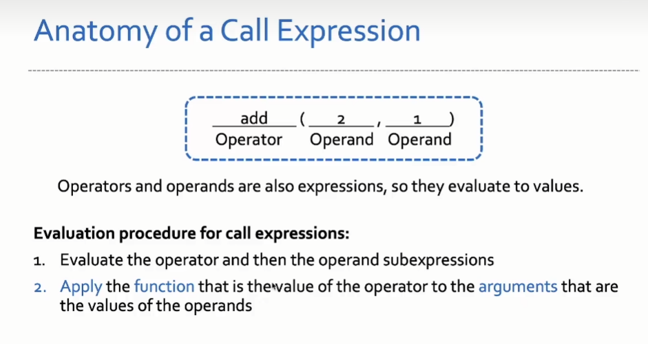
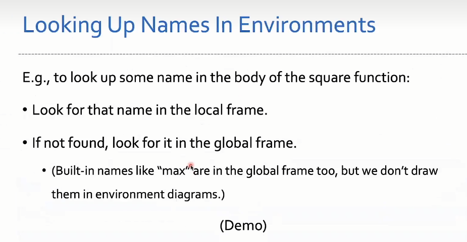

1. 表达式
   evaluates to a value
2. Anatomy of a Call Expression

   - operator
   - operand
     
   - argument

3. 定义函数
   - create a func with signature <name>(<parameters>)
   - set the body of the function
   - bind <name> to that function in the current frame
4. 调用函数

   - Add a local `frame`, forming a new environment
     `An environment is a sequence of frames`
   - `Bind` the function's parameters to the arguments in that frame
   - `Execute` the body of the function in that new environment

5. 变量查找(Looking Up Names In Environment)
   Frame 链, local -> enclosing -> global -> built-in
   
