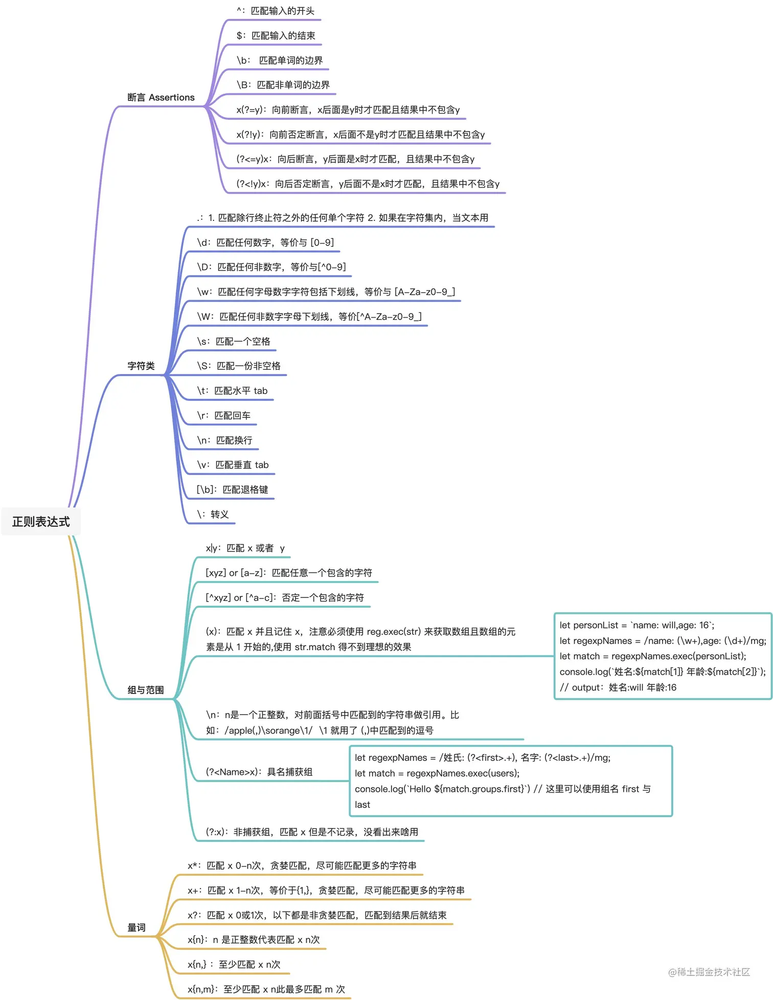

# [辰暮](https://juejin.cn/user/3087084378665367/posts)

## 《重构-改善既有代码的设计》

## 《代码整洁之道-Clean Code》

一个人再怎么强大也不可能管理一个城市的所有细节，只有将城市划分成更细的模块并且每个模块都有自己的关注点(街道、商圈等)才能将城市管理的很好，软件架构也是一样，大型软件架构必须实现关注点分离

- 将系统的构造与使用分离开（好处：1. 实现关注点分离，2. 方便 TDD）
  - 工厂：通过抽象工厂等设计模式将构造过程封装起来
  - 依赖注入：通过依赖注入或控制反转将构造与使用分类开

## 保持架构整洁-读《架构整洁之道》

- 名词解释
  设计(Design)：一般用于低层次的讨论中，表示系统底层的组织结构与`实现细节`
  架构(Architecture)：一般用于高层次的讨论中，`形而上地看待系统`
- 与业务方去 PK 保护架构价值是工程师的职责
- 任何一个软件的模块都应该有且只有一个`被修改的原因`
- 打破循环依赖的集中方式：1. 依赖反转 DIP 2. 创建一个新的组件将循环依赖的地方放到新组件中，原有组件共同依赖新组件
- **一个组件的抽象化程度应该与其稳定性保持一致**
- **软件架构的终极目标：**最大化程序员的生产力，同时最小化系统的总运营成本。即：全局最优解
  要坚定地在一线写代码，架构师应该是解决问题最强的那个人而不是高高在上指点江山的人(不贴合业务也设计不出啥好架构)
- **不管是组织架构还是软件架构都要清晰地定义边界**：可扩展性和可用性失败的共同原因就是责任不清，无人负责意味着地段真空，多人负责意味着会增加情感型冲突
  项目一开始就应该交给一个人或者一个团队，同时听取另一个团队的建议

## 我眼中的“软件工程”

https://juejin.cn/post/7243520456980185125

> 如果你面临一个复杂的问题没有头绪，那就提高一个次元去解决 —— 广中平佑

软件工程的核心是高质量(高迭代速度、高稳定性)地解决复杂的领域问题，任何技术细节(包括但不限于框架、语言、架构)都是为了达成这个目标的手段而已。 `因此不要过分陷入具体的技术细节无法自拔，提高一个次元就能探索到底层逻辑。`
软件的本质是通过代码描述真实世界的运行，软件工程的本质问题是解决业务逻辑的复杂性。
软件的本质性：把真实世界的运行机制抽象到计算机维度的建模过程
软件的附属性：将模型通过编码等方式部署到计算机上

## 总结一下正则表达式

https://tool.oschina.net/uploads/apidocs/jquery/regexp.html
