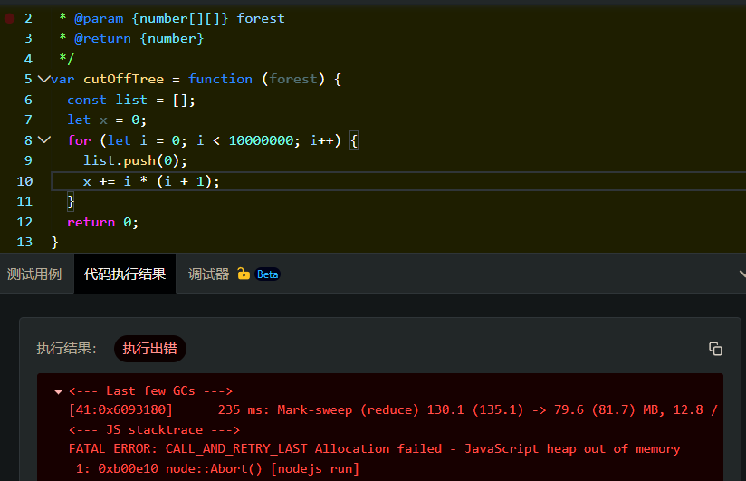
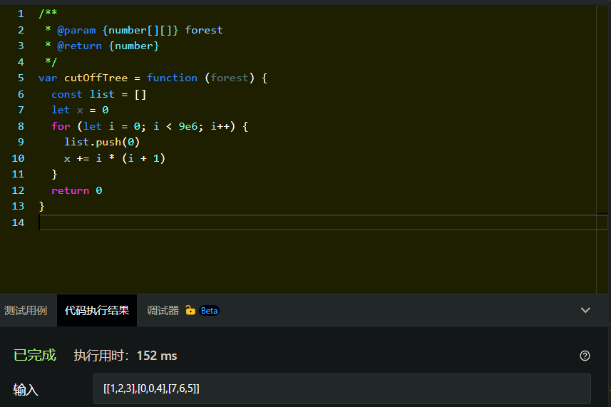
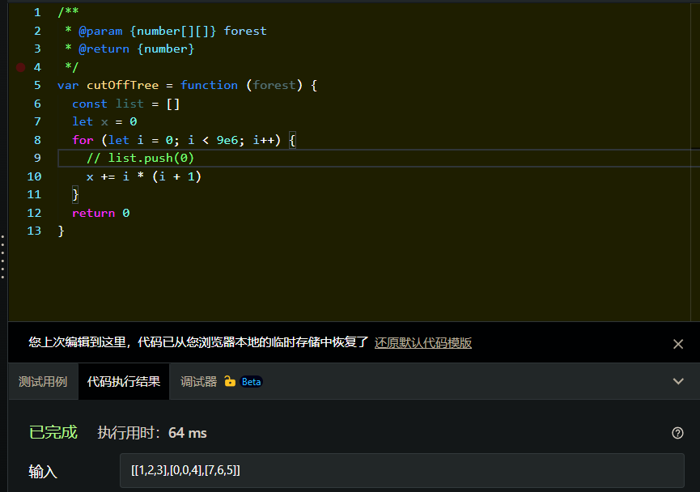
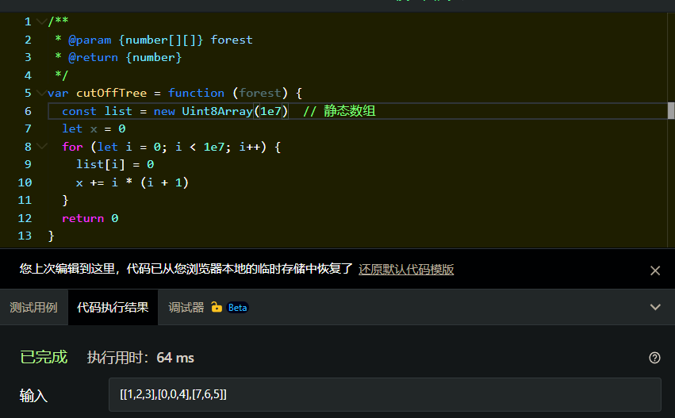
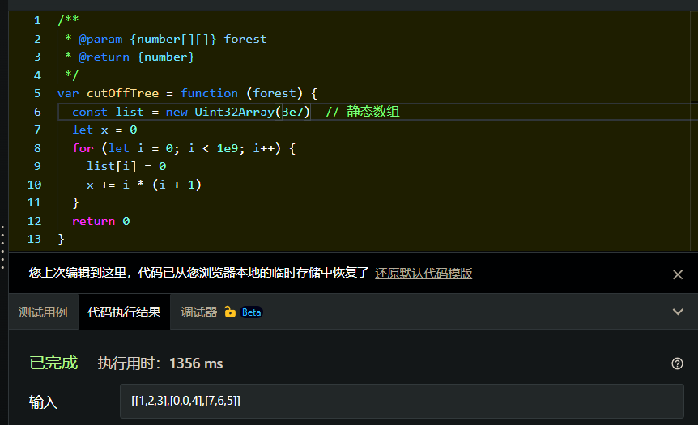
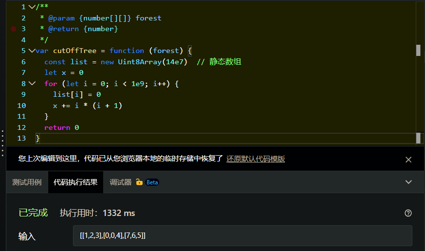

`print(3.5 * int(1e7) * 32/8 // int(1e6))` => **140MB**


```JS
/**
 * @param {number[][]} forest
 * @return {number}
 */
var cutOffTree = function (forest) {
  const list = new Uint8Array(3.5e7)  // 静态数组
  let x = 0
  for (let i = 0; i < 1e9; i++) {
    list[i] = 0
    x += i * (i + 1)
  }
  return 0
}
```

**可以看到 动态数组耗费的空间是 Uint32Array 的 4 倍左右**
