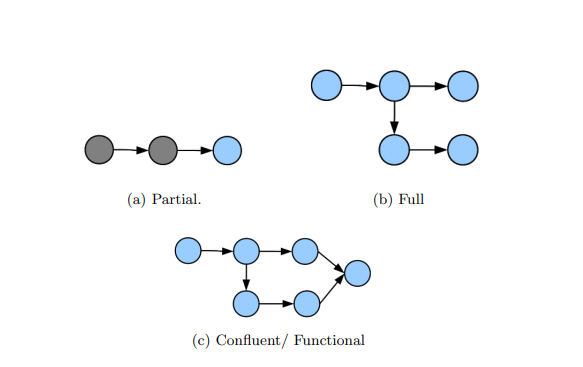
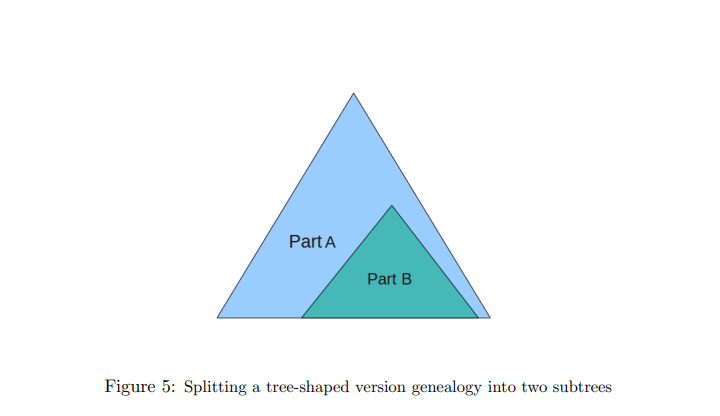

下面是一份对 _MIT 6.851: Advanced Data Structures (Spring 2012) Lecture 01_ 的详细总结与讲解。原文主要讨论了**持久化（Persistent）数据结构**的概念和几种不同级别的持久化模型，包括部分持久化（Partial Persistence）、完全持久化（Full Persistence）以及汇合持久化（Confluent Persistence）和函数式持久化（Functional Persistence）。同时也展示了在指针机（pointer machine）模型下如何把普通（短暂/ephemeral）数据结构改造成持久化数据结构，以及相应的时间、空间开销分析。

---

## 1. 背景和概述

在传统的数据结构中，每当进行一次更新操作（如插入、删除、修改）时，结构会“变异”（in-place changes），从而丢失了之前版本的状态信息。如果我们希望在进行新版本更新的同时，保留旧版本并随时能够查询，就需要**持久化**（persistence）技术。持久化数据结构能够在不同“版本（version）”间保留查询能力。

**动机：**

- 版本控制：例如想要回溯某一历史状态，或者进行时间旅行般的操作。
- 算法需求：有些算法需要在多个版本的结构中进行交叉查询或者合并。

**分类：**

- **时间性（temporal）**数据结构通常分为两类：
  1. **持久化数据结构（Persistent）**：保留各个更新版本，之后的查询可作用于任意之前的版本。
  2. **回溯数据结构（Retroactive）**：可在历史时刻“插入”或“删除”过去的操作，从而影响当前或后续状态。在下一讲（Lecture 02）会讨论。

**在持久化数据结构中**，根据允许的更新方式和合并操作，又能细分为：

1. **部分持久化（Partial Persistence）**
2. **完全持久化（Full Persistence）**
3. **汇合（合流）持久化（Confluent Persistence）**
4. **函数式持久化（Functional Persistence）**

---

## 2. 模型与定义

### 2.1 指针机（Pointer Machine）模型

在指针机模型中，我们把数据结构视为由若干“节点（node）”组成，每个节点包含若干个**固定数量**的字段（field）。字段可以存放：

- 真实的数据值（如整数），或
- 指向其它节点的指针。

可以进行的操作包括：

1. `x = new Node()`：分配一个新节点
2. `x = y.field`：读取某节点字段
3. `x.field = y`：写入某字段
4. `x = y + z`：一些常规的数据运算
5. `destroy(x)`：销毁节点（前提是没有其它指针再指向它）

我们常见的链表、二叉搜索树等都可以在指针机模型下用有限字段来表示。但像大小可变的数组则不直接属于此模型。

**一个重要限制**：节点的**入度**（in-degree）通常要保持在 \(O(1)\) 范围内，即被多少个节点引用是常数级的。

### 2.2 持久化的不同定义

1. **部分持久化（Partial Persistence）**

   - 只允许在最新版本上做更新操作，但允许对**任意旧版本**执行查询。
   - 操作形式：
     - `read(var, version)`：在指定版本 `version` 中读取 `var`
     - `newVersion = write(var, val)`：只能在当前最新版本上写，然后产生一个新版本（新版本的索引会自增或线性增长）
   - 版本结构呈线性扩展，如一条时间线。

2. **完全持久化（Full Persistence）**

   - 允许对**任何版本**进行更新，并生成新的版本。
   - 操作形式：
     - `read(var, version)`
     - `newVersion = write(var, version, val)`：指定“在旧版本 `version` 上写”，生成新版本。
   - 版本结构不再是简单的线性，而是会形成一棵“向外分叉”的版本树（版本可以有多个子分支）。

3. **汇合持久化（Confluent Persistence）**

   - 在完全持久化的基础上，**还允许**把多个版本合并生成一个新版本。
   - 操作形式：
     - `read(var, version)`
     - `newVersion = write(var, version, val)`
     - `newVersion = combine(var, val, version1, version2)`：将多个版本的数据进行某种合并，产生新版本。
   - 版本图不止是树，而是一个有向无环图（DAG），因为不同分支可以汇合到一个新版本上。

4. **函数式持久化（Functional Persistence）**
   - 来源于函数式编程思想，所有结构**不可变**（immutable），每次“修改”都会新生成节点而绝不在原节点上改动。
   - 也可以理解为我们只能通过“创建新节点”来表达更新。
   - 从实现上说，函数式持久化一定也是汇合持久化，因为任何两个版本要合并时，都能直接引用各自对应的不可变子结构，然后合并生成新结构。

上述四种模型的关系是：**函数式 \(\implies\) 汇合 \(\implies\) 完全 \(\implies\) 部分**。也就是说，函数式是最强的约束（也是最强能力），而部分持久化是约束最弱的。

---

## 3. 部分持久化

**问题**：我们能否在指针机模型下，把一个原本的、只支持“原地修改”（ephemeral）的数据结构，改造成部分持久化的数据结构，并且保证时间、空间额外开销尽量低？

**答案**：可以。Driscoll、Sarnak、Sleator、Tarjan 在 [6] 里给出了著名结果，表明可以在**入度有限（\(O(1)\)）**的指针机模型下，实现**摊还 \(O(1)\)** 的更新和查询。

### 3.1 基本思路：增设“修改记录（modification log, mods）”

- 在每个节点中，除了原始的“数据字段”和“指针字段”外，再添加一个“修改记录”区（mods），用来记录该节点在不同版本下字段的变动。
- 当节点的修改记录“写满”时，就会“复制/分裂（copy/split）”该节点，从而避免过度堆积在一个节点。
- 同时，为了让旧版本依然可读，一旦节点被复制成新的节点，所有指向旧节点的指针，也需要在逻辑上保持对旧版本和新版本的区分。

  
_示意图：左边是原本的链表/树结构，右边是部分持久化后，每个节点额外有一个 mod 日志，用于记录“在不同版本的修改”_

具体而言，每个节点包含：

1. 读区（read-only area）：存储最新的字段值（或初始化时的字段值）。
2. 回指区（back pointers）：记录谁在指向自己，用于分裂时能通知“父节点”更新指针。这在入度有限时可以 \(O(1)\) 完成。
3. 修改区（mods）：每条修改记录形如 `(field, version, newValue)`。

#### 操作流程

- **查询（read(var, version））**

  1. 找到对应节点后，到该节点的修改区中二分/顺序找“版本号不超过 `version` 的最新修改”记录，得到该字段在此版本的值。若找不到对应修改，就用读区里的默认值。
  2. 由于每个节点的修改区大小是常数，查询只需 \(O(1)\) 时间（或最坏也只需 \(O(\log(1))\) 就是常数）。

- **更新（write(var, val)）**
  1. 若当前节点的 mods 区还没满，则在其中追加 `(field, newVersion, val)` 即可，摊还时间 \(O(1)\)。
  2. 若已满，就**创建一个新节点**，把旧节点最新状态复制过去，然后让新节点承接后续的修改。
     - 复制时，需要更新所有指向旧节点的指针，让它们指向新节点或旧节点，以保证在版本语义上正确区分。
     - 由于每个节点的入度是常数，我们在最坏情况下也只需要常数次的递归复制操作。
  3. 生成一个新版本。

#### 复杂度分析

- **空间开销**：因为每个节点的 mod 区大小是常数，并且每次真正分裂节点也只额外分配常数大小的新节点，所以整体空间是**与更新次数同阶**的。
- **时间开销**：采用摊还分析（amortized analysis），可以证明**更新摊还时间为 \(O(1)\)**。
  - 直观理解：某个节点一旦被分裂，就会清空其修改区，从而“释放潜在成本”，因此大量“更新”被分摊掉。

---

## 4. 完全持久化

相比部分持久化，**完全持久化**允许我们在**任何版本**进行修改，而不只是“最新版本”。这样就出现了**版本树**分叉的问题。

### 4.1 版本树表示

版本之间的关系不再是线性，而是**树状分叉**。要快速判断某个版本 `v` 是否是另一个版本 `w` 的祖先，需要在版本间进行祖先关系的快速查询。文中介绍了一种**将版本树“线性展开”**的技巧，通过一个**order-maintenance**数据结构来维持括号序列，从而在 \(O(1)\) 时间内做以下操作：

1. “插入”新版本对应的“起始括号”和“结束括号”
2. 判断两个版本的前后（“谁在谁之前”），以及祖先-后代关系。

在实现时，会为每个新版本在括号序列中插入 `(v` 和 `)v`，使其恰好嵌套在父版本对应的括号内部。这样我们只要比较括号序列的顺序，就能判断版本间的包含（祖先）关系。

### 4.2 数据结构的改造

与部分持久化类似，每个节点也有“读区 + 回指区 + 修改区”。但由于现在任何版本都可能被更新，我们必须在**所有版本**中保留这个多版本可查询的结构。处理方式依然是当修改区写满时就进行复制/分裂，并且更新相关指针。

**写操作**（`write(n.field, value, version)`）类似：

1. 在节点 `n` 的 mods 中查找“和 `version` 相关的最新记录”。若修改区有空闲，就记录新值；否则，分裂节点成 `n`（旧）和 `n'`（新），把部分修改记录迁移到 `n'`，并递归地更新相关指针。
   

2. 在版本树中插入一个新版本（括号序列里插入对应位置）。

### 4.3 复杂度

- **查询**：依然是 \(O(1)\) 摊还。我们用 order-maintenance 结构快速判断应该用哪条 mod 记录。
- **更新**：采用摊还分析，能够得到每次更新为 \(O(1)\) 摊还时间。空间开销同样与更新次数同阶。

**未解决的问题**：如何把完全持久化做**去摊还（de-amortized）**处理，使每次更新在最坏情况下也能是 \(O(1)\)？该问题尚未得出完美的通用解法。

---

## 5. 汇合（合流）持久化

在完全持久化的基础上，允许把多个版本“合并”生成一个新版本；这样一来，版本之间不仅有树状分叉，还有**汇合**操作，从而形成一个DAG结构。对应的版本结构可能高度复杂。

- 例如字符串“拼接”操作：把一个字符串和自己合并，反复执行，导致存在指数级别数量的不同路径。

**核心挑战**：

1. **版本图是一般DAG**，祖先关系判定比树更复杂。
2. 版本共享某些子结构带来的操作开销，会因为可能存在大量可达路径而变得难以管理。

在 [9]（Fiat & Kaplan）的结果中，给出了对“汇合深度” \( e(v) \) 的分析：

- \( e(v) = 1 + \log(\text{从根到 } v \text{的路径总数}) \)
- 若一个版本可由指数级路径指向，那么操作成本下限也会随之增加。

他们给出的通用转换在最坏情况下要 \( O(\log n + \max_v e(v)) \) 的开销。并且也有相应的 \(\Omega(e(v))\) 的下界。

### 特殊情形：Disjoint 操作

当合并的版本彼此**不共享**任何实际节点（数据）时，可以用更优化的数据结构。Collette 等 [11] 给出了在“分支间数据不重叠”前提下可做到 \( O(\log n) \) 的更新和查询。

---

## 6. 函数式（Functional）持久化

函数式持久化的数据结构在实现上**不允许原地修改**，每次更新都“新建节点”并保持旧结构完好不变。这在函数式编程语言（Haskell、OCaml等）中非常常见。

### 6.1 常见示例

1. **函数式平衡BST**：

   - 对 BST 的插入/删除操作，会沿访问路径“复制”经过的节点，并在新节点指针上指向原有不变的子树或新子树。
   - 若树高为 \( O(\log n) \)，一次更新的节点复制量也为 \( O(\log n) \)，因此更新开销 \( O(\log n) \)。

2. **函数式Deque（双端队列）**：

   - Kaplan 等人在 [8] 中给出了一种可常数时间拼接、常数时间更新的纯函数式双端队列实现（带有 catenation 操作）。
   - Brodal 等 [15] 还给出可在 \( O(\log n) \) 时间内插入、删除、搜索并能以 \( O(1) \) 时间完成拼接的更加复杂的数据结构。

3. **函数式Trie**：
   - 把 Trie 每个修改都视为“复制路径”的方式。Demaine 等 [3] 展示了如何在 Trie 中合并版本（实现汇合），在字符串或关键字操作的场景下十分高效。

### 6.2 复杂度与结论

Pippenger 在 [13] 中分析了函数式编程环境下纯函数式结构的复杂度，发现相对于可变结构而言，往往存在一个最高 \( O(\log n) \) 级别的额外开销。

---

## 7. 总结与文献

- **部分持久化**：在指针机入度 \(O(1)\) 环境下，可用“修改记录（mods）+节点分裂”技巧，将任何“有界度”数据结构改造成部分持久化，并在摊还意义下实现 \(O(1)\) 更新与 \(O(1)\) 查询。
- **完全持久化**：需要额外维护一个版本树的顺序结构（如 order-maintenance），同样可实现摊还 \(O(1)\) 的更新与查询。
- **汇合持久化**：由于允许合并多个版本，其版本关系是DAG，管理和查询难度更高。已有结果表明，可能需要因“有效深度”而产生更高的对数或更大复杂度开销，并且有相应的下界证实难以进一步降低。
- **函数式持久化**：对象不可变，每次更新都建新节点；常见实现如函数式平衡树、函数式双端队列、函数式Trie等。常见在函数式语言中，开销一般是 \(O(\log n)\) 或常数，取决于数据结构具体性质。

**一些开放性问题**：

1. 完全持久化的**去摊还**实现（使每次最坏情况更新也在 \(O(1)\) 或其他更小复杂度）。
2. 对部分/完全持久化的**下界**研究。
3. 汇合持久化在一般情况下，如何在更低（甚至 \(O(1)\) ）的额外开销下实现？现有结果仍未完善。
4. 特定结构（如可裁剪拼接的数组）如何实现高效的汇合或函数式持久化？

**主要参考文献**（见讲义尾部的[1]–[15]）包括：

- Driscoll, Sarnak, Sleator, Tarjan 关于持久化的开创性论文 [6]
- Kaplan, Okasaki, Tarjan 在函数式双端队列和汇合操作上的工作 [8][9]
- Brodal 在部分持久化结构方面的研究 [1][15]
- 以及其他针对 Trie、Link-Cut Trees 等特定数据结构的持久化改造 [3][7][14]

---

## 总体结论

Lecture 01 涵盖了持久化数据结构的核心思想与关键技巧，尤其是部分持久化和完全持久化在指针机模型下的通用转换，以及它们的时间与空间复杂度分析。持久化数据结构在需要对历史版本的并行查询、回滚，或者在多版本合并场景下都极具应用价值。本节也指出了不少依然开放的难题，为后续的进阶研究与课程内容埋下伏笔。

这就是本次课程（6.851 Lecture 01）对持久化数据结构的总体介绍和分析。后续课程会展开对回溯数据结构（Retroactive Data Structures）以及更多高阶数据结构与算法主题的探讨。
