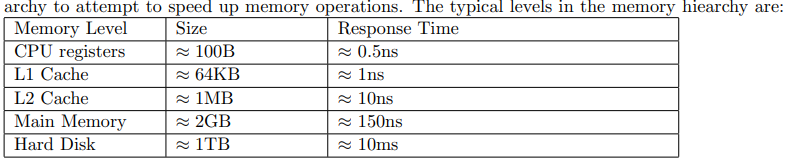

下面是一份对 **MIT 6.851: Advanced Data Structures (Spring 2012) Lecture 7** (_Memory Hierarchies and Cache-Oblivious Data Structures_) 的**详细讲解与总结**。本讲重点关注当代计算机中的**多级存储层次**（CPU Cache、主存、磁盘等）对算法分析和数据结构设计所带来的影响，并介绍了**外部存储模型**（External Memory Model）和**Cache-Oblivious（缓存无关）模型**两种常见的抽象。最后，还讨论了在 Cache-Oblivious 模型下如何构造可在 \(O(\log_B N)\) 传输代价内完成搜索、插入、删除操作的**搜索树**。

---

## 1. 背景：从传统 RAM 到多级存储模型

以往在课程中，我们主要使用**Word RAM** 或 **Cell Probe** 模型，把一次访问/操作一个字（word）当作常数时间。但是，现代计算机中存在：

- **CPU 寄存器**（容量很小、访问极快）
- **L1/L2/L3 缓存**（较大但仍很快）
- **主存（RAM）**（更大更慢）
- **硬盘（磁盘）**（容量非常大但速度非常慢）
- 以及更多层（SSD、网络存储等）……

通常，访问越底层的存储层所需时间越高，并且读写数据往往以**块（block）**为单位发生，造成现实与传统模型差异很大。

为更好地分析**块传输（block transfers）**而非单词访问的成本，诞生了 **外部存储模型（I/O model）** 和 **Cache-Oblivious 模型** 等。

---

## 2. 外部存储（External Memory）模型

### 2.1 模型概述

由 Aggarwal 和 Vitter 在 1988 年提出 [1]，也称作 **Disk Access Model (DAM)**。其核心思路：

- 系统只有**两层**：一个容量为 \(M\) 的高速缓存（cache）和一个无限大的慢速磁盘（disk）。
- 数据分为**块**，大小为 \(B\)。因此，高速缓存可存放 \(\frac{M}{B}\) 个块。
- 读取或写入一个块的成本算作 1 次 I/O 操作（亦即一次“传输”）。在缓存中对块内的操作视为**零成本**。

研究中要**最小化块传输次数**。

### 2.2 常见结果与算法

1. **顺序扫描（Scanning）**：要扫描 \(N\) 个元素，需 \(O(\frac{N}{B})\) 次传输。
2. **搜索（Searching）**：典型方法是 B-树（B-Tree），可在 \(O(\log_B N)\) 块传输内完成搜索/插入/删除；且能证明这在比较模型中是**最优**的（信息论下界）。
3. **排序（Sorting）**：可以用 \((M/B)\)-路归并排序，达到 \(O\bigl(\frac{N}{B}\log\_{\frac{M}{B}}\frac{N}{B}\bigr)\) 次传输；已知该复杂度是比较模型下的最优。
4. **置换（Permutation）**：最坏情况可用排序解法，也可用线性交换，取决于 \(\frac{N}{B}\) 与 \(\frac{N}{B}\log*{M/B}\frac{N}{B}\) 的大小；常写为 \(\min\bigl\{N,\, \frac{N}{B}\log*{M/B}\frac{N}{B}\bigr\}\)。
5. **缓冲树（Buffer Tree）**：实现延迟批处理操作（如 insert、delete-min）可达 \(O(\frac{1}{B}\log\_{M/B} \frac{N}{B})\) 摊还传输；还能实现外部优先队列等。

---

## 3. Cache-Oblivious（缓存无关）模型

### 3.1 模型定义与动机

**Cache-Oblivious** 模型（由 Frigo 等在 1999 年提出 [10][11]）是对外部存储模型的进一步抽象：

- 算法在编写时，**不知道**块大小 \(B\) 以及缓存容量 \(M\) 的具体数值；
- 系统自动进行缓存替换，我们假设系统会采用最优离线策略（或者采用 LRU 具备常数因子竞争保证）。
- 在任意真实（或抽象）的缓存配置下，我们分析算法的块传输性能。

优点：

1. 同一算法可**适配多级缓存**（L1/L2/.../外存），而在每级都能近似优化块访问。
2. 算法代码实现上可与传统 RAM 程序相似，不需要显式地按 \(B\) 做分块循环。

### 3.2 经典结果

- **顺序扫描**：同外存模型， \(\Theta(\frac{N}{B})\) 次传输。
- **排序**：\(\Theta\bigl(\frac{N}{B}\log\_{\frac{M}{B}}\frac{N}{B}\bigr)\) 传输；第 8 讲会详细讲述相关算法。
- **搜索**：有**缓存无关 B-树**（van Emde Boas 布局等技巧），可在 \(O(\log_B N)\) 次传输完成搜索/插入/删除。
- **优先队列**：也可构造在 tall-cache ( \(M = \Omega(B^{1+\epsilon})\) ) 条件下支持 insert、extract-min 等 \(O(\frac{1}{B}\log\_{M/B} \frac{N}{B})\) 摊还。

---

## 4. Cache-Oblivious BST 的关键：van Emde Boas (vEB) 布局

### 4.1 静态树的 vEB 布局

对于**静态** BST（只读查询），可将树按照 van Emde Boas 布局存储：

1. 取整棵树高度 \(\log N\)。把它拆成**上半**（即前 \(\frac12 \log N\) 深度）子树和余下 \(\sqrt{N}\) 个**下半**子树（每个大小约 \(\sqrt{N}\)）。
2. 在内存中先存上半子树的节点，然后依次存下半子树，每个下半子树再递归采用相同布局。
3. 当子树规模 \(\le B\) 时可终止，因其整体读入只要 1～2 次块传输。

通过分析，在该布局下的一次**从根到叶的搜索**会访问若干子树，但在块传输上能显示出对数据的良好局部性，导致搜索复杂度为 \(O(\log_B N)\)。

---

### 4.2 支持动态更新

为动态搜索树设计 cache-oblivious 版本，需要额外处理：插入、删除会破坏 vEB 布局的连续性。下面采用 [5] 或 [4] 中方法：

1. **Ordered File Maintenance (OFM)**

   - 将 \(N\) 个元素按顺序存储在一个数组里，允许在相邻元素之间插入/删除。
   - 该数据结构能在 \(O(\log^2 N)\) 摊还时间、 \(O(\frac{\log^2 N}{B})\) 块传输中完成插入/删除。（具体实现放在后面课程讲解。）

2. **在 OFM 之上搭建 vEB 布局的上层“树”**
   - 用一棵 vEB 结构的完全二叉树来表示对节点的分区，每个内节点存它对应区间子树的最大值之类信息；叶子指向 OFM 数组中的具体元素位置。
   - 搜索时，沿着这棵 vEB 布局树寻找，最终到达叶子确定在 OFM 中的确切位置。
   - 插入：先 SEARCH 找位置，再在 OFM 中插入新元素（需 \(O(\frac{\log^2 N}{B})\) 块传输），然后向上更新 vEB 树的信息（可能需要访问若干子树，但每层只访问常数块）。

分析可得**单次操作** \(\mathrm{SEARCH/INSERT/DELETE}\) 的块传输数为 \(O(\log_B N + \frac{\log^2 N}{B})\)。

- 可以进一步用**分层/分组 (indirection)** 技巧，使得大部分时候只操作小块子树或合并分拆 group，最终在大层面只需较少更新，从而将复杂度压到 \(O(\log_B N)\) 摊还传输。

---

## 5. 总结

**Lecture 7** 内容要点：

1. **多级存储层次下的算法分析**：外部存储模型、Cache-Oblivious 模型，关注“块传输”次数而非单次 word 访问。
2. **外部存储模型**：
   - B-树搜索 \(O(\log*B N)\)、归并排序 \(O\bigl(\frac{N}{B}\log*{\frac{M}{B}}\frac{N}{B}\bigr)\)、缓冲树等。
3. **Cache-Oblivious 模型**：算法不知道 \(B\)、\(M\)，仍可达到与外存模型类似的块传输复杂度。常用**vEB布局**、**分层**等技巧。
4. **静态 Cache-Oblivious 搜索树**：将完全二叉树以 van Emde Boas 布局存储，可保证搜索 \(O(\log_B N)\) 次传输。
5. **动态结构**：结合有序文件维护 (OFM) + vEB 布局 + 分层/组块，可在 \(O(\log_B N)\) 块传输内完成所有搜索、插入、删除操作，从而得到**缓存无关 B-树**。

这些思想对于现实系统中优化 I/O 开销、提高缓存命中率具有重要启示。后续课程会讨论更多在此模型下的排序、优先队列等数据结构或算法的实现细节与性能分析。
