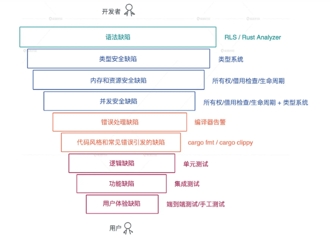

1. Rust 解决了我们开发者在实践过程中遇到的很多问题，而这些问题目前大部分语言都没有很好地解决.
   - 代码缺陷
     
     语法、类型、内存、并发
     错误处理、代码风格
     逻辑、功能、用户体验
   - 引入缺陷的代价
     
     所以 Rust 在设计之初，尽可能把大量缺陷在编译期，在秒和分钟级就替你检测出来，让你修改，不至于把缺陷带到后续环境，最大程度的保证代码质量。
2. rust 为什么未来可期
3. rust vs golang
   https://kerkour.com/programming-vs-software-engineering-rust-vs-go
   作者好能说，虽然一直在diss rust

   - Rust 借鉴了 Haskell，有完整的类型系统，支持泛型。为了性能的考虑，`Rust 在处理泛型函数的时候会做单体化`，泛型函数里每个用到的类型会编译出一份代码，这也是为什么在编译的时候 Rust 编译速度如此缓慢。

   - Rust 的诞生目标就是取代 C/C++，`想要做出更好的系统层面的开发工具，所以在语言设计之初就要求不能有运行时。`所以你看到的类似 Golang 运行时的库比如 Tokio，都是第三方库，不在语言核心中，这样可以把是否需要引入运行时的自由度给到开发者。

   - Rust 和 C/C++ 都是编译成机器码，直接面对具体的 CPU 架构。所以 `Rust 代码 需要为每个平台单独编译`，这是它和 Java/DotNet 等语言的主要区别；
     但是像 golang 这样的语言，它也直接编译(go build)成机器码，但 golang，即便一个最简单的 hello world，`编译出来的代码也包含(复制进去)了一个庞大的运行时`，处理调度，GC 等工作。Rust 没有这些额外的运行时。
