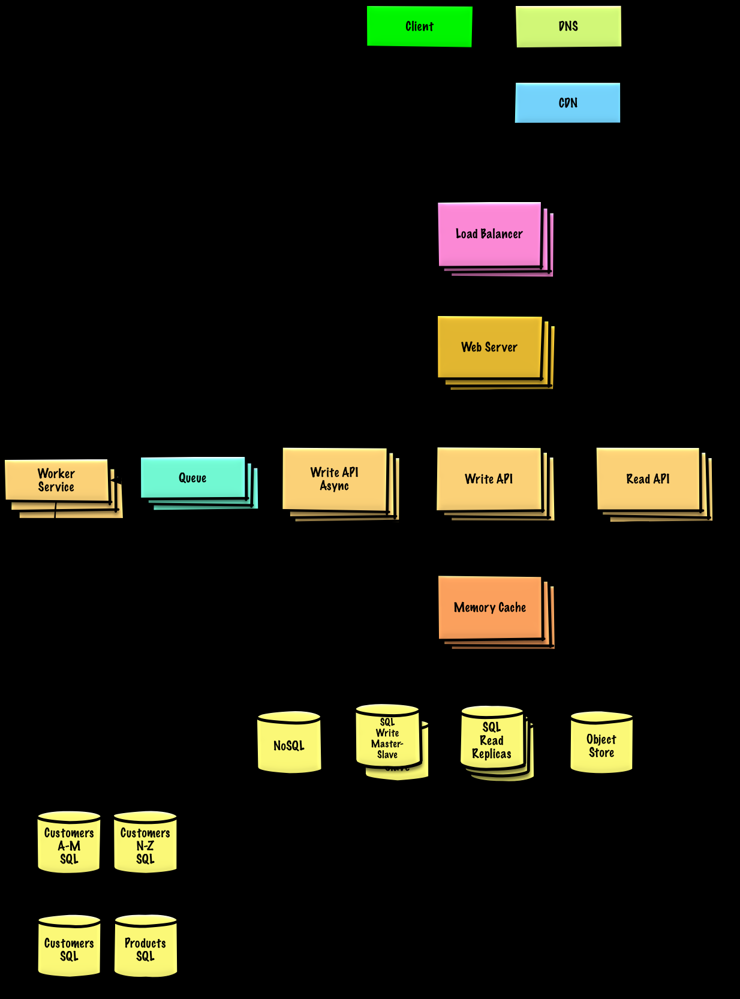

https://github.com/donnemartin/system-design-primer/blob/master/README-zh-Hans.md

ElasticSearch 使用 Apache Lucene 实现索引，而 MongoDB 索引基于传统的 B+树结构
ElasticSearch 存储 Json 文档，MongoDB 采用 Bson 格式存储（Binary Json）；
ElasticSearch 提供 Restful 接口，MongoDB 不提供；

MongoDB 是通用功能的非 Restful 风格的 NoSQL 数据库，文档以 Bson 格式存储，主要用于数据存储；
ElasticSearch 是分布式全文检索引擎，可以提供实时 Restful 风格 API 处理海量面向文档的数据。文档采用 Json 风格，主要用于基于文本的数据搜索。

MongoDB 中全文本搜索的替代方法
在 MongoDB 提出文本索引的概念之前，我们要么对数据建模以`支持关键字`搜索，要么使用`正则`表达式来实现这种搜索功能

- 首先，这些方法都不支持词干，`停用词`，`排名`等功能。
- 使用`关键字搜索`将需要创建`多关键字索引`，这比全文索引还不够
  文本搜索缺少的功能

SQL 指结构化查询语言，全称是 Structured Query Language。

```
Power           Exact Value         Approx Value        Bytes
---------------------------------------------------------------
7                             128
8                             256
10                           1024   1 thousand           1 KB    1e3
16                         65,536                       64 KB
20                      1,048,576   1 million            1 MB    1e6
30                  1,073,741,824   1 billion            1 GB    1e9
32                  4,294,967,296                        4 GB
40              1,099,511,627,776   1 trillion           1 TB    1e12
```

# 如何处理一个系统设计的面试题

- 第一步：描述使用场景，约束和假设
  把所有需要的东西聚集在一起，审视问题。不停的提问，以至于我们可以明确使用场景和约束。讨论假设。

  - 谁会使用它？
  - 他们会怎样使用它？
  - 有多少用户？
  - 系统的作用是什么？
  - 系统的输入输出分别是什么？
  - 我们希望处理多少数据？
  - 我们希望每秒钟处理多少请求？
  - 我们希望的读写比率？

- 第二步：创造一个高层级的设计
  使用所有重要的组件来描绘出一个高层级的设计。

  - 画出主要的组件和连接
  - 证明你的想法

- 第三步：设计核心组件
  对每一个核心组件进行详细深入的分析。举例来说，如果你被问到设计一个 url 缩写服务，开始讨论：

  - 生成并储存一个完整 url 的 hash
    - MD5 和 Base62
    - Hash 碰撞
    - SQL 还是 NoSQL
    - 数据库模型
  - 将一个 hashed url 翻译成完整的 url
    - 数据库查找
  - API 和面向对象设计

- 第四步：扩展设计
  确认和处理瓶颈以及一些限制。举例来说就是你需要下面的这些来完成扩展性的议题吗？
  - 负载均衡
  - 水平扩展
  - 缓存
  - 数据库分片

预估计算量

```
Power           Exact Value         Approx Value        Bytes
---------------------------------------------------------------
7                             128
8                             256
10                           1024   1 thousand           1 KB
16                         65,536                       64 KB
20                      1,048,576   1 million            1 MB
30                  1,073,741,824   1 billion            1 GB
32                  4,294,967,296                        4 GB
40              1,099,511,627,776   1 trillion           1 TB
```

## 设计 Pastebin.com (或者 Bit.ly)

https://pastebin.com/
