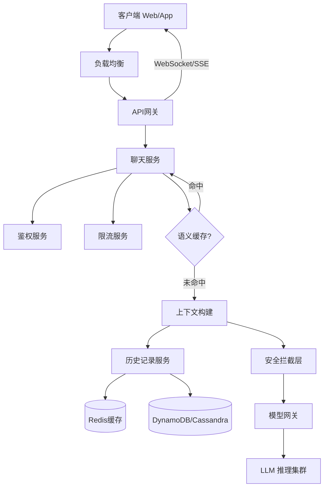

# CH04: ChatGPT: Personal Assistant Chatbot / ChatGPT：个人助理聊天机器人

本章深入分析类似于 **ChatGPT** 的个人助理聊天机器人的系统设计。这是一个典型的高并发、状态敏感、计算密集型的生成式 AI 应用。

## 1. 系统概览与核心挑战

### 1.1 核心功能

- **多轮对话**: 能够记住上下文，维持连贯的交流。
- **实时响应**: 采用流式传输（Streaming）让用户尽快看到生成的每一个字。
- **安全合规**: 具备内容审核机制，防止生成有害内容。

### 1.2 关键指标 (SLA)

- **TTFT (Time To First Token)**: 首字生成时间。用户感知延迟最关键的指标，理想值 < 200ms。
- **TPS (Tokens Per Second)**: 生成速度。影响用户阅读体验，理想值 > 15 TPS。
- **并发能力**: 支持数亿级日活用户的同时在线。

## 2. 高层架构设计 (High-Level Architecture)

系统被划分为接入层、业务逻辑层和模型推理层。

### 2.1 架构图解

### 2.2 关键组件

1.  **API 网关 (Gateway)**: 处理 **SSL 卸载**、初步鉴权，并维持与客户端的长连接（通常使用 **Server-Sent Events (SSE)** 而非 WebSocket，因为主要是服务端单向推流）。
2.  **聊天服务 (Chat Service)**: 核心编排服务（无状态）。负责协调历史记录获取、安全检查、模型调用等。
3.  **历史记录服务 (History Service)**:
    - **写 (Write)**: 对话结束后异步写入 NoSQL 数据库（如 Cassandra, DynamoDB），保证高吞吐。
    - **读 (Read)**: 使用 Redis 缓存最近的 N 轮对话，确保上下文构建的低延迟。
4.  **模型推理服务 (LLM Service)**: 部署在 GPU 机群上的推理引擎。

## 3. 模型与数据流水线 (Model & Data Pipeline)

ChatGPT 的背后的“大脑”是基于 **GPT-4** 或 **Llama 3** 等 Decoder-only Transformer 架构的模型。其训练过程分为三个关键阶段：

### 3.1 预训练 (Pre-Training)

- **数据**: 互联网海量文本（CommonCrawl, Github, Wiki）。
- **任务**: **Next Token Prediction**（预测下一个词）。
- **产出**: 基座模型 (Base Model)。此时模型具备知识，但不懂指令，只会续写。

### 3.2 监督微调 (SFT - Supervised Fine-Tuning)

- **数据**: 人工编写的高质量 `(Prompt, Response)` 对。
- **目标**: 教会模型遵循指令（Instruction Following）。
- **产出**: 对话模型。

### 3.3 人类反馈强化学习 (RLHF)

让模型更符合人类价值观（Helpful, Honest, Harmless）。

1.  **奖励模型 (Reward Model)**: 人类对模型生成的多个回答进行排序（A 优于 B），训练一个打分模型。
2.  **PPO (Proximal Policy Optimization)**: 使用强化学习算法，利用奖励模型的打分来优化生成策略，同时使用 KL 散度防止模型偏离初始分布太远。

## 4. 推理过程详解 (Inference Workflow)

当用户发送 "如何做蛋糕？" 时：

1.  **上下文组装 (Context Construction)**:
    - Chat Service 从 Redis 拉取最近 x 轮对话。
    - 拼接 Prompt: `[System Prompt] + [History Messages] + [User Query]`。
    - **截断策略**: 如果超出 Context Window（如 8k/32k token），采用滑动窗口（丢弃最旧的）或摘要策略（Summarization）。
2.  **分词 (Tokenization)**: 使用 BPE (Byte Pair Encoding) 将文本转为 Token ID。
3.  **KV Cache (关键优化)**:
    - Transformer 的 Attention 计算是 $O(N^2)$ 的。
    - **KV Cache** 存在 GPU 显存 (HBM) 中，缓存了之前所有 Token 的 Key 和 Value 矩阵。
    - 这样生成第 $N+1$ 个词时，不需要重新计算前 $N$ 个词的 Attention，极大降低了计算量。
4.  **解码策略 (Decoding/Sampling)**:
    - 此时模型输出的是概率分布 (Logits)。
    - **Top-p (Nucleus Sampling)**: 截取累积概率达到 p (如 0.9) 的那一组词，从中随机采样。比 Top-k 更动态，是 Chat 场景的标准配置。
    - **Temperature**: 控制随机性。0.7~1.0 较有创造力，0.2 较严谨。
5.  **流式返回 (Streaming)**: 每生成一个 Token，立即通过 SSE 推送给前端。

## 5. 状态管理 (State Management)

HTTP 是无状态的，LLM 也是无状态的。记忆也是一种“错觉”，是通过每次把历史记录重新喂给模型实现的。

- **短期记忆**: 存在 Redis 中，随请求发送。
- **长期记忆**:
  - 摘要 (Summarization): 当上下文过长时，调用 LLM 生成前文摘要，替换掉原始对话。
  - 向量数据库 (Vector DB): 对于超长对话，将历史记录向量化存入 Vector DB (如 Milvus/Pinecone)，根据当前 query 检索相关的历史片段（RAG 思想）。

## 6. 性能与安全优化

### 6.1 语义缓存 (Semantic Caching)

- 传统缓存基于 Key 精确匹配。
- **语义缓存**: 使用 Embedding 模型计算 User Query 的向量。如果在向量数据库中找到极高相似度的问题（如 "怎么做蛋糕" 和 "蛋糕做法"），直接返回缓存的答案，省去昂贵的 GPU 推理。

### 6.2 投机采样 (Speculative Decoding)

- 使用一个小模型（Draft Model，如 7B）快速生成几个词。
- 大模型（Main Model，如 70B）并行验证这些词。
- 由于验证比生成快得多，如果命中了，推理速度能提升 2-3 倍。

### 6.3 安全护栏 (Guardrails)

- **Input Rail**: 此前处理，检测敏感词、注入攻击（Prompt Injection）。
- **Output Rail**: 此后处理，检测生成的回答是否包含偏见、暴力或 PII（个人隐私信息）。

## 总结

ChatGPT 的系统设计是**无状态计算（模型）**与**有状态存储（历史记录）**的完美结合。其核心壁垒在于大规模训练流水线（RLHF）以及推理阶段对 GPU 资源的极致优化（KV Cache, Continuous Batching）。
