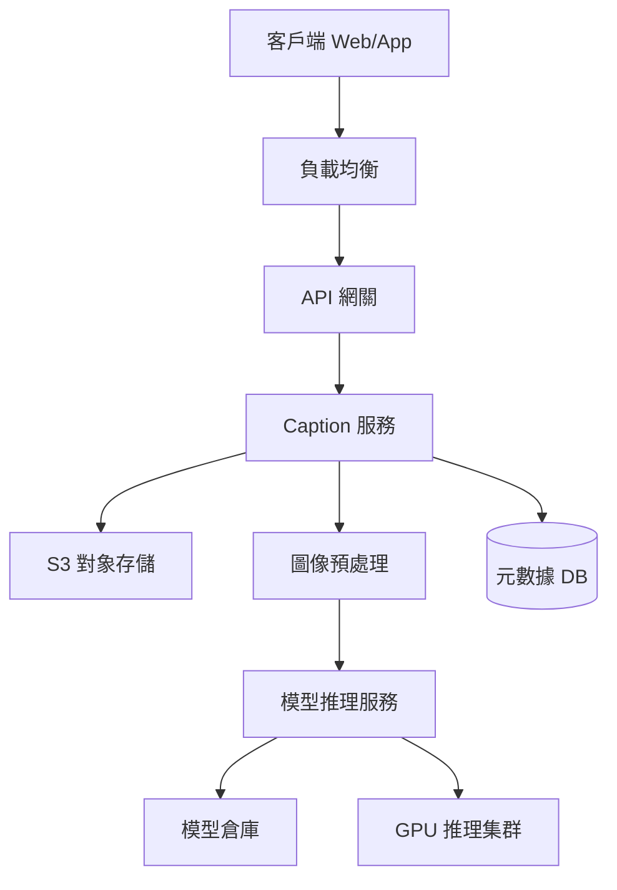

# CH05: Image Captioning / 圖片說明

本章將探討**圖片說明 (Image Captioning)** 系統的設計。這是一個經典的**多模態 (Multi-modal)** 機器學習問題，目標是讓計算機「看懂」圖片，並用自然語言描述出來。

## 1. 產品定義與應用場景

### 1.1 什麼是 Image Captioning?

Image Captioning 是一個輸入為圖片（Image），輸出為文本描述（Check caption）的過程。它連接了計算機視覺（Computer Vision, CV）和自然語言處理（Natural Language Processing, NLP）兩個領域。

### 1.2 核心應用場景

1.  **無障礙輔助 (Accessibility)**: 為視障人士描述屏幕上的圖片內容（如 Facebook 的 "Automatic Alt Text"）。
2.  **內容檢索與 SEO (Image Search & SEO)**: 將圖像內容轉化為文本索引，使用戶可以通過搜索 "海灘上的狗" 找到相關圖片。
3.  **內容審核 (Content Moderation)**: 自動檢測圖片中是否包含暴力、色情等違規場景並生成報告。
4.  **智能監控**: 自動描述監控攝像頭捕捉到的異常事件。

## 2. 系統架構設計 (System Architecture)

與 ChatGPT 類似，這也是一個推理密集的系統，但在輸入端處理的是體積較大的圖像數據。

### 2.1 API 設計

```json
POST /v1/caption
Content-Type: multipart/form-data; boundary=---

Input:
- image: binary data (JPEG/PNG)
- distinct_id: user_uuid

Output:
{
  "caption": "A golden retriever playing with a ball on the beach.",
  "confidence": 0.98,
  "latency_ms": 150
}
```

### 2.2 高層架構圖



主要流程：

1.  **上傳與存儲**: 圖片經過網關上傳至對象存儲 (S3)，返回 URL。
2.  **預處理**: 調整圖片大小 (Resize)、歸一化 (Normalization)、裁剪 (Crop) 以適配模型輸入（例如 $224 \times 224$ 或 $384 \times 384$ 像素）。
3.  **推理**: GPU 集群加載模型，計算特徵並生成文本。
4.  **返回**: 將生成的 Caption 返回給用戶。

## 3. 核心模型架構 (Model Architecture)

Image Captioning 的架構演進經歷了從 "CNN+RNN" 到 "Transformer" 再到 "Large Vision-Language Models (LVLMs)" 的過程。

最經典且通用的架構是 **Encoder-Decoder (編碼器-解碼器)** 範式。

### 3.1 視覺編碼器 (Visual Encoder)

負責 "看" 圖片，將像素轉化為高維特徵向量 (Feature Vectors)。

- **CNN (ResNet, Inception)**: 傳統做法。提取卷積層的特徵圖 (Feature Map)。例如，$14 \times 14 \times 2048$ 的特徵圖代表圖片被劃分為 $14 \times 14$ 個區域的特徵。
- **Vision Transformer (ViT)**: 現代做法。將圖片切割成 Patch（例如 $16 \times 16$ 像素的小塊），作為 Token 輸入 Transformer Encoder。ViT 能夠更好地捕捉全局上下文。
- **CLIP (Contrastive Language-Image Pre-training)**: 当前最流行的选择。CLIP 的 Image Encoder 已經在海量圖文對上學習到了與文本對齊的視覺特徵，語義理解能力極強。

### 3.2 語言解碼器 (Language Decoder)

負責 "說" 話，根據視覺特徵生成單詞序列。

- **RNN (LSTM/GRU)**: 早期做法。逐詞生成，每個時間步輸入圖像特徵和上一個詞。
- **Transformer Decoder (GPT-like)**: 現代做法。利用 Self-Attention 機制，生成質量和長距離依賴能力遠超 RNN。

### 3.3 連接層 (The Bridge)

如何將視覺特徵餵給語言模型？

1.  **Cross-Attention**: 在 Transformer Decoder 層之間插入 Cross-Attention 層，Query 來自文本，Key/Value 來自圖像特徵。
2.  **Projection Layer (投影層)**: 這是現代多模態大模型 (如 LLaVA) 的做法。
    - 將 ViT 輸出的圖像 Embedding 通過一個簡單的 Linear Layer (或 MLP) 映射到與 LLM 文本 Embedding 相同的維度。
    - 將這些 "Visual Tokens" 視為一種特殊的前綴 Prompt，拼接在文本 Prompt 之前輸入 LLM。
    - 例子: Input = `[Image_Feature_1] ... [Image_Feature_N] "Describe this image."`

## 4. 關鍵技術與挑戰

### 4.1 注意力機制 (Visual Attention)

早期的 CNN+RNN 只能將整張圖壓縮成一個向量，丟失了空間細節。
**Attention 機制** 允許 Decoder 在生成每個詞時，動態地 "聚焦" 於圖片的特定區域。

- 例如：生成單詞 "frisbee" 時，模型的注意力權重會集中在圖片中飛盤的區域。
- 這不僅提升了準確性，還提供了**可解釋性 (Explainability)**（可以將權重可視化為熱力圖）。

### 4.2 搜索策略 (Search Strategy)

在推理階段，如何選擇下一個詞？

- **Greedy Search (貪婪搜索)**: 每次選擇概率最大的詞。速度快，但容易陷入局部最優，導致句子不通順。
- **Beam Search (集束搜索)**: 維護 $k$ 個候選序列（Beam Width）。每次擴展所有候選，保留總概率最高的 $k$ 個。這是標準做法，能顯著提升句子質量。

### 4.3 評估指標 (Metrics)

除了人工評估，還有自動化指標：

- **BLEU**: 基於 n-gram 精確度，原用於機器翻譯。
- **ROUGE**: 基於召回率，原用於文本摘要。
- **CIDEr**: 專門為圖像描述設計，基於 TF-IDF 加權的 n-gram 一致性，與人類判斷相關性較高。
- **SPICE**: 基於場景圖 (Scene Graph) 的語義評估，關注物體、屬性和關係的準確性。

## 5. 數據集與訓練 (Datasets & Training)

### 5.1 常用數據集

- **MS COCO**: 最權威的數據集，超過 30 萬張圖片，每張圖 5 個高質量的人工標註 Caption。
- **Flickr30k**: 3 萬張圖片。
- **Visual Genome**: 包含詳細的場景圖信息。
- **LAION-5B**: 海量互聯網抓取的圖文對（噪音較大，需過濾），用於預訓練基礎模型（如 CLIP）。

### 5.2 訓練策略

- **Pre-training (預訓練)**: 使用海量數據 (Web Scale) 學習圖像與文本的對齊 (Alignment)。
- **Fine-tuning (微調)**: 在 COCO 等高質量標註數據上進行監督學習，優化生成質量。

## 總結

Image Captioning 系統已經從簡單的模式識別演進為具備認知推理能力的**多模態大模型 (LMM)**。現代架構的核心在於利用 **ViT** 提取強大的視覺特徵，並通過 **Projection** 對齊到預訓練好的 **LLM** 中，從而繼承 LLM 強大的語言生成和世界知識能力。
