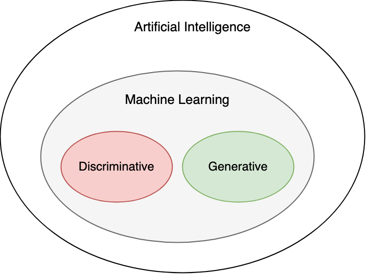
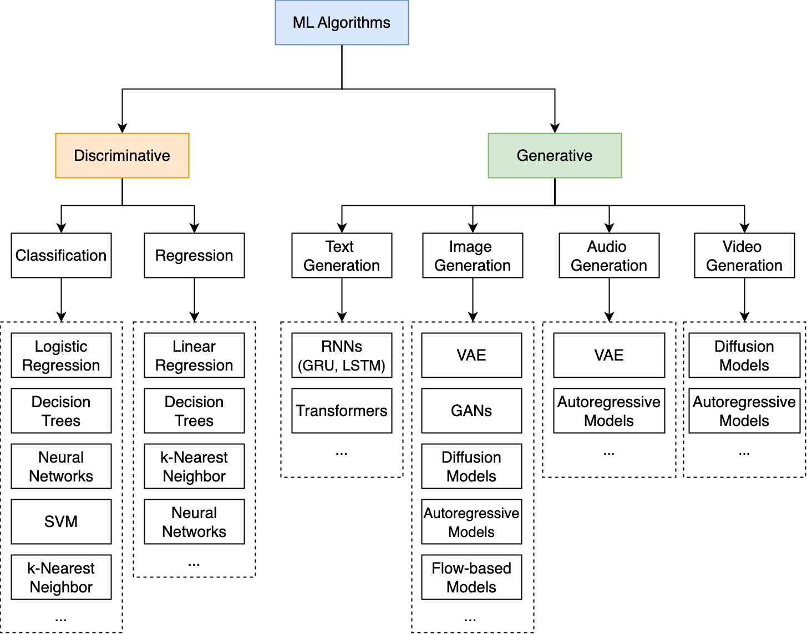

https://bytebytego.com/courses/genai-system-design-interview/introduction-and-overview

TODO

这份文档为生成式 AI（GenAI）系统设计提供了一个清晰且极具实战意义的路线图。它不仅区分了判别式与生成式模型的本质差异，还深入探讨了推动当代 GenAI 爆发的三大核心支柱：数据、模型容量与算力。

以下是对该内容的深入专业分析与核心洞见提炼：

### 1. 范式转移：从“区分”到“理解分布”

**核心洞见：** 判别式模型（Discriminative）在特征空间中寻找分界线（学习 $P(Y|X)$），而生成式模型（Generative）则更进一步，尝试通过学习数据的联合概率分布（$P(X, Y)$）或边际分布（$P(X)$）来“掌握”数据的生成逻辑。

- **深层意义：** 生成式模型不仅知道“什么是 A，什么是 B”，它还知道“如何从无到有创造一个像 A 的东西”。这种对数据流形（Data Manifold）的深刻学习，是 GenAI 展现出“类人创造力”的根本原因。

### 2. GenAI 爆发的核心动力学：数据、容量、算力

文档指出这三者缺一不可，其中隐含了几个关键的技术拐点：

- **数据（Data）—— 自监督学习的红利：** 过去 ML 受限于受监督学习（Labled Data）的昂贵成本。GenAI 的崛起归功于**自监督学习（Self-supervised Learning）**，它让模型能够吞噬互联网上 PB 级的无标签数据（如 Llama 3 使用了 15 万亿 Token）。
- **模型容量（Capacity）—— 涌现的基础：** 参数量（$10^9$ 级以上）不仅是规模的堆砌，当跨越某个阈值后，模型会出现“涌现”能力（Emergent Abilities），如零样本推理和多步逻辑分析。
- **算力（Compute）与 FLOPs：** 文档精准区分了**参数量（空间复杂度）**与 **FLOPs（时间/计算复杂度）**。
  - _洞见：_ 模型的效率优化（如混合精度训练 AMP、深度优化驱动的架构）比单纯增加 GPU 数量更关键。 PaLM-2 耗时 5.5 个单卡 H100 年的算力需求，解释了为什么分布式训练（三类并行：Data, Tensor, Pipeline）是现代 GenAI 的入场券。

### 3. Scaling Law（缩放定律）的战略价值

**核心洞见：** Scaling Law 告诉我们，模型性能不是随机的，而是与算力、数据量、参数量呈幂律关系。

- **Chinchilla 启示：** 2022 年 DeepMind 的研究（Chinchilla）修正了单纯追求参数量的盲目性，强调了**数据规模必须与模型规模同步线性增长**。这直接导致了后续模型（如 Llama 系列）倾向于在更小的模型上训练更久、更多的数据。
- **推理侧 Scaling：** 提到 GPT-o1，暗示了当前的前沿已经从“训练侧 Scaling”扩展到了“推理侧 Scaling”（通过思维链和搜索增加推理时的计算量来换取性能提升）。

### 4. 系统设计面试框架的专业解剖

文档推荐的七步框架是成功应对 ML 面试的黄金标准。以下是几处关键的战略点：

1.  **需求澄清（Clarifying）：** 不要直接写模型。要先分清 **Functional（功能：能生图）** 和 **Non-functional（非功能：延迟 < 2s，支持 1M 并发）**。这是评估候选人工程成熟度的第一标准。

2.  **数据准备（Data Prep）：** 在 GenAI 环境下，这不再是特征工程（Feature Engineering），而是**数据工程（Data Engineering）**：清洗、去重（Deduplication）、有害内容过滤、合成数据（Synthetic Data）的应用。

    

3.  **架构与训练（Model/Training）：**
    - **架构：** 深入理解 Transformer 的自注意力机制（Self-Attention）是基础（$Q, K, V$ 矩阵操作）。
    - **训练优化：** 必须熟悉 **梯度检查点（Gradient Checkpointing）**、**混合精度（AMP）** 和 **并行策略**。这展示了你不仅会调包，还会处理大规模生产环境下的显存溢出与通信瓶颈。
4.  **评估（Evaluation）：**
    - _难点：_ 生成式任务没有单一标准答案。
    - _洞见：_ 必须结合 **离线指标（FID, BLEU）**、**AI 辅助评估（LLM-as-a-judge）** 和 **在线业务指标（CTR, 用户满意度）** 构建多维评估体系。

### 总结

GenAI 系统设计不仅仅是模型算法的设计，更是一场关于**资源布局（算力/数据）、安全性（伦理/偏见）以及工程鲁棒性**的博弈。这份文档为从业者提供了一个从宏观理论到微调实践的闭环视野，特别强调了分布式训练、缩放定律和多模态对齐等现代工业界最核心的挑战。
