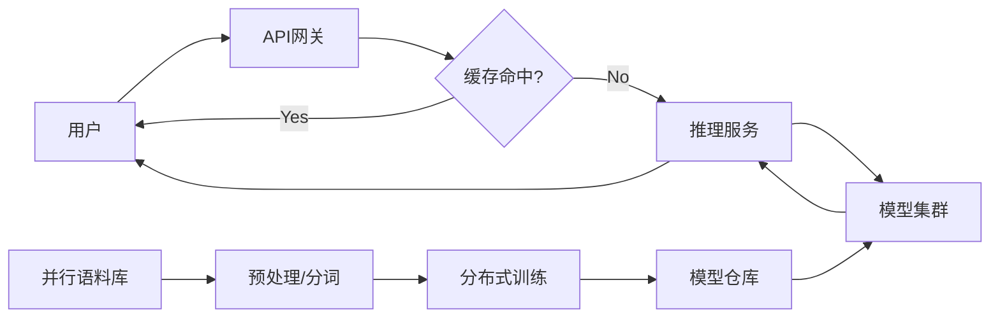

# CH03: Google Translate / Google 翻译系统设计详解

本章深入分析 Google 翻译（Google Translate）的系统设计。在 Generative AI 的背景下，翻译系统是典型的**序列到序列（Seq2Seq）**生成任务。现代翻译系统已经从早期的基于统计的机器翻译（SMT）全面转向了**神经机器翻译（NMT）**，特别是基于 **Transformer** 架构的模型。

## 1. 系统概览与需求

### 核心目标

构建一个能够支持 100+ 种语言互译、处理海量并发请求、保持低延迟且高准确度的全球化翻译系统。

### 关键指标 (Non-Functional Requirements)

- **低延迟 (Low Latency)**: 用户输入时能够实时给出翻译结果（毫秒级响应）。
- **高可用性 (High Availability)**: 为全球用户提供 24/7 服务。
- **准确性 (Accuracy)**: 翻译结果语法正确、语义通顺、符合上下文。
- **可扩展性 (Scalability)**: 随着新语言和新数据的加入，系统能平滑扩展。

## 2. 高层架构设计 (High-Level Architecture)

Google 翻译的架构主要由两条核心流水线组成：**训练流水线 (Training Pipeline)** 和 **推理流水线 (Inference/Serving Pipeline)**。

### 架构组件

1.  **客户端 (Client)**: Web 端、移动 App、Chrome 浏览器插件等。发送源文本、源语言（可自动检测）和目标语言。
2.  **API 网关 (API Gateway/Load Balancer)**: 处理鉴权、限流、路由请求到最近的数据中心。
3.  **翻译服务 (Translation Service)**:
    - **缓存层 (Caching)**: 优先查询 Redis/Memcached。对于高频短语（如 "Hello", "Thank you"），直接返回结果，极大地降低延迟。
    - **推理服务 (Inference Server)**: 如果缓存未命中，调用模型服务进行实时生成。
4.  **模型服务器 (Model Server)**: 托管训练好的 Transformer 模型（通常是经过量化和蒸馏的优化版本），运行在 TPU/GPU 集群上。
5.  **数据流水线 (Data Pipeline)**: 负责离线的海量数据处理，为模型训练提供燃料。

## 3. 模型架构：从 GNMT 到 Transformer

### 3.1 核心模型：Transformer

虽然早期 Google 使用基于 LSTM 的 GNMT (Google Neural Machine Translation)，但现代架构完全由 **Transformer** 主导（论文 _Attention Is All You Need_）。

- **Encoder-Decoder 结构**:
  - **Encoder (编码器)**: 接收源语言句子，利用 **Self-Attention (自注意力机制)** 并行处理所有单词，捕捉长距离依赖关系，生成包含丰富语义的上下文向量（Embeddings）。
  - **Decoder (解码器)**: 自回归（Autoregressive）地生成目标语言句子。每一步生成一个 Token，同时关注 Encoder 的输出（Cross-Attention）和自己之前生成的 Token（Masked Self-Attention）。

### 3.2 分词器 (Tokenizer)

为了解决 **OOV (Out of Vocabulary)** 问题（即遇到字典里没有的生僻词），Google 翻译使用 **Subword Tokenization**（子词分词）技术，如 **WordPiece** 或 **SentencePiece**。

- **原理**: 将罕见词拆分为更小的常见单元。
- **例子**: "unhappiness" -> "un", "happy", "ness"。
- **优势**: 显著减小了词表大小（通常在 32k 左右），同时覆盖了几乎所有单词的组合。

## 4. 数据工程 (Data Engineering)

数据是 NMT 的核心壁垒。

1.  **数据收集 (Collection)**:
    - **网络爬虫**: 抓取多语言网站（如联合国文档、政府公报、双语电子书），提取**平行语料 (Parallel Corpus)**。
    - **用户反馈**: Google 翻译社区的纠错数据是高质量的微调样本。

2.  **数据清洗与对其 (Cleaning & Alignment)**:
    - 句子对齐：通过算法匹配源句子和目标句子。
    - 过滤噪声：去除乱码、长度不匹配的句子对（例如源句 5 个词，目标句 100 个词）。

3.  **回译 (Back-Translation)**:
    - **针对低资源语言**（数据稀缺的语言，如某些非洲语言）的关键技术。
    - **做法**: 拿大量的**单语数据**（例如只有目标语言的文本），用一个反向翻译模型（目标->源）生成伪造的源语言数据，构建合成的平行语料来增强训练。

## 5. 训练与推理流程

### 5.1 训练策略 (Training)

- **目标函数**: 最小化预测分布与真实分布之间的交叉熵损失 (Cross-Entropy Loss)。
- **Teacher Forcing**: 训练时不管模型上一步预测了什么，解码器的输入总是使用**真实的**上一个 Token，以加速收敛。
- **分布式训练**: 利用数据并行（Data Parallelism）在成百上千个 TPU 上训练。

### 5.2 推理策略 (Inference)

- **Beam Search (集束搜索)**:
  - 生成时不贪心地只选概率最高的那一个词（Greedy Search），而是保留前 $k$ 个（例如 $k=5$）最优路径。
  - 最终根据累积概率得分选择最优句子。
- **长度惩罚 (Length Penalty)**:
  - 防止模型倾向于生成极短的句子（因为短句子的联合概率通常更高），对长句子给予归一化补偿。

## 6. 性能优化与工程实践

为了达到实时翻译的要求，Google 采用了多种极致优化手段：

### 6.1 量化 (Quantization)

将模型权重从 FP32（32位浮点数）转换为 INT8（8位整数）甚至更低。

- **效果**: 模型体积缩小 4 倍，推理速度显著提升，同时通过校准保持精度损失微乎其微。

### 6.2 知识蒸馏 (Knowledge Distillation)

- **Teacher Model**: 巨大、深层、精度极高但慢。
- **Student Model**: 较小、较浅、速度快。
- **过程**: 让 Student 模型不仅学习真实标签（Hard Label），还学习 Teacher 模型输出的概率分布（Soft Label）。Student 模型用于线上实时服务。

### 6.3 专用硬件 (TPU)

Google 翻译运行在 **TPU (Tensor Processing Unit)** 上。TPU 专为矩阵乘法（Systolic Array 架构）设计，处理 Transformer 的 Attention 运算效率远高于 GPU。

## 7. 评估指标 (Evaluation)

- **BLEU Score (Bilingual Evaluation Understudy)**:
  - 自动评估指标。比较机器翻译结果与人类参考翻译的 n-gram 重叠度。虽然不完美，依然是工业界最通用的标准。
- **人工评估**: 对于离线质量把控，依然需要语言专家进行打分。

## 总结

Google 翻译系统的成功不仅仅是 Transformer 架构的胜利，更是**高质量大规模数据清洗管道**、**回译技术**以及**工程化推理优化（量化、TPU、缓存）**共同作用的结果。
