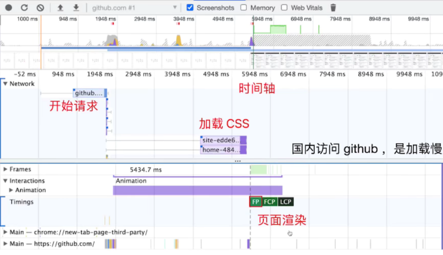
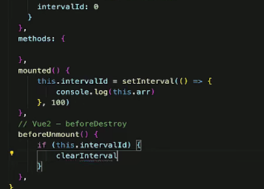
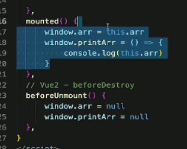
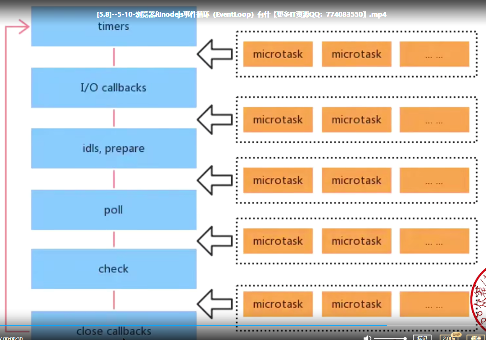
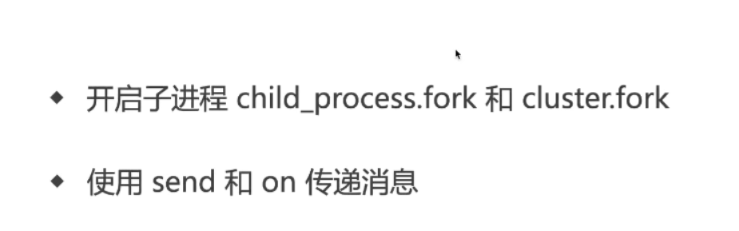
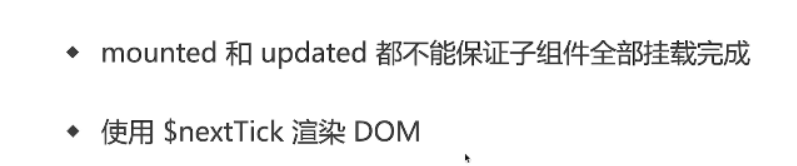
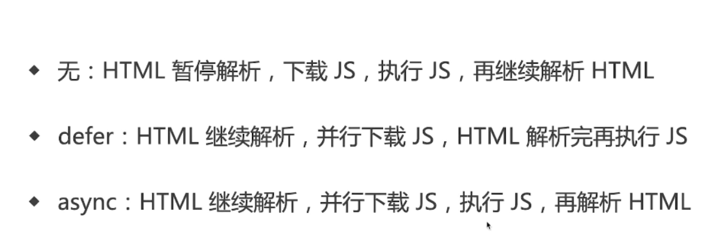

1. js 内存泄漏
2. 后端一次性返回 1e5 条数据，怎么渲染

- 沟通
- 自定义 nodejs 中间层
- 虚拟列表 (只渲染可视区域 DOM，vscode)，不造轮子 virtual-scroll-list

3. h5 页面如何首屏优化？

- SPA 路由懒加载
- 干脆 SSR 服务端渲染 (SSR 是一门古老的技术)
- App 预取
- 分页
- 图片懒加载(`注意提前设置图片尺寸，尽量只重绘不重排`)
- LightHouse
- loading，骨架屏

4. 常用设计模式与使用场景
   工厂模式:React.createElement，jquery 的$：省去写 new，简化复杂的创建
   单例模式：dialog modal ,store
   代理模式:Proxy，get set
   观察者:时间注册
   发布订阅:on,emit  
   装饰器：AOP，nestjs
   发布订阅与观察者模式区别：有无中间媒介

5. vue 优化
   computed 缓存
   keep-alive 缓存
   异步组件
6. vue2 坑
   无法通过数组直接修改数据
   路由切换 scroll 到顶部 (SPA 通病)-列表页需要缓存 scrollTop 值
7. react 优化
   修改 css 模拟 v-show
   vscode 里自带优化 useMemo useCallback
   Fragment 减少层级
   jsx 中不要定义函数
   React.memo
8. react 坑
   js 关键字冲突
   `htmlFor className`
9. 如何统一监听 vue 组件报错
   监听下级组件报错：errorCaptured 生命周期 ，返回 false 会阻止向上传播
   监听全局组件报错：errorHandler ，返回 false 会阻止向上传播
   全局 window.onerror ：捕捉 vue 监听不到的错误 mounted 执行；`异步报错`
10. 如何统一监听 React 组件报错
    监听组件报错：ErrorBoundary 组件，可降级展示 UI
    全局 window.onerror ：捕捉 React 监听不到的错误 mounted 执行；`异步报错`

11. 如果一个 h5 网页访问`慢`，如何分析原因？
    - LightHouse/Network
    - first paint (FP)
    - first contentful paint (FCP) 有感知了
    - DomContentLoaded
    - load

网页加载慢=>CDN，路由懒加载，缓存策略优化
网页渲染慢=>优化服务端接口

12. js 垃圾回收算法
    引用计数(之前)
    标记清除(现代)

13. 闭包是内存泄露吗 不是
14. 如何检测内存泄漏
    performance 里的小垃圾筒(Collect garbage)

组件销毁时定时器/监听事件未清除

组件销毁时全局变量未清除

15. WeakMap WeakSet
16. 浏览器和 nodejs 事件循环区别
    nodejs 事件循环类型和优先级不同 `定回闲轮检关`
    同步=>清空微任务=>按顺序执行六个类型的宏任务(开始前清空微任务队列)
    
    最大区别就是 nodejs 宏任务和微任务分类型和优先级
17. 虚拟 dom 真的很快嘛
    保证最坏时间复杂度
    组件化、数据视图分离、`数据驱动视图需要 vdom`
    并不是 vdom 更快!js 直接操作 dom 更快
    只是`数据驱动视图需要 vdom`
18. nodejs 如何开启多进程
    js 开不了多线程!
    只能开多进程(Webworker)
    cluster.fork
    
19. js-bridge 实现原理
    js 无法直接调用 native api
20. requestAnimationFrame 每次渲染完进行
    requestIdleCallback fiber 里的渲染在空闲时进行
    要等到 DOM 树渲染完才执行，`宏任务`
21. vue 生命周期做了什么
    created Vue 实例初始化完成 响应式绑定完成 data method 完成 尚未渲染模板
    mounted 完成 vdom=>dom 渲染
    beforeUnmount 解绑事件
    setup 代替里 beforeCreated/created
    使用 hooks onMounted /onUpdated
22. vue 什么时候操作 DOM 比较合适
    
23. diff 算法区别
24. MemoryHistory 是什么 (适用于 Webview 的路由)
    MemoryHistory：用作参考实现，也可用于非 DOM 环境，如 React Native 或测试
    Memory history 不会在地址栏被操作或读取
25. 移动端 h5 click 300ms 延迟如何解决
    FastClick 库 监听 touchEnd 事件 用自定义 DOM 事件模拟 click 事件
    content="width=device-width" 设置即可
26. http 协议与 UDP 协议区别
27. async 和 defer
    
28. 网络请求=>解析=>渲染
    dns 查询=>tcp 连接=>http 请求=>两棵树+render tree=>layout/painting
29. repaint 与 reflow
30. 如何实现网页多标签 tab 通信
    localstoarge
31. koa 洋葱模型通过 dfs 实现
32. setState 是同步，只是 batchUpdate 使它看起来像异步
33. LRU 缓存 用 Map
34. ['1','2','3'].map(parseInt) 1,NaN,NaN
    parseInt('1',0) 当成十进制
    parseInt('2',1) 不存在 1 进制，NaN
    parseInt('3',2) 二进制不存在 3,NaN
35. 如何设计一个前端 SDK
