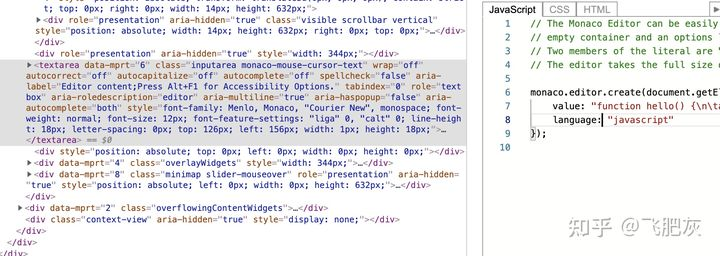
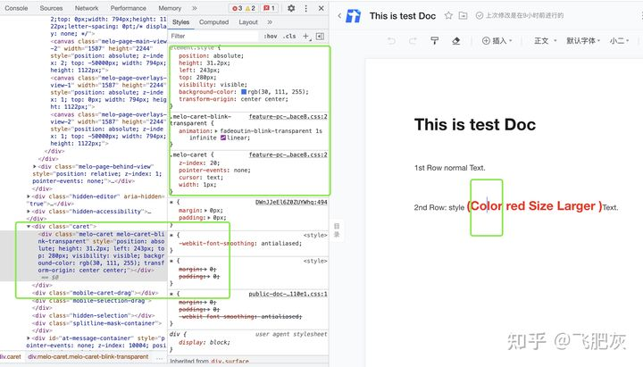

庆幸的是，HTML 的 <input/> 和 <textarea/> 元素提供了完整的文本输入功能，并且可以通过它们的 selectionStart，selectionEnd 和 setSelectionRange 方法来获取当前输入的位置和设置选中，这些位置信息是基于文本字符串的顺序序号，如果想获取空间坐标位置，需要自己进行额外的计算。<input/> 和 <textarea/> 元素就是一个最简单的完整的文本编辑器。

如果我们的需求仅限于此，浏览器已经在在底层帮我们把这个问题处理完了，我们完全都不会意识到 caret 这个问题的存在。

编辑器首先要解决的第一个问题就是 caret 问题：

- 如何显示 caret
- 如何定位 caret

## 1. 如何显示 Caret

主要有两种不同的技术路线，
第一种方向是采用模拟 caret `绝对定位`的方法，
第二种方向是利用 html 的 `contenteditable` 的机制，让浏览器自己处理 caret。再展开到细节

1. 使用 <input/> 或 <textarea/> 模拟 caret （通常情况下 width 1px），动态操作它的绝对定位和 focus 状态，并且监听它的键盘输入事件作为整个文档内容的键盘输入响应入口
   代表作： monaco editor（vscode）
   
2. 通过 div 模拟 caret
   腾讯文档 和 Google Doc
     
    虽然腾讯文档和 Google Doc 都是采用 div caret 方案，但是它们的编辑器技术路线却大相径庭，腾讯文档的内容是在 `canvas 中绘制的`。在 canvas 中绘制文档内容，不用觉得吃惊，它其实只是一种很常见的策略，几乎所有的 `web excel 都是在 canvas 中绘制的`。在 canvas 中会有几个好处就是，

   1. 对于大文档来说，性能会非常好，只需要按需绘制；
   2. 可以很容易地得到文档的浏览缩略图。缺点就是在文档中加入交互性变得很困难。

      > 为什么只有 vscode 使用 textarea 模拟 caret，而其他的编辑器都是用 div 来模拟 caret？
      > 答案很简单，vscode 是纯文本编辑器，其他的都是富文本编辑器，当用户进行复制粘贴的时候，textarea 只能接受字符串，会丢失粘贴文本内容的样式以及其他非文本的内容。

3. 整体 contenteditable
   代表作：石墨文档 和 语雀文档

   ```HTML
     <div contenteditable>请输入...</div>
   ```

   HTMLElement.contentEditable 属性用于表明元素是否是可编辑的。
   `基于 contenteditable 技术实现@选人功能`
   微博是通过一个纯的 textarea 来实现的 at 功能。
   qq 空间是用 contenteditable 的 div 来实现的

   `市场上大部分开源的富文本编辑器都是使用 contenteditable, 例如 draftjs 和 roosterjs。`(可以大胆猜测，语雀文档和石墨文档是基于某个开源的富文本编辑器基础之上进行开发的)

4. 局部 contenteditable
   代表作： Microsoft Office Word.

## 2. 如何定位 caret

显示 caret 非常简单，如何能正确计算出 caret 的位置才是真正的核心难点问题。(说明：对于 contenteditable 方向的方案，不存在定位 caret 的问题。)

monaco editor （vs code）的具体实现过程如下：

- 监听整个编辑器根节点 div 的 mousedown 事件
- 根据 mouse 的坐标计算出对应的行列数。关于它是如何根据当前鼠标点击点计算出对应的行列数的逻辑计算，大家可以参考：/vscode/src/vs/editor/browser/controller/mouseTarget.ts ， 详细的计算过程都在这里。
- 知道了行列数，最后一步就可以很容易推算出 caret 的正确位置。

## 其他场景

细心观察我们会发现在其他的应用场景里，我们也需要解决 caret 问题，其他最典型的就是 select 组件（即，带搜索功能的下拉选择多选组件）。
原理上都是通过 textarea/input/div 来模拟 caret，这里稍微有点区别，select 里面不是绝对定位，是采用文档流布局，这个 caret 元素和已选中的内容在 DOM 里是按顺序排列的。
