## 笔记

0. 为什么要打包构建
   - 更块更小(压缩合并 tree-shaking)
   - 高级语法支持(tS es6 模块化 scss)
   - 兼容和错误检查(polyfill postcss eslint)
   - 统一环境
   - 统一规范
1. module chunk bundle 的区别
   **module** 是各个源码文件；
   webpack 一切皆模块
   **chunk** 是多模块合成的大块，比如 enrty,splitchunk 出 verndor 和 common,以及 import()异步加载出的 chunk(例如 vue 的异步组件,每个都会生成一个 chunk.js)
   **bundle** 是最终的输出文件
   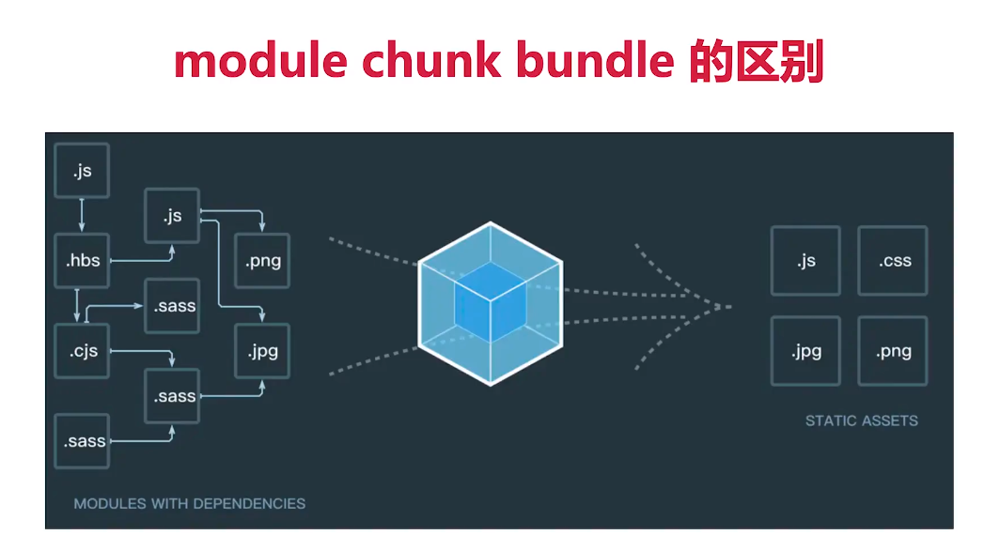
2. 常见的 loader（函数） plugin（类）
3. webpack 懒加载
   - import().then()
   - vue 和 react 的异步组件、异步加载路由
4. 为何 proxy 不能被 polyfill
   class => function
   promise =>callback
   proxy 用 Object.defineProperty 的功能模仿不了
5. webpack 常见性能优化,非常重要
   - 打包构建速度：babel-loader 开启缓存以及 exclude&include,ignorePlugin,noParse,happyPack,parallelUglifyPlugin,自动刷新，热更新，DLLPlugin,
   - 优化产出代码
6. 如何产出一个 lib
7. babel-runtime 和 babel-polyfill
   core-js 是所有 es6es7 新语法(synmob,promise,weakmap)的 polyfill 库,但是无法 polyfill 生成器语法
   regenerator 是支持 generator 语法的库
   babel-polyfill = core-js+regenerator
   babel-polyfill 在 babel7.4 后被弃用，推荐直接使用 core-js 和 regenerator
   babel 是**编译工具**不处理模块化不关心 api 只解析语法而 webpack 是**打包构建工具**不关心语法
   babel-polyfill 很大，应该按需引入
   {
   "useBuiltIns": "usage",
   "corejs": 3,
   "targets": {
   "browsers": "last 2 versions, not ie <= 9"
   }
   }
   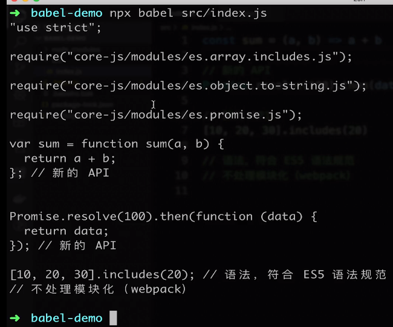

   babel-polyfill 会污染全局环境
   babel-runtime 重新对变量命名，加了\_
   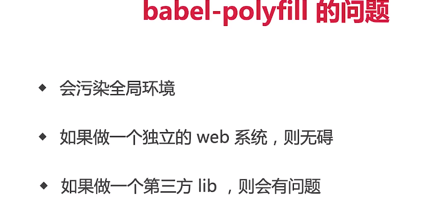
   "plugins": [
   [
   "@babel/plugin-transform-runtime",
   {
   "absoluteRuntime": false,
   "corejs": 3,
   "helpers": true,
   "regenerator": true,
   "useESModules": false
   }
   ]
   ]

```js
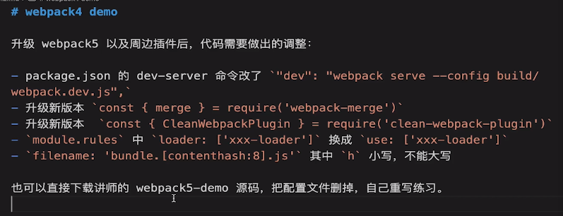
基本配置：
拆分配置和 merge

定义环境变量的插件
 plugins: [
        new webpack.DefinePlugin({
            // window.ENV = 'development'
            ENV: JSON.stringify('development')
        })
    ],

处理es6:babel-loader
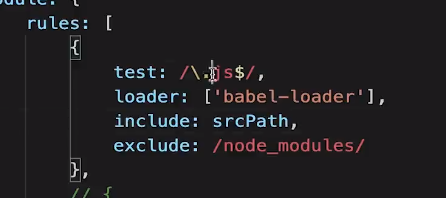


多入口配置
正常如果有多个入口，需要在 entry 中，以对象形式将所有入口都配置一遍，html 模版目录也需要 new 很多个 HtmlWebpackPlugin 来配置对应的页面模版，是否可以自动扫描? 无论多少个入口，只管新建，而不用管理入口配置？可以的！
https://segmentfault.com/a/1190000020237962
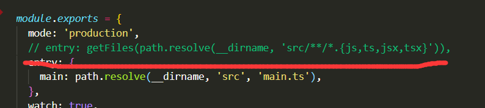
配置多个htmlPlugin插件设置
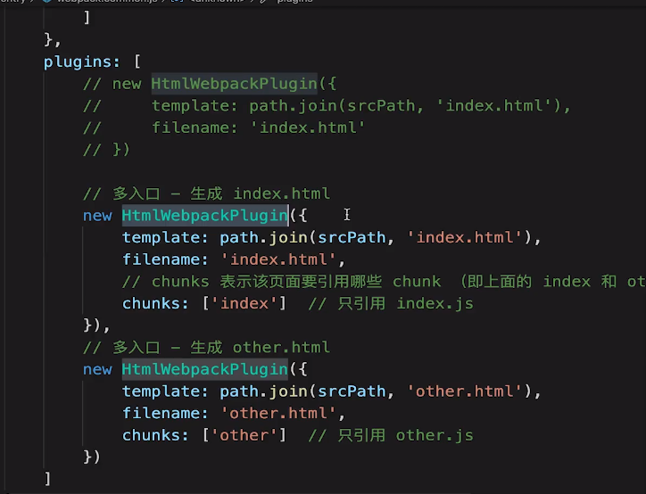


为什么开启webpack server后每次改变文件重新打包时间久
多入口打包，怎么观察单个文件变化而不是全部

mode 默认production 会压缩代码
development不会压锁代码
要压缩可以用
  optimization: {
    minimize: true,
    minimizer: [
      new TerserPlugin({
        terserOptions: {
          format: {
            comments: false,
          },
        },
        extractComments: false,
      }),
    ],
  },
压缩大概会占用4秒的时间

加载，抽离与压缩css
https://webpack.js.org/plugins/css-minimizer-webpack-plugin/
build-min-extract-css
生产环境下不能把css打包到产生的js中
使用mini-css-extract-plugin
// 抽离并压缩 css
            {
                test: /\.css$/,
                loader: [
                    MiniCssExtractPlugin.loader,  // 注意，这里不再用 style-loader
                    'css-loader',
                    'postcss-loader'
                ]
            },
            // 抽离 less --> css
            {
                test: /\.less$/,
                loader: [
                    MiniCssExtractPlugin.loader,  // **注意**，这里不再用 style-loader
                    'css-loader',
                    'less-loader',
                    'postcss-loader'
                ]
            }

             // 抽离 css 文件
        new MiniCssExtractPlugin({
            filename: 'css/main.[contenthash:8].css'
        })

       optimization: {
    // 压缩 css
    minimizer: [new TerserPlugin(), new CssMinimizerPlugin()],
  },

生产环境下抽离公共代码与第三方代码
splitchunks
需要抽离大文件
// 缓存分组
      cacheGroups: {
        // 第三方模块
        vendor: {
          name: 'vendor', // chunk 名称
          priority: 1, // 权限更高，优先抽离，重要！！！
          test: /node_modules/,
          minSize: 3 * 1024, // 大于3*1024就拆出来
          minChunks: 1, // 引了一次lodash就搬出来
        },

        // 公共引用的模块比如utils里的模块
        common: {
          name: 'common', // chunk 名称
          priority: 0, // 优先级
          minSize: 3 * 1024, // 公共模块的大小限制
          minChunks: 2, // 公共模块最少复用过几次
        },
      },

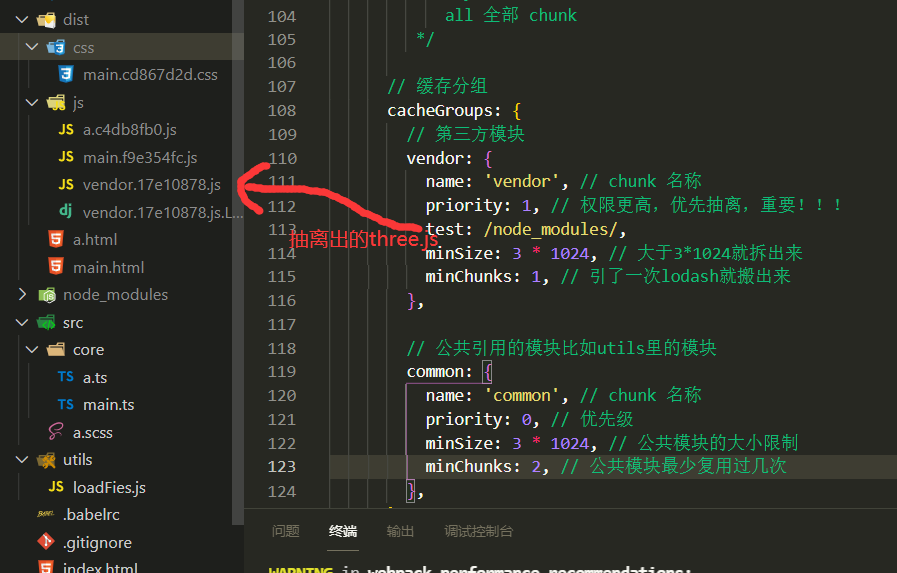
决定是否引入vendor(第三方模块)和common(自己的模块)
new HtmlWebpackPlugin({
            template: path.join(srcPath, 'index.html'),
            filename: 'index.html',
            // chunks 表示该页面要引用哪些 chunk （即上面的 index 和 other），默认全部引用
            chunks: ['index', 'vendor', 'common']  // 要考虑代码分割
        }),
        // 多入口 - 生成 other.html
        new HtmlWebpackPlugin({
            template: path.join(srcPath, 'other.html'),
            filename: 'other.html',
            chunks: ['other', 'common']  // 考虑代码分割
        })

webpack默认支持懒加载JS
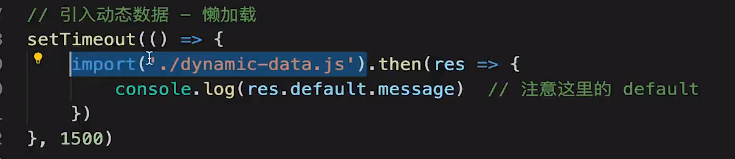
import('foo.js').then(res=>console.log(res))

IgnorePlugin避免引入无用代码，直接不引入（可以CDN引入），代码中没有。比如moment.js在导入时会自动导入本地化文件，一般情况下几乎不使用而且又比较大，此时可以通过IgnorePlugin忽略对本地化文件的生成，减小文件大小。
noParse避免重复打包，该引入还是会引入，只是不参与loader或webpack的解析及打包。忽略未采用模块系统文件的处理。比如常见的jQuery非常大，又没有采用模块系统，让Webpack解析这类型文件完全是浪费性能。
externals的官方描述是:
防止将某些 import 的包(package)打包到 bundle 中，而是在运行时(runtime)再去从外部获取这些扩展依赖(external dependencies)
查看浏览器环境中的名称
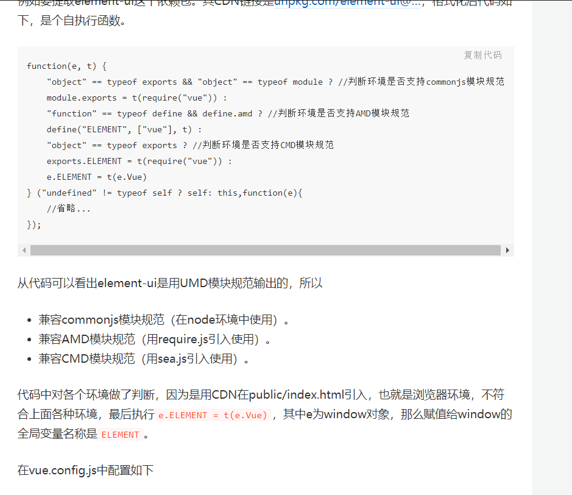
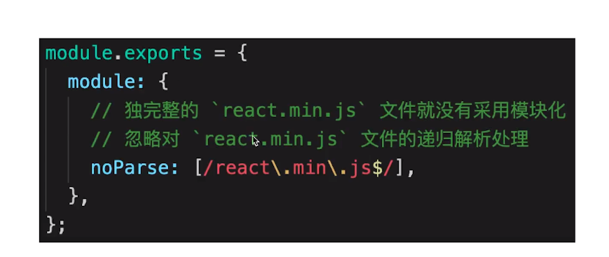

happypack多进程打包
paralleluglifyplugin多进程压缩JS
关于开启多进程：不一定加速，按需使用，有进程开销


filename 指列在 entry 中，打包后输出的文件的名称。 chunkFilename 指未列在 entry 中，却又需要被打包出来的文件的名称。
热更新（新代码生效，网页不刷新，状态不丢失）不等于自动刷新（watch，整个网页全部刷新，状态会丢失）
热更新配置
若是改变js文件的话还需要在入口文件中增加（css-loader底层已经实现了这段代码，所以css文件的改变不用做此配置。使用vue脚手架来编写项目的时候也不用自己编写这段代码，因为vue-loader做了此项的配置）
if(module.hot){//若是没有这段话的也可以不用设置以上的hotOnly:true属性
    module.hot.accept('./number',()=>{
        number();
    })
}
1.在webpack.config.js的devServer增加
hot:true//开启Hot Module Replacement的功能
hotOnly:true//即便Hot Module Replacement的功能没有生效。也不让浏览器自动刷新
2.引进webpack
const webpack = require('webpack')
3.在webpack.config.js的plugins增加
new webpack.HotModuleReplacementPlugin()

webpack内置DLLPlugin
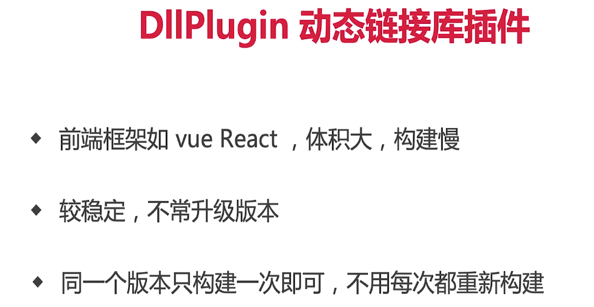
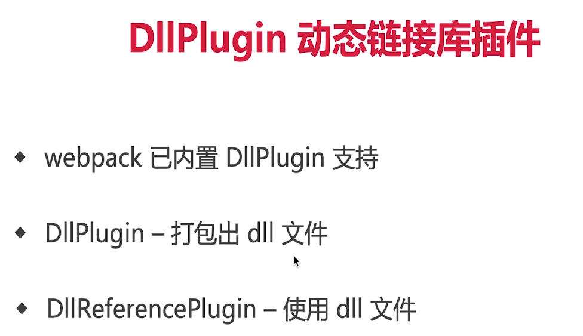

优化产出代码
体积更小
小图片base64
懒加载
提取公共代码
CDN加速publicpath
scope Hosting作用域提升
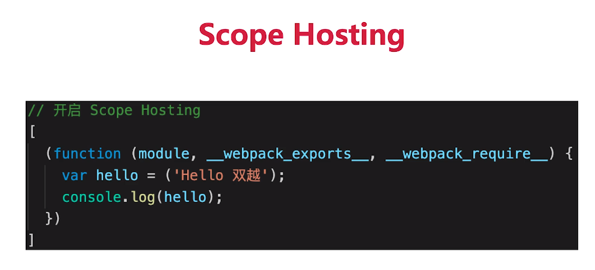
bundle加contenthash
使用production(自动tree-shaking,自动开启代码压缩)
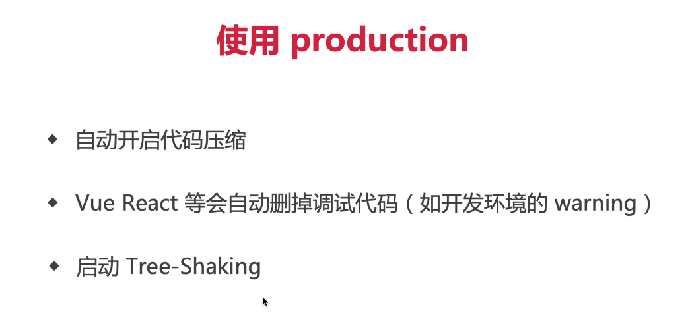
必须es6Module才能tree-shaking生效 CommonJS不行
前者静，后者动
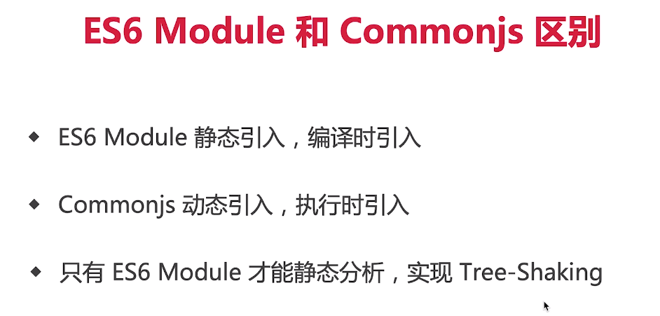
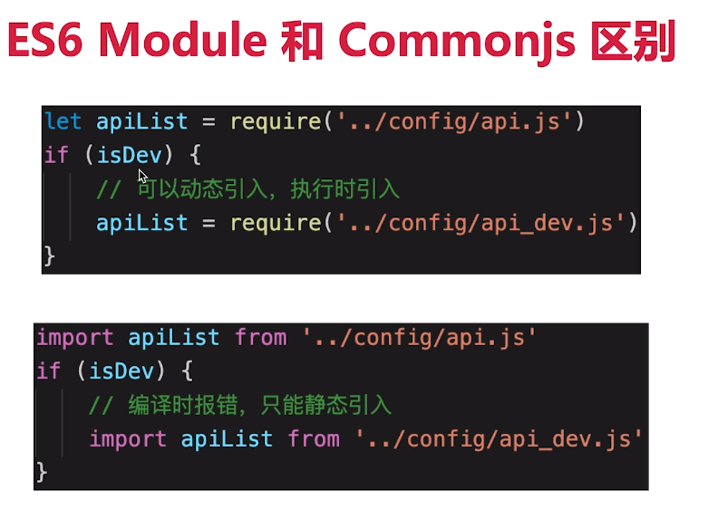

合理分包不重复加载
速度更快内存是用更少


babel解析es6/jsx
靠的是plugin转@babel/preset-env是一堆plugins的集合
babel-polyfill和babel-runtime
"devDependencies": {
    "@babel/cli": "^7.14.3",
    "@babel/core": "^7.14.3",
    "@babel/plugin-transform-runtime": "^7.14.3",
    "@babel/preset-env": "^7.14.4",
    "@babel/preset-react": "^7.13.13",
 "dependencies": {
    "@babel/polyfill": "^7.12.1",
    "@babel/runtime": "^7.14.0",


```

问题

1. webpack 具体的作用
   1. 代码转换
   2. 文件优化
   3. 代码分割
   4. 模块合并
   5. 自动刷新
2. webpack 常见有哪些配置
   1. Entry：入口，Webpack 执行构建的第一步将从 Entry 开始，可抽象成输入。
   2. Output：输出结果，在 Webpack 经过一系列处理并得出最终想要的代码后输出结果。
   3. mode：提供 mode 配置选项，告知 webpack 使用相应模式的内置优化
   4. Module：模块，在 Webpack 里一切皆模块，一个模块对应着一个文件。
   5. Chunk：代码块，一个 Chunk 由多个模块组合而成，用于代码合并与分割。
   6. Loader：模块转换器，用于把模块原内容按照需求转换成新内容。
   7. Plugin：扩展插件，在 Webpack 构建流程中的特定时机注入扩展逻辑来改变构建结果或做你想要的事情。
3. webpack 工作流程
   1. 参数解析：从配置文件和 Shell 语句中读取与合并参数，得出最终的参数(mergeOptions)
   2. 找到入口文件：从 Entry 里配置的 Module 开始递归解析 Entry 依赖的所有 Module
   3. 调用 Loader 编译文件：每找到一个 Module， 就会根据配置的 Loader 去找出对应的转换规则
   4. 遍历 AST，收集依赖：对 Module 进行转换后，再解析出当前 Module 依赖的 Module
   5. 生成 Chunk：这些模块会以 Entry 为单位进行分组，一个 Entry 和其所有依赖的 Module 被分到一个组也就是一个 Chunk
   6. 输出文件：最后 Webpack 会把所有 Chunk 转换成文件输出
4. 常见 Loader 配置以及工作流程

```JS
// webpack.config.js
module.exports = {
  module: {
    rules: [
     {
        test: /\.vue$/,
        loader: 'vue-loader'
      },
      { test: /\.js$/, use: 'babel-loader' },
      {
        test: /\.css$/,
        use: [
          { loader: 'style-loader' },
          { loader: 'css-loader' },
          { loader: 'postcss-loader' },
        ]
      }
    ]
  }
};

```

         1. webpack.config.js 里配置了一个 模块 的 Loader；
         2. 遇到 相应模块 文件时，触发了 该模块的 loader;
         3. loader 接受了一个表示该 模块 文件内容的 source;
         4. loader 使用 webapck 提供的一系列 api 对 source 进行转换，得到一个 result(js 代码);
         5. 将 result 返回或者传递给下一个 Loader，直到处理完毕。

5. 常见 plugin 配置以及简易原理
   html-webpack-plugin 这个插件很重要，作用一是创建 HTML 页面文件到你的输出目录，作用二是将 webpack 打包后的 chunk 自动引入到这个 HTML 中
   DefinePlugin 定义全局常量
   UglifyJsPlugin js 压缩
   插件就像是一个插入到生产线中的一个功能，在特定的时机对生产线上的资源做处理。webpack 通过 Tapable 来组织这条复杂的生产线。 webpack 在编译过代码程中，会触发一系列 Tapable 钩子事件，插件所做的，就是找到相应的钩子，往上面挂上自己的任务，也就是注册事件，这样，当 webpack 构建的时候，插件注册的事件就会随着钩子的触发而执行了。
6. webpack 打包速度太慢怎么办
   1. 缩小编译范围，减少不必要的编译工作，即 modules、mainFields、noParse、includes、exclude、alias 全部用起来。

```JS
const resolve = dir => path.join(__dirname, '..', dir);
resolve: {
    modules: [ // 指定以下目录寻找第三方模块，避免webpack往父级目录递归搜索
        resolve('src'),
        resolve('node_modules'),
        resolve(config.common.layoutPath)
    ],
    mainFields: ['main'], // 只采用main字段作为入口文件描述字段，减少搜索步骤
    alias: {
        vue$: "vue/dist/vue.common",
        "@": resolve("src") // 缓存src目录为@符号，避免重复寻址
    }
},
module: {
    noParse: /jquery|lodash/, // 忽略未采用模块化的文件，因此jquery或lodash将不会被下面的loaders解析
    // noParse: function(content) {
    //     return /jquery|lodash/.test(content)
    // },
    rules: [
        {
            test: /\.js$/,
            include: [ // 表示只解析以下目录，减少loader处理范围
                resolve("src"),
                resolve(config.common.layoutPath)
            ],
            exclude: file => /test/.test(file), // 排除test目录文件
            loader: "happypack/loader?id=happy-babel" // 后面会介绍
        },
    ]
}

```

2.  webpack-parallel-uglify-plugin 插件（优化 js 压缩过程）
    webpack-parallel-uglify-plugin 能够把任务分解给多个子进程去并发的执行，子进程处理完后再把结果发送给主进程，从而实现并发编译，进而大幅提升 js 压缩速度
3.  HappyPack
    在 webpack 运行在 node 中打包的时候是单线程去一件一件事情的做，HappyPack 可以开启多个子进程去并发执行，子进程处理完后把结果交给主进程
4.  DLL 动态链接
    第三方库不是经常更新，打包的时候希望分开打包，来提升打包速度。打包 dll 需要新建一个 webpack 配置文件（webpack.dll.config.js），在打包 dll 的时候，webpack 做一个索引，写在 manifest 文件中。然后打包项目文件时只需要读取 manifest 文件。

## sourcemap 设置

sourcemap 可以帮助我们定位打包之前的代码。
sourcemap 是在开发的时候使用 `cheap-module-eval-source-map`， 而在发布上线的时候使用 `nosource-source-map`。
这里的 cheap 指的是只能定位到行，不能定位到列，对大多数人来说到行就够了，这样本地开发打包编译也快一点。module 指的是定位到源代码，而不是经过 loader 等处理后的代码。eval 指的是代码会包裹在 eval 函数执行。nosource 指的是仅显示出错的源代码位置，而无法定位到源代码，这对我们的生产环境起到了保护作用，避免被其他人拿到前端完整的源代码。
