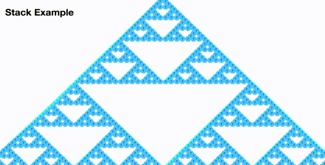
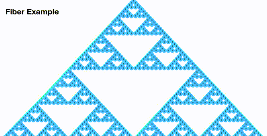
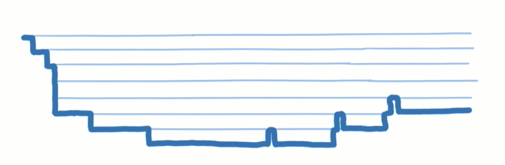
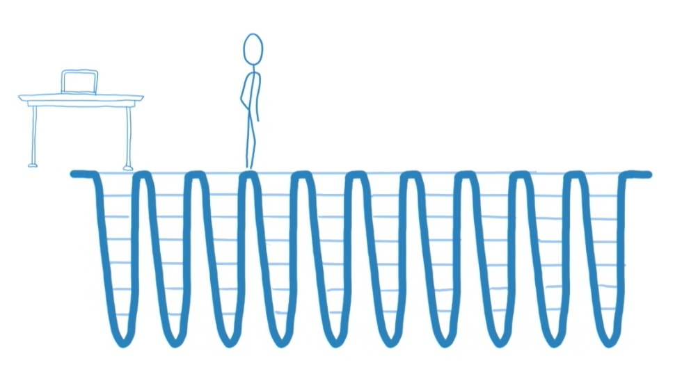
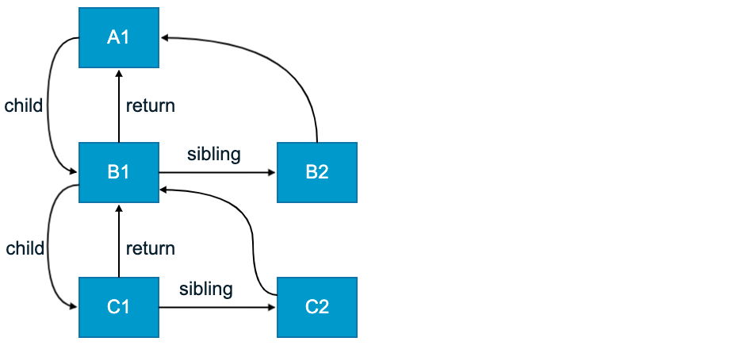
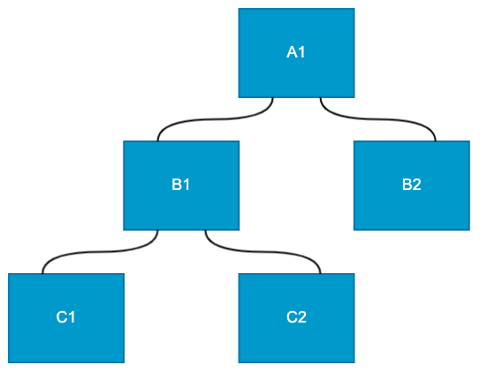
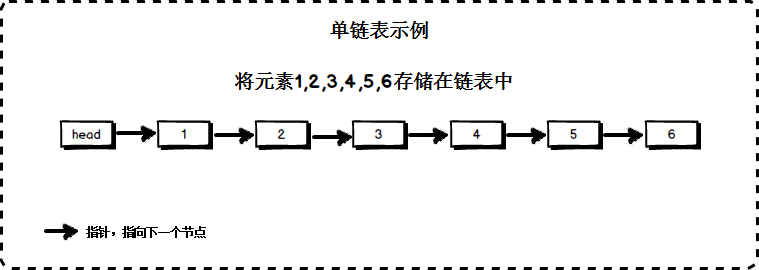
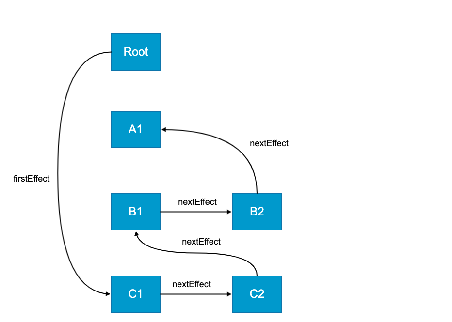
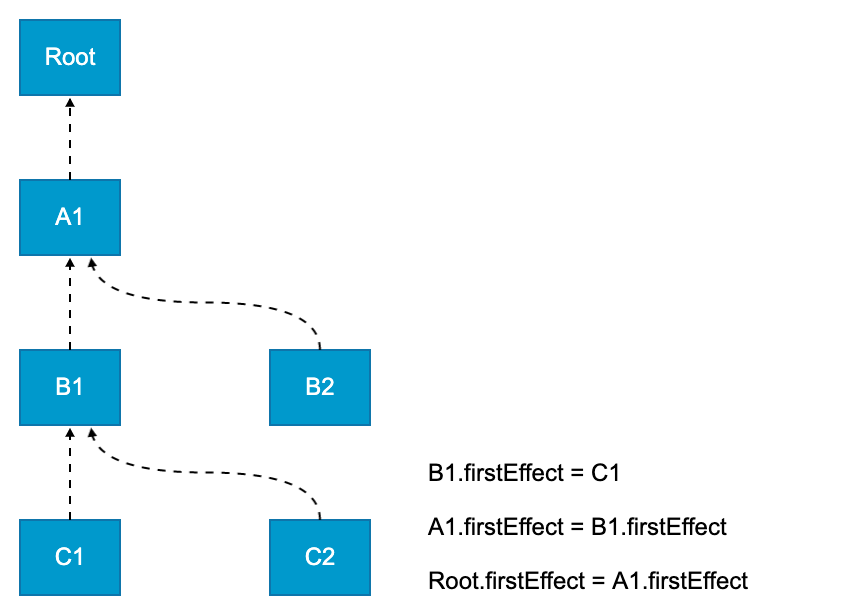

### 2. requestIdleCallback

#### 2.1 核心 API 功能介绍

利用浏览器的空余时间执行任务，如果有更高优先级的任务要执行时，当前执行的任务可以被终止，优先执行高级别任务。

```javascript
requestIdleCallback(function (deadline) {
  // deadline.timeRemaining() 获取浏览器的空余时间
})
```

#### 2.2 浏览器空余时间

页面是一帧一帧绘制出来的，当每秒绘制的帧数达到 60 时，页面是流畅的，小于这个值时， 用户会感觉到卡顿

1s 60 帧，每一帧分到的时间是 1000/60 ≈ 16 ms，如果每一帧执行的时间小于 16ms，就说明浏览器有空余时间

如果任务在剩余的时间内没有完成则会停止任务执行，继续优先执行主任务，也就是说 requestIdleCallback 总是利用浏览器的空余时间执行任务

#### 2.3 API 功能体验

页面中有两个按钮和一个 DIV，点击第一个按钮执行一项昂贵的计算，使其长期占用主线程，当计算任务执行的时候去点击第二个按钮更改页面中 DIV 的背景颜色。

使用 requestIdleCallback 就可以完美解决这个卡顿问题。

```html
<div class="playground" id="play">playground</div>
<button id="work">start work</button>
<button id="interaction">handle some user interaction</button>
```

```css
<style>
  .playground {
    background: palevioletred;
    padding: 20px;
    margin-bottom: 10px;
  }
</style>
```

```javascript
var play = document.getElementById('play')
var workBtn = document.getElementById('work')
var interactionBtn = document.getElementById('interaction')
var iterationCount = 100000000
var value = 0

var expensiveCalculation = function (IdleDeadline) {
  while (iterationCount > 0 && IdleDeadline.timeRemaining() > 1) {
    value = Math.random() < 0.5 ? value + Math.random() : value + Math.random()
    iterationCount = iterationCount - 1
  }
  requestIdleCallback(expensiveCalculation)
}

workBtn.addEventListener('click', function () {
  requestIdleCallback(expensiveCalculation)
})

interactionBtn.addEventListener('click', function () {
  play.style.background = 'palegreen'
})
```

### 3 Fiber

#### 3.1 问题

React 16 之前的版本比对更新 VirtualDOM 的过程是采用循环加递归实现的，这种比对方式有一个问题，就是一旦任务开始进行就无法中断，如果应用中组件数量庞大，主线程被长期占用，直到整棵 VirtualDOM 树比对更新完成之后主线程才能被释放，主线程才能执行其他任务。这就会导致一些用户交互，动画等任务无法立即得到执行，页面就会产生卡顿, 非常的影响用户体验。

核心问题：递归无法中断，执行重任务耗时长。 JavaScript 又是单线程，无法同时执行其他任务，导致任务延迟页面卡顿，用户体验差。

#### 3.2 解决方案

1. 利用浏览器空闲时间执行任务，拒绝长时间占用主线程
2. 放弃递归只采用循环，因为循环可以被中断
3. 任务拆分，将任务拆分成一个个的小任务

#### 3.3 实现思路

在 Fiber 方案中，为了实现任务的终止再继续，DOM 比对算法被分成了两部分：

1. 构建 Fiber:拆分 reconciliation(和解) (可中断),Diff 计算
2. 提交 Commit (不可中断)，将 Fiber 渲染成 DOM

DOM 初始渲染: virtualDOM -> Fiber -> Fiber[] -> DOM

DOM 更新操作: newFiber vs oldFiber -> Fiber[] -> DOM

#### 3.4 Fiber 对象

```
{
  type         节点类型 (元素, 文本, 组件)(具体的类型)
  props        节点属性
  stateNode    节点 DOM 对象 | 组件实例对象
  tag          节点标记 (对具体类型的分类 hostRoot || hostComponent || classComponent || functionComponent)
  effects      数组, 存储需要更改的 fiber 对象
  effectTag    当前 Fiber 要被执行的操作 (新增, 删除, 修改)
  `parent`       当前 Fiber 的父级 Fiber
  `child`        当前 Fiber 的子级 Fiber
  `sibling`      当前 Fiber 的下一个兄弟 Fiber
  alternate    Fiber 备份 fiber 比对时使用
}
```


#### 1. Fiber 出现的目的是什么

为了提高 React 渲染页面的效率，**减少页面卡顿**，提升用户体验。





#### 2. 在 Fiber 出现之前 React 存在什么问题

在 React 15 版本中采用的是 Virtual DOM 对比方案，通过对比 Virtual DOM 找出差异部分，从而只将差异部分更新到页面中，避免更新整体 DOM 以提高性能。

```html
<body>
  <ul id="list"></ul>
  <button id="btn">更改数据</button>
</body>
<script>
  let data = ['a', 'b', 'c', 'd', 'e']
  let list = document.getElementById('list')
  let btn = document.getElementById('btn')

  function renderData() {
    let str = ''
    for (let attr in data) {
      str += '<li>' + data[attr] + '</li>'
    }
    list.innerHTML = str
  }
  renderData()

  btn.onclick = function () {
    data[1] = '哈喽 摩托'
    renderData()
  }
</script>
```

在 Virtual DOM 比对的过程中 React **使用了递归，递归调用的过程不能被终止**，如果 Virtual DOM 的层级比较深，递归比对的过程就会长期占用主线程，而 JavaScript 又是单线程，不能同时执行多个任务，其他任务只能等待执行，而且 JavaScript 的执行和 UI 的渲染又是互斥的，此时用户要么看到的就是空白界面，要么就是有界面但是不能响应用户操作，处于卡顿状态，用户体验差。

核心就是递归比对的过程长期占用主线程产生了性能问题。



<video controls>
  <source src="./video/Recursion.mp4" type="video/mp4">
</video>

#### 3. 虚拟 DOM 是如何被转换为真实 DOM 的

[babel repl](https://babeljs.io/repl)
jsx 被 babel 转为 react.createElement 的 virtualDom

```js
const jsx = (
  <div id="a1">
    <div id="b1">
      <div id="c1"></div>
      <div id="c2"></div>
    </div>
    <div id="b2"></div>
  </div>
)
```

```js
function render(vdom, container) {
  // 创建 DOM 元素
  const element = document.createElement(vdom.type)
  // 为元素添加属性 (刨除 children)
  Object.keys(vdom.props)
    .filter(propName => propName !== 'children')
    .forEach(propName => (element[propName] = vdom.props[propName]))

  // 递归创建子元素
  if (Array.isArray(vdom.props.children)) {
    vdom.props.children.forEach(child => render(child, element))
  }
  // 将子元素追加到父级
  container.appendChild(element)
}

render(jsx, document.getElementById('root'))
```

#### 4. Fiber 如何解决性能问题

1. **递归转迭代，可以中止**
   在 Fiber 架构中 React 放弃了递归调用，采用循环来模拟递归，因为循环可以随时被中断。
2. **空闲时间执行任务**
   React 利用浏览器空闲时间执行比对任务， 解决了 React 执行比对任务长期占用主线程的问题。

React 在执行完一个任务单元后，查看是否有其他的高优先级任务，如果有，放弃占用主线程，先执行优先级高的任务。



#### 5. 什么是 Fiber（两层含义）

1. **Fiber 是一个执行单元**

   在 React 15 中，将 VirtualDOM 树整体看成一个任务进行递归处理，任务整体庞大执行耗时且不能中断。

   在 React 16 中，将整个任务拆分成了一个一个小的任务进行处理，每一个小的任务指的就是一个 Fiber 节点的构建。

   任务会在浏览器的空闲时间被执行，每个单元执行完成后，React 都会检查是否还有空余时间，如果有就交还主线程的控制权。

   

   1. 将任务拆分成了一个一个小的任务单元
   2. 闲时执行任务

2. **Fiber 是一种数据结构**

   Fiber 是一种数据结构，支撑 Fiber 构建任务的运转。

   **当某一个 Fiber 任务执行完成后，怎样去找下一个要执行的 Fiber 任务呢**？

   React 通过**链表结构**找到下一个要执行的任务单元。

   要构建链表结构，需要知道每一个节点的**父级节点**是谁，要知道他的**子级节点**是谁，要知道他的**下一个兄弟节点**是谁。

   Fiber 其实就是 JavaScript 对象，在这个对象中有 child 属性表示节点的子节点，有 sibling 属性表示节点的下一个兄弟节点，有 return 属性表示节点的父级节点。

   ```javascript
   type Fiber = {
     // 组件类型 div、span、组件构造函数
     type: any,
     // DOM 对象
     stateNode: any,
     // 指向自己的父级 Fiber 对象
     return: Fiber | null,
     // 指向自己的第一个子级 Fiber 对象
     child: Fiber | null,
     // 指向自己的下一个兄弟 iber 对象
     sibling: Fiber | null,
   }
   ```

      

#### 6. Fiber 的工作方式

Fiber 的工作分为两个阶段：**render 阶段和 commit 阶段**。

render 阶段：构建 Fiber 对象，构建链表，在链表中标记要执行的 DOM 操作 ，可中断。

commit 阶段：根据构建好的链表进行 DOM 操作，不可中断。



**先从上向下走，构建节点对应的 Fiber 对象，然后找同级兄弟，然后再从下向上走，构建 Fiber 对象及链表**。
render 找出差异
commit 更新差异

#### 7. 实现 Fiber

```js
import React from 'js'

const jsx = (
  <div id="a1">
    <div id="b1">
      <div id="c1"></div>
      <div id="c2"></div>
    </div>
    <div id="b2"></div>
  </div>
)

const container = document.getElementById('root')

/**
 * 1. 为每一个节点构建 Fiber 对象
 * 2. 构建 Fiber 链表
 * 3. 提交 Fiber 链接
 */

// 创建根元素 Fiber 对象
const workInProgressRoot = {
  stateNode: container,
  props: {
    children: [jsx],
  },
}

let nextUnitOfWork = workInProgressRoot

function workLoop(deadline) {
  // 如果下一个要构建的执行单元存在并且浏览器有空余时间
  while (nextUnitOfWork && deadline.timeRemaining() > 0) {
    // 构建执行单元并返回新的执行单元
    nextUnitOfWork = performUnitOfWork(nextUnitOfWork)
  }
  // 如果所有的执行单元都已经构建完成
  if (!nextUnitOfWork) {
    // 进入到第二个阶段 执行 DOM 操作
    commitRoot()
  }
}
// Fiber 工作的第一个阶段
function performUnitOfWork(workInProgress) {
  // 构建阶段向下走的过程
  // 1. 创建当前 Fiber 节点的 DOM 对象并存储在 stateNode 属性中
  // 2. 构建子级 Fiber 对象
  beginWork(workInProgress)
  // 如果子级存在
  if (workInProgress.child) {
    // 返回子级 构建子级的子级
    return workInProgress.child
  }
  // 开始构建阶段向上走的过程
  // 如果父级存在
  while (workInProgress) {
    // 构建 Fiber 链表
    completeUnitOfWork(workInProgress)
    // 如果同级存在
    if (workInProgress.sibling) {
      // 返回同级 构建同级的子级
      return workInProgress.sibling
    }
    // 同级不存在 退回父级 看父级是否有同级
    workInProgress = workInProgress.return
  }
}

function beginWork(workInProgress) {
  // 如果 Fiber 对象没有存储其对应的 DOM 对象
  if (!workInProgress.stateNode) {
    // 创建 DOM 对象并存储在 Fiber 对象中
    workInProgress.stateNode = document.createElement(workInProgress.type)
    // 为 DOM 对象添加属性
    for (let attr in workInProgress.props) {
      if (attr !== 'children') {
        workInProgress.stateNode[attr] = workInProgress.props[attr]
      }
    }
  }
  // 创建子级 Fiber 对象
  if (Array.isArray(workInProgress.props.children)) {
    // 记录上一次创建的子级 Fiber 对象
    let previousFiber = null
    // 遍历子级
    workInProgress.props.children.forEach((child, index) => {
      // 创建子级 Fiber 对象
      let childFiber = {
        type: child.type,
        props: child.props,
        return: workInProgress,
        effectTag: 'PLACEMENT',
      }
      // 第一个子级挂载到父级的 child 属性中
      if (index === 0) {
        workInProgress.child = childFiber
      } else {
        // 其他子级挂载到自己的上一个兄弟的 sibling 属性中
        previousFiber.sibling = childFiber
      }
      // 更新上一个子级
      previousFiber = childFiber
    })
  }
}

function completeUnitOfWork(workInProgress) {
  let returnFiber = workInProgress.return

  if (returnFiber) {
    // 链头上移
    if (!returnFiber.firstEffect) {
      returnFiber.firstEffect = workInProgress.firstEffect
    }
    // lastEffect 上移
    if (!returnFiber.lastEffect) {
      returnFiber.lastEffect = workInProgress.lastEffect
    }
    // 构建链表
    if (workInProgress.effectTag) {
      if (returnFiber.lastEffect) {
        returnFiber.lastEffect.nextEffect = workInProgress
      } else {
        returnFiber.firstEffect = workInProgress
      }
      returnFiber.lastEffect = workInProgress
    }
  }
}

// Fiber 工作的第二阶段
function commitRoot() {
  // 获取链表中第一个要执行的 DOM 操作
  let currentFiber = workInProgressRoot.firstEffect
  // 判断要执行 DOM 操作的 Fiber 对象是否存在
  while (currentFiber) {
    // 执行 DOM 操作
    currentFiber.return.stateNode.appendChild(currentFiber.stateNode)
    // 从链表中取出下一个要执行 DOM 操作的 Fiber 对象
    currentFiber = currentFiber.nextEffect
  }
}

// 在浏览器空闲的时候开始构建
requestIdleCallback(workLoop)
```

#### 8. 构建 Fiber 链表

1. 什么是链表

   

   通过链表可以按照顺序存储内容

2. 链表的构建顺序是怎么样的 ？

   链表的顺序是由 DOM 操作的顺序决定的，c1 是第一个要执行 DOM 操作的所以它是链的开始，A1 是最后一个被添加到 Root 中的元素，所以它是链的最后。

   

3. 如何向链的尾部添加新元素？

   在链表结构中通过 nextEffect 存储链中的下一项。

   在构建链表的过程中，需要通过一个变量存储链表中的最新项，每次添加新项时都使用这个变量，每次操作完成后都需要更新它。这个变量在源码中叫做 lastEffect。

   lastEffect 是存储在当前 Fiber 对象的父级上的，当父级发生变化时，为避免链接顺序发生错乱，lastEffect 要先上移然后再追加 nextEffect

4. 将链表保存在什么位置？

   链表需要被保存在 Root 中，因为在进入到第二阶段时，也就是 commitRoot 方法中，是将 Root 提交到第二阶段的。

   在源码中，Root Fiber 下有一个叫 firstEffect 的属性，用于存储链表。

   在构建链表的遍历过程中，C1 开始，Root 是结尾，如何才能将 C1 存储到 Root 中呢？

   其实是链头的不断上移做到的。

   
