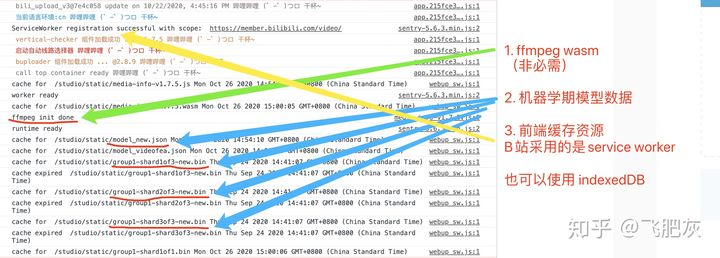

# 机器学习在前端的应用（一）（上传视频推荐封面图功能解析）

机器学习的大体流程分为三个流程：

1. 对已有数据集进行模型训练，

2. 将训练好的模型投入到实际应用中，预测当前结果，

3. 收集应用的最终结果（预测不准的情况下，通常会有人工干预）再反馈给数据集，进行持续迭代优化训练。

## 算法前置趋势

但是，随着客户端机器的性能越来越好，已经开始出现了把算法能力前置到浏览器上的趋势。 这背后主要依赖三种底层技术：

1. webgl： 对于绝大多数浏览器来说，webgl 是可以直接使用，通过 webgl 直接`调用硬件 GPU 的并行计算能力`，这已经是一个很常规的动作。

2. wasm： 在 firefox/chrome 上都有很好的支持，浏览器可以直接运行性能最优的 C/C++ 代码。

3. worker：采用多个 worker 的方式来处理大量高负荷计算，相对于上面两种方案来说，worker 应该是最慢的方案。

一些知名的前端机器学习的库都在充分利用这些这些特性，端层算法已经越来越成熟了。

在国内的互联网公司中，在前端应用部署机器学习应用，走在最前面的应该当属 bilibili 了。 B 站在今年年初的时候上线了一个新的功能：在 UP 主上传视频的时候，浏览器在用户等待的这段时间里，会去分析用户本地上传的视频中的截图，挑选出质量最佳的几张图片推荐给用户作为封面备选，这所有的过程都是在浏览器上完成的。

## B 站到底做了什么？

在 chrome 上打开 B 站的投稿页，打开控制台可以看到以下三条关键线索。

1. ffmepg wasm 在这里的作用只有一个，支持解码任意格式的本地视频，从本地视频中截出图片。实际上 HTML 上的 video 自身也具备一定的解码功能，不需要做额外的工作，也能离屏截图。如果没有`解码`方面的需求，video 标签是够用的。

虽说理论上，使用 wasm 可以能到更好的解码性能，但是在我的实际测试中，这种优势完全看不出来，反而很多时候 video 标签的性能更好。

所以说，如果不需要支持任意格式的视频，ffmpeg wasm 在这里不是必需的。

2. 机器学习模型数据，更确切地说，这个是 tensorflow.js 转出来的模型数据，它主要两部分组成：

模型的 manifest json 文件，描述该模型的网络结构，以及权重数据的数量和名称。
二进制的权重数据文件，数量可能多个，在 json 里有描述。

3. 前端缓存(service worker 缓存资源)

因为 B 站使用了 ffmepg wasm (1-2 Mb) 和机器学习模型 （9 Mb), 这些资源对于前端来说是大型资源，需要做前端缓存才能投入到实际应用中。

在这个例子里面，B 站采用的是 PWA `service worker` 方案，这是种很常见的方案，有一个硬性要求资源必需是同源的。也可以采用`indexedDB 的方式来做前端大资源缓存，这种方案没有同源要求`。

## 具体实现过程如下：

1. 通过 `ffmepg 或原生 HTML video 标签离屏解码本地视频`，按照一定的规则和频率从视频中获取图片，图片的数量一般为 50 – 100 张，考虑到内存占用情况，数量一般不会超过 100。

2. 使用 `tensorflow 模型对每一张图片进行打分`，输入是图片，输出是分数，这是一个最简单的机器学习应用。分数高的代表图片质量好，分数低的代表图片质量低。 在我们测试 B 站的模型时（满分 5 分），有人的图片分数往往较高，没有人的图片分数较低。

3. 相似度去重，这一点非常重要，推荐近似重复的图片给用户是没有意义的。对于一个任意视频进行采样截图操作，是无法保证不存在重复和类似的。所以，这里还需要加上一个操作，计算每张图片的 pHash，以 pHash 作为图片的粗粒度的相似度值。

4. 将图片按照分数进行排序，并且将分数最高的图片放入推荐备选池。

5. 将下一张图与备选池中的图片进行相似度比较，满足条件放入备选池，否则依次往下。

6. 到备选池图片足够时，可以结束选图过程。

到目前为止，按照上面的步骤，B 站的视频上传封面推荐的功能就可以完整地实现出来了，虽然我们并没有接触过 B 站的源码。实际上，某大型视频网站也很快地做出了类似的功能（SDK 是我实现的）, 实现细节稍微有些区别，比如：我们使用的是 indexedDB 做缓存，没有采用 PWA 方案，tensorflow 模型是自己的算法团队基于自有数据训练的模型。并且在此基础之上，我们再往前走了一步：`在用户选择完封面的时候，我们会把用户当时选择的图片，和推荐备选池中的图片一起上传到服务器，这些数据会用于模型的迭代训练，持续优化模型。`

## 总结

上传视频推荐封面，是一个非常不错的需求，通常情况下，一个视频上传通常是非常耗时的过程，而且这段时间，用户除了等待什么都做不了，加了一个封面推荐的功能，对于用户来说，非常贴心的。

在这个例子里面，只是用到了一个机器学习最简单的模型：打分模型，输入一张图片，输出一个分数。实际上，还有很多功能更强大的机器学习模型完全可以直接投入到应用中，我们会在后面的系列文章中继续深入讨论。

ffmpeg 不是必需的，选型 ffmpeg 的唯一考量就是是否`需要支持任意格式的视频文件`，video 做不到这个. video 的离屏截图只是一个简单的小技巧，`例如设置为 muted，js 控制跳转`. 最终的截图一定会到 canvas，canvas 一样可以离屏. 希望能解答你的问题.

# 机器学习在前端的应用（二）(口红试色功能解析)

## 如何在图片/视频中找出人物的嘴唇轮廓

口红试色功能中的核心问题是需要找出图片/视频中的人脸的嘴唇轮廓区域坐标，并且在性能上能够满足实时性要求。为了解决这个问题，我们需要用到 2 个机器学习模型：`blazeface` 模型 和 `facemesh` 模型。先通过 blazeface 模型首先找出人脸所在的矩形区域，将查找范围缩小。然后再通过 facemesh 模型在人脸矩形区域内去找出嘴唇的轮廓。
对于人脸区域检测，实际上，您也可以使用 openCV.js ( 它是 open CV 的 wasm 版本) , 但是 OpenCV.js 有 8 MB 左右的大小，相比之下，blazeface 模型（460 KB）的优势还是非常明显的。
这个模型还是非常有用的，特别适用于`通过模板来自动合成图片`的场景，例如，上传任意人物图片，合成类似身份证那种固定模板的图片。感兴趣的同学，可以自己动手试试，应用这个模型可以很容易实现。

facemesh 的模型数据相较于 blazeface 模型更为复杂，它大概有 3.1 MB。
需要注意的一点是，在 facemesh 模型的使用封装内部，它是依赖 blazeface 模型的结果输出作为它的输入。
facemesh 模型它输出整个面部的网格坐标，它包括眼睛，眉毛，眉心，面部轮廓，鼻子，脸颊，嘴唇等等。实际上，它们是三维坐标，包含了 z 轴方向上的深度信息。通过 facemesh 模型，我们只需要它的输出结果里的 4 种标注坐标（上嘴唇外轮廓，上嘴唇内轮廓，下嘴唇外轮廓，下嘴唇内轮廓），就可以把嘴唇的轮廓描述出来，并且绘制在画布上。并且它的运行速度，完全能够满足实时视频要求。对于口红试色这种特定的应用场景，我们的需求已经基本得到实现了。

## 总结

口红试色的这个功能已经在很多电商网站 �?APP 上都已经应用上线，同样的代码基本上也是可以在微信小程序上运行。它们为了达到实时性的效果，基本都采用在前端部署机器学习模型，整个过程完全不消耗任何服务端和网络资源 �?/p>

`facemesh` 模型的功能很强大，口红试色只是在这里小试牛刀，我们可以应用它来做很多事情，比如，抖音视频中添加表情包，`猫耳朵/猪鼻子`等等功能。您只需要对挂件绘制的部分做些功课，那些酷炫的视频动态表情包，都是可以实现的 �?/p>
