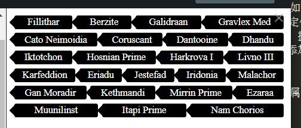

# 盒模型、浮动、position、display、单双三列布局

## 盒子模型

content-box 要求内容始终是设定的 width 和 height；
border-box 指定的 width/height 包含了内边距和边框

## 外边距折叠

常规块盒子有一种机制叫外边距折叠，即垂直方向上的两个外边距相遇时，会折叠成一个外边距，且折叠之后的外边距高度为两者之中`较大的那一个`

外边距折叠好像很奇怪，实际上却很有用。当一个页面包含了多个段落，如果没有外边距折叠，从第二个段落开始，所有段落的间距都是最上方段落的上外边距的两倍，有了外边距折叠，段落间距才会相等。
如果想要清除两个盒子之间的外边距折叠，可以给目标盒子设置以下属性：

1. display: inline-block
2. float 属性值不是"none"的元素
3. `绝对定位` (常用)

## 定位

绝对定位元素的父级是距离该元素最近的定位祖先，也就是"position"属性不为"static"的最近任意祖先。如果没有这个定位祖先，那么绝对定位元素就相对于文档的根元素"html"进行定位。
绝对定位非常适合创建弹出层、提示和对话框等覆盖于其他内容之上的组件。比如有一篇文章，可以给文章添加一些`行内的评注`，最好以气泡图的样式显示在文章外部的空白区域中。

z-index 可以设置为负数；该属性只能作用于`定位元素`。

## display

flex

1. flex-grow：拉伸弹性系数，如果`容器宽度减去弹性项的基础值之和之后`还有剩余空间，那么就按照弹性系数比例去分配剩余空间
2. flex-shrink：缩减弹性系数，和拉伸弹性系数逻辑相反
3. flex-basis：基础值
   这三个属性应用给弹性项，而不是容器。
   给所有的"li"添加"flex: 1 1 0"（**即 flex:1**）属性，该属性的三个值分别为 flex-grow、flex-shrink 和 flex-basis，表示：当有剩余空间时均匀分配剩余空间、当超出容器宽度时进行缩放、弹性项的基础值都为容器的 0%
   flex: 1 1 auto 表示什么：`auto 代表在计算剩余空间时需要减去每个标签自身的宽度`而不是之前讲的 0%那样忽略了自身的宽度
   
