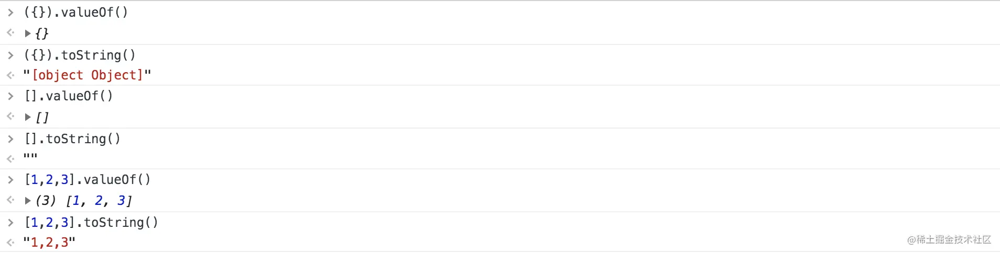

1. 下列代码的输出

```JS
   if ([] == false) {console.log(1);}
   if ({} == false) {console.log(1);}
   if ([]) {console.log(1);}
   if ([1] == [1]) {console.log(1);}

   1,无,1,无


```

`对象与原始类型相比较`时，会把对象按照对象转换规则转换成原始类型，再比较。
当对象转为其他原始类型时，`会先调用对象的 valueOf()方法`，如果 valueOf()方法返回的是原始类型，则直接返回这个原始类型
如果 valueOf()方法返回的是不是原始类型或者 valueOf()方法不存在，`则继续调用对象的 toString()方法`，如果 toString()方法返回的是原始类型，则直接返回这个原始类型,如果不是原始类型，则直接报错抛出异常。
https://juejin.cn/post/6844903934876745735


```JS
 {} == 0  // false
 {} == '[object object]'  // true
 [] == false  // true；最终转化成`数字`
 [1,2,3] == '1,2,3' // true
```

如果两个对象指向同一个对象，相等操作符返回 true，否则为 false。

```JS
  [] == []  // false
  {} == {}  // false
  [] != []  // true
```

取非的含义时什么呢？
逻辑非 (!) 的优先级高于相等操作符 ( == )

```JS
[] == ![]  // true；等价于[] == false
{} == !{}  // false；等价于{} == false
```

2. 对一个文件的访问，常由（ 用户访问权限和文件属性 ）共同限制
3. TCP 比 UDP 更适合局域网，UDP 更适合广域网，要是都需要三次握手，广域网性能就跟不上
4. 用谷歌浏览器设置断点逐步调试，是在控制台的哪个 Tab 下。
   Elements
   Console
   Network
   `Sources`
5. clientWidth 属性是一个只读属性，它返回该元素的像素宽度，宽度包含内边距（padding），`不包含边框（border），外边距（margin）和滚动条`
6. this 指向

```JS

 指向global


 var a = "window";
  var test = {
    a: "test",
    getAFunc: function () {
      return function () {
        return this.a;
      };
    }
  };
  console.log(test.getAFunc()());


  var a = "window";
  var test = {
    a: "test",
    getAFunc: () => {
      return () => {
        return this.a;
      };
    }
  };
  console.log(test.getAFunc()());

  指向函数调用者obj
  var a = "window";
  var test = {
    a: "test",
    getAFunc: function () {
      var self = this
      return function () {
        return self.a;
      };
    }
  };
  console.log(test.getAFunc()());

  var a = "window";
  var test = {
    a: "test",
    getAFunc: function () {
      return () => {
        return this.a;
      };
    }
  };
  console.log(test.getAFunc()());
```
