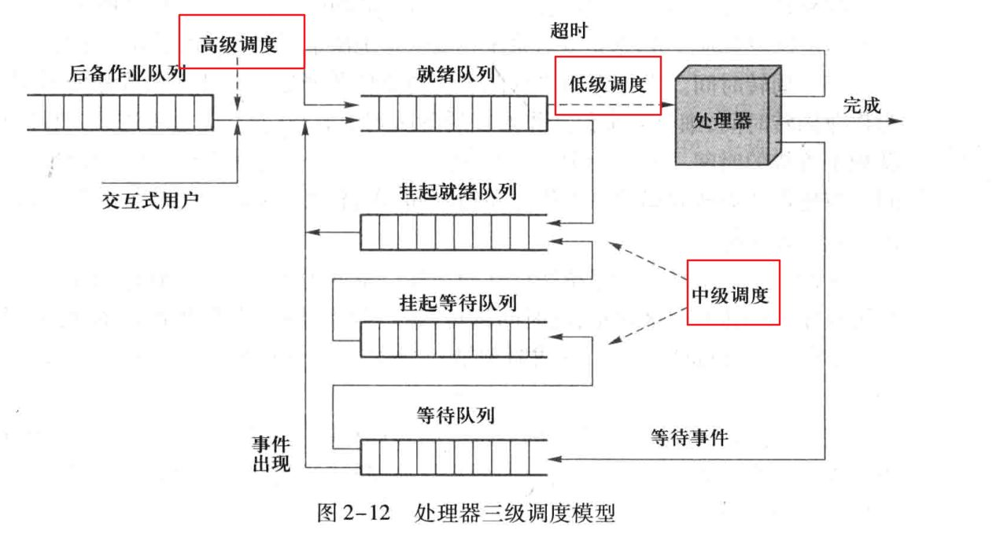
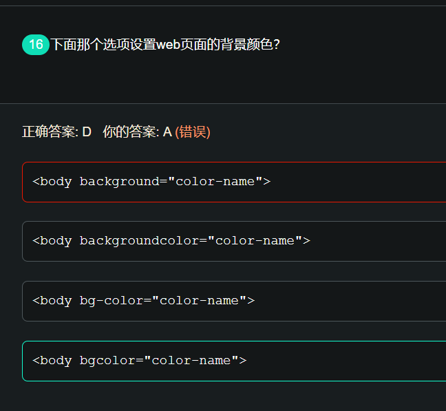

1. CPU 调度
   高级调度是作业调度；中级调度是交换调度；低级调度是进程调度
   

- 高级调度：即作业调度，按照一定策略将选择磁盘上的程序装入内存，并建立进程
- 中级调度：即交换调度，按照一定策略在内外存之间进行数据交换。
- 低级调度：即 CPU 调度（进程调度），按照`一定策略`选择就绪进程，占用 cpu 执行。
  短作业优先/先来先服务/最短剩余时间优先

2. 变量 el 为一个<div class="a">元素，哪段代码能得到其滚动内容的高度( )
   `el.scrollHeight`
   ScrollHeight 滚动内容高度。clientHeight 可视内容高度 ScrollTop 滚动过的高度
3. 一棵二叉树有 n 个元素，n>0,它的高度最大为 n，最小高度为[log2n]+1。
4. 网络地址转换 NAT
   - 可同时实现地址和端口转换
     最初是为了解决 Internet IPv4 地址数量有限的问题而开发的。
5. 从一个大量整数中找出最大的 `10` 个数，以下使用最优的算法是
   最大堆算法
6. 关于进程和线程描述正确的是？

- 进程是系统进行资源分配和调度的一个独立单位
- 线程可以可与同属一个进程的其他的线程共享进程所拥有的全部资源

7. body 标签的两个属性 background 和 bgcolor，其中 background 只能写 url 表示背景图像,bgcolor 写背景颜色
   Html5 不支持，Html4.01 已废弃
   bgcolor:文档的背景颜色。此方法不符合规范，请使用 CSS 的 background-color 属性替代
   
8. `console.log([1,undefined,3,5].map((_, n) => n))`
   [0,1,2,3]
   不会忽略 undefined；只会忽略 empty
   `console.log([1,,3,5].map((_,n) => n))`
   [0,empty,2,3]
9. `js 通过 document.cookie 来读取 cookie，通过 document.cookie=''来清除 cookie;` 的说法是错误的
   如果要删除某个 Cookie，则只需要新建一个同名的 Cookie，并将 maxAge 设置为 0，并覆盖原来的 Cookie

```JS
function eraseCookie(name) {
    document.cookie = name + '=; Max-Age=0'
}
```

10. 以下选项中不会让元素完全从渲染树中消失，渲染元素继续占据空间的是？
    visibility:hidden;
    opacity:0
    overflow:hidden
    `display:none 不只是隐藏标签, 是删除标签, 其他都只是隐藏`
11. 以下哪些，可以当作 head 的子标签？
    script
    style
    meta
    link
12. Symbol 是一种 JS 原始数据类型
    Symbol() instanceof Object `结果为 false`
    Symbol instanceof Object `结果为 true` 因为 Symbol 是函数
13. 操作系统有四个特征：并发，共享，异步，虚拟
14. 常见的负载均衡算法有？
    随机法(也算)
    轮询
    加权轮询
    一致性哈希
15. 常见的缓存淘汰算法有？
    LFU：如果数据在过去一段时间被访问的次数很少，那么将来被访问的概率也会很低
    LRU：利用局部性原理，根据一个作业在执行过程中过去的页面访问历史来推测未来的行为
    FIFO：最早调入主存的页面不再被使用的可能性最大。

16. 下面不属于应用层的协议是?
    HTTP
    DNS
    SMTP
    `ICMP`：网络层协议
    注意 DNS 也是应用层协议
