## Java 程序员，别用 Stack？！

这篇文章是我公众号上的一篇文章，探讨了 Java 语言中的一个设计问题。大家闲的没事儿，可以看一看：）

 

---

在 Leetcode 的交流区，可以看到这样的一个讨论：

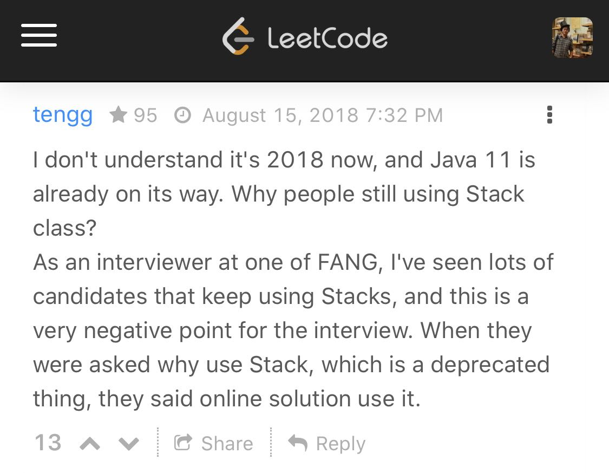

翻译：

> 我不明白，为什么现在已经 2018 年了（这是 2018 年的帖子），Java 11 马上就要推出了，为什么还有人使用 Java 中的 Stack 类？
>
> 作为硅谷大厂的一名面试官，我见过太多的面试候选人使用 Stack 类。从面试的角度，这非常不好（这篇帖子的后续讨论，甚至有人提到，这可能使你丢掉一个 offer）。
>
> 当被问到为什么使用 Stack 类时，大多数人只是回答：网上的解答是这么写的。

 

那么问题来了。Java 的 Stack 类到底怎么了？

这篇文章，我将试图讲明白这个问题。

注意：这篇文章是专门针对 Java 程序员的一个技术细节的讨论。这篇文章不是在说“栈”这种数据结构不被推荐使用，而是在说 Java 语言中，Stack 这个类不被推荐使用。

在阐述这个问题的过程中，我意外地发现这样一个看似简单的话题，可以涉及到的内容出奇的多。为了让整篇文章的逻辑更清晰，我将使用问答（Q&A）的形式组织整个内容。

 

---

**Q：在 Java 语言中，不推荐使用 Stack 类？**

是的。实际上，这个不推荐不是某个技术专家或者某个企业的规范标准，而是来自 Java 官方。

如果大家在 Java 中查询 Stack 的文档，就会看到如下的说明：

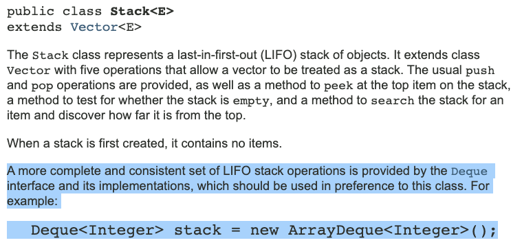

链接：[https://docs.oracle.com/javase/7/docs/api/java/util/Stack.html](https://docs.oracle.com/javase/7/docs/api/java/util/Stack.html)

 

注意我标注的地方。

简单翻译：一个更加完整，一致的，后进先出的栈相关的操作，应该由 Deque 接口提供。并且，也推荐使用 **Deque** 这种数据结构（比如 ArrayDeque）来实现。

因此，如果你想使用栈这种数据结构，Java 官方推荐的写法是这样的（假设容器中的类型是 Integer）：

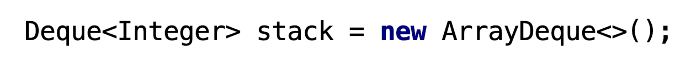

下面，我们先来看看 Stack 到底怎么了？再来看看为什么使用 Deque？

 

**Q：Java 中的 Stack 类到底怎么了？**

Java 中的 Stack 类，最大的问题是，继承了 Vector 这个类。根据 Java 官方文档中的类关系，如下所示：

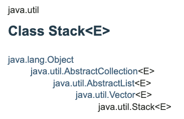

Vector 是什么类？简单来说，Vector 就是一个动态数组。

大家应该都知道，ArrayList 也是动态数组。ArrayList 和 Vector 的区别我们后面再讨论。我们先来看一下，Stack 这个类继承 Vector，会产生什么问题？

最大的问题在于，**继承使得子类继承了父类的所有公有方法**。

而 Vector 作为动态数组，是有能力在数组中的任何位置添加或者删除元素的。因此，Stack 继承了 Vector，Stack 也有这样的能力！

大家可以尝试如下的代码片段，在 Java 中是正确的：

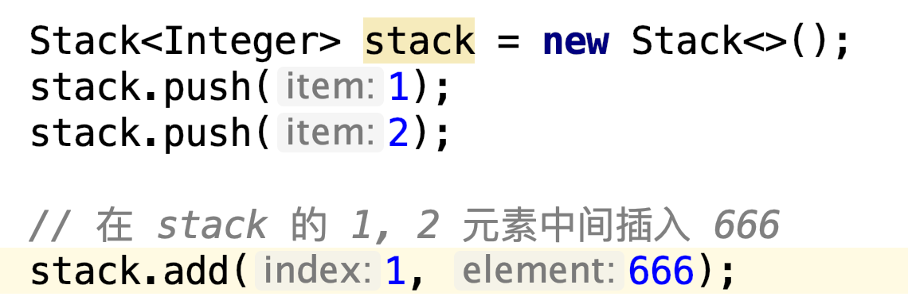

但很显然，我们不希望对于栈来说，可以指定在 1 这个位置插入一个 666。这一点都不 666，而是破坏了栈这种数据结构的封装。

大家要知道，封装的一大意义，就是向用户屏蔽用户不需要的操作。否则，用户可能会有意无意地调用这些操作，这将成为软件工程中重要的 bug 来源。

 

**Q：问题出在哪里？**

Java 中的 Stack 实现，是被业界一直认为非常糟糕的实现。实际上，它犯了面向对象设计领域的一个基本错误：**Stack 和 Vector 之间的关系，不应该是继承关系，而应该是组合关系（composition）。**

关于继承关系和组合关系的区别，相信大家在 OOD 学习过程中，听过无数遍。

 

继承关系描述的是 **is-a** 的关系，即“是一个”的关系。

猫是一个动物，所以猫这个类可以继承动物类；

程序员是一个雇员，所以程序员这个类可以继承雇员类。

 

而组合关系描述的是 **has-a** 的关系，即“有一个”的关系。

车里有一台发动机，所以发动机这个类和车这个类之间，应该是组合关系，即车中包含一个成员变量，是发动机这个类的对象；

电脑里有 CPU，内存，显卡。所以 CPU，内存，显卡，这些类和电脑类之间的关系，都应该是组合关系。

 

上面这些例子，都是我们在生活中看得到摸得到的实体，我们在做类设计的时候，通常不会犯糊涂。但遇到更抽象的对象的时候，事情可能就不一样了。

比如，栈这种数据结构，和动态数组这种数据结构之间，到底应该是 is-a 的关系？还是 has-a 的关系？

使用自然语言描述，听起来似乎说：栈是一个动态数组，毛病不大。但其实仔细思考，就会发现，**栈不是一个动态数组！**

 

因此，很多时候，对于现实中并不存在的设计对象，人类很可能想不清楚 is-a 和 has-a 的关系。在这里，我再提供一个简单的原则：**判断一下，如果设计成继承关系的话，我们是否有可能把子类进行向上的父类转型？如果可能，则应该设计成继承关系，否则应该是组合关系。**

换句话说，在这个例子中，我们是否可能将栈当做一个动态数组使用？答案是不可能。所以，栈和动态数组之间的关系不应该是继承关系。

 

实际上，在真实的世界中，真正的继承关系是很少的。真正的继承关系中，父类大多是一个很抽象的概念，比如“人”，比如“动物”。但是我们设计的大多数类，不是这么抽象的概念。整体来说，组成关系更常用。

这个概念不是我说的，而是业界公认的 OOP 设计原则。叫做：**Composition over inheritance。**如果用中文说，就是**应该优先考虑组合关系。**

在 OOP 设计中，很多人会更倾向于使用继承关系，毕竟继承关系看起来更“面向对象”一些，也是面向对象讲解的重点。但是，在具体实践中，组合更常见！说得再绝对一些：**多用组合，少用继承！**

大名鼎鼎的 Design Patterns 中，也强调了这个原则。

如果大家在网上搜索 Composition over inheritance，会看到很多相关讨论。有兴趣的同学，也可以参考维基百科的这个词条：

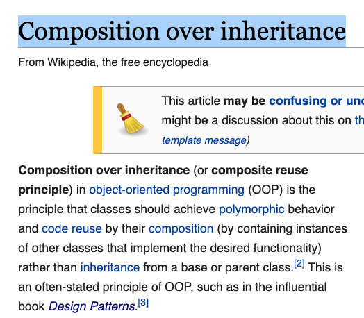

 

所以，一个更好的，基于 Vector 的栈的实现，应该是这样的：

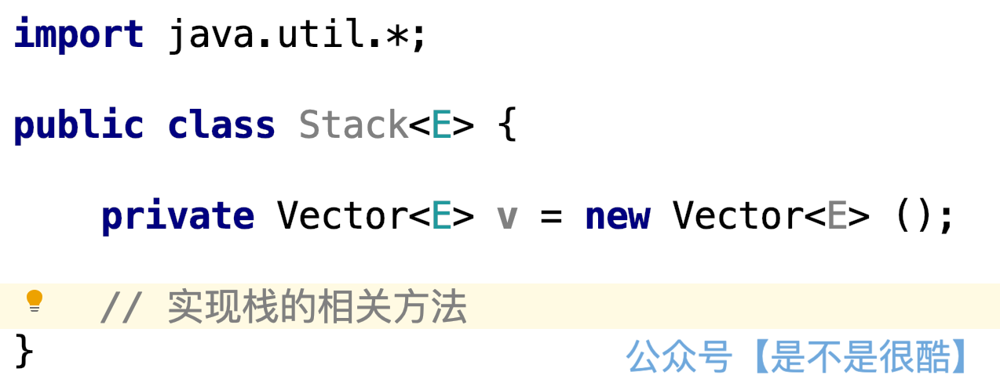

 

**Q: Java 官方不知道这个 Stack 类的实现不好吗？为什么不改？**

Java 官方当然知道这个实现不好。但是，因为要保持兼容性（**backward compatibility**），对于已经正式发布的代码，Java 官方不能做接口设计层面的修改。否则，使用老版本 Java 的程序，将在新的 Java 环境下无法执行，这是 Java 官方不愿意看到的。

Java 官方可以做到的是，将这个类标志成“弃用”（deprecated），以让新版本的开发者不再允许使用这个类，但老版本的程序，还能继续执行。

但是，这么多年了，Java 官方也并没有将 Stack 标为“弃用”，只是在文档上注明“不建议使用”。

 

**Q：为什么使用接口？**

下面，我们再来看一下 Java 官方推荐的写法：使用 Deque 接口：

首先，我们简单聊一下接口这个话题。

接口在 OOP 设计中，也是非常重要的概念。并且，在近些年，变得越来越重要。甚至发展出了“面向接口的编程”这一思想（Interface-based programming）。

对于这么大的一个话题，这篇文章篇幅限制，不做过多具体探讨。如果有兴趣的同学，可以搜索一下。维基百科也有这个词条。

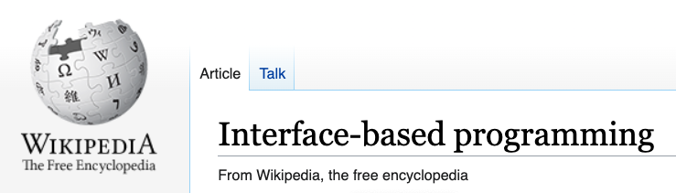

 

苹果公司的最新编程语言 Swift，自 2014 年面世，一个主打的特性，叫做“面向协议”。其实，这里的“面向协议”，和“面向接口”，在我看来是很相近的意思。我相信做苹果开发的同学对此不会陌生。

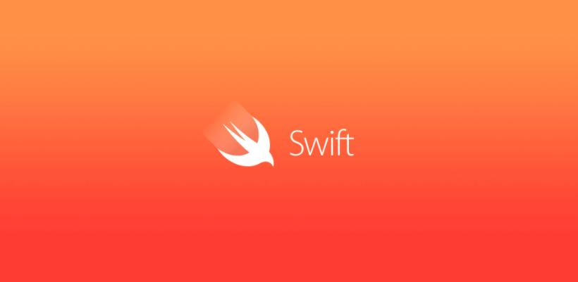

 

接口最大的意义之一，就是做了更高层次的抽象：只定义了一个类应该满足哪些方法，而对具体的实现方式不做限制。

比如，我们都知道，在 Java 语言中，Queue 就是一个接口。我们想实现一个队列，可以这么写：

在上述实现中，q1 和 q2 的底层具体实现不同，一个是 LinkedList，一个是 ArrayDeque。但是，从用户的角度看，q1 和 q2 是一致的：都是一个队列，只能执行队列规定的方法。

这样做，将“队列”这样一个概念，和底层数据结构的具体实现——LinkedList 或者 ArrayDeque **解耦**了：

底层开发人员可以随意维护自己的 LinkedList 类或者 ArrayDeque 类，只要他们满足 Queue 接口规定的规范；

开发者可以选择合适的数据结构来定义 Queue；

而 Queue 的更上层使用者，无需知道 q1 或者 q2 的实现细节，从他们的角度看，只要能调用 Queue 的相关方法：peek, poll, offer 等等，来满足上层的业务需求，就好了。

而且这样做，完美解决了之前说的，继承关系把父类的所有方法都拿过来的问题。接口的设计相当于做了访问限制。LinkedList 中有很多方法，但是，当我们使用 LinkedList 实现 Queue 接口的时候，用户只能调用 Queue 中定义的方法。

 

从这个角度，我们也能看出 Stack 设计的另一个不合理之处：Stack 和 Queue 同样作为一种特殊的线性数据结构，都应该只是规定一系列操作的接口而已，具体的底层实现，由开发者再做选择。

但因为 Stack 做成了一个类，继承了 Vector，也就只能基于 Vector 这一种固定的数据结构了。

为了修正这个问题，Java 官方推出了 Deque 接口，作为实现栈的接口。

 

**Q：什么是 Deque 接口？**

Deque 是双端队列的意思。所谓的双端队列，就是能在线性数据结构的两段，进行插入和删除操作。

大家可以想象，由于 Stack 的定义是在同一端进，同一端出。所以，如果 Deque 可以满足在两段进行插入和删除，自然也能在同一端进行插入和删除，也就是可以以此为基础，做成一个 stack。

 

**Q：等等！这里有问题！**

很多同学应该能马上反应过来了。这里有问题！

因为我们根据 Java 官方推荐的方法声明的这个 stack，虽然变量名称是 stack，但它实际上是一个 deque。这就意味着，这个 stack，可以在两段做插入和删除操作！但是，真正的栈，只能在同一端做插入和删除操作！

这难道不是重蹈了 Stack 这个类的覆辙？毕竟，我们最开始分析，就说 Stack 这个类的一大问题，是继承了 Vector 这个类的若干我们不需要的方法，破坏了封装性，比如在任何一个位置插入一个元素。现在这个基于 Deque 接口的 stack，依然有我们不需要的方法啊！

没错！这就是 Java 的历史遗留问题了。**这个问题至此已经无解了。**因为 Stack 这个关键字被占据了。Java 官方不想推出一个叫做 RealStack 或者 CorrectStack 一类的接口名称。所以，按照 Java 官方的推荐所建立的这个 stack，依然不完美。

但至今为止，Java 暂时只是做到这个份儿上。

或许，Oracle 少打一些官司，多研究一下如何处理这些历史遗留问题，Java 能更好吧。

 

所以，在实际的工程应用上，有人也并不建议使用 Deque 做为 stack 的实现，而是自己再做一层封装。

比如，大家可以看一下这篇探讨 Stack 和 Deque 的文章。

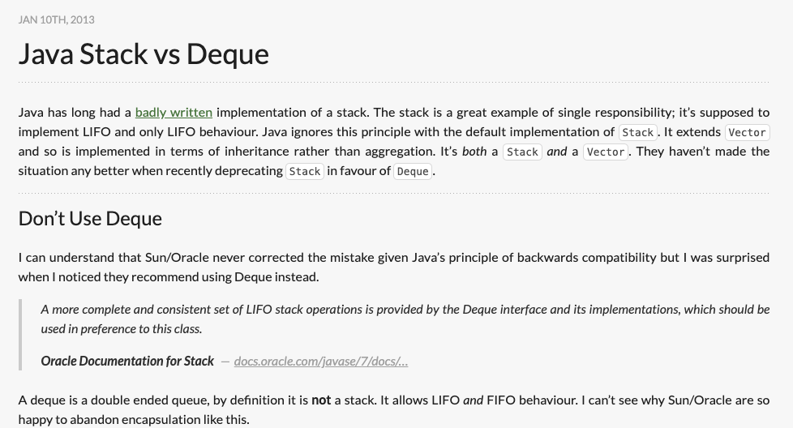

其中，第一个副标题，就是 Don't Use Deque。翻译过来就是，不要使用 Deque！

这篇文章的核心就是：虽然 Java 官方推荐使用 Deque 接口实现 stack，但是这样的 stack 也破坏了封装性，并不安全。

怎么办？很简单，自己再封装一层，做一个只限制能从一段做插入删除的，真正的栈。

这个代码其实很简单，因为这本质是一个设计问题，而不是逻辑问题。有兴趣的同学可以看一下这篇文章：[http://baddotrobot.com/blog/2013/01/10/stack-vs-deque/](http://baddotrobot.com/blog/2013/01/10/stack-vs-deque/)

 

当然了，在实际的算法面试中，可能面试官的关注点并不是这种设计问题，所以使用 Java 官方文档建议的方式来创建栈，并且和面试官讲清楚，我认为就足够了。

 

**Q：那 Vector 呢？**

大家可以看到，上面的讨论，我们已经完全扔掉 Java 中的 Vector 这个类了。

实际上，Vector 这个类不仅仅是简单的一个动态数组而已，而更进一步，保证了线程安全。

因为要保证线程安全，所以 Vector 实际上效率也并不高。

Java 官方的 Vector 文档中明确指出了：如果你的应用场景不需要线程安全的特性，那么对于动态数组，应该使用 ArrayList。请参考下图我标注的文字：

但实际上，即使需要并发编程，自 Java 5 以后，也推荐使用 java.util.concurrent 包。

不过，这涉及到并发编程的问题了。这是一个很大的问题，几句话讲不清楚。如果大家对并发编程感兴趣，可以在网上找更多相关资料.

 

---

好了。至此，这篇文章的主旨已经介绍完毕了。一个小小的 Java 中不建议使用 Stack 类。我也没有想到会写这么长。

最后，关于在面试中，如果有同学需要使用“栈”这种数据结构，选择 Stack 这个类，面试官会怎么看？我在我的知识星球上做了一个小调查。其中 @lk 同学的看法，我觉得非常公允。

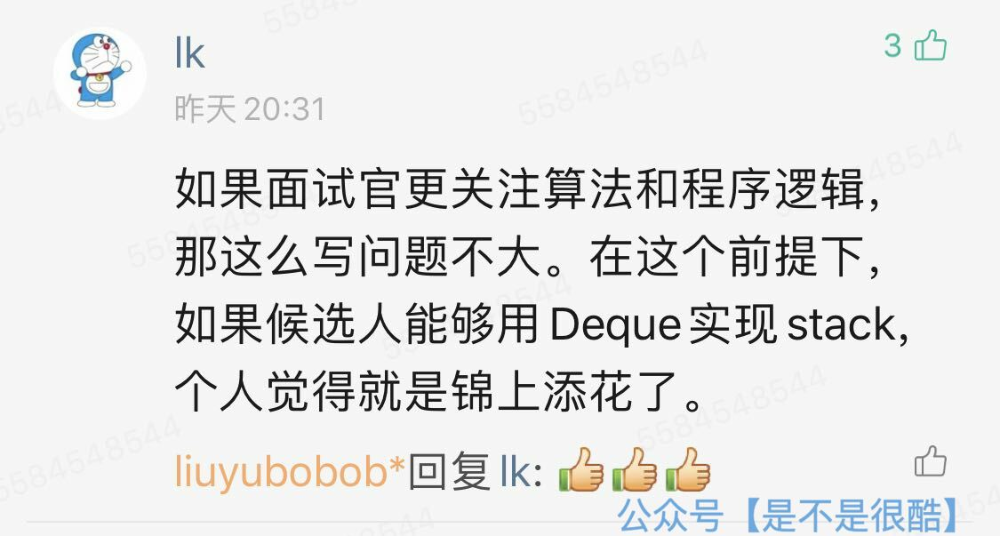

从我的角度，如果我考查的是算法逻辑，我不太会关注语言实现细节，而会更关注解决问题的逻辑思路；

当然，如果面试官希望考察的就是 Java 语言功底，尤其是面试 Java 高级工程师，希望看出来对 Java 语言的理解程度。或许，这是一个很好的面试问题：**Java 语言中的 Stack 类，有什么问题？**

毕竟，通过这么一个看似简单的问题，能引申出来这么多东西：）

如果这个问题以后流行起来，大家别忘了这篇文章：）

 

**大家加油！：）**