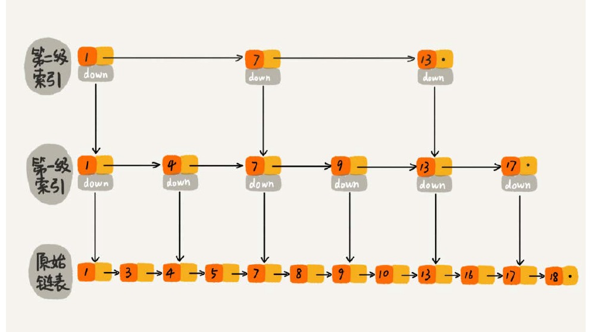

## 数组

1. 延迟删除
2. 下标从 0 开始，因为 a[k]的内存地址是根据`base+offset*typeSize`计算的

## 如何实现浏览器的前进后退功能

1. 双指针
2. 双栈

## 队列在线程池等有限资源池中的应用:阻塞队列与非阻塞队列

1. 公平处理:链表无界队列
2. 阻塞：数组(固定长度循环队列)

## 如何根据年龄给 100 万用户数据排序:桶排序/计数排序等`范围小的情况`

## 将 10 万个`手机号码`从小到大排序：基数排序

## 二分

1. 如何在 1000 万(1e7)个整数中快速查找某个整数？
   我们的内存限制是 100MB，每个数据大小是 8 字节，最简单的办法就是将数据存储在数组中，内存占用差不多是 80MB(`1e7=>80MB`)
   我们可以先对这 1000 万数据从小到大排序，然后再利用二分查找算法;如果用散列表或者二叉树来存储这 1000 万的数据，`用 100MB 的内存肯定是存不下的`
2. 如何快速定位 IP 对应的省份地址？
   它是通过维护一个很大的 IP 地址库来实现的。地址库中包括 IP 地址范围和归属地的对应关系。
   如果 IP 区间与归属地的对应关系`不经常更新`，我们可以先预处理这 12 万条数据，让其按照起始 IP 从小到大排序。如何来排序呢？我们知道，`IP 地址可以转化为 32 位的整型数`。所以，我们可以将起始地址，按照对应的整型值的大小关系，从小到大进行排序，然后 bisectRight 即可
   如果经常更新，采用 `SortedDict` 即可

## 跳表：为什么 Redis 一定要用跳表来实现有序集合

为单链表提高查找效率:对链表建立 k 级“`索引`”
每两个结点提取一个结点到上一级，我们把抽出来的那一级叫作索引或索引层

- 插入、删除、查找以及迭代输出有序序列这几个操作，红黑树也可以完成，时间复杂度跟跳表是一样的。但是，`按照区间来查找数据这个操作，红黑树的效率没有跳表高。`
- 跳表更容易代码实现

## 散列表

1. Word 文档中的单词拼写检查功能是如何实现的
   常用的英文单词有 20 万个左右，假设单词的平均长度是 10 个字母，平均一个单词占用 10 个字节的内存空间，那 20 万英文单词大约占 2MB 的存储空间，就算`放大 10 倍也就是 20MB`。对于现在的计算机来说，这个大小`完全可以放在内存里面`。所以我们可以用散列表来存储整个英文单词词典。
2. 如何打造一个工业级水平的散列表
   散列函数、装载因子、散列冲突
3. 为什么散列表和链表经常一块使用
   结合了二者的优点

## 哈希算法应用

1. 区块链使用的是 SHA256 哈希算法，计算哈希值非常耗时，如果要篡改一个区块，就必须重新计算该区块后面所有的区块的哈希值，短时间内几乎不可能做到

2. 会话粘滞（session sticky）的负载均衡算法
   **客户端 id hash=>机器编号**
   我们可以通过`哈希算法，对客户端 IP 地址或者会话 ID 计算哈希值，将取得的哈希值与服务器列表的大小进行取模运算`，最终得到的值就是应该被路由到的服务器编号
3. 如何快速判断图片是否在图库中
   **图片 hash=>文件路径**
   每个图片取唯一标识（或者信息摘要），然后构建散列表。
   比如，我们可以`从图片的二进制码串开头取 100 个字节，从中间取 100 个字节，从最后再取 100 个字节，然后将这 300 个字节放到一块，通过哈希算法（比如 MD5），得到一个哈希字符串`，用它作为图片的唯一标识。
   如果不存在，那就说明这个图片不在图库中；如果存在，我们再通过散列表中`存储的文件路径`，获取到这个已经存在的图片，跟现在要插入的图片做全量的比对，看是否完全一样。

   **图片 hash=>机器编号**
   需要注意的是:假设现在我们的图库中有 1 亿张图,在单台机器上构建散列表是行不通的
   我们同样可以对数据进行分片，然后采用多机处理。我们准备 n 台机器，让每台机器只维护某一部分图片对应的散列表。我们每次从图库中读取一个图片，`计算唯一标识，然后与机器个数 n 求余取模`，得到的值就对应要分配的机器编号，`然后将这个图片的唯一标识和图片路径发往对应的机器构建散列表。`
   当我们要判断一个图片是否在图库中的时候，我们通过同样的哈希算法，`计算这个图片的唯一标识，然后与机器个数 n 求余取模。假设得到的值是 k，那就去编号 k 的机器构建的散列表中查找。`

4. 给这 1 亿张图片构建散列表大约需要多少台机器。
   散列表中每个数据单元包含两个信息，哈希值和图片文件的路径。假设我们通过 MD5 来计算哈希值，那长度就是 128 比特，也就是` 16 字节`。文件路径长度的上限是 256 字节，我们可以假设平均长度是 `128 字节`。如果我们用链表法来解决冲突，那还需要存储指针，指针只占用 8 字节。所以，散列表中每个数据单元就占用 152 字节（这里只是估算，并不准确）。
   假设一台机器的内存大小为 2GB，散列表的装载因子为 0.75，那一台机器可以给`大约 1000 万（2GB\*0.75/152）张图片构建散列表`。所以，如果要对 1 亿张图片构建索引，需要大约`十几台机器`。在工程中，这种估算还是很重要的，能让我们事先对需要投入的资源、资金有个大概的了解，能更好地评估解决方案的可行性。
   实际上，针对这种海量数据的处理问题，我们都可以采用多机分布式处理。借助这种分片的思路，可以突破单机内存、CPU 等资源的限制。
5. 如果机器数目变了怎么办?
   我们需要一种方法，使得在新加入一个机器后，并不需要做大量的数据搬移
   一致性哈希
6. 加密哈希
   常用于加密的哈希算法：
   MD5：MD5 Message-Digest Algorithm，MD5 消息摘要算法
   SHA：Secure Hash Algorithm，安全散列算法
   DES：Data Encryption Standard，数据加密标准
   AES：Advanced Encryption Standard，高级加密标准
7. Git commit id

## 堆和堆排序：为什么说堆排序没有快速排序快

1. 堆排序数据访问的方式没有快速排序友好(对于快速排序来说，数据是顺序访问的。而对于堆排序来说，数据是跳着访问的。局部性原理，不是像快速排序那样，局部顺序访问，对 CPU 缓存是不友好的)
2. 对于同样的数据，在排序过程中，堆排序算法的数据交换次数要多于快速排序。

3. 假设现在我们有一个包含 10 亿个搜索关键词的日志文件，如何快速获取到 Top10 最热门的搜索关键词呢？

`有点像64匹🐎选前3问题`
有很多高级的解决方法，比如使用 MapReduce 等。但是，如果我们将处理的场景限定为单机，可以使用的内存为 1GB

1. 给 🐎 分组：我们创建 10 个空文件 00，01，02，……，09。我们遍历这 10 亿个关键词，并且通过某个哈希算法对其求哈希值，然后哈希值同 10 取模，得到的结果就是这个搜索关键词应该被分到的文件编号。
2. 组内比赛选 top10🐎
   对这 10 亿个关键词分片之后，每个文件都只有 1 亿的关键词，去除掉重复的，可能就只有 1000 万个，每个关键词平均 50 个字节，所以总的大小就是 500MB。1GB 的
   内存完全可以放得下。`我们针对每个包含 1 亿条搜索关键词的文件，利用散列表和堆，分别求出 Top 10，然后把这个 10 个 Top 10 放在一块，然后取这 100 个关键词中，出现次数最多的 10 个关键词，这就是这 10 亿数据中的 Top 10 最频繁的搜索关键词了。`

## 图的存储

解决现实问题的时候当存储图有多种选择，例如: 1.用邻接表自己存 2.关系型库 3.图数据库
那么这三种方式每一种的适用场景，优缺点分别是什么呢？
1 内存中用临界表
2 要持久化存储就用数据库
3 超大图并且涉及大量图计算。用专业的图数据库

## 分治算法：谈一谈大规模计算框架 MapReduce 中的分治思想

1. 归并排序
2. 二维平面上有 n 个点，如何快速计算出两个距离最近的点对？
   分成两块单独求其中一块点对最小距离
   然后求这两块之间点对的最小距离 通过一些排序和删除 可以减少到 6 个点之间比较
3. 有两个`n*n`的矩阵 A，B，如何快速求解两个矩阵的乘积`C=A*B`？
   v.斯特拉森提出了 2\*2 分块矩阵的计算公式从原来的 8 次乘法缩减到了 7 次
   当 n 规模很大的时候缩减效果就很明显
4. 要解决这种数据量大到内存装不下的问题，我们就可以利用分治的思想

## 向量空间：如何实现一个简单的音乐推荐系统

1. 找到跟你口味偏好`相似的用户`，把他们爱听的歌曲推荐给你；
   如何来判断两个用户是否口味相似呢？欧氏距离
2. 找出跟你喜爱的歌曲特征`相似的歌曲`，把这些歌曲推荐给你。
   针对每个歌曲，我们将每个用户的打分作为向量。有了每个歌曲的向量表示，我们通过计算向量之间的欧几里得距离，来表示歌曲之间的相似度

## 位图

1. 如何实现网页爬虫中的 URL 去重功能？
   布隆过滤器
2. 假设我们有 1 亿个整数，数据范围是从 1 到 10 亿，如何快速并且省内存地给这 1 亿个数据从小到大排序？
   通过位图方式开辟一个十亿大小的位图缩小到 0.125g 的样子,虽检查 1 到 10 亿之间的数字`是否存在再输出`即可达到排序

## 索引：如何在海量数据中快速查找某个数据？

`有序数组`也可以被作为索引。如果数据是静态的，也就是不会有插入、删除、更新操作，那我们可以把数据的关键词（查询用的）抽取出来，组织成有序数组，然后利用二分查找算法来快速查找数据。

## Redis 常用数据类型对应的数据结构

## 搜索引擎背后的经典数据结构和算法

## 高性能队列 Disruptor 背后的数据结构和算法

## 剖析微服务接口鉴权限流背后的数据结构和算法

## 用学过的数据结构和算法实现一个短网址系统
