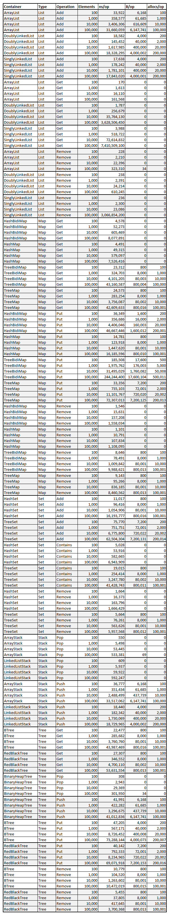

https://pkg.go.dev/github.com/emirpasic/gods#section-readme

## Lists

```Go
type List interface {
	Get(index int) (interface{}, bool)
	Remove(index int)
	Add(values ...interface{})
	Contains(values ...interface{}) bool
	Sort(comparator utils.Comparator)
	Swap(index1, index2 int)
	Insert(index int, values ...interface{})
	Set(index int, value interface{})

	containers.Container
	// Empty() bool
	// Size() int
	// Clear()
	// Values() []interface{}
    // String() string
}
```

## Sets

```Go
type Set interface {
	Add(elements ...interface{})
	Remove(elements ...interface{})
	Contains(elements ...interface{}) bool
    // Intersection(another *Set) *Set
    // Union(another *Set) *Set
    // Difference(another *Set) *Set

	containers.Container
	// Empty() bool
	// Size() int
	// Clear()
	// Values() []interface{}
	// String() string
}

```

## Stacks

```Go
type Stack interface {
	Push(value interface{})
	Pop() (value interface{}, ok bool)
	Peek() (value interface{}, ok bool)

	containers.Container
	// Empty() bool
	// Size() int
	// Clear()
	// Values() []interface{}
	// String() string
}
```

## Maps

```Go
type Map interface {
	Put(key interface{}, value interface{})
	Get(key interface{}) (value interface{}, found bool)
	Remove(key interface{})
	Keys() []interface{}

	containers.Container
	// Empty() bool
	// Size() int
	// Clear()
	// Values() []interface{}
	// String() string
}
```

## Trees

```go
type Tree interface {
	containers.Container
	// Empty() bool
	// Size() int
	// Clear()
	// Values() []interface{}
	// String() string
}
```

## Queues

```go
type Queue interface {
	Enqueue(value interface{})
	Dequeue() (value interface{}, ok bool)
	Peek() (value interface{}, ok bool)

	containers.Container
	// Empty() bool
	// Size() int
	// Clear()
	// Values() []interface{}
	// String() string
}
```

## Functions

### Comparator

### Iterator

### Enumerable

Each/Map/Select/Any/All/Find

### Serialization

```Go
// JSONSerializer

package main

import (
	"encoding/json"
	"fmt"
	"github.com/emirpasic/gods/maps/hashmap"
)

func main() {
	m := hashmap.New()
	m.Put("a", "1")
	m.Put("b", "2")
	m.Put("c", "3")

	bytes, err := json.Marshal(m) // Same as "m.ToJSON(m)"
	if err != nil {
		fmt.Println(err)
	}
	fmt.Println(string(bytes)) // {"a":"1","b":"2","c":"3"}
}

// JSONDeserializer

package main

import (
	"encoding/json"
	"fmt"
	"github.com/emirpasic/gods/maps/hashmap"
)

func main() {
	hm := hashmap.New()

	bytes := []byte(`{"a":"1","b":"2"}`)
	err := json.Unmarshal(bytes, &hm) // Same as "hm.FromJSON(bytes)"
	if err != nil {
		fmt.Println(err)
	}
	fmt.Println(hm) // HashMap map[b:2 a:1]
}
```

### Sort

## Testing and Benchmarking

This takes a while, so test within sub-packages:

go test -run=NO_TEST -bench . -benchmem -benchtime 1s ./...

