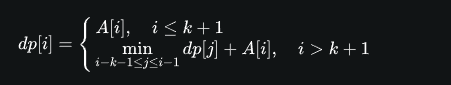
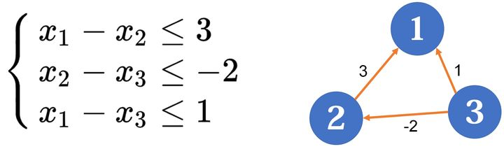

1. 种类并查集
   一般的并查集，维护的是具有连通性、传递性的关系，例如亲戚的亲戚是亲戚。但是，有时候，我们要维护另一种关系：`敌人的敌人是朋友`。种类并查集就是为了解决这个问题而诞生的。

   问题：如果两名怨气值为 c 的罪犯被关押在同一监狱，他们俩之间会发生摩擦，并造成影响力为 c 的冲突事件。
   `将一些罪犯们在两座监狱内重新分配，以求产生的冲突事件影响力都较小`
   其实很容易想到，这里可以**贪心**，**把所有矛盾关系从大到小排个序，然后尽可能地把矛盾大的犯人关到不同的监狱里**，直到不能这么做为止。这看上去可以用并查集维护，但是有一个问题：**我们得到的信息，不是哪些人应该在相同的监狱，而是哪些人应该在不同的监狱**。这怎么处理呢？这个题其实有很多做法，但这里，我们介绍使用种类并查集的做法。
   我们`开一个两倍大小的并查集`。例如，假如我们要维护 4 个元素的并查集，我们改为开 8 个单位的空间：
   我们用 1~4 维护朋友关系（就这道题而言，是指关在同一个监狱的狱友），用 5~8 维护敌人关系（这道题里是指关在不同监狱的仇人）。现在假如我们得到信息：1 和 2 是敌人，应该怎么办？
   我们 merge(1, 2+n), merge(1+n, 2);。这里 n 就等于 4
   https://zhuanlan.zhihu.com/p/97813717
   现在假如我们又知道 2 和 4 是敌人，我们 merge(2, 4+n), merge(2+n, 4);：
   敌人的敌人就是朋友，2 和 4 是敌人，2 和 1 也是敌人，所以这里，1 和 4 通过 2+n 这个元素间接地连接起来了。这就是种类并查集工作的原理。

较为本质地说，种类并查集（包括普通并查集）维护的是一种循环对称的关系。
所以如果是三个及以上的集合，只要每个集合都是等价的，且集合间的每个关系都是等价的，就能够用种类并查集进行维护
动物王国中有三类动物 A,B,C，这三类动物的食物链构成了有趣的环形。A 吃 B，B
吃 C，C 吃 A。
**于是我们可以用一个三倍大小的并查集进行维护，用 i+n 表示 i 的捕食对象，而 i+2n 表示 i 的天敌。**

merge(x, y); //这是真话，则 x 和 y 是一族
merge(x + n, y + n); //x 的猎物和 y 的猎物是一族
merge(x + 2 _ n, y + 2 _ n); //x 的天敌和 y 的天敌是一族

merge(x, y + n); //这是真话，则 x 吃 y
merge(x + n, y + 2 \* n); //x 的猎物吃 y 的猎物
merge(x + 2 \* n, y); //x 的天敌吃 y 的天敌，或者说 y 吃 x 的天敌

2. ST 表
   ST 表（Sparse Table，稀疏表）是一种简单的数据结构，主要用来解决 RMQ（Range Maximum/Minimum Query，区间最大/最小值查询）问题。它主要应用倍增的思想，可以实现 nlogn 预处理、 O(1) 查询。
   为了减少时间复杂度，可以用动态规划的方法进行预处理：
   ST 表使用一个二维数组 f，对于范围内的所有 f[a][b]

```C++
for (int i = 1; i <= 20; ++i)
    for (int j = 1; j + (1 << i) - 1 <= n; ++j)
        f[j][i] = max(f[j][i - 1], f[j + (1 << (i - 1))][i - 1]);
```

其实 ST 表不仅能处理最大值/最小值，凡是符合结合律且可重复贡献的信息查询都可以使用 ST 表高效进行。

3. 01 字典树
   如果我们要找与给定数异或最大的数，就尽可能走与该数当前位不同的路径。反之则尽可能走与当前位相同的路径。

4. 二叉搜索树 API
   https://zhuanlan.zhihu.com/p/177063180
   增删
   改查
   查询某数的排名
   查询指定排名的数
   求某数的前驱
   求某数的后继
   维护一个有序的数组，配合二分查找，也可以实现这些操作，但插入和删除的复杂度是 O(n) 。相对地，链表可以 O(1) 插入和删除，但其他操作的复杂度不够优秀。二叉搜索树即 BST 对于以上每个操作，都拥有不差的复杂度。

插入
从根节点开始，递归地搜索。若插入的值小于当前节点的值，则向左搜；反之向右搜。这样最后如果找到一个已有节点，则令其计数+1；否则若到达空节点，则用该节点存储这个值。
**求排名**
排名被定义为比某数小的数+1

5. 单调队列

   > > “如果一个选手比你小还比你强，你就可以退役了。”——单调队列的原理

   单调队列是一种主要用于`解决滑动窗口类问题`的数据结构，即，`在长度为 n 的序列中，求每个长度为 m 的区间的区间最值`。它的时间复杂度是 O(n)，在这个问题中比 nlogn 的 ST 表和线段树要优。
   单调队列的基本思想是，维护一个双向队列（deque），遍历序列，仅当一个元素可能成为某个区间最值时才保留它。

   - 有一个 a*b 的整数组成的矩阵，现请你从中找出一个 n*n 的正方形区域，使得该区域所有数中的最大值和最小值的差最小。
     这个题可以用单调队列先后处理行和列。
     矩阵中的每一行可以看作长度为 b 的序列，我们用单调队列求出其中所有长度为 n 的区间的最值。对每行都如此操作，即可求出每个 1xn 的长方形区域中的最大、最小整数。
     这些最值又构成一个矩阵。我们再把这个新矩阵的每一列看作一个序列，求其中所有长度为 n 的区间最值。这样，可以求出原矩阵每个 nxn 的正方形区域中的最大、最小整数。
     这时我们得到两个 (a-n+1)x(b-n+1)的矩阵，包含了所有 nxn 正方形区域的最小、最大值，遍历一遍求最小差即可。

   - 给定一行 n 个非负整数 a[1]..a[n]。现在你可以选择其中若干个数，但不能有超过 k 个连续的数字被选择。你的任务是使得选出的数字的和最大。
     这种题是很典型的**单调队列优化 DP。**
     我们把问题转化为`删除若干个数`，`且删除的数间隔不超过 k，求删除数的最小值`。设 dp[i]表示在删除第 i 个数的情况下， 前 i 个数中删除数的最小和。那么很容易想到转移方程：
      这个朴素方法是 O(mn) 的，为了优化它，我们可以使用单调队列。注意到，`我们不断地在求 dp 的区间最小值`，而且区间长度是固定的 m+1 ，这正好符合滑动窗口的模型。只不过，我们需要动态地进行整个过程，即，在维护单调队列的过程中求出 dp。

6. 单调栈
   单调栈是一种和单调队列类似的数据结构。单调队列主要用于 O(n) 解决滑动窗口问题，单调栈则主要用于 O(n) 解决 NGE 问题（Next Greater Element）

   - **单调栈优化 DP。**

   - 队列中任意两个人 a 和 b，如果他们是相邻或他们之间没有人比 a 或 b 高，那么他们是可以互相看得见的。
     写一个程序计算出有多少对人可以互相看见。
     此题体现了单调栈的另一种重要应用，即解决某些涉及到`“两元素间所有元素均(不)大/小于这两者”的问题。(也可以用差分，奶牛晒日光浴问题)`在本题中，我们用一个单调栈存储那些“`可以看到当前位置的人的人的身高`”，它无疑是单调不增的。每当遍历到一个新的位置时，就计算当前位置的人可以看到前面的多少人，并更新单调栈

7. 可持久化线段树(persisited)
   大家可能用过 Photoshop 的历史记录画笔，使用它可以返回之前的某个状态，并在此基础上进行修改。实现这样的功能，便需要`可持久化`的数据结构，它保存每个历史版本，可以高效地查询和修改历史版本，且因其维持原结构的`不变性`还在函数式编程领域有很大作用。
   `可持久化线段树`就是这样一种数据结构。想要让线段树可持久化，`最朴素的实现方法是每进行一次操作都建一棵新的树`，不用说也知道，这样做的时间和空间复杂度都是不可接受的。稍微思考一下会发现，每次修改操作都只会有少数的点被修改，`所以大量的点是可以共用的。`
   假如我们现在要令 A4 加 2，我们先创建一个新的根节点,要修改的 A4 对应的叶子节点在右子树上。所以，这个`新节点的左儿子应该与原节点的左儿子相同（即与之共用左子树）`。`再创建一个新的节点作为右儿子。`接下来处理这个新节点（这是一个递归的过程）。显然 A4 应该在左子树，`所以相似地，沿用原树的右儿子，然后创建一个新的节点作为左儿子。`
   可持久化线段树常被称为主席树
   https://zhuanlan.zhihu.com/p/250565583

8. 差分约束系统
   每个不等式称为一个约束条件，都是两个未知量之差小于或等于某个常数
   ` x+a>=y 可转化为 x 到 y 间有一条权值为 a 的边`
   这样建出的有向图，它的每个顶点都对应差分约束系统中的一个未知量，源点到每个顶点的最短路对应这些未知量的值，而每条边对应一个约束条件。
   
   那么问题来了，既然是最短路，源点在哪里呢？

实际上取哪个点为源点是无关紧要的，但是，有时候我们得到的图不是连通的，这样求出来的结果很容易出现 INF。为了避免这种情形，我们习惯人为地增加一个超级源点。

例如我们现在人为地新增一个 0 号点（或 n+1 号点），从它向所有顶点连一条边权为 0 的边：
现在我们以 0 号点为源点求各点的最短路即可
`在符合差分约束系统的一组解上加上或减去同一个数，得到的解同样符合原系统`

9.  最近公共祖先
    我们用一个数组 fa[i][k]存储 i 号点的 2^k 级祖先,父节点为 1 级祖先，祖父结点为 2 级祖先……以此类推
    // 在 dfs 中...
    fa[cur][0] = fath;
    for (int i = 1; i <= Log2[dep[cur]]; ++i)
    fa[cur][i] = fa[fa[cur][i - 1]][i - 1];
    此节点的 2^i 级祖先等于此节点父节点的 2^(i-1)级祖先

```C++
注意更新fa数组(记录情况)和dep数组(之后用来查询)
int Log2[MAXN], fa[MAXN][20], dep[MAXN]; // fa的第二维大小不应小于log2(MAXN)
bool vis[MAXN];
void dfs(int cur, int fath = 0)
{
    if (vis[cur])
        return;
    vis[cur] = true;
    dep[cur] = dep[fath] + 1;
    fa[cur][0] = fath;
   //  i <= Log2[dep[cur]] 即2^i<=dep[cur]
    for (int i = 1; i <= Log2[dep[cur]]; ++i)
        fa[cur][i] = fa[fa[cur][i - 1]][i - 1];
    for (int eg = head[cur]; eg != 0; eg = edges[eg].next)
        dfs(edges[eg].to, cur);
}
int lca(int a, int b)
{
    if (dep[a] > dep[b])
        swap(a, b);
    while (dep[a] != dep[b])
        b = fa[b][Log2[dep[b] - dep[a]]];
    if (a == b)
        return a;
    for (int k = Log2[dep[a]]; k >= 0; k--)
        if (fa[a][k] != fa[b][k])
            a = fa[a][k], b = fa[b][k];
    return fa[a][0];
}
int main()
{
    // ...
    for (int i = 2; i <= n; ++i)
        Log2[i] = Log2[i / 2] + 1;
    // ...
    dfs(s); // 无根树可以随意选一点为根
    // ...
    return 0;
}
```

那么**树上两点的距离**则为 dis(u,v)=dep(u)+dep(v)-2dep(LCA(u,v))。`nlogn 预处理，logn 查询，空间复杂度为 nlogn 。`

10. 传递闭包
    从数学上来说，传递闭包是在集合 X 上求包含关系 R 的最小传递关系。从关系图的角度来说，就是如果原关系图上有 i 到 j 的路径，则其传递闭包的关系图上就应有从 i 到 j 的边。`通俗地讲，就是确定每个点是否能到达其他每个点。`
    而这，把 `Floyd 最短路算法`稍微改一下即可。设 E 是原来的关系矩阵，则可以这样写：

```C++
for (int k = 1; k <= n; ++k)
    for (int i = 1; i <= n; ++i)
        for (int j = 1; j <= n; ++j)
            if (E[i][k] && E[k][j])
                E[i][j] = 1;
```

就是依次判断：`仅经由 1 号点能不能从 i 到达 j，仅经由 1、2 号点能不能从 i 到达 j`……最后得到的 E 是传递闭包的关系矩阵。 E[i][j]如果等于 1，则表示存在从 i 到 j 的路径。时间复杂度是 O(n^3)

11. 逆元
    在数论中，如果`a*b与1模p同模` ，我们就说 a 和 b 在模 p 意义下互为乘法逆元，记作 a=inv(b) 。
    逆元有什么用呢？我们常常遇到一些题目要求`结果对一个大质数 p 取模`，这是因为答案很大，出题人为了不麻烦大家写高精，就采取这样的方法。**加减法和乘法对取模运算都是封闭的**，所以你可以处处取模来避免溢出。
    即(a+b)modp==amodp+bmodp
    **但遇到除法时，就麻烦了**
    (12/3)mod10=4
    12mod10=2
    3mod10=3
    (2/3)mod10=?
    为了解决模意义下的除法问题，我们引入了逆元
    inv(a)可以看作模 p 意义下的 1/a
    那么在模 p 意义下，有`a/b=a*inv(b)`
    即`(2/3)mod10=(2*inv(3))mod10=4`
    **三种计算逆元的方法：拓展欧几里得，费马小定理，线性递推。**
    费马小定理
    对素数 p ，若 a 不是 p 的倍数，有 a^(p-1)与 1 模 p 同余
    https://zhuanlan.zhihu.com/p/100587745
12. 中国剩余定理
13. 素数筛 nloglogn 复杂度
14. 拓展欧几里得
15. Gosper's Hack 是一种生成 n 元集合所有 k 元子集的算法
    如果调用 GospersHack(3, 5)，会依次遍历到以下二进制数：
    00111
    01011
    01101
    01110
    10011
    10101
    10110
    11001
    11010
    11100
    这个算法复杂度与答案个数是同阶的，比暴力枚举 2^n 个数然后分别算 popcount 要好。
16. 逆序对本质上就是一种`二维偏序`：
17. 基数排序
    基数排序：从低位到高位，依次进行计数排序

18. 三分法
    三分法是二分法的变种，他最基本的用途是`求单峰函数的极值点。`
    从数学的角度来说，求极值点，先求导再二分不就好了吗？然而，实际中我们遇到的函数，求导可能很困难，所以会用上三分法。
    三分法的原理非常简单，以求极大值为例，每次对一个区间[l,r]求三等分点 lsec 和 rsec：
    如果 f(lsec) < f(rsec) ，说明极大值一定在[lsec,r]内取到，因为如果在[0,lsec)内，那 rsec 一定处于单调下降的区间内，它的函数值不可能大于 lsec 的函数值。 于是我们令 l=lsec 并继续。
    如果 f(lsec) > f(rsec)，同理，极大值一定在[l,rsec]内取到，令 r=rsec 并继续。
    这样进行下去，直到 l 和 r 的差距小于设定的 eps 为止。如果求的是极小值而非极大值，只需把上面条件判断处的大于、小于互换。

```C++
while (r - l > eps)
{
    mid = (l + r) / 2;
    double fl = f(mid - eps), fr = f(mid + eps);
    if (fl < fr)
        l = mid; // 这里不写成mid - eps，防止死循环；可能会错过极值，但在误差范围以内所以没关系
    else
        r = mid;
}
```

这种写法的三分，其实和普通的二分很像了。

19. 摩尔投票
    摩尔投票是一种用来解决`绝对众数`问题的算法。
    在一个集合中，`如果一个元素的出现次数比其他所有元素的出现次数之和还多，那么就称它为这个集合的绝对众数`。等价地说，绝对众数的出现次数大于总元素数的一半。
20. 康托展开用于求一个排列在所有 1-n!的排列间的字典序排名。
    康托展开的实质是计算`当前排列在所有由小到大全排列中的顺序`
    例如，3 5 7 4 1 2 9 6 8 展开为 98884
    因为 X=2*8!+3*7!+4*6!+2*5!+0*4!+0*3!+2*2!+0*1!+0\*0!=98884.
    解释：

    排列的第一位是 3，比 3 小的数有两个，以这样的数开始的排列有 8!个，因此第一项为 2\*8!

    排列的第二位是 5，比 5 小的数有 1、2、3、4，由于 3 已经出现，因此共有 3 个比 5 小的数，这样的排列有 7!个，因此第二项为 3\*7!

    以此类推，直至 0\*0!

21. 数位 DP
    我们一般使用记忆化搜索的方法来实现数位 DP
22. 悬线法
    悬线法是一种比较简单的 DP 技巧，主要用于在 O(mn) 的时间内解决最大矩形/最大正方形问题，即，给出一个 nxm 的方格矩阵，其中某些方格是不可选的，`求可选的最大矩形/正方形。`
