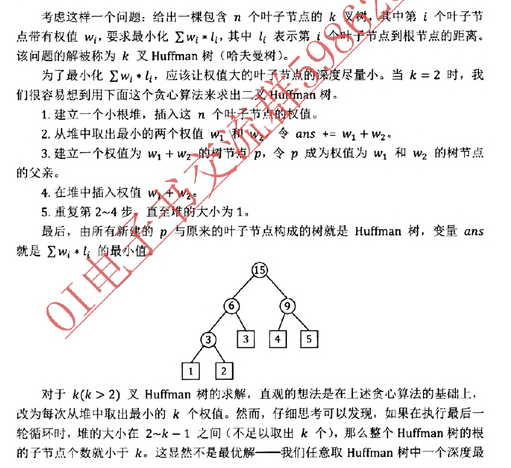
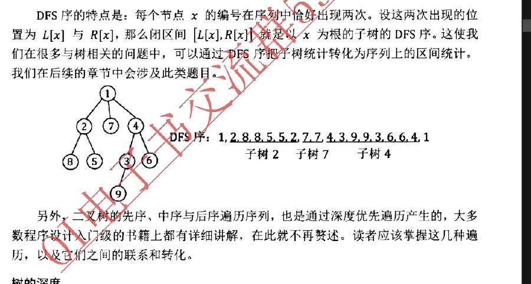
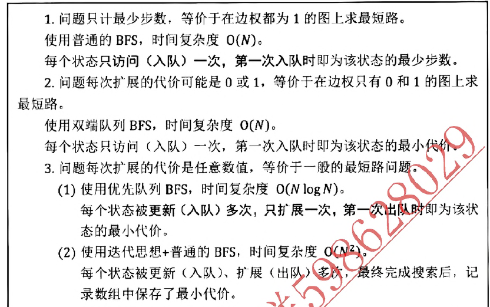

# 基本算法

## 几个常熟

| 32 位补码          | int(十进制) | int(十六进制)  |
| ------------------ | ----------- | -------------- |
| 01111...11111      | 2147483647  | 0x 7F FF FF FF |
| 00111111 重复 8 次 | 1061109567  | 0x 3F 3F 3F 3F |
| 11111..1111        | -1          | 0x FF FF FF FF |

0x 3F FF FF FF 很有用

1. 整数的两倍不超过 0x 7F FF FF FF (int 表示的最大数,2^31-1)
2. 整数的每八位(每个字节)都是相同的

## 二进制状态压缩(状压 dp)

二进制状态压缩，是指一个长度为 m 的 bool 数组用一个 m 位二进制整数表示并存储的方法。利用下列位运募操作可以实现原 bool 数组中对应下标元素的存取。

| 操作        | 运算                                |
| ----------- | ----------------------------------- |
| 取出第 k 位 | (n>>k) & 1                          |
| 取出后 k 位 | n & ((1<<k)-1))                     |
| 第 k 位取反 | n xor (1<<k)                        |
| 第 k 位赋 1 | n or (1<<k)                         |
| 第 k 位赋 0 | n & (~(1<<k)) 即与上 1111..11011111 |

这种方法运算简便，并且节省了程序运行的时间和空间。当 m 不太大时，可以直接使用一个整数类型存储。当 m 较大时，可以使用若干个整数类型(int 数组)，也可以直接利用 C++ STL 为我们提供的 bitset 实现（第 0x71 节)。

## 前缀和

把一个区间的操作变为操作区间端点

二维:激光炸弹
一维：
可以互相看见的牛
上车下车问题
有 N 头牛站成一行。两头牛能够相亚看见，当且仅当它们中间的牛身高都比它们矮。现在，我们只知道其中最高的牛是第 P 头，它的身高是 H，不知道剩余 N-1 头牛的身高。但是，我们还道对关系，每对关系都指明了某两头牛 Ai 和 B 可以相互看见。求每头牛的身高最大可能是多少。1≤ N,M ≤10\*，1≤H ≤106。
题目中的 M 对关兵带给我们的信息实际上是牛之间身高的相对大小关系。具体来说，`我们建立个个数组 ℃`，数组中起初全为 0。若一条关系指明 `A 和 B可以互相看见`,`则把数组中下标为 A+1 到 Bt-1 的数都减去 1`，意思是在 `A和B中间的牛，身高至少要比它们小 1`。因为第 Р 头牛`是最高的，所以最终 c[P]一定为 0`。其他的牛与第 Р 头牛的身高差距就体现在数组 C 中。换言之，`最后第 i 头牛的身高就等于 H+C[i].`
如果我们朴素执行把数组 C 中下标为 A+1 到 B-1 的数`都减去 1 的操作，那么整个算法的时间复杂度为 O(NM)`，复杂度过高。一个简单而高效的做法是，`额外建立一个数组 D，对于每对 Ai 和 B;，令 D[A;+1]减去 1，D[B]加上 1。其含义是:“身高减小 1”的影响从 A ＋ 1 开始，持续到 B 一 1，在 B 结束。最后，C 就等于 D 的前缀和`，即 C[i]= =D]。
例如：一个区间加一变成`上车下车问题`，操作端点即可

## 递归

1. `局部变量在每层递归中都占有一份空间，`
   声明过多或递归过深就会超过“栈”所能存储的范围，
   造成栈溢出。

2. 非局部变量对于各层递归都共享同一份空间，
   需要及时维护、还原现场，以防止在各层递归之间存储和读取的数据互相影响.

## 二分

二分答案:子数组和
给定一个正整数数列 A、求-个平均数最大的、长度不小于 L 的子段。
二分答案,判定“是否存在一个长度不小于 L 的子段，平均数不小于二分的值”。
如果把数列中`每个数都减去二分的值 v 就转化为判定“是否存在一个长度不小于 L 的子段，子段和非负”`/。下面我们着重来然后使用前缀和求子数组的和，`用一个变量记录 sum[i-L]的最小值`

## 离散化

树状数组:离散化预处理
排序算法的第一个应用是离散化。通俗地讲，“离散华”就是把`无穷大集合中的若干个元素映射为有限集合以便于统计的方法`。例如在想>情况下，问题的范围虽然定义在整数集合 Z，但是只涉及其中 m 个有限数慎，身数值的绝对大小无关(只把这些数值作为代表，或只与它们的相对顺序有头此时，我们就可以把整数集合 Z 中的这 m 个整数与 1~m 建立映射关系。\_如来每一个时间、空间复杂度与数值范围 Z 的大小有关的算法，在离散化后，该算手心时间、空间复杂度就降低为与 m 相关。

## 中位数

货仓选址
n>>1 处
`均分纸牌`(超级洗衣机)
“均分纸牌”问题是说，有 M 个人排成一行，他们手中分别有 C[1]~C[M]张纸牌，在每一步操作中，可以让某个人把自已`手中的一张纸牌交给他旁边的一个人`，求至少需要多少步操作才能让每个人手少持有的纸牌数相等。
假设纸牌总数为 T 可以开始让所有人的纸牌减去 T/M 则答案为 S1+S2+...SM Si 表示`前缀和`
`环形均分纸牌`

## 逆序对

奇数码问题:两个局面可达，等价于逆序对个数奇偶性相同

## 倍增

倍增,字面意思就是“成倍增长”。这是指我们在进行递推时，如果状态空间很大，通常的线性递推无法满足时间与空间复杂度的要求，那么我们可以通过成倍增长的方式，`只递推状态空间中在 2 的整数次幂位置上的值作为代表`。需要其他位置上的值时，我们通过“`任意整数可以表示成若干个 2 的次幂项的和`”这个性质，使用之前求出的代表值拼成所需的值。所以使用倍增算法也`要求我们递推的向题的状态空间关于 2 的次幂具有可划分性。`，例如>>
LCA 等树上倍增算法；快速幂；RMQ(区间最值)问题的 ST 算法

在 RMQ 问题（区间最值问题）中，著名的 ST 算法就是倍增的产物。给定一个长度为 N 的数列 A，ST 算法能在 `O(N log N)时间的预处理后，以 o(1)的时间复杂度在线回答“数列 A 中下标在 l~r 之间的数的最大值是多少`”这样的区间最值问题。

## 贪心

常用验证手段：微扰(邻项交换)

奶牛晒日光浴问题
有 C 头奶牛日光浴，第 i 头奶牛需要 minSPF[i]和 maxSPF[i]单位强度之间的阳光。每头奶牛在日光浴前要涂防晒霜，防晒霜有 L 种，涂上第 i 种之后，身体接收到的阳光强度就会德定为 SPF[i]，第 i 种防晒霜有 cover[i]瓶。求最多可以满足多少头奶牛进行日光浴。

1. 按照` miSPF 递减的顺序把奶牛排序`，依次考虑每头牛。
2. 对于每头牛,扫描一遍所有的防晒霜，在这头牛能用〈能用指的是该防晒霜的强度符合这头的范围，并且瓶数还有剩余)的防晒霜里`找一个SPF值最大的防晒霜使用。`

国王游戏:逆序对数为 0

在本章中，我们探讨了程序设计的一些基本思想。我们曾经多次提到过，任何问题都有其涉及的范围，称之为问题的"状态空间”。`求解一个问题，就是在这个状态空间里的遍历与映射`。递推与递归是遍庆状态空间的两种基本形式。本章以及接下来的章节探讨的各种算法，则是对升“通历顺序”“遍历过程中的决策方法”“状态空间中各状态之间的映射方式”全出的指导。
`枚举与模拟`是按照问题的直接表述形式对状态空间进行朴素的遍历，`搜索`则是带有一定的选择性、决策性的遍历，`贪心`是在每步决策 S 时采取局部最优策略的遍历，`动态规划`则是基于全局考量的分阶段、按维度、无重复遍历。`二分、倍增以及一排序相关`的一些算法会对状态空间实施划分、等价、代表、拼接等手段，直接降低遍历时需要面对的时空规模。

# 数据结构

## 栈

最小栈:
我们建立两个枝，栈 A 存储原本的数据。栈 B 存储栈 A 中以栈底开头的每段数据的最小值。

Editor:对顶栈
询问在位置 k 之前的最大前缀和，k 不超过当前的光标位置
`对顶栈`风险对冲，类似于对顶堆
建立两个栈，`栈 A 存储从序列开头到当前光标位置的这一段子序列，栈 B 存储从当前光标位置到序列结尾的这一段子序列，二者都以光标所在的那一端作为栈顶。这两个栈合起来就保存了整个序列。`因为查询操作的 k 不超过光标位置，所以我们用一个数组 f 维护栈 A 的前缀和的最大值即可(思路与最小栈一样)。

进出栈序列问题
给定 1~N 这 N 个整数和一个无限大的栈，每个数都要进栈并出栈一次。如果进栈的顺序为 1,2,--,N、那么可能的出栈序列有多少种?
动态规划，O(N2)
在任何一个时刻，我们实际上只关心有多少个数尚未入栈、有多少个数还在栈里，并做出一步合法的操作，`并不关心这些数具体是哪些`。因此，我们可以用 F[i,j]表示有 i 个数尚未进栈，目前有 j 个数在栈里，已经有 n-i-j 个数出栈时的方案总数。
在最终状态下，即所有数已经出栈时，顺序已经确定，所以边界为:F[0,0]= 1.我们需要求出初始状态下，即所有数尚未进栈时，可以到达上述边界的方案总数，所以目标为:F[N,0]
把一个数进站，把栈顶出栈：F[i,j]=F[i-1,j+1]+F[i,j-1]
该问题等价于`求第 N 项 Catalan 数，即 C(2n,n)/(n +1)`。
`1, 1, 2, 5, 14, 42, 132, 429, 1430, 4862`
卡特兰数是一个非常神奇的序列，它与许多看似千差万别的问题都有着紧密的关联。这些问题包括：

有效的括号表达式(LC22 - 括号生成)
二叉搜索树的结构
有效的出栈序列
凸多边形的三角划分
...

表达式计算
中缀表达式 `3*(1-2)`
前缀表达式(波兰式) op A B
后缀表达式(逆波兰式) A B op
前缀和后缀表达式的值的定义是，先递归求出 4，B 的值，二者再做 op 运算的结果。这两种表达式不需要使用括号，其运算方案是唯一确定的。对于计算机来讲，`它最容易理解后缀表达式`，我们可以使用栈来 O(N) 地求出它的值。

## 队列

单调队列
有长度限制的最大`子序列和`问题：
注意不是https://leetcode-cn.com/problems/constrained-subsequence-sum/!!!
找两个位置 x 和 y 使得 S[y]-S[x]最大`并且 y-x<=M`
(长度在 10^5 量级)
思路:
枚举右端点 j j 固定时 问题变为找到左端点 i 在[i-m,i-1]之间，且 s[i]最小

不妨比较一下任意两个位置 i 和 k，如果 k<i<j 并且 S[k] ≥S[i]，那么对于所有大于等于 j 的右端点，k 永远不会成为最优选择。这是因为不但 S[k]不小于 S[i]，而且 i 离 j 更近，长度更不容易超过 M，即 i 的生存能力比 k 更强。所以当 i 出现后，k 就完全是一个无用的位置。
以上比较告诉我们，可能成为最优选择的策略集合一定是一个“`下标位置递增、对应的前缀和 S 的值也递增`”的序列。我们可以用一个队列保存这个序列。随着右端点从前向后扫描，我们对每个 i 执行以下三个步骤:

```JS
for (let rihgt = 0; rihgt < array.length; rihgt++) {
  // 1.判断队头是否超出范围,出队处理
  // 2.此时队头就是右端点为j 左端点为i的最佳选择
  // 3.不断删除队尾 直到对位的S值小于S[j] 然后把j作为一个新的决策入队
}

```

单调队列算法 每个元素至多入队一次 出对一次 O(n)
它的思想也是在`决策队列中及时排除一定不是最优解的选择`。单调队列是优化动态规划的一个重要手段。

## 链表与邻接表

**邻值查找**

给定一个长度为 n 的序列 A,A 中的数各不相同。对于 A 中的`每一个数 Ai`，求:**距离它最小的值的序号**

平衡树解法 ok

链表解法(链表排序)
把序列 A 从小到大`排序`，然后依次串成一个链表。注意在排序的同时，建立一个数组 B。`其中 B 表示原始序列中的 Aj 处于链表中的哪个位置`（一个指针>因为链表有序，所以在链表中，指针 Bn 指向的节点的 prev 和 next 就分别是 An 的前驱和后继。通过比较二者与 An 的差，我们就能求出与 An 最接近的值。
之后利用链表删除 O(1)的特性 找完就删去该节点，之后再找到剩下的 prev/next 值

邻接表

```TS
结构：
Map<key,Item[]>
```

## Hash

- 自定义哈希函数
  雪花问题
  H(a,b,c,d,e,f)=`(a+b+c+d+e+f+a*b*c*d*e*f) mod P P是一个大的质数`

- 字符串哈希:
  取一固定值 P(131 或 13331)，`把字符串看作 Р 进制数`，并分配一个大于 0 的数值，代表母 l 子符。一般来说，我们分配的数值都远小于 P。例如，对于小写字母构成的字符串，可以令 a = 1,b = 2,…,z= 26。取一固定值 M(2^64)，求出该 Р 进制数对 M 的余数，作为该字符的哈希值。
  S 的哈希值为 H(S) 那么 S 后加一个 c
  `H(S+c)=(H(S)*P+value[c]) mod M`
  S 的哈希值为 H(S) S+T 的哈希值为 H(S+T) 那么 T 的哈希值为
  `H(T)=(H(S+T)-H(S)*p**T.length) mod M` 即相当于在 S 后补零 对齐相减

  根据上面两种操作，可以`O(N)预处理字符串所有前缀的哈希值` 从而在 O(1)时间查询字符串任一个字串的 Hash 值
  哈希值相等 则认为字符串相等

  例题:DNA 序列/最长重复子串(二分+哈希)/最长回文子串(nlogn)

  - 后缀数组(SA)

## 字符串

**最小表示法**
循环同构字符串中字典序最小的那个
朴素法 O(n)

SS 表示复制一份接在后面
双指针比较

## Trie

n 个数两两间的最大异或值
我们可以把每个整数看作长度为 32 的二进制 01 串（数值较小时在前边补 0)，并且把 A~Ai-1 对应的 32 位二进制串插入一棵 Trie 树（最低二进制位为叶子节点)。接下来，对于 A 对应的 32 位二进制串，我们在 Trie 中进行一次与检索类以的过程,每一步都尝试沿着“`与 Ai 的当前位相反的字符指针`”向下访问。若“与 A 的当前位相反的字符指针”指向空节点，则只好访问与 A 当前位相同的字符指针,)根据 xor 运算“相同得 0，不同得 1”的性质，该方法即可找出与 A;做 xor 风算结果最大的 Aj。

异或最大的路径
给定 N 个节点的树，树上的每条边都有一个权值。从树中选择两个点 x 和 y，把从'x 到 y 的路径上的所有边权 xor(异或)起来，得到的结果最大是多少? N≤105。
树上 x 到 y 的路径上所有边权的 xor 结果就等于 `D[x] xor D[y]`。
其中 D[x]表示根节点到 x 的异或值,重叠路径抵消了
所以，`问题就变成了从 D[1]~D[N]这 N 个数中选出两个，xor 的结果最大`，即上一道例题。可以用 Trie 树来快速求解。

## 二叉堆

超市卖商品问题
给定 N 个商品，每个商品有利润 p;和过期时间 d;，每天只能卖一个商品，过期商品不能再卖，求如何安排每天卖的商品，可以使收益最大。1≤N,p,d, ≤ 10^4。

详细地说，我们把`商品按照过期时间排序`，建立一个初始为空的小根堆〈节点权值为商品利润)，
然后扫描每个商品:

1. 若当前商品的过期时间(天数)t 等于当前堆中的商品数,说明在目前方案下，前 t 天已经安排了 t 个商品卖出。此时，若当前商品的利润大于堆顶权值（即已经安排的 t 个商品中的最低利润)，则替换掉堆顶〈用当的商品哲换掉原方案中利润最低的商品)。
2. 若当前商品的过期时间（天数）小于当前迸中的商品个数，直接把该商品插入堆。
   最终，堆里的所有商品就是我们需要卖出的商品，它们的利润之和就是答案。该算法的时间复杂度为 o(N log N)6

Huffman 树
考虑这样一个问题:给出一棵包含 n 个叶子节点的 k 叉树，第 i 个叶子节点带有权值 wi，`要求最小化 ∑wi* li`，其中 li 表示第 i 个叶子节点到根节点的距离。该问题的解被称为 k 叉 Huffman 树(哈夫曼树)。
为了最小化 ∑wi\*li，应该让权值大的叶予节点的深度尽量小。当 k =2 时，我们很容易想到用下面这个贪心算法来求出二文 uiman 树。

应用 1：合并果子
例如有 3 种果子，数目依次为 1，2，9。可以先将 1，2 堆合并，新堆数目为 3，耗费体力为 3 接着，将新堆与原先的第三堆合并，又得到新的堆，数目为 12，耗费体力为所以多多总共耗费体力=3+ 12= 15。可以证明 15 为最小的体力耗费值。
因为每次合并消耗的体力等于两堆果子的重量之和，所以最终消耗的体力总和就是每堆果子的重量乘它参与合并的次数。这恰好对应一个二叉 Huffman 树问题，`果子堆的重量就是叶子节点的权值，参与合并的次数就是叶子到根的距离`。`建立一个小根堆，插入所有果子堆的重量。不断取出堆中最小的两个值，把它们的和插入堆，同时累加到答案中。直至最后堆的大小为 1 时，输出答案即可。`
应用 2：压缩编码

# 搜索

## dfs

无向边，每个点和每条边恰好走一次 复杂度为 O(V+E)

- dfs 的`时间戳`
- 树的 dfs 序 `两个相等时间戳的中间那段闭区间就是子树的dfs序`
  可以把子树统计变成序列上的区间统计
  

可达性分析
给定一张 N 个点 M 条边的有向无环图；
分别统计从每个点出发能够到达的点的数量。N, M≤30000。
这启发我们先用`拓扑排序算法求出一个拓扑序，然后按照拓扑序的倒序进行计算——因为在拓扑序中，对任意的一条边(x, y)，x 都排在 y 之前。`
状态压缩方法，我们可以使用一个 N 位二进制数存储每个 f(x)(f(x)表示可以到达的点集)，其中第 i 位是 1 表示 x 能到 i，0 表示不能到 i。这样一来，`对若干个集合求并，就相当于对若干个 N 位二进制数做“按位或”运算`。最后，每个 f(x)中 1 的个数就是从 x 出发能够到达的节点数量。
这个 `N 位二进制数`可以压缩成 N/32 ＋ 1 个无符号 32 位整数 unsigned int 进行存储，更简便的方法是直接使用 C++ STL 中为我们提供的 bitset，

小猫爬山

1. 先装大猫
2. 超过答案则剪枝
3. dfs(cur,count)函数

## 剪枝

1. 优化搜索顺序：**排序**
2. 排除等效冗余
3. 可行性剪枝
4. 最优性剪枝:已经不是最优解了
5. 记忆化

## bfs

推箱子

`双端队列 BFS`:边权不全是 1
这是一张边权要么是 0、要么是 1 的无向图。在这样的图上我们可)以通过双端队列广搜来计算。算法的整体框架与一般的广搜类似,只是在每个节点入沿分支扩展时稍作改变。`如果这条分支是边权为 0 的边，就把沿该分支到达的新结点从队头入队;如果这条分支是边权为 1 的边，就像一般的广搜一样从队尾人队`。这样一来，我们就仍然能保证，任意时刻广搜队列中的节点对应的距离值都具有“两段性”和“单调性”，每个节点第一次被访问（入队）时，就能得到及发上角到该节点的最短距离。
因为每个节点只需要访问一次，所以算法的时问复杂度为 O(R \* C)。

`优先队列bfs`:dijkstra
在优先队列 BFS 中，每个状态也会被多次更新、多次进出队列，一个状态也可能以不同的代价在队列中同时存在。不过，当每个状态第一次从队列中被取出时，就得到了从起始状态到该状态的最小代价。`之后若再被取出，则可以直接忽略，不进行扩展`。所以，`优先队列 BFS 中每个状态只扩展一次，时间复杂度只多了维护二叉堆的代价`。若一般广搜复杂度为 O(N)，则优先队列 BFS 的复杂度为 O(N log N)。对应在最短路问题中，就是我们将在 Ox61 节介绍的堆优化的 Dijkstra 算法。


## A 星=优先队列 bfs+估价函数

如果`给定一个“目标状态”，需要求出从初态到目标状态的最小代价`，那么`优先队列 BFS 的这个“优先策略”显然是不完善的`。(一叶障目，不见泰山)
**一个状态的当前代价最小，只能说明从起始状态到该状态的代价很小，而在未来的搜索中，从该状态到目标状态可能会花费很大的代价**;
另外一些状态虽然当前代价略大，但是未来到目标状态的代价可能会很小，于是从起始状态到目标状态的总代价反而更优。
优先队列 BFS 会优先选择前者的分支，导致求出最优解的搜索量增大。比如在上一节（115 页〉优先队列 BFS 的示意图中，产生最优解的搜索路径(5+2+1）的后半部分就很晚才得以扩展。
为了提高搜索效率，我们很自然地想到，可以`对未来可能产生的代价进行预估`。详细地讲，我们设计一个“估价函数”，以任意“`状态`”为输入，计算出从`该状态到目标状态所需代价的估计值`。在搜索中，我们仍然维护一个堆，不断从堆中取出“`当前代价+未来估价`”最小的状态进行扩展。
这种带有估价函数的优先队列 BFS 就称为 A*算法。只要保证对于任意状态 state,都有 `f(state)<=g(state)`，A*算法就一定能在目标状态第一次从堆中被取出时得到最优解，并且在搜索过程中每个状态只需要被扩展一次（之后再被取出就可以直接忽略)。估价 f(state)越准确、越接近 g(state)，A\*算法的效率就越高。如果估价始终为 0，就等价于普通的优先队列 BFS。

第 K 短路问题
上一节我们已经讲到，在优先队列 BFS 中，`某个状态第次从堆中被取出时，就得到了从初态到它的最小代价。`读者用数学归纳法很容易得到一个推论:对于任意正整数 i 和任意节点 x，`当第 i 次从堆中取出包含节点的二元组时，对应的 dist 值就是从 S 到 x 的第 i 短路`。所以，当扩展郅的节点 y 已经被取出 K 次时，就没有必要再插入堆中了。最后当节点 T 第 K 次被软出时，就得到了 S 到 T 的第 K 短路。

## 迭代加深

我们可以从小到大限制搜索的深度，`如果在当前深度限制下搜不到答案，就把深度限制增加，重新进行一次搜索`，这就是迭代加深思想。所谓“迭代”，就是以上一次的结果为基础，重复执行以逼近答案的意思。
总而言之，当搜索树规模随着层次的深入增长很快，并且我们能够确保答案在一个较浅层的节点时，就可以采用迭代加深的深度优先搜索算法来解决问题。读者可以进行大致的估算,有些题目描述甚至会包含“如果 10 步以内搜不到结果就算无解”的字样。

## IDA 星=迭代加深+估价函数

# 数学知识

## 质数

在整个自然数集合中,质数的数量不多,分布比较稀疏,对于一个足够大的整数 N,不超过 N 的颀数大为有 N/ lnN 个，即每 lnN 个数中大约有 1 个质数。

## NIM 博弈

给定 n 堆物品，第 i 堆物品有 A;个。两名玩家轮流(行动，每次可以任选一堆，取走任意多个物品，可把一堆取光，但不能不取。取走最后住物品者获胜。两人都采取最优策略，问先手能否必胜。
NIM 博弈不存在平局，有先手必胜和先手必败两种情况。
定理
`NIM博弈先手必胜,当且仅当A1 xor A2xor … xor An≠ 0。`

# 数据结构

## 并查集

并查集能在一张`无向图中维护节点之间的连通性`，这是它的基本用途之一。实际上，`并查集擅长动态维护许多具有传递性的关系`。所谓传递性，顾名思义，就是指如果 A 与 B 有某种关系，B 与 C 有某种关系，那么 A 与 C 也有衷种确定的关系。本题中的“等于”就是一种传递关系，而“不等于”则显然不具有传递性。

## 树状数组

若区间结尾为 R，则区间长度就等于 R 的“二进制分解”下最小的 2 的次幂，即 lowbit(R)。例如 x =7= 2^2+2^1+2^0，区间[1.7]可以分成[1.4]、[5,6]和[7,7]三个小区间，长度分别是 lowbit(4)= 4、lowbit(6)=2 和 lowbit(7) = 1。
树状数组(Binary lndexed Trees)就是一种基于上迷思想的数据结构，其基本用途是维护序列的前缀和。对于给定的序列 a，我们建 ○ 个数组 c，其中 c[x]保存序列 α 的区间`[x - lowbit(x)＋ 1，x]中所有数的和`

1. logn 查询前缀和
2. logn 单点增加

**奶牛身高问题**:**实时维护 01 序列中的第 k 个 1**
有 n 头奶牛(n≤105)，已知它们的身高为 1~n 且各不相同，但不知道每头奶牛的具体身高。
现在这 n 头奶牛站成一列，`已知第 i 头奶牛前面有 Ai 头比它低，求每头奶牛的身高。`

如果最后一头奶牛前面有 An 头牛比它高，那么显然它的身高 Hn = An + 1。如果倒数第二头奶牛前有 An-1 头牛比它高，那么:

1. 若 An-1<An，则它的身高 Hn-1 = An-1+1。
2. 若 An-1≥An，则它的身高 Hn-1 = An-1+ 2。

依此类推，如果第 k 头牛前面有 Ax 头比它高，那么它的身高 Hx 是数值 1~n 中第 Ax+1 小的没有在{Hk+1,Hk+2,… , Hn〕中出现过的数。

具体来说，我们建立-一个长度为 n 的 01 序列 b,起初全部为 1。然后，从 n 到 1 倒序扫描每个 A;， 对每个 A;执行以下两个操作: 1.查询序列 b 中第 Ai+1 个

1. 在什么位置，这个位置号就是第 t 头奶牛的身高
   Hi。
2. 把 b[H]减 1(从 1 变为 0)。

也就是说，我们需要实时维护一个 01 序列，支持查询第 k 个 1 的位置(k 为任意整数)，以及修改序列中的一个数值。

方法一:树状数组+二分，单次操作 o(log2n)
用树状数组 c 维护 01 序列 b 的前缀;`在每次查询时二分答案`,通过 ask(mid)即可得到前 mid 个数中有多少个 1，比较大小，即可确定二分上下界的变化。

## 线段树:维护扫描线

维护区间信息通用数据结构，长处是范围修改

**线段树延迟标记**
被询问区间[l,r]在线段树上被拆成(logN)个区间(小结点)，从而在 O(logn)求出答案。
不过，`在“区间修改”指令中，如果某个节点被修改区间L完全覆盖，那么以该节点为根的整棵子树中的所有节点存储的信息都会发生变化`.若逐进行更新,将使得一次区间修改指令的时间复杂度`增加到 O(N)`，这是我们不能接受的。
试想，如果我们在一次修改指令中发现节点入代表的区间[pl,pr]被修改区间[l,r]完全覆盖，并且逐一更新了子树 p 中的所有节但是在之后的查询指令中却根本没有用到[l,r]的子区间作为候选,那么更新 p 的整棵子树就是徒劳的。

换言之，我们在执行修改指令时，同样司风在 lsp spy≤r 的情况下立即返回,只不过在`回溯之前向节点p 增加一个标识“该节点曾经被修改，但其子节点尚未被更新”。`
如果在后续的指令中，需要从节点 p 向下递归，我们再检查 p 是否具有标记。
`若有标记,就根据标记信总更新p的两个子节点，同时为 p 的两个子节点增加标记，然后清除 p的标记。'`
也就是说，除文在修改指令中直接划分成的 O(logN)个节点之外，对任意节点的修改都延迟到“在后绩操作中递归进入它的父节点时”再执行。这样一来，每条查询或修改指令的成间复杂度都降低到了 0(log N)。`这些标记就称为“延迟标记”。`
延迟标记提供线段树中从上往下传递信息的方式。`这种“延迟”也是设计算法与解决问题的一个重要想路。`

扫描线问题
给定平面直角坐标系中的 N 个矩形，求它们的面积并，
即这些矩形的并集在坐标系中覆盖的总面积

## 分块

树状数组:倍增思想
线段树：分治思想
它们之所以能够高效地在一个序列上执行指令并统计信息，
`就是因为它们把序列中的元素聚合成大大小小的“段”`，
花费额外的代价对这些“段”进行维护，
从而使得每个区间的信息可以快速由几个已有的“段”结合而成。
当然，树状数组与线段树也有其缺点。比如在维护较为复杂的信息(尤其是不满足区间可加、可减性的信息）时显得吃力，代码实现也不是那么简单、直观，需要深入理解并注意许多细节。在本节中，我们将介绍分块算法。
`分块的基本思想是通过适当的划分，预处理一部分信息并保存下来，`用空间换取时间，达到时空平衡。事实土、分块更接近于“朴素”，效率往往比不上树状数组与线段树，但是它更加通用,容易实现。我们通过几道例题详细探讨各种形式的分块算法及其应用。
**大段维护，局部朴素**
在线求区间众数

## 点分治

n 个点的树，每条边都有一个权值。
树上两个节点 x 与 y 之间的路径长度是路径上各条边的权值之和。
求长度不超过 K 的路径有多少条。

## BST

Treap 是英文 Tree 和 Heap 的合成词。
Treap 在插入每个新节点时,给该节点随机生成一个额外的权值。
然后像二义堆的插入过程一样，自底问上依次检查，当某个节点不满足大根堆性质时，就执行单旋转，使该点与其父节点的关系发生对换。
特别地，对于删除操作，因为 Treap 支持旋转,我门可以直接找到需要删除的节点，
并把它向下旋转成叶节点，最后直接删除。这样就避免了采取类似普通 BST 的别除方法可能导〕的节点信息史新、堆性质维按夺复杂问题。
总而言之，Treap 通过适当的单旋转 y 在维持节点关键码满足 BST 性质的同时，还使每个节点上随机生成的额外权值满足大根堆性质。Treap 是一种平衡二叉查找树，检索、插入、求前驱后继以及删除节点的封)夏杂度都是 0(log N)。

单旋转的概念；Treap 的实现与基本操作；伸展树 Splay

# 动态规划

无后效性：动态规划要求对空间的遍历构成一张有向无环图

**数位 dp**
